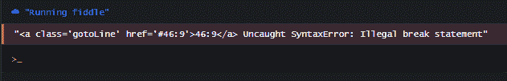

# JavaScript Array.forEach()教程——如何遍历数组中的元素

> 原文：<https://www.freecodecamp.org/news/javascript-array-foreach-tutorial-how-to-iterate-through-elements-in-an-array-with-map/>

在 JavaScript 中，您经常需要遍历一个数组集合，并为每次迭代执行一个回调方法。JS 开发人员通常会使用一种有用的方法来做到这一点:`forEach()`方法。

`forEach()`方法为数组中迭代的每个元素调用一次指定的回调函数。就像其他数组迭代器如`map`和`filter`一样，回调函数可以接受三个参数:

*   当前元素:这是数组中当前被迭代的元素。
*   它的索引:这是该项在数组中的索引位置
*   目标数组:这是被迭代的数组

`forEach`方法不像其他迭代器如`filter`、`map`和`sort`那样返回新数组。相反，该方法返回`undefined`本身。所以它不像其他方法那样可以链接。

关于`forEach`的另一件事是你不能终止循环(用 break 语句)或者让它跳过一次迭代(用 continue 语句)。换句话说，你控制不了。

终止`forEach`循环的唯一方法是在回调函数中抛出一个异常。不要担心，我们将很快在实践中看到这一切。

## 如何在 JavaScript 中使用`forEach()`方法

想象一下，一群学生排队进行例行点名。班级协调员走过队伍，叫出每个学生的名字，同时标记他们是否在场。

需要注意的是，协调员不会改变学生在队列中的顺序。他还会在点名结束后让他们站在同一条线上。他所做的只是对他们每个人执行一个动作(他的检查)。

在下面的例子中，记住这个场景，我们将看到如何在 JavaScript 中使用`forEach`方法来解决现实世界的问题。

## `forEach()`JavaScript 中的方法示例

### 如何用`forEach()`去掉数组中的第一个奇数

在这个例子中，我们有一个数组，它的第一个点是一个奇数，后面是几个偶数。但是我们只希望数组中的数字是偶数。所以我们将使用`forEach()`循环从数组中移除奇数:

```
let numbers = [3, 6, 8, 10, 12]
let odd = 3;

numbers.forEach(function(number) {
    if (number === odd) {
        numbers.shift() // 3 will be deleted from array
    }
})

console.log(numbers);

[6, 8, 10, 12] // All even!
```

### 如何使用`forEach()`访问索引属性

在这个例子中，我们将为数组中循环的每个学生执行一个`rollCall`函数。`rollcall`函数只是将与每个学生相关的字符串记录到控制台。

```
names = ["anna", "beth", "chris", "daniel", "ethan"]

function rollCall(name, index) {
    console.log(`Is the number ${index + 1} student - ${name} present? Yes!`)
    ;}

names.forEach((name, index) => rollCall(name, index));

/*
"Is the number 1 student - anna present? Yes!"
"Is the number 2 student - beth present? Yes!"
"Is the number 3 student - chris present? Yes!"
"Is the number 4 student - daniel present? Yes!"
"Is the number 5 student - ethan present? Yes!"
*/
```

在这个例子中，我们拥有的关于每个学生的唯一信息是他们的名字。然而，我们也想知道每个学生使用什么代词。换句话说，我们希望为每个学生定义一个代词属性。

所以我们把每个学生定义为一个有两个属性的对象，名字和代词:

```
names = [
    {name:"anna",pronoun: "she"},
    {name: "beth",pronoun: "they"},
    {name: "chris",pronoun: "he"},
    {name: "daniel",pronoun: "he"},
    {name: "ethan",pronoun: "he"}
]

function rollCall(student, index) {
    console.log(`The number ${index + 1} student is ${student.name}. Is ${student.pronoun} present? Yes!`);
}

names.forEach((name, index) => rollCall(name, index));

/*
"The number 1 student is anna. Is she present? Yes!"
"The number 2 student is beth. Is they present? Yes!"
"The number 3 student is chris. Is he present? Yes!"
"The number 4 student is daniel. Is he present? Yes!"
"The number 5 student is ethan. Is he present? Yes!"
*/
```

我们将每个学生的点名信息记录到控制台，然后我们执行检查以查看学生使用了什么代词，最后我们将准确的代词作为字符串的一部分动态传递。

### 如何用 JavaScript 中的`forEach()`将一个数组复制到一个新数组中

经过三年的学习，现在是每个学生毕业的时候了。在 JavaScript 中，我们定义了两个数组:`stillStudent`和`nowGraduated`。正如你可能猜到的，`stillStudent`在学生毕业前举行。

然后,`forEach`循环接收每个学生，并对其调用`graduateStudent`函数。

在这个函数中，我们构造了一个具有两个属性的对象:学生的名字以及他们毕业的位置。然后我们将新对象传递给`nowGraduated`数组。此时，该学生已成为毕业生。

这个例子还演示了如何使用`forEach()`方法将一个数组复制到一个新的数组中。

```
let stillStudent = ["anna", "beth", "chris", "daniel", "ethan"]
let nowGraduated = []

function graduateStudent(student, index) {
    let object = { name: student, position: index + 1}
    nowGraduated[index] = object
}

stillStudent.forEach((name, index) => graduateStudent(name, index));

console.log(nowGraduated);

/*
[
    { name: "anna", position: 1}, 
    { name: "beth", position: 2}, 
    { name: "chris", position: 3}, 
    { name: "daniel", position: 4}, 
    { name: "ethan", position: 5}]
]
*/
```

### 如何用`array`参数检查数组中的下一项

在某些时候，老师需要检查列表中是否有下一个特定的条目。在这种情况下，老师需要对整个列表有一个宽广的视野。这样，他就能知道是否还有下一个学生要找。

在我们的 JavaScript 中，我们可以复制它，因为回调函数也可以访问`array`(第三个)参数。这个参数代表目标数组，是`name`。

我们检查数组中是否有下一个项目(学生)。如果有，我们将字符串`positive`传递给`nextItem`变量。如果没有，我们将字符串`negative`传递给变量。然后对于每一次迭代，我们检查**那个**学生是否确实是最后一个。

```
names = ["anna", "beth", "chris", "daniel", "ethan"]

function rollCall(name, index, array) {
    let nextItem = index + 1 < array.length ? "postive" : "negative"
    console.log(`Is the number ${index + 1} student - ${name} present? Yes!. Is there a next student? ${nextItem}!`);
}

names.forEach((name, index, array) => rollCall(name, index, array))

/*
"Is the number 1 student - anna present? Yes!. Is there a next student? postive!"
"Is the number 2 student - beth present? Yes!. Is there a next student? postive!"
"Is the number 3 student - chris present? Yes!. Is there a next student? postive!"
"Is the number 4 student - daniel present? Yes!. Is there a next student? postive!"
"Is the number 5 student - ethan present? Yes!. Is there a next student? negative!"
*/
```

## 你不能退出`forEach`循环，所以用`every()`代替

还记得我说过，从本质上来说，你不能打破(也就是退出)一个`forEach`循环吗？一旦开始，它将一直运行，直到到达数组中的最后一项。所以如果你插入一个`break`语句，它将返回一个`SyntaxError`:

```
let numbers = [2, 4, 5, 8, 12]
let odd = 5;

numbers.forEach(function(number) {
    if (number === odd) {
        break; // oops, this isn't gonna work!
    }
}) 
```



通常情况下，如果你在到达最后一项之前完成了你的目标，你会想要打破循环。在上面的例子中，我们已经找到了奇数(5)，所以没有必要继续迭代剩余的条目(8 和 12)。

如果你想在某些条件下跳出循环，那么你必须使用以下任何一种方法:

*   `for`循环
*   [回路`for…of`或`for…in`回路](https://futurestud.io/tutorials/node-js-for-of-vs-for-in-loops)
*   `Array.some()`
*   `Array.every()`
*   `Array.find()`

以下是如何用`Array.every()`打破循环的方法:

```
let numbers = [2, 4, 5, 8, 12]
let odd = 5;

numbers.every(number => {
  if (number == odd) {
    return false;
  }

  console.log(number);

  return true;
});

// 2 4
```

## 包扎

在本教程中，我介绍了`forEach`方法，用一个简单的类比说明了它是如何工作的，并且我还给出了一些它在 JavaScript 代码中使用的实际例子。

希望你能从这篇文章中得到一些有用的东西。

****如果你想了解更多关于 Web 开发的知识，欢迎访问我的** [博客](https://ubahthebuilder.tech) **。****

感谢您的阅读，再见。

> ********************************P/S********************************:如果你正在学习 JavaScript，我创作了一本电子书，用手绘数字笔记的方式教授 JavaScript 中的 50 个主题。[点击这里查看](https://ubahthebuilder.gumroad.com/l/js-50)。