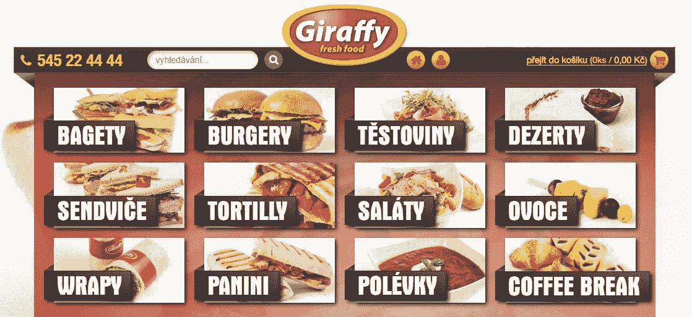
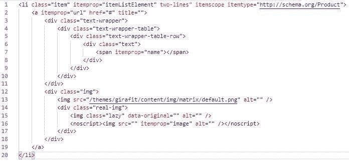
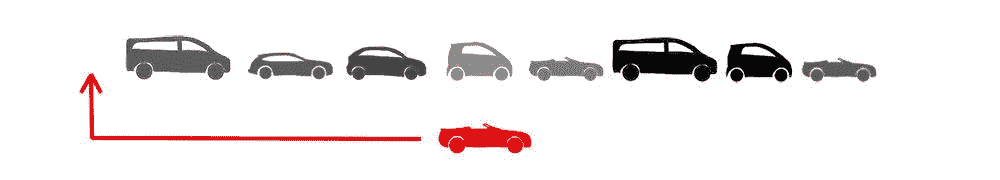
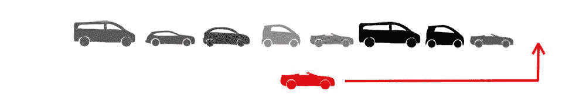
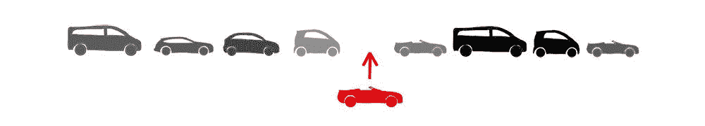
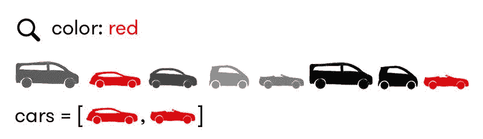
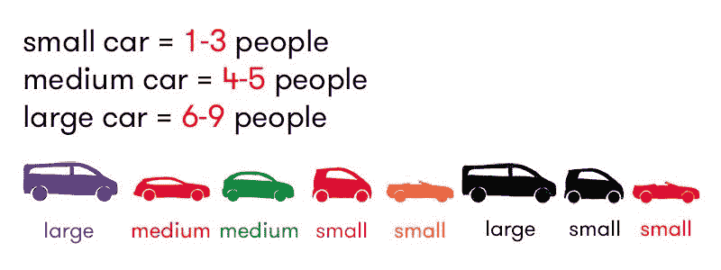
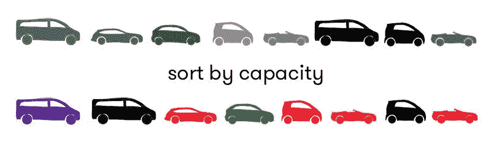
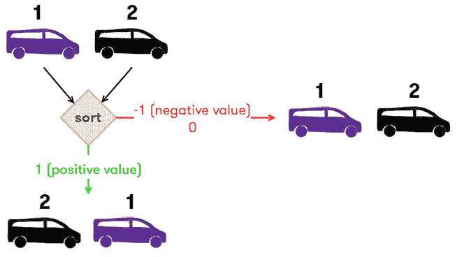

# JavaScript 对象数组教程——如何使用 JS 数组方法创建、更新和遍历对象

> 原文：<https://www.freecodecamp.org/news/javascript-array-of-objects-tutorial-how-to-create-update-and-loop-through-objects-using-js-array-methods/>

平均来说，我每周处理 JSON 数据 18 次。而且我几乎每次都需要谷歌来寻找操纵它们的具体方法。如果有一个终极指南可以永远给你答案呢？

在本文中，我将向您展示在 JavaScript 中使用对象数组的基础知识。

如果您曾经使用过 JSON 结构，那么您就使用过 JavaScript 对象。毫不夸张地说。JSON 代表 JavaScript 对象符号。

创建对象就像这样简单:

```
{
  "color": "purple",
  "type": "minivan",
  "registration": new Date('2012-02-03'),
  "capacity": 7
} 
```

这个物体代表一辆汽车。可以有许多类型和颜色的汽车，每个对象代表一个特定的汽车。


现在，大多数情况下，您可以从外部服务获得这样的数据。但是有时你需要手动创建对象和它们的数组。就像我创建这个电子商店时一样:



考虑到每个类别列表项在 HTML 中是这样的:



我不想让这个代码重复 12 次，那会使它不可维护。

## 创建对象数组

但是让我们回到汽车上。让我们来看看这组汽车:


我们可以这样将它表示为一个数组:

```
let cars = [
  {
    "color": "purple",
    "type": "minivan",
    "registration": new Date('2017-01-03'),
    "capacity": 7
  },
  {
    "color": "red",
    "type": "station wagon",
    "registration": new Date('2018-03-03'),
    "capacity": 5
  },
  {
    ...
  },
  ...
] 
```

对象数组不会一直保持不变。我们几乎总是需要操纵它们。因此，让我们看看如何将对象添加到一个已经存在的数组中。

### 在 start - Array.unshift 处添加一个新对象



要在第一个位置添加对象，使用`Array.unshift`。

```
let car = {
  "color": "red",
  "type": "cabrio",
  "registration": new Date('2016-05-02'),
  "capacity": 2
}
cars.unshift(car); 
```

### 在末端添加一个新对象- Array.push



要在最后一个位置添加对象，使用`Array.push`。

```
let car = {
 "color": "red",
 "type": "cabrio",
 "registration": new Date('2016-05-02'),
 "capacity": 2
}
cars.push(car); 
```

### 在中间添加一个新对象- Array.splice



要在中间添加对象，请使用`Array.splice`。这个功能非常方便，因为它也可以删除项目。注意它的参数:

```
Array.splice(
  {index where to start},
  {how many items to remove},
  {items to add}
); 
```

因此，如果我们想在第五个位置添加红色大众 Cabrio，我们将使用:

```
let car = {
  "color": "red",
  "type": "cabrio",
  "registration": new Date('2016-05-02'),
  "capacity": 2
}
cars.splice(4, 0, car); 
```

## 遍历对象数组

我在这里问你一个问题:为什么要循环遍历一个对象数组？我这么问的原因是，循环几乎从来都不是我们想要实现的目标的主要原因。

JavaScript 提供了许多函数，可以解决您的问题，而不需要在一般的循环中实际实现逻辑。让我们来看看。

### 通过数组的值查找数组中的对象

假设我们想找一辆红色的车。我们可以使用函数`Array.find`。


```
let car = cars.find(car => car.color === "red"); 
```

该函数返回第一个匹配的元素:

```
console.log(car);
// output:
// {
//   color: 'red',
//   type: 'station wagon',
//   registration: 'Sat Mar 03 2018 01:00:00 GMT+0100 (GMT+01:00)',
//   capacity: 5
// } 
```

也可以搜索多个值:

`let car = cars.find(car => car.color === "red" && car.type === "cabrio");`

在这种情况下，我们将得到列表中的最后一辆车。

### 从符合条件的数组中获取多个项目- Array.filter

`Array.find`函数只返回一个对象。如果我们想得到所有的红色汽车，我们需要使用`Array.filter`。



```
let redCars = cars.filter(car => car.color === "red");
console.log(redCars);
// output:
// [
//   {
//     color: 'red',
//     type: 'station wagon',
//     registration: 'Sat Mar 03 2018 01:00:00 GMT+0100 (GMT+01:00)',
//     capacity: 5
//   },
//   {
//     color: 'red',
//     type: 'cabrio',
//     registration: 'Sat Mar 03 2012 01:00:00 GMT+0100 (GMT+01:00)',
//     capacity: 2
//   }
// ] 
```

### 转换数组的对象-数组.映射

这是我们经常需要的东西。将对象数组转换为不同对象的数组。那是`Array.map`的工作。假设我们想根据汽车的尺寸将汽车分成三组。



```
let sizes = cars.map(car => {
  if (car.capacity <= 3){
    return "small";
  }
  if (car.capacity <= 5){
    return "medium";
  }
  return "large";
});
console.log(sizes);
// output:
// ['large','medium','medium', ..., 'small'] 
```

如果我们需要更多的值，也可以创建一个新对象:

```
let carsProperties = cars.map(car => {
 let properties = {
   "capacity": car.capacity,
   "size": "large"
 };
 if (car.capacity <= 5){
   properties['size'] = "medium";
 }
 if (car.capacity <= 3){
   properties['size'] = "small";
 }
 return properties;
});
console.log(carsProperties);
// output:
// [
//   { capacity: 7, size: 'large' },
//   { capacity: 5, size: 'medium' },
//   { capacity: 5, size: 'medium' },
//   { capacity: 2, size: 'small' },
//   ...
// ] 
```

### 向数组的每个对象添加一个属性

但是如果我们也想要汽车的尺寸呢？在这种情况下，我们可以为一个新属性`size`增强对象。这是`Array.forEach`函数的一个很好的用例。

```
cars.forEach(car => {
 car['size'] = "large";
 if (car.capacity <= 5){
   car['size'] = "medium";
 }
 if (car.capacity <= 3){
   car['size'] = "small";
 }
}); 
```

### 按属性对数组排序

当我们转换完对象后，我们通常需要以某种方式对它们进行排序。

通常，排序基于每个对象的属性值。我们可以使用`Array.sort`函数，但是我们需要提供一个定义排序机制的函数。

假设我们想根据汽车的容量以降序对汽车进行排序。



```
let sortedCars = cars.sort((c1, c2) => (c1.capacity < c2.capacity) ? 1 : (c1.capacity > c2.capacity) ? -1 : 0);
console.log(sortedCars);
// output:
// [
//   {
//     color: 'purple',
//     type: 'minivan',
//     registration: 'Wed Feb 01 2017 00:00:00 GMT+0100 (GMT+01:00)',
//     capacity: 7
//   },
//   {
//     color: 'red',
//     type: 'station wagon',
//     registration: 'Sat Mar 03 2018 01:00:00 GMT+0100 (GMT+01:00)',
//     capacity: 5
//   },
//   ...
// ] 
```

`Array.sort`比较两个对象，如果排序函数的结果为正，则将第一个对象放在第二个位置。所以你可以把排序函数看成一个问题:第一个对象应该放在第二个位置吗？



当两个对象的比较值相同时，确保始终添加零的情况，以避免不必要的交换。

### 检查数组中的对象是否满足条件- Array.every，Array.includes

当我们只需要检查每个对象的特定条件时，`Array.every`和`Array.some`就派上了用场。

我们的汽车列表里有红色的 cabrio 吗？所有的汽车都能运送至少 4 个人吗？或者更以网络为中心:购物车里有特定的产品吗？

```
cars.some(car => car.color === "red" && car.type === "cabrio");
// output: true

cars.every(car => car.capacity >= 4);
// output: false 
```

您可能还记得类似于`Array.some`的函数`Array.includes`，但是它只适用于原始类型。

## 摘要

在本文中，我们介绍了帮助您创建、操作、转换和遍历对象数组的基本函数。它们应该涵盖大多数你会偶然发现的情况。

如果您有需要更高级功能的用例，请查看[这份详细的阵列指南](https://www.freecodecamp.org/news/data-structures-101-arrays-a-visual-introduction-for-beginners-7f013bcc355a/)或访问 [W3 schools 参考资料](https://www.w3schools.com/Jsref/jsref_obj_array.asp)。

或者[联系我](https://twitter.com/ondrabus)我再准备一篇:-)