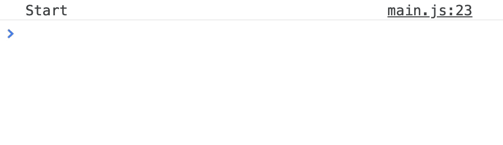
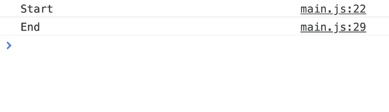
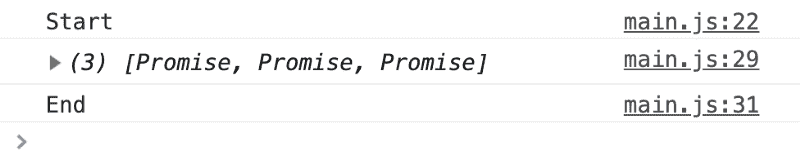
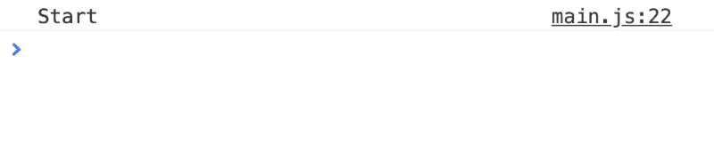
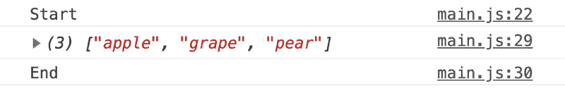
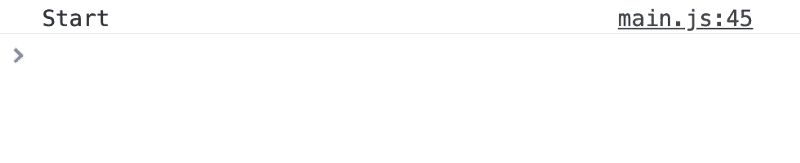
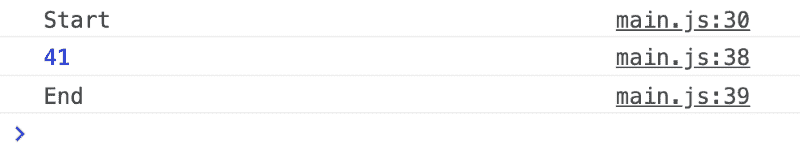
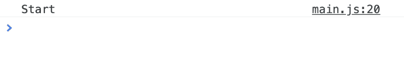
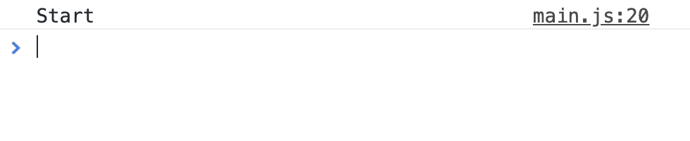
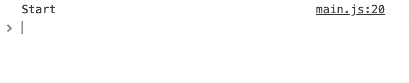

# JavaScript 异步和等待循环

> 原文：<https://www.freecodecamp.org/news/javascript-async-and-await-in-loops-30ecc5fb3939/>

基本的`async`和`await`很简单。当你试图在循环中使用`await`时，事情变得有点复杂。

在这篇文章中，我想分享一些在循环中使用`await`时需要注意的问题。

### **开始之前**

我假设你知道如何使用`async`和`await`。如果你不知道，请阅读[以前的文章](https://zellwk.com/blog/async-await)，在继续之前熟悉一下。

### **准备示例**

对于本文，假设您想从一个水果篮中获取水果的数量。

```
const fruitBasket = {
 apple: 27,
 grape: 0,
 pear: 14
};
```

您想获得果篮中每种水果的数量。要获得一个水果的数量，可以使用一个`getNumFruit`函数。

```
const getNumFruit = fruit => {
 return fruitBasket[fruit];
};

const numApples = getNumFruit(“apple”);
console.log(numApples); // 27
```

现在，假设`fruitBasket`位于远程服务器上。访问它需要一秒钟。我们可以用超时来模拟这一秒钟的延迟。(如果您对理解超时代码有问题，请参考[上一篇文章](https://zellwk.com/blog/async-await))。

```
const sleep = ms => {
 return new Promise(resolve => setTimeout(resolve, ms));
};

const getNumFruit = fruit => {
 return sleep(1000).then(v => fruitBasket[fruit]);
};

getNumFruit(“apple”).then(num => console.log(num)); // 27
```

最后，假设你想用`await`和`getNumFruit`在异步函数中获取每个水果的编号。

```
const control = async _ => {
 console.log(“Start”);

const numApples = await getNumFruit(“apple”);
 console.log(numApples);

const numGrapes = await getNumFruit(“grape”);
 console.log(numGrapes);

const numPears = await getNumFruit(“pear”);
 console.log(numPears);

console.log(“End”);
};
```


Console shows ‘Start’. One second later, it logs 27\. Another second later, it logs 0\. One more second later, it logs 14, and ‘End’

这样，我们就可以开始循环查看`await`。

### **在 for 循环中等待**

比方说，我们有一个水果阵列，我们想从果篮。

```
const fruitsToGet = [“apple”, “grape”, “pear”];
```

我们要遍历这个数组。

```
const forLoop = async _ => {
 console.log(“Start”);

for (let index = 0; index < fruitsToGet.length; index++) {
 // Get num of each fruit
 }

console.log(“End”);
};
```

在 for 循环中，我们将使用`getNumFruit`来获取每个水果的数量。我们还会将该号码记录到控制台中。

由于`getNumFruit`返回一个承诺，我们可以在记录之前`await`解析的值。

```
const forLoop = async _ => {
 console.log(“Start”);

for (let index = 0; index < fruitsToGet.length; index++) {
 const fruit = fruitsToGet[index];
 const numFruit = await getNumFruit(fruit);
 console.log(numFruit);
 }

console.log(“End”);
};
```

当您使用`await`时，您希望 JavaScript 暂停执行，直到等待的承诺得到解决。这意味着 for 循环中的`await`应该串行执行。

结果正如你所料。

```
“Start”;
“Apple: 27”;
“Grape: 0”;
“Pear: 14”;
“End”;
```



Console shows ‘Start’. One second later, it logs 27\. Another second later, it logs 0\. One more second later, it logs 14, and ‘End’

这种行为适用于大多数循环(如`while`和`for-of`循环)...

但是它不适用于需要回调的循环。这种需要回退的循环的例子包括`forEach`、`map`、`filter`和`reduce`。在接下来的几节中，我们将看看`await`如何影响`forEach`、`map`和`filter`。

### **在 forEach 循环中等待**

我们将做与 for 循环例子中相同的事情。首先，让我们遍历水果数组。

```
const forEachLoop = _ => {
 console.log(“Start”);

fruitsToGet.forEach(fruit => {
 // Send a promise for each fruit
 });

console.log(“End”);
};
```

接下来，我们将尝试使用`getNumFruit`获取水果的数量。(注意回调函数中的`async`关键字。我们需要这个`async`关键字，因为`await`在回调函数中)。

```
const forEachLoop = _ => {
 console.log(“Start”);

fruitsToGet.forEach(async fruit => {
 const numFruit = await getNumFruit(fruit);
 console.log(numFruit);
 });

console.log(“End”);
};
```

您可能希望控制台看起来像这样:

```
“Start”;
“27”;
“0”;
“14”;
“End”;
```

但实际结果是不同的。在 forEach 循环中的承诺得到解析之前，JavaScript 继续调用`console.log('End')` 。

控制台按以下顺序登录:

```
‘Start’
‘End’
‘27’
‘0’
‘14’
```



Console logs ‘Start’ and ‘End’ immediately. One second later, it logs 27, 0, and 14.

JavaScript 这样做是因为`forEach`不是承诺感知的。它不能支持`async`和`await`。你*_ 不能 _* 在`forEach`中使用`await`。

### **等待地图**

如果在一个`map`中使用`await`，`map`将总是返回一个承诺数组。这是因为异步函数总是返回承诺。

```
const mapLoop = async _ => {
 console.log(“Start”);

const numFruits = await fruitsToGet.map(async fruit => {
 const numFruit = await getNumFruit(fruit);
 return numFruit;
 });

console.log(numFruits);

console.log(“End”);
};

“Start”;
“[Promise, Promise, Promise]”;
“End”;
```



Console logs ‘`Start`’, ‘[Promise, Promise, Promise]’, and ‘End’ immediately

因为`map`总是返回承诺(如果您使用`await`)，所以您必须等待承诺数组被解析。你可以用 `await Promise.all(arrayOfPromises)`做到这一点。

```
const mapLoop = async _ => {
 console.log(“Start”);

const promises = fruitsToGet.map(async fruit => {
 const numFruit = await getNumFruit(fruit);
 return numFruit;
 });

const numFruits = await Promise.all(promises);
 console.log(numFruits);

console.log(“End”);
};
```

以下是您得到的结果:

```
“Start”;
“[27, 0, 14]”;
“End”;
```



Console logs ‘Start’. One second later, it logs ‘[27, 0, 14] and ‘End’

如果你愿意，你可以操纵你的承诺所带来的价值。解析的值将是您返回的值。

```
const mapLoop = async _ => {
 // …
 const promises = fruitsToGet.map(async fruit => {
 const numFruit = await getNumFruit(fruit);
 // Adds onn fruits before returning
 return numFruit + 100;
 });
 // …
};

“Start”;
“[127, 100, 114]”;
“End”;
```

### **等待过滤器**

当你使用`filter`时，你想过滤一个有特定结果的数组。假设您想要创建一个包含 20 多个水果的数组。

如果您正常使用`filter`(没有 await ),您将像这样使用它:

```
// Filter if there’s no await
const filterLoop = _ => {
 console.log(‘Start’)

const moreThan20 = await fruitsToGet.filter(fruit => {
 const numFruit = fruitBasket[fruit]
 return numFruit > 20
 })

console.log(moreThan20)
 console.log(‘End’)
}
```

你可能认为`moreThan20`只包含苹果，因为有 27 个苹果，但是有 0 个葡萄和 14 个梨。

```
“Start”[“apple”];
(“End”);
```

`filter`中的`await`工作方式不一样。其实根本不管用。你得到了未过滤的数组...

```
const filterLoop = _ => {
 console.log(‘Start’)

const moreThan20 = await fruitsToGet.filter(async fruit => {
 const numFruit = getNumFruit(fruit)
 return numFruit > 20
 })

console.log(moreThan20)
 console.log(‘End’)
}

“Start”[(“apple”, “grape”, “pear”)];
(“End”);
```



Console loggs ‘Start’, ‘[‘apple’, ‘grape’, ‘pear’]’, and ‘End’ immediately

这就是为什么会这样。

当你在`filter`回调中使用`await`时，回调总是一个承诺。由于承诺总是真实的，数组中的每一项都会通过过滤器。在`filter`中编写`await`就像编写这样的代码:

```
// Everything passes the filter…
const filtered = array.filter(true);
```

正确使用`await`和`filter`有三个步骤:

1.使用`map`返回一个数组承诺

2.承诺的排列

3.`filter`解析出的值

```
const filterLoop = async _ => {
 console.log(“Start”);

const promises = await fruitsToGet.map(fruit => getNumFruit(fruit));
 const numFruits = await Promise.all(promises);

const moreThan20 = fruitsToGet.filter((fruit, index) => {
 const numFruit = numFruits[index];
 return numFruit > 20;
 });

console.log(moreThan20);
 console.log(“End”);
};

Start[“apple”];
End;
```



Console shows ‘Start’. One second later, console logs ‘[‘apple’]’ and ‘End’

### **等待与减少**

在这种情况下，假设您想要找出水果盘中水果的总数。通常，您可以使用`reduce`来遍历一个数组，并将数字相加。

```
// Reduce if there’s no await
const reduceLoop = _ => {
 console.log(“Start”);

const sum = fruitsToGet.reduce((sum, fruit) => {
 const numFruit = fruitBasket[fruit];
 return sum + numFruit;
 }, 0);

console.log(sum);
 console.log(“End”);
};
```

你总共会得到 41 种水果。(27 + 0 + 14 = 41).

```
“Start”;
“41”;
“End”;
```



Console logs ‘Start’, ‘41’, and ‘End’ immediately

当你把`await`和 reduce 一起使用时，结果会变得非常混乱。

```
// Reduce if we await getNumFruit
const reduceLoop = async _ => {
 console.log(“Start”);

const sum = await fruitsToGet.reduce(async (sum, fruit) => {
 const numFruit = await getNumFruit(fruit);
 return sum + numFruit;
 }, 0);

console.log(sum);
 console.log(“End”);
};

“Start”;
“[object Promise]14”;
“End”;
```



Console logs ‘Start’. One second later, it logs ‘[object Promise]14’ and ‘End’

什么？！`[object Promise]14`？！

解剖这个很有意思。

*   在第一次迭代中，`sum`就是`0`。`numFruit`为 27(来自`getNumFruit(‘apple’)`的解析值)。`0 + 27` 是 27。
*   在第二次迭代中，`sum`是一个承诺。(为什么？因为异步函数总是返回承诺！)`numFruit`为 0。承诺通常不能添加到对象中，所以 JavaScript 将其转换为`[object Promise]`字符串。`[object Promise] + 0` 是`[object Promise]0`
*   第三次迭代，`sum`也是一个承诺。`numFruit`就是`14`。`[object Promise] + 14`是`[object Promise]14`。

谜团解开了！

这意味着，你可以在一个`reduce`回调中使用`await`，但是你必须记住首先要`await`累加器！

```
const reduceLoop = async _ => {
 console.log(“Start”);

const sum = await fruitsToGet.reduce(async (promisedSum, fruit) => {
 const sum = await promisedSum;
 const numFruit = await getNumFruit(fruit);
 return sum + numFruit;
 }, 0);

console.log(sum);
 console.log(“End”);
};

“Start”;
“41”;
“End”;
```



Console logs ‘Start’. Three seconds later, it logs ‘41’ and ‘End’

但是...正如你从 gif 上看到的，做每件事都需要很长时间。这是因为`reduceLoop`需要等待每次迭代的`promisedSum`完成。

有一种方法可以加速 reduce 循环。(我是在蒂姆·奥克斯利的帮助下发现这一点的。如果在`await promisedSum`之前先`await getNumFruits(`，`reduceLoop`只需一秒钟即可完成:

```
const reduceLoop = async _ => {
 console.log(“Start”);

const sum = await fruitsToGet.reduce(async (promisedSum, fruit) => {
 // Heavy-lifting comes first.
 // This triggers all three getNumFruit promises before waiting for the next iteration of the loop.
 const numFruit = await getNumFruit(fruit);
 const sum = await promisedSum;
 return sum + numFruit;
 }, 0);

console.log(sum);
 console.log(“End”);
};
```



Console logs ‘Start’. One second later, it logs ‘41’ and ‘End’

这是可行的，因为`reduce`可以在等待循环的下一次迭代之前触发所有三个`getNumFruit`承诺。然而，这种方法有点令人困惑，因为你必须小心你的`await`事物的顺序。

在 reduce 中使用`await`最简单(也是最有效)的方法是:

1.使用`map`返回一个数组承诺

2.承诺的排列

3.`reduce`解析出的值

```
const reduceLoop = async _ => {
 console.log(“Start”);

const promises = fruitsToGet.map(getNumFruit);
 const numFruits = await Promise.all(promises);
 const sum = numFruits.reduce((sum, fruit) => sum + fruit);

console.log(sum);
 console.log(“End”);
};
```

这个版本简单易读易懂，只需要一秒钟就可以计算出水果的总数。


Console logs ‘Start’. One second later, it logs ‘41’ and ‘End’

### **关键要点**

1.如果你想连续执行`await`调用，使用`for-loop`(或者任何没有回调的循环)。

2.不要把`await`和`forEach`一起使用。用一个`for-loop`(或者任何没有回调的循环)来代替。

3.不要把`await`放在`filter`和`reduce`里面。总是`await`一个带有`map`的承诺数组，然后相应地`filter`或`reduce`。

本文原载于 [*我的博客*](https://zellwk.com/blog/async-await-in-loops/) *。*
如果你想要更多的文章来帮助你成为一个更好的前端开发者，注册我的[时事通讯](https://zellwk.com/)。