# JavaScript Async/Await 教程——通过制作冰淇淋学习 JS 中的回调、承诺和 Async/Await🍧🍨🍦

> 原文：<https://www.freecodecamp.org/news/javascript-async-await-tutorial-learn-callbacks-promises-async-await-by-making-icecream/>

今天，我们将建立并经营一家冰淇淋店，同时学习 T2 异步 JavaScript。在此过程中，您将学习如何使用:

*   回收
*   承诺
*   异步/等待

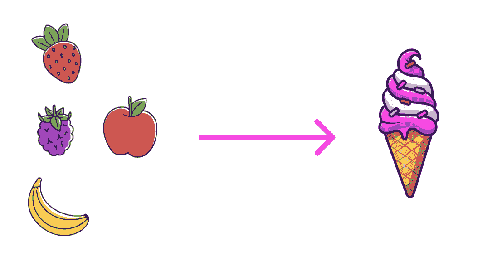

# 以下是我们将在本文中涉及的内容:

*   什么是异步 JavaScript？
*   同步与异步 JavaScript
*   JavaScript 中回调的工作方式
*   JavaScript 中的承诺是如何工作的
*   Async / Await 如何在 JavaScript 中工作

所以让我们开始吧！

## 如果你喜欢，你也可以在 YouTube 上观看这个教程:

[https://www.youtube.com/embed/n5ZtTO1ArWg?feature=oembed](https://www.youtube.com/embed/n5ZtTO1ArWg?feature=oembed)

# 什么是异步 JavaScript？

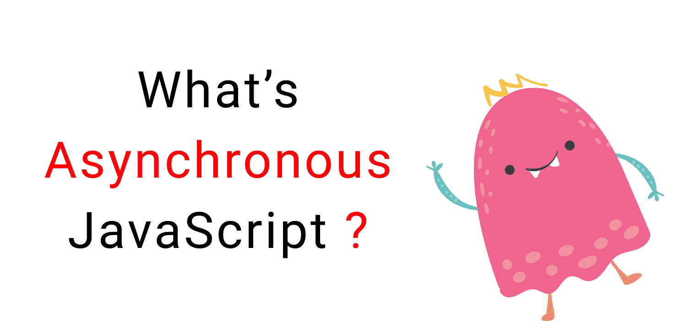

如果您想高效地构建项目，那么这个概念适合您。

异步 JavaScript 的理论帮助你将复杂的大项目分解成更小的任务。

然后，你可以使用这三种技巧中的任何一种——**回调、承诺或异步/等待**——以获得最佳结果的方式运行这些小任务。

让我们开始吧！🎖️

# 同步与异步 JavaScript


## 什么是同步系统？

在同步系统中，任务是一个接一个完成的。

想象一下，你只有一只手来完成 10 项任务。所以，你必须一次完成一项任务。

看一下 GIF👇–这里一次只发生一件事:


您将看到，直到第一个图像完全加载，第二个图像才开始加载。

嗯，JavaScript 默认是同步的**【单线程】**。可以这样想——一根线意味着一只手可以用来做事情。

## 什么是异步系统？

在这个系统中，任务是独立完成的。

在这里，假设你有 10 只手来完成 10 项任务。因此，每只手可以同时独立完成每项任务。

看一下 GIF👇–您可以看到每个图像同时加载。


同样，所有的图像都是按照自己的速度加载的。他们中没有一个在等其他人。

## 总结一下同步和异步 JS:

当三个图像在马拉松上，在一个:

*   **同步**系统，三幅图像在同一车道。一个追不上另一个。比赛一个接一个地结束了。如果第 2 幅图像停止，下面的图像也停止。

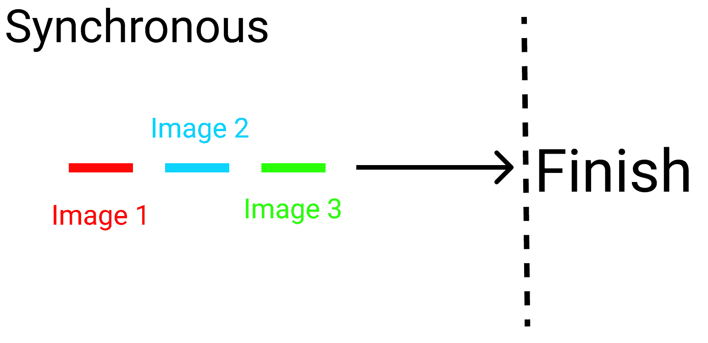

*   **异步系统，**三个图像在不同的车道上。他们将以自己的速度完成比赛。没有人为任何人停下来:

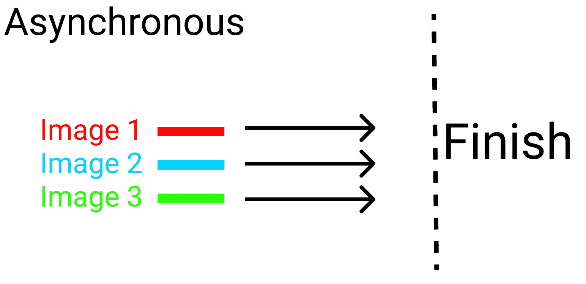

## 同步和异步代码示例


在开始我们的项目之前，让我们看一些例子，并澄清任何疑问。

### 同步代码示例

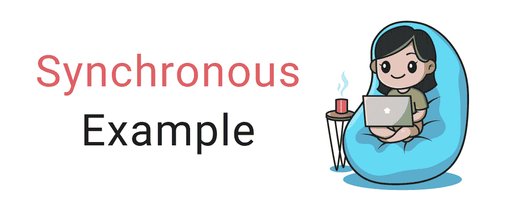

要测试同步系统，请用 JavaScript 编写以下代码:

```
console.log(" I ");

console.log(" eat ");

console.log(" Ice Cream "); 
```

控制台中的结果如下:👇

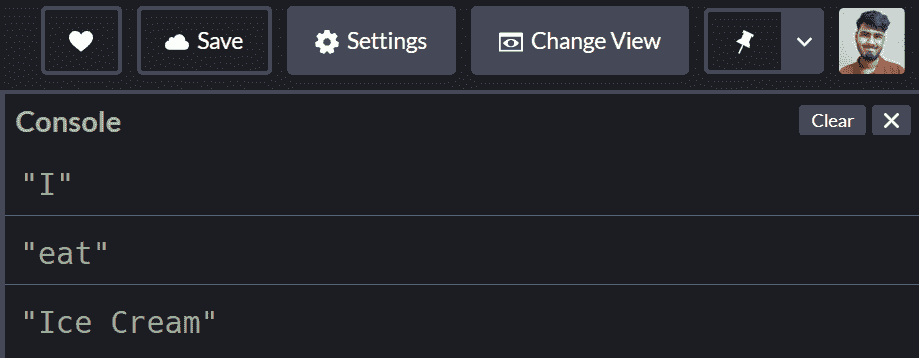

### 异步代码示例

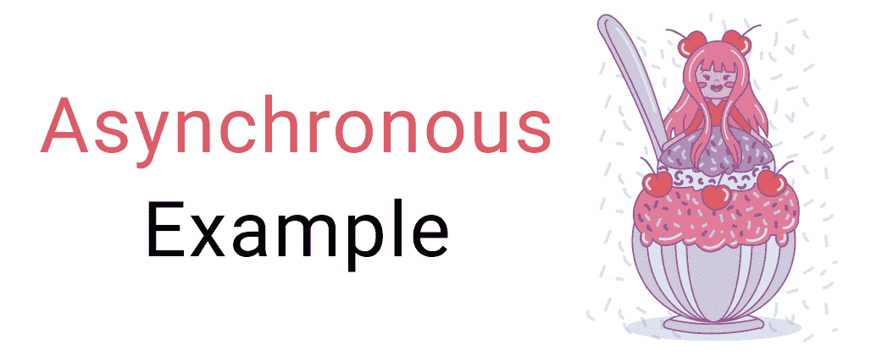

比方说吃点冰淇淋要两秒钟。现在，让我们测试一个异步系统。用 JavaScript 写下面的代码。

**注意:**别担心，我们将在本文后面讨论`setTimeout()`函数。

```
console.log("I");

// This will be shown after 2 seconds

setTimeout(()=>{
  console.log("eat");
},2000)

console.log("Ice Cream") 
```

这是控制台中的结果:👇

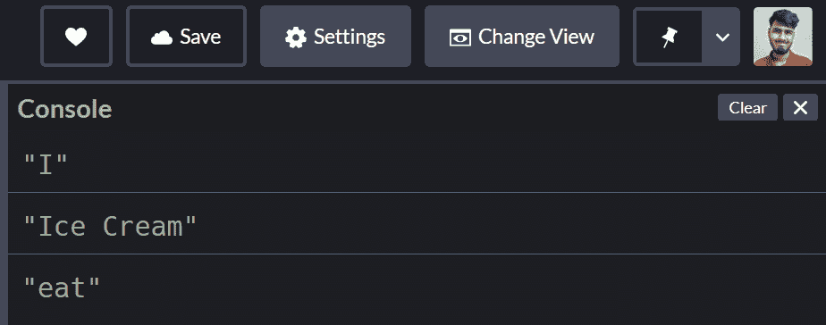

现在你已经知道了同步和异步操作的区别，让我们来构建我们的冰淇淋店。

## 如何设置我们的项目

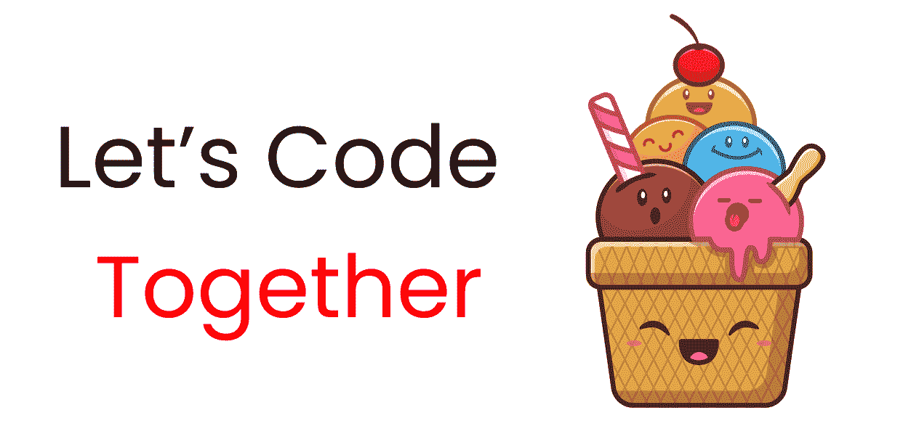

对于这个项目，你可以打开 [Codepen.io](https://codepen.io/) 并开始编码。或者，您可以在 VS 代码或您选择的编辑器中完成。

打开 JavaScript 部分，然后打开开发人员控制台。我们将编写代码，并在控制台中看到结果。

# JavaScript 中有哪些回调？

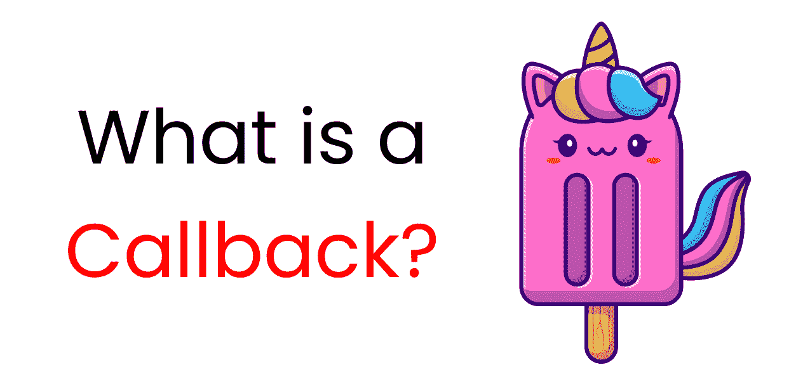

当你将一个函数作为参数嵌套在另一个函数中时，这叫做回调。

下面是回调的一个示例:

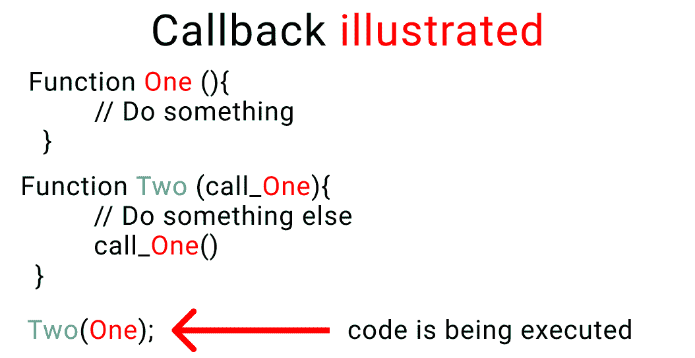

**An example of a callback**

别急，一会儿我们会看到一些回调的例子。

### 我们为什么要使用回调？

当做一项复杂的任务时，我们把它分解成更小的步骤。为了帮助我们根据时间(可选)和顺序建立这些步骤之间的关系，我们使用回调。

看一下这个例子:👇

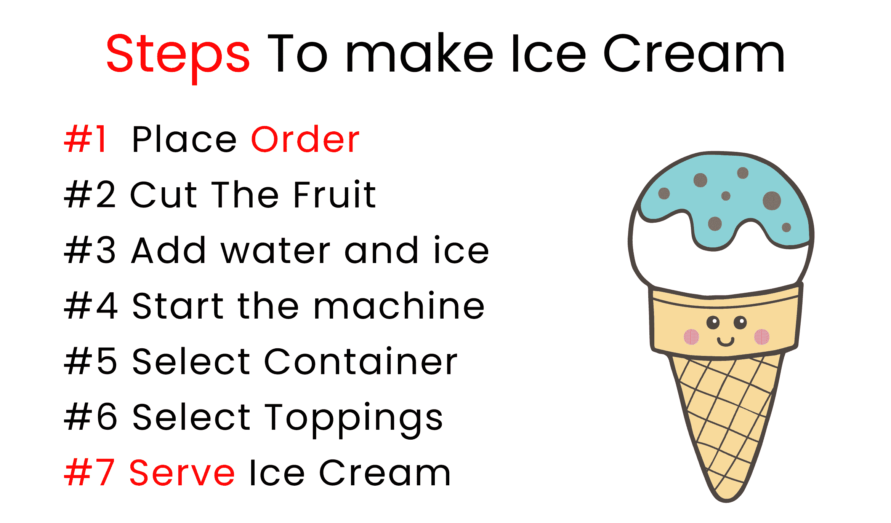

**Chart contains steps to make ice cream**

这些是制作冰淇淋需要采取的小步骤。还要注意，在这个例子中，步骤的顺序和时间是至关重要的。你不能只把水果切碎，然后端上冰淇淋。

同时，如果前一步没有完成，我们就不能进入下一步。

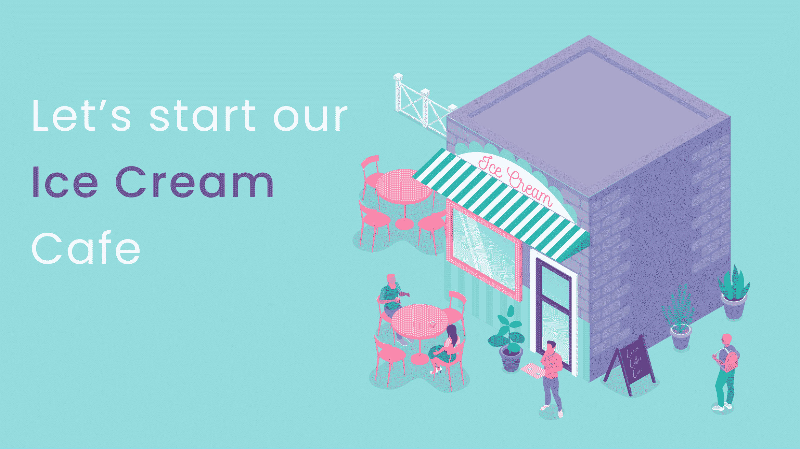

为了更详细地解释这一点，让我们开始我们的冰淇淋店业务。

## 但是等等...

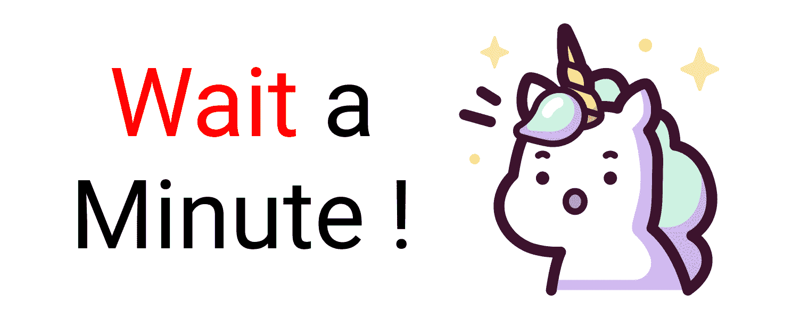

商店将分为两部分:

*   储藏室会有所有的原料[我们的后端]
*   我们将在厨房[前台]制作冰淇淋

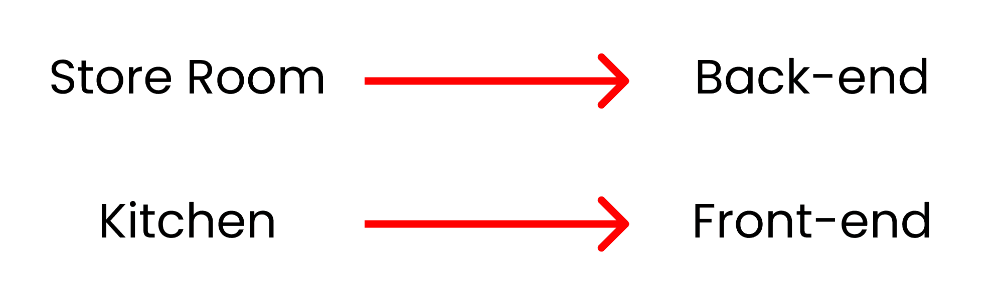

## 让我们存储数据

现在，我们要把原料储存在一个物体里。开始吧！

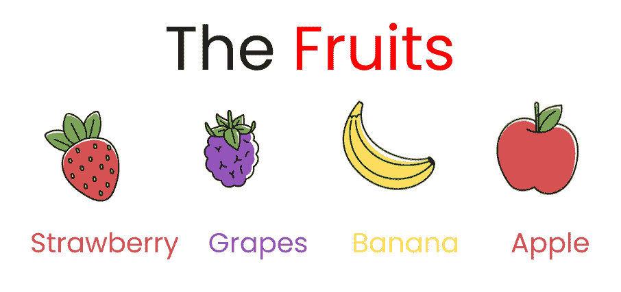

你可以像这样把原料储存在物品里:👇

```
let stocks = {
    Fruits : ["strawberry", "grapes", "banana", "apple"]
 } 
```

我们的其他材料在这里:👇

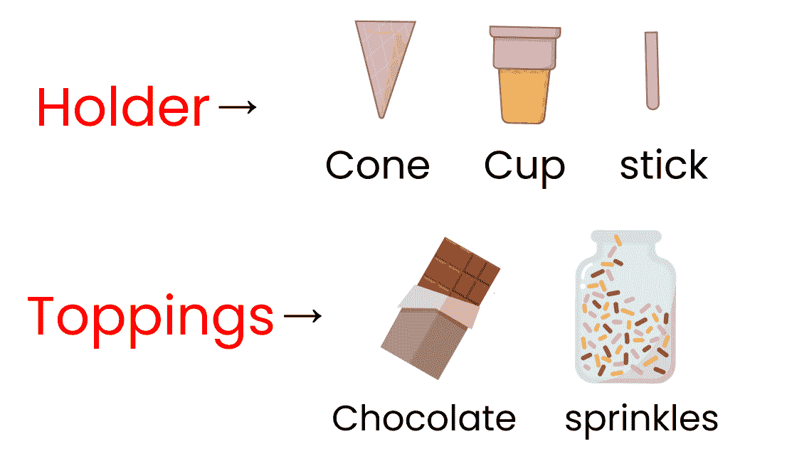

您可以像这样在 JavaScript 对象中存储这些其他成分:👇

```
let stocks = {
    Fruits : ["strawberry", "grapes", "banana", "apple"],
    liquid : ["water", "ice"],
    holder : ["cone", "cup", "stick"],
    toppings : ["chocolate", "peanuts"],
 }; 
```

整个生意取决于顾客**点了什么**。一旦我们接到订单，我们就开始生产，然后供应冰淇淋。所以，我们将创建两个函数- >

*   `order`
*   `production`

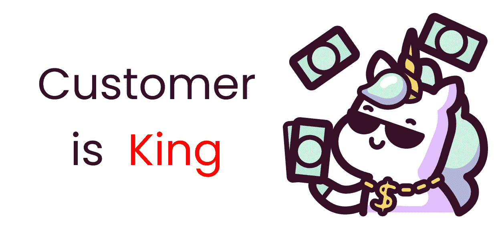

事情是这样的:👇


Get order from customer, fetch ingredients, start production, then serve.

让我们发挥我们的作用。我们将在这里使用箭头函数:

```
let order = () =>{};

let production = () =>{}; 
```

现在，让我们使用回调来建立这两个函数之间的关系，如下所示:👇

```
let order = (call_production) =>{

  call_production();
};

let production = () =>{}; 
```

### 让我们做一个小测试

我们将使用`console.log()`函数进行测试，以消除我们对如何建立两个函数之间的关系的任何疑问。

```
let order = (call_production) =>{

console.log("Order placed. Please call production")

// function 👇 is being called 
  call_production();
};

let production = () =>{

console.log("Production has started")

}; 
```

为了运行测试，我们将调用 **`order`** 函数。我们将添加名为`production`的第二个函数作为它的参数。

```
// name 👇 of our second function
order(production); 
```

这是我们控制台中的结果👇

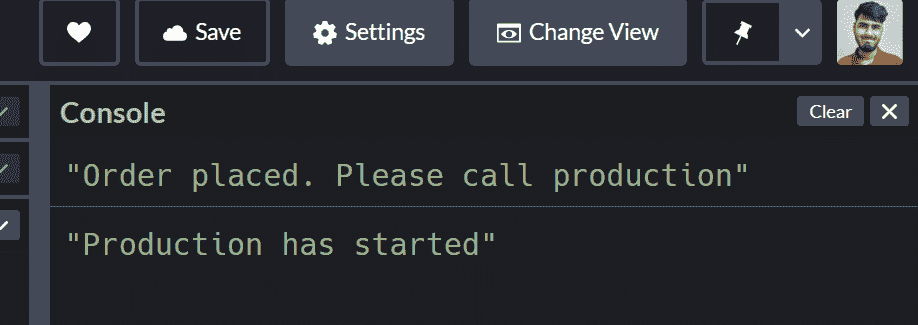

## 休息一会儿

到目前为止还不错——休息一下吧！

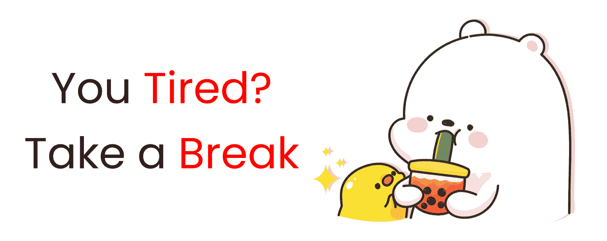

## 清除 console.log

保留这段代码并删除所有内容[不要删除我们的股票变量]。在我们的第一个函数中，传递另一个参数，以便我们可以接收订单[水果名称]:

```
// Function 1

let order = (fruit_name, call_production) =>{

  call_production();
};

// Function 2

let production = () =>{};

// Trigger 👇

order("", production); 
```

这是我们的步骤，以及执行每个步骤所需的时间。

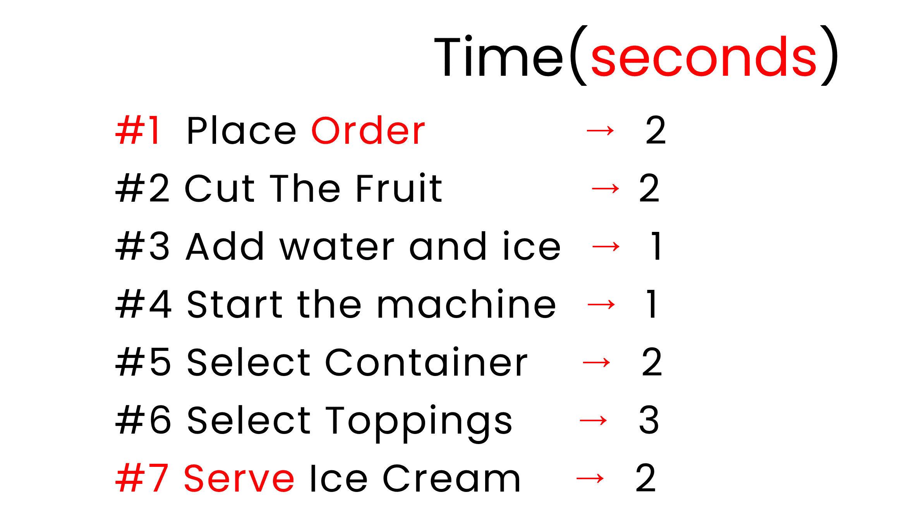

**Chart contains steps to make ice cream**

在这个图表中，您可以看到第一步是下订单，这需要 2 秒钟。然后第二步是切水果(2 秒)，第三步是加水和冰(1 秒)，第四步是启动机器(1 秒)，第五步是选择容器(2 秒)，第六步是选择浇头(3 秒)，第七步，最后一步，是端上冰淇淋，需要 2 秒。

为了建立计时，函数`setTimeout()`是非常好的，因为它也通过将函数作为参数来使用回调。

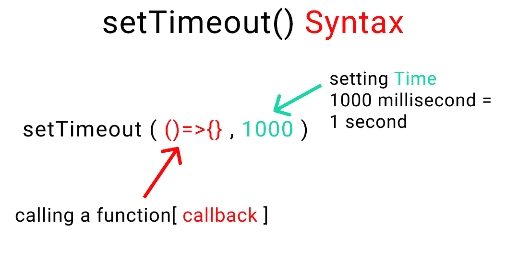

**Syntax of a setTimeout() function**

现在，让我们选择我们的水果并使用这个函数:

```
// 1st Function

let order = (fruit_name, call_production) =>{

  setTimeout(function(){

    console.log(`${stocks.Fruits[fruit_name]} was selected`)

// Order placed. Call production to start
   call_production();
  },2000)
};

// 2nd Function

let production = () =>{
  // blank for now
};

// Trigger 👇
order(0, production); 
```

这是控制台中的结果:👇

**注意**2 秒后显示结果。

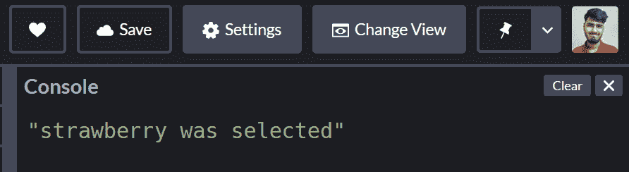

如果您想知道我们是如何从股票变量中挑选草莓的，下面是带有格式的代码👇

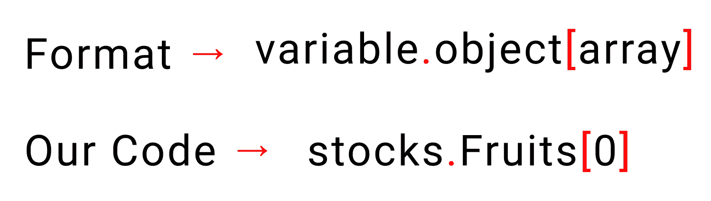

不要删除任何东西。现在我们将开始用下面的代码编写我们的生产函数。👇我们将使用箭头函数:

```
let production = () =>{

  setTimeout(()=>{
    console.log("production has started")
  },0000)

}; 
```

这是结果👇

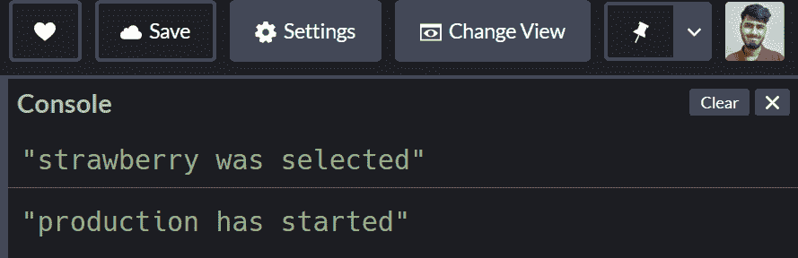

我们将在现有的`setTimeout`函数中嵌套另一个`setTimeout`函数来切水果。像这样:👇

```
let production = () =>{

  setTimeout(()=>{
    console.log("production has started")

    setTimeout(()=>{
      console.log("The fruit has been chopped")
    },2000)

  },0000)
}; 
```

这是结果👇

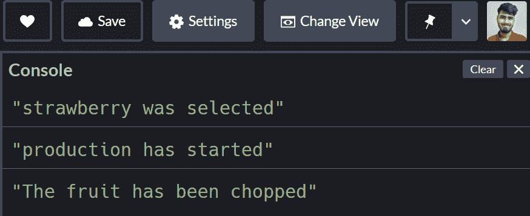

如果你记得，这是我们的步骤:


**Chart contains steps to make ice cream**

让我们通过将一个函数嵌套在另一个函数中来完成我们的冰淇淋生产——这也称为回调，还记得吗？

```
let production = () =>{

  setTimeout(()=>{
    console.log("production has started")
    setTimeout(()=>{
      console.log("The fruit has been chopped")
      setTimeout(()=>{
        console.log(`${stocks.liquid[0]} and ${stocks.liquid[1]} Added`)
        setTimeout(()=>{
          console.log("start the machine")
          setTimeout(()=>{
            console.log(`Ice cream placed on ${stocks.holder[1]}`)
            setTimeout(()=>{
              console.log(`${stocks.toppings[0]} as toppings`)
              setTimeout(()=>{
                console.log("serve Ice cream")
              },2000)
            },3000)
          },2000)
        },1000)
      },1000)
    },2000)
  },0000)

}; 
```

这是控制台中的结果👇

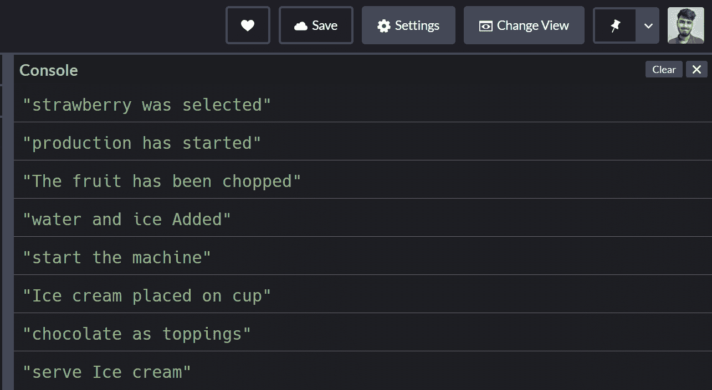

感到困惑？

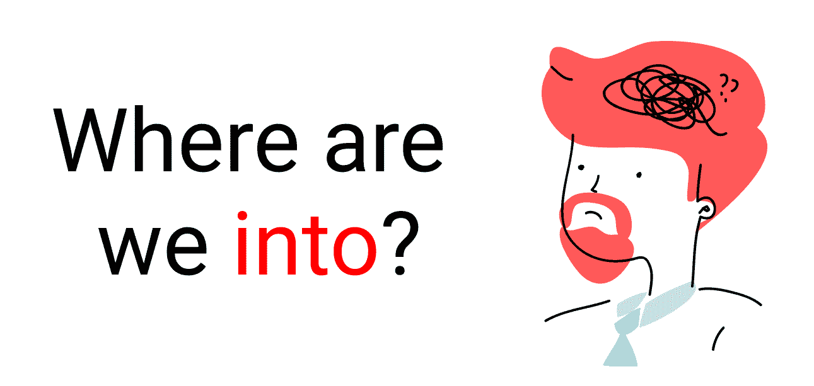

这叫回调地狱。它看起来像这样(还记得上面的代码吗？): 👇

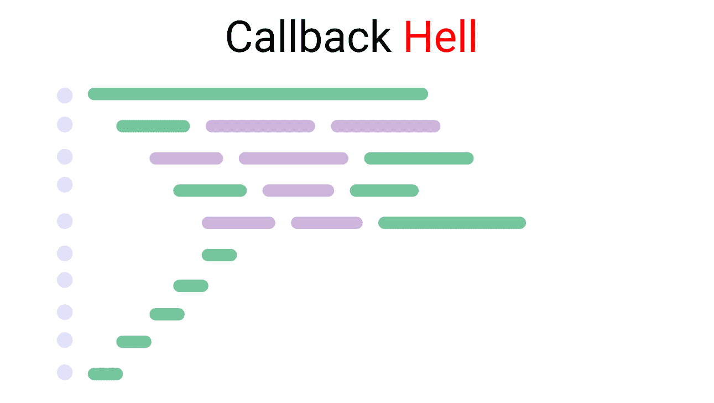

**Illustration of Callback hell**

对此有什么解决办法？

# 如何利用承诺逃离回调地狱

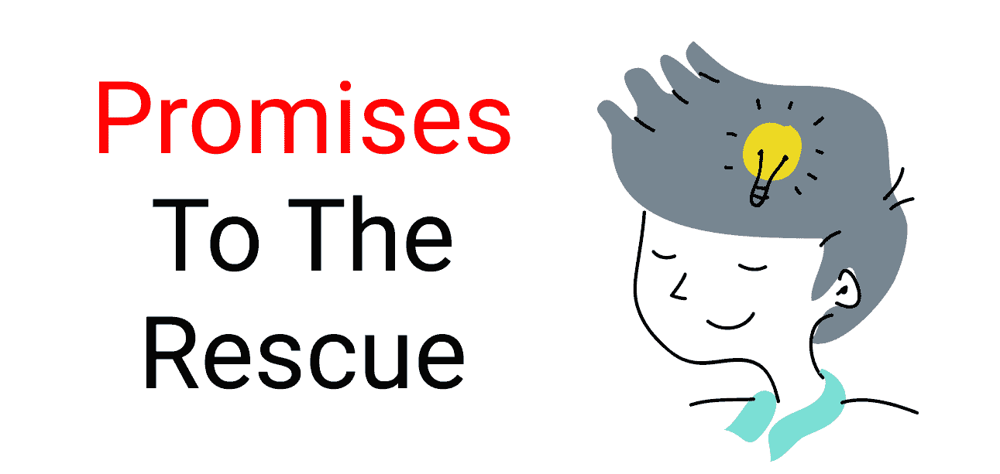

承诺是为了解决回调地狱的问题和更好地处理我们的任务而发明的。

## 休息一会儿

但是首先，休息一下！


这就是承诺的样子:

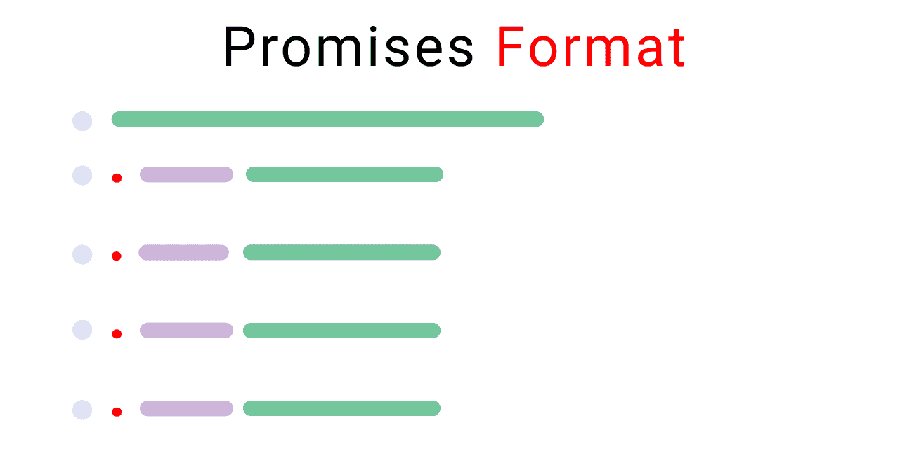

**illustration of a promise format**

让我们一起来解剖承诺。

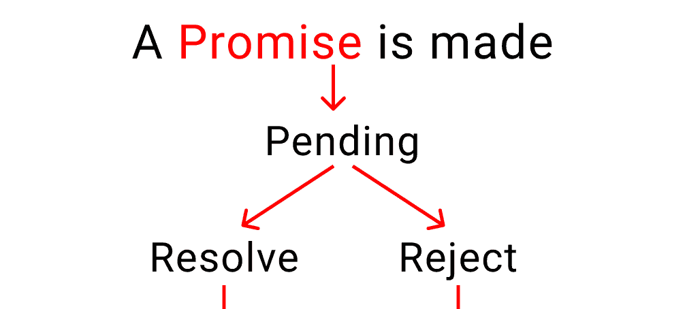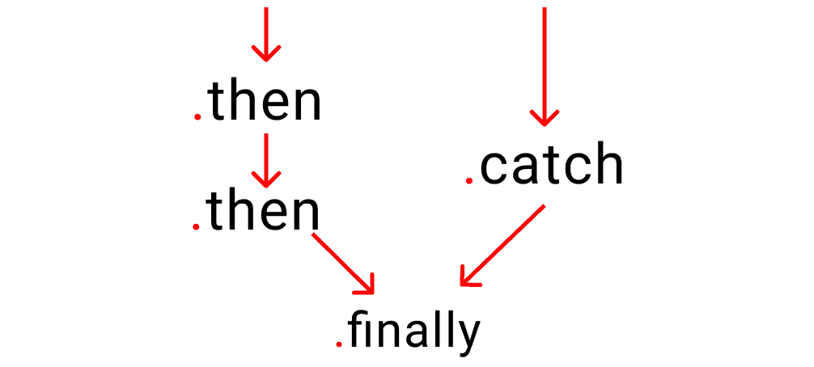

**An illustration of the life of a promise**

如上图所示，承诺有三种状态:

*   **待定:**这是初始阶段。这里什么都没发生。你可以这样想，你的客户正在慢慢给你下订单。但是他们还没有点任何东西。
*   **已解决:**这意味着你的顾客收到了他们的食物，很开心。
*   **拒绝:**这意味着你的顾客没有收到订单，离开了餐厅。

让我们通过承诺来研究我们的冰淇淋生产案例。

## 但是等等...


我们需要先了解另外四件事->

*   时间和工作的关系
*   承诺链
*   错误处理
*   `.finally`处理器

让我们开始我们的冰淇淋店，并通过循序渐进的方式逐一理解这些概念。

## 时间和工作的关系

如果你记得，这是我们制作冰淇淋的步骤和时间


**Chart contains steps to make ice cream**

为此，让我们在 JavaScript 中创建一个变量:👇

```
let is_shop_open = true; 
```

现在创建一个名为`order`的函数，并传递两个名为`time, work`的参数:

```
let order = ( time, work ) =>{

  } 
```

现在，我们要向我们的顾客做出承诺，“我们将为你提供冰淇淋”，就像这样-->

```
let order = ( time, work ) =>{

  return new Promise( ( resolve, reject )=>{ } )

  } 
```

我们的承诺有两部分:

*   已解决[冰淇淋已送达]
*   被拒绝[顾客没有得到冰淇淋]

```
let order = ( time, work ) => {

  return new Promise( ( resolve, reject )=>{

    if( is_shop_open ){

      resolve( )

    }

    else{

      reject( console.log("Our shop is closed") )

    }

  })
} 
```

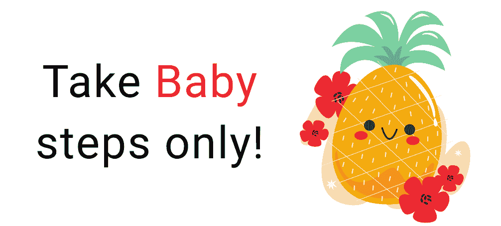

让我们使用`if`语句中的`setTimeout()`函数将时间和工作因素添加到我们的承诺中。跟我来👇

**注:**在现实生活中，也可以避开时间因素。这完全取决于你的工作性质。

```
let order = ( time, work ) => {

  return new Promise( ( resolve, reject )=>{

    if( is_shop_open ){

      setTimeout(()=>{

       // work is 👇 getting done here
        resolve( work() )

// Setting 👇 time here for 1 work
       }, time)

    }

    else{
      reject( console.log("Our shop is closed") )
    }

  })
} 
```

现在，我们将使用我们新创建的函数来开始冰淇淋生产。

```
// Set 👇 time here
order( 2000, ()=>console.log(`${stocks.Fruits[0]} was selected`))
//    pass a ☝️ function here to start working 
```

结果呢👇2 秒钟后看起来像这样:

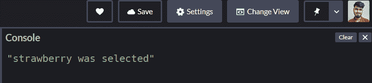

干得好！


## 承诺链

在这个方法中，我们使用`.then`处理程序来定义当第一个任务完成时我们需要做什么。它看起来像这样👇

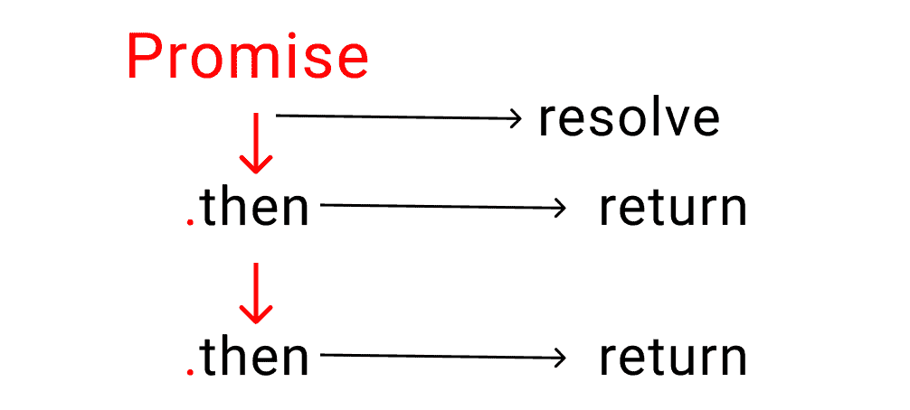

**Illustration of promise chaining using .then handler**

的。然后，当我们最初的承诺得到解决时，handler 返回一个承诺。

#### 这里有一个例子:

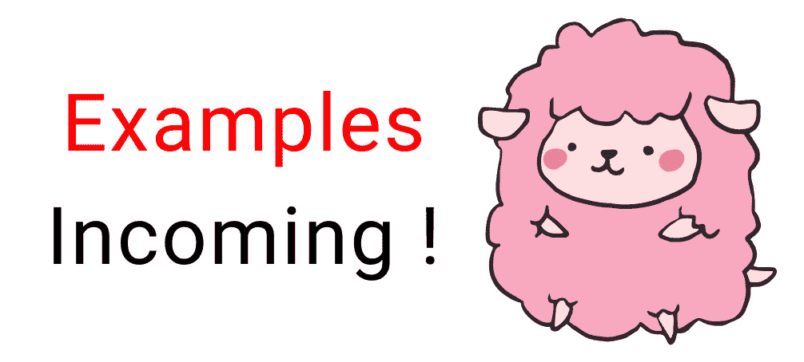

让我说得更简单些:这类似于给某人下达指令。你告诉某人“首先做这个，然后做那个，然后做另一件事..，那么..，然后……”诸如此类。

*   第一个任务是我们最初的承诺。
*   一旦一小部分工作完成了，剩下的任务就会回报我们的承诺

让我们在项目中实现它。在代码的底部写下下面几行。👇

**注意:**不要忘记在你的`.then`处理程序中写下`return`这个词。否则无法正常工作。如果您很好奇，请在我们完成以下步骤后尝试移除回车:

```
order(2000,()=>console.log(`${stocks.Fruits[0]} was selected`))

.then(()=>{
  return order(0000,()=>console.log('production has started'))
}) 
```

这是结果:👇


使用相同的系统，让我们完成我们的项目:👇

```
// step 1
order(2000,()=>console.log(`${stocks.Fruits[0]} was selected`))

// step 2
.then(()=>{
  return order(0000,()=>console.log('production has started'))
})

// step 3
.then(()=>{
  return order(2000, ()=>console.log("Fruit has been chopped"))
})

// step 4
.then(()=>{
  return order(1000, ()=>console.log(`${stocks.liquid[0]} and ${stocks.liquid[1]} added`))
})

// step 5
.then(()=>{
  return order(1000, ()=>console.log("start the machine"))
})

// step 6
.then(()=>{
  return order(2000, ()=>console.log(`ice cream placed on ${stocks.holder[1]}`))
})

// step 7
.then(()=>{
  return order(3000, ()=>console.log(`${stocks.toppings[0]} as toppings`))
})

// Step 8
.then(()=>{
  return order(2000, ()=>console.log("Serve Ice Cream"))
}) 
```

结果如下:👇

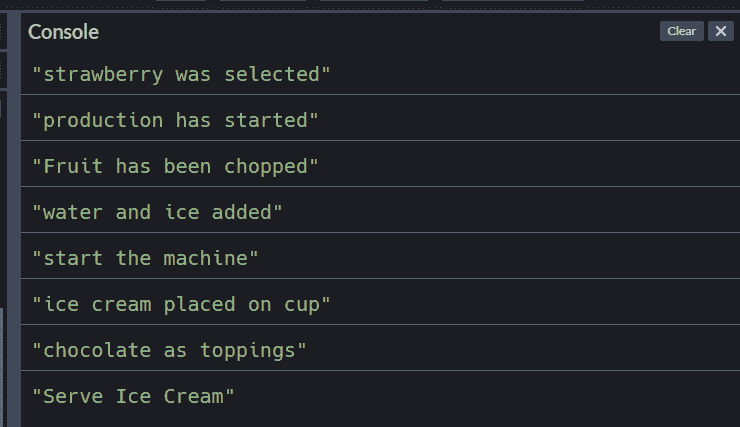

## 错误处理

当出现问题时，我们需要一种处理错误的方法。但首先，我们需要了解承诺周期:


**An illustration of the life of a promise**

为了捕捉我们的错误，让我们将变量改为 false。

```
let is_shop_open = false; 
```

这意味着我们的店关门了。我们不再向顾客出售冰淇淋了。

为了处理这个问题，我们使用了`.catch`处理程序。就像`.then`一样，它也返回一个承诺，但只是在我们最初的承诺被拒绝的情况下。

这里有一个小小的提醒:

*   当一个承诺被兑现时，就会起作用
*   当承诺被拒绝时有效

深入到最底部，编写以下代码:👇

请记住，在您之前的`.then`处理程序和`.catch`处理程序之间应该没有任何东西。

```
.catch(()=>{
  console.log("Customer left")
}) 
```

结果如下:👇

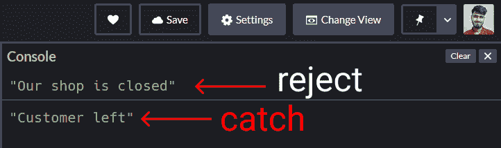

关于这段代码，有几点需要注意:

*   第一个信息来自我们承诺的`reject()`部分
*   第二条消息来自`.catch`处理器

## 如何使用？finally()处理器

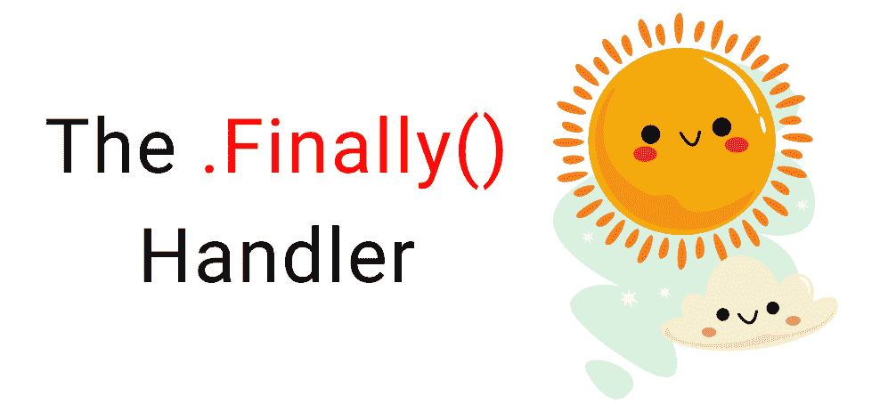

有一种叫做`finally`的处理程序，不管我们的承诺是被解决还是被拒绝，它都会工作。

例如:无论我们不接待顾客还是接待 100 名顾客，我们的商店都会在一天结束时关门

如果您对测试这一点很好奇，请在最底层编写以下代码:👇

```
.finally(()=>{
  console.log("end of day")
}) 
```

结果是:👇

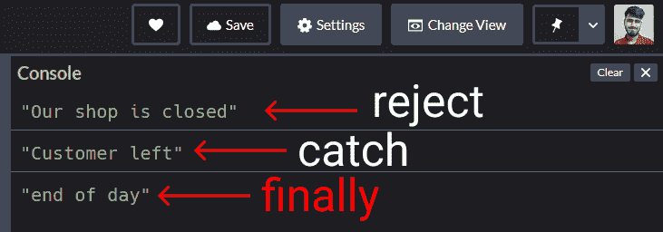

各位有请 Async / Await~

# JavaScript 中的 Async / Await 是如何工作的？

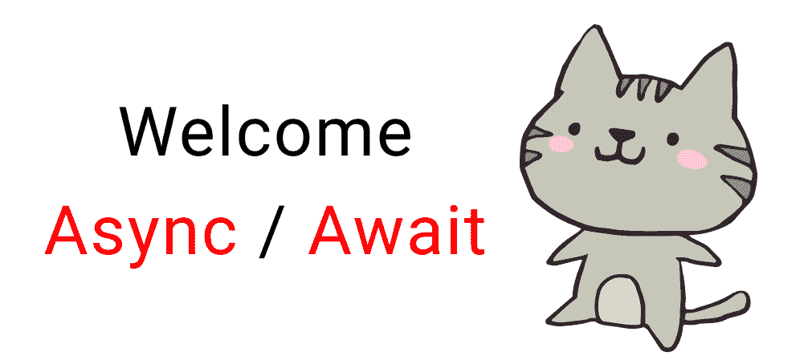

这应该是写承诺的更好的方式，它帮助我们保持代码简单和干净。

你所要做的就是在任何常规函数前写下单词`async`，它就变成了一个承诺。

## 但是首先，休息一下


让我们来看看:👇

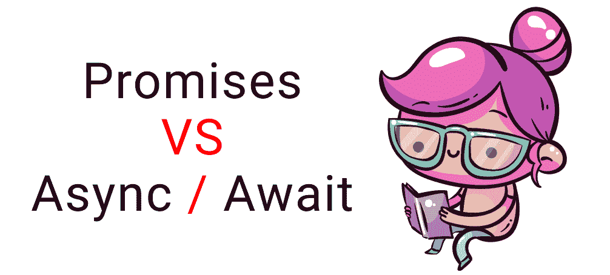

## JavaScript 中的承诺与异步/等待

在 async/await 之前，为了做出承诺，我们这样写道:

```
function order(){
   return new Promise( (resolve, reject) =>{

    // Write code here
   } )
} 
```

现在使用 async/await，我们写一个这样的:

```
//👇 the magical keyword
 async function order() {
    // Write code here
 } 
```

## 但是等等......


你需要明白->

*   如何使用`try`和`catch`关键字
*   如何使用 await 关键字

## 如何使用 Try 和 Catch 关键字

我们使用`try`关键字来运行代码，同时使用`catch`来捕捉错误。这和我们看承诺时看到的概念是一样的。

我们来看一个对比。我们将看到该格式的一个小演示，然后我们将开始编码。

### JS 中的承诺->解决或拒绝

我们在这样的承诺中使用了决心和拒绝:

```
function kitchen(){

  return new Promise ((resolve, reject)=>{
    if(true){
       resolve("promise is fulfilled")
    }

    else{
        reject("error caught here")
    }
  })
}

kitchen()  // run the code
.then()    // next step
.then()    // next step
.catch()   // error caught here
.finally() // end of the promise [optional] 
```

### JS 中的异步/等待-> try，catch

当我们使用 async/await 时，我们使用这种格式:

```
//👇 Magical keyword
async function kitchen(){

   try{
// Let's create a fake problem      
      await abc;
   }

   catch(error){
      console.log("abc does not exist", error)
   }

   finally{
      console.log("Runs code anyways")
   }
}

kitchen()  // run the code 
```

不要慌，我们接下来讨论`await`关键词。

现在，希望你能理解 promises 和 Async / Await 的区别。

## 如何使用 JavaScript 的 Await 关键字


关键字`await`让 JavaScript 等待一个承诺完成并返回结果。

### 如何在 JavaScript 中使用 await 关键字

让我们回到我们的冰淇淋店。我们不知道顾客会喜欢哪种配料，巧克力还是花生。所以我们需要停下我们的机器，去问问我们的顾客他们想要什么冰淇淋。

请注意，这里只有我们的厨房停止了工作，但厨房外的员工仍然会做一些事情，例如:

*   洗碗
*   擦桌子
*   接单，等等。

## Await 关键字代码示例

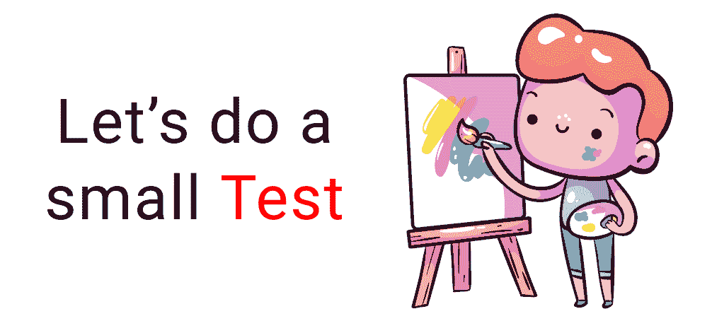

让我们创建一个小承诺，询问使用哪种浇头。这个过程需要三秒钟。

```
function toppings_choice (){
  return new Promise((resolve,reject)=>{
    setTimeout(()=>{

      resolve( console.log("which topping would you love?") )

    },3000)
  })
} 
```

现在，让我们首先用 async 关键字创建厨房函数。

```
async function kitchen(){

  console.log("A")
  console.log("B")
  console.log("C")

  await toppings_choice()

  console.log("D")
  console.log("E")

}

// Trigger the function

kitchen(); 
```

让我们在`kitchen()`调用下面添加其他任务。

```
console.log("doing the dishes")
console.log("cleaning the tables")
console.log("taking orders") 
```

这是结果:

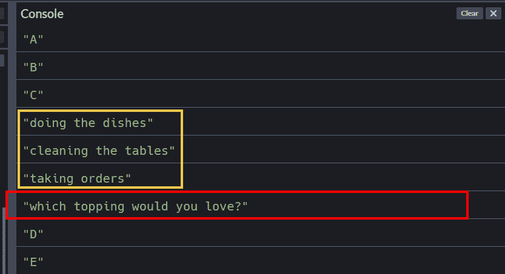

我们真的走出厨房去问我们的顾客，“你的顶级选择是什么？”与此同时，其他的事情仍然要做。

一旦我们得到他们的顶级选择，我们就进入厨房并完成工作。

### 小纸条

当使用 Async/ Await 时，也可以使用`.then`、`.catch`和`.finally`处理程序，它们是承诺的核心部分。

### 我们再开一家冰淇淋店吧


我们要创建两个函数->

*   做冰淇淋
*   分配每个小任务需要的时间。

开始吧！首先，创建时间函数:

```
let is_shop_open = true;

function time(ms) {

   return new Promise( (resolve, reject) => {

      if(is_shop_open){
         setTimeout(resolve,ms);
      }

      else{
         reject(console.log("Shop is closed"))
      }
    });
} 
```

现在，让我们创建我们的厨房:

```
async function kitchen(){
   try{

     // instruction here
   }

   catch(error){
    // error management here
   }
}

// Trigger
kitchen(); 
```

让我们给出一些小说明，测试一下我们的厨房功能是否正常:

```
async function kitchen(){
   try{

// time taken to perform this 1 task
     await time(2000)
     console.log(`${stocks.Fruits[0]} was selected`)
   }

   catch(error){
     console.log("Customer left", error)
   }

   finally{
      console.log("Day ended, shop closed")
    }
}

// Trigger
kitchen(); 
```

商店开门时，结果看起来是这样的:👇

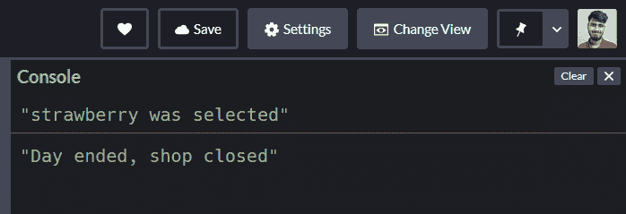

当商店关门时，结果看起来像这样:👇


到目前为止一切顺利。


让我们完成我们的项目。

这是我们的任务清单:👇


**Chart contains steps to make ice cream**

首先，开我们的店

```
let is_shop_open = true; 
```

现在编写我们的`kitchen()`函数中的步骤:👇

```
async function kitchen(){
    try{
	await time(2000)
	console.log(`${stocks.Fruits[0]} was selected`)

	await time(0000)
	console.log("production has started")

	await time(2000)
	console.log("fruit has been chopped")

	await time(1000)
	console.log(`${stocks.liquid[0]} and ${stocks.liquid[1]} added`)

	await time(1000)
	console.log("start the machine")

	await time(2000)
	console.log(`ice cream placed on ${stocks.holder[1]}`)

	await time(3000)
	console.log(`${stocks.toppings[0]} as toppings`)

	await time(2000)
	console.log("Serve Ice Cream")
    }

    catch(error){
	 console.log("customer left")
    }
} 
```

这是结果:👇

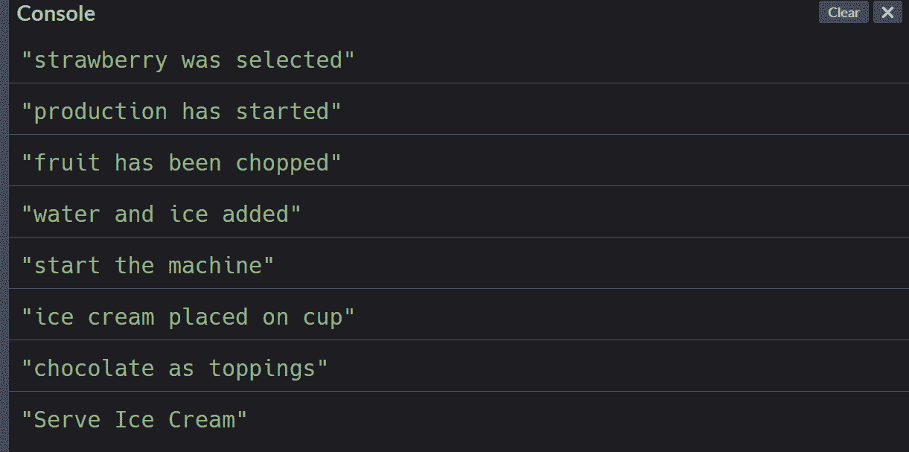

# 结论

恭喜你读到最后！在本文中，您了解到:

*   同步和异步系统的区别
*   使用 3 种技术(回调、承诺和异步/等待)的异步 JavaScript 机制

这是你一直读到最后的奖章。❤️

### 建议和批评得到了❤️的高度赞赏


**YouTube[/Joy Shaheb](https://youtube.com/c/joyshaheb)**

**LinkedIn[/JoyShaheb](https://www.linkedin.com/in/joyshaheb/)**

**推特[/JoyShaheb](https://twitter.com/JoyShaheb)**

**insta gram[/JoyShaheb](https://www.instagram.com/joyshaheb/)**

# 信用

*   [收集所有使用过的图像](https://www.freepik.com/user/collections/promises-article/2046500)
*   [独角兽](https://www.flaticon.com/packs/unicorn-4)， [kitty 头像](https://www.flaticon.com/packs/kitty-avatars-3)
*   [虎斑猫](https://www.pexels.com/photo/brown-tabby-cat-with-slice-of-loaf-bread-on-head-4587955/)，[占星女](https://www.pexels.com/photo/young-female-astrologist-predicting-future-with-shining-ball-6658693/)，[捧花女](https://www.pexels.com/photo/woman-in-white-dress-holding-white-flower-bouquet-3981511/)
*   [人物情绪](https://www.vecteezy.com/vector-art/180695-people-mind-emotion-character-cartoon-vector-illustration)