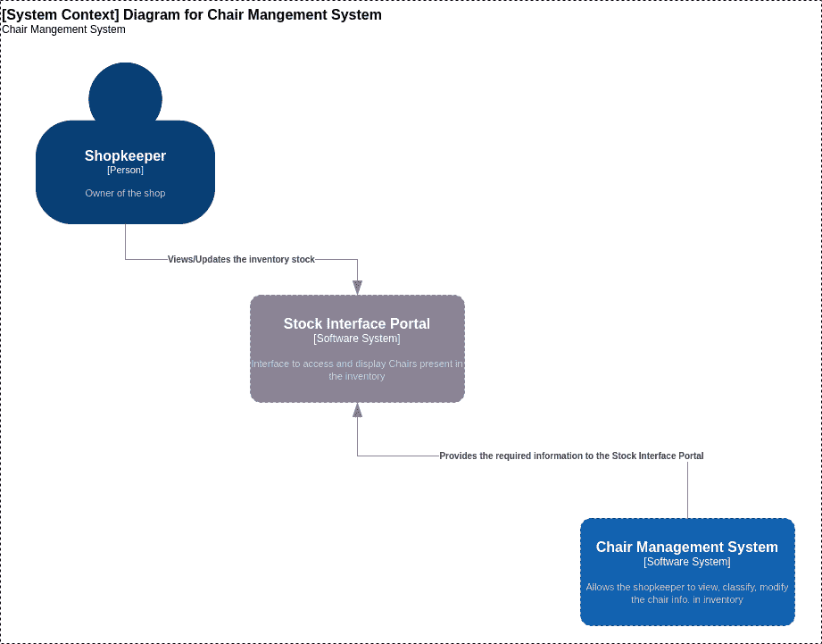
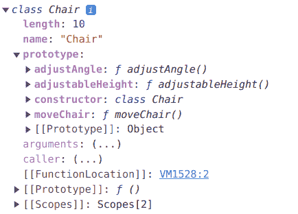
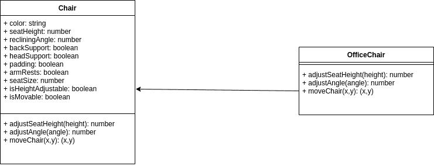
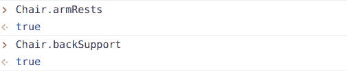
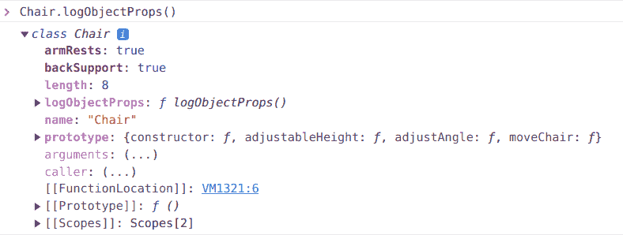
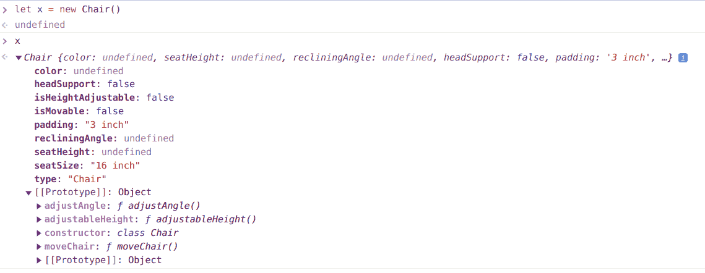
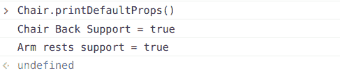
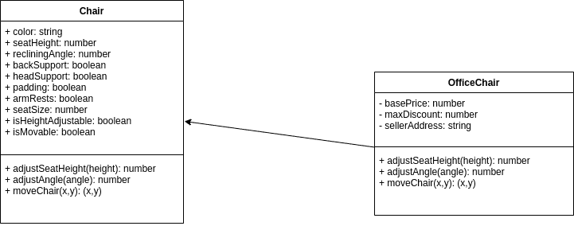
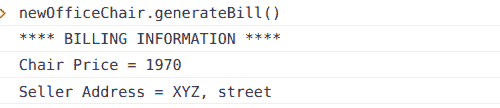

# JavaScript 类——它们如何使用用例示例

> 原文：<https://www.freecodecamp.org/news/javascript-classes-how-they-work-with-use-case/>

在这篇博文中，我将带你看一个真实的例子，这个例子使用了 Javascript 中的类的概念。

我认为用实际的用例工作是有帮助的，因为当你能把它们与现实生活联系起来时，理解这些概念就简单多了。

因此，在本指南中，您将了解 JavaScript 中的类、继承、抽象函数、如何使用关键字，如`super`和`extend` s、静态关键字以及类的私有成员。

让我们开始吧。

## 目录

*   [先决条件](#Prerequisites)
*   [JavaScript 中有哪些类？](#what-are-classes-in-javascript)
*   [用例描述](#use-case-description)
*   [椅子管理系统中的抽象功能和继承](#abstract-functions-and-inheritance-in-chair-management-system)
*   [Javascript 中的静态关键字](#static-keyword-in-javascript)
*   [Javascript 中的私有成员](#private-members-of-classes-in-javascript)

## 先决条件

在你开始阅读这篇博文之前，你应该对以下主题有一个基本的了解:

*   类图:我们将用它们来展示我们的例子
*   [上下文图和容器图](https://www.notion.so/JS-Classes-a-boon-to-the-society-6360d1a702fe49da9b7ba98b0e03fe37#446c5b4c9e5b4d89abb200421ddd706a)
*   [哎呀知识](https://www.notion.so/JS-Classes-a-boon-to-the-society-6360d1a702fe49da9b7ba98b0e03fe37#29ab50e013e04d48968ebaf9aec0ec50)
*   [原型继承和原型链接介绍](https://dev.to/lawrence_eagles/understanding-prototypal-inheritance-in-javascript-4f31#chp-2)
*   [JS 中构造函数介绍](https://dev.to/lawrence_eagles/an-easy-guide-to-understanding-constructors-in-javascript-2mf6)

## JavaScript 中有哪些类？

在 [EcmaScript 2015](https://262.ecma-international.org/6.0/) (ES6)中引入了类，以提供一种更干净的方式来遵循面向对象的编程模式。

JavaScript 仍然遵循基于原型的继承模型。JavaScript 中的类是基于原型的继承模型上的语法糖，我们用它来实现 OOP 概念。

因此，在 JS 中引入类使得开发人员围绕 OOP 概念构建软件变得更加容易。它也带来了与不同的基于 OOP 的编程语言的相似性，比如 C++和 Java。

在上课之前，我们用构造函数在 JavaScript 中做 OOP。看看下面的例子:

```
function Pen(name, color, price) {
    this.name = name;
    this.color = color;
    this.price = price;
}

const pen1 = new Pen("Marker", "Blue", "$3");
console.log(pen1); 
```

Pen Constructor function

上面的代码显示了一个具有名称、颜色和价格属性的`Pen`构造函数。我们使用`new`关键字和`Pen`构造函数来创建一个对象`pen1`。

现在，假设我们想给`Pen`构造函数添加一个新函数。为此，我们需要将函数添加到`Pen`的 prototype 属性中。看看下面的`showPrice`功能:

```
function Pen(name, color, price) {
    this.name = name;
    this.color = color;
    this.price = price;
}

const pen1 = new Pen("Marker", "Blue", "$3");

Pen.prototype.showPrice = function(){
    console.log(`Price of ${this.name} is ${this.price}`);
}

pen1.showPrice();
```

Adding function in a constructor

如果这些概念对您没有意义，那么我建议您通过先决条件一节中提到的文章来复习 JS/背景知识。特别是，查看关于原型和构造函数的文章。

看着上面的代码，我们可以说已经完成了我们想要做的事情——也就是给构造函数`Pen`添加一个`showPrice`函数。但是你可以看到，与我们在 C++或 Java 中实现的 OOP 概念相比，它并不是那么可读。

我们可以借助`class`关键字重新创建上面的例子。看看下面的代码:

```
class Pen {
    constructor(name, color, price){
        this.name = name;
        this.color = color; 
        this.price = price;
    }

    showPrice(){
        console.log(`Price of ${this.name} is ${this.price}`);
    }
}

const pen1 = new Pen("Marker", "Blue", "$3");
pen1.showPrice();
```

Using Class keyword in JS

注意到了不同！我们已经取得了相同的结果，但语法更加清晰。与将函数直接添加到构造函数的原型中相比，添加像`showPrice`这样的新成员函数要容易得多。

让我们使用一个用例来更深入地研究 JS 中的类。通过这个用例，我们将看到这些概念如何用于解决一些现实生活中的问题。

## 用例描述

**快速注意一下**:****这篇博文中绘制的上下文、容器和类图并不完全遵循上述图的约定。我用图表来帮助你理解一般的概念。****

****在我们开始之前，如果你需要复习的话，我建议阅读 C4 模型、容器图和上下文图。您可以在先决条件部分找到它们。****

****我们将解决以下问题:帮助一位店主对库存中的椅子进行分类，并将其显示在屏幕上。****

****用例简单明了。请看下图，该图展示了整个建议系统:****

****

Context Diagram for the Chair Management System**** 

****从上图中可以看出，它有 3 个主要组件:****

1.  ******人:**店主要和我们的系统互动。****
2.  ******软件系统:库存界面门户** -该界面允许店主查看或修改库存中的椅子信息。****
3.  ******软件系统:椅子管理系统** -该系统将允许接口获取或修改店主请求的所需细节。****

****现在我们已经理解了用例，让我们从这篇博文中我们将要关注的目标系统开始。就是**椅子管理系统。******

****我们将首先在椅子管理系统中创建一些主要组件。我们在这个系统中的组件只是不同的类，这将有助于促进店主的不同需求。****

****

Chair component of Chair Management System**** 

****让我们添加一个名为 **`Chair`** 的组件。既然是类，就会有自己的属性(属性)和行为(方法)。****

****看一下上面的图表。我们可以看到:****

*   ****第二行包含椅子类的属性，例如颜色、座位高度、recliningAngle 等等。****
*   ****第三行对应于告诉我们椅子可以执行什么功能的方法，例如 adjustSeatHeight、adjustAngle、moveChair 等等。****

****在本文中，我们将按照上述方式创建所有组件。****

****`Chair`组件将是我们的基本组件。这意味着所有其他类型的椅子，如办公椅、餐椅等都将归入该类别/组件。****

****让我们从用 JS 创建我们的 base chair 类开始。看看下面的代码:****

```
**`class Chair {
    constructor(color, seatHeight, recliningAngle, backSupport, headSupport, padding, armRests, seatSize, isHeightAdjustable, isMovable){
        this.color = color;
        this.seatHeight = seatHeight;
        this.recliningAngle = recliningAngle;
        this.backSupport = backSupport;
        this.headSupport = headSupport;
        this.padding = padding;
        this.armRests = armRests;
        this.seatSize = seatSize;
        this.isHeightAdjustable = isHeightAdjustable;
        this.isMovable = isMovable;
    }

    adjustableHeight() {};
    adjustAngle(){};
    moveChair(){};    
}

const newChair = new Chair("Blue","25 inch","20 deg",true,false,"3 inch",true,"16 inch",false,false);

console.dir("Chair Prototype", Chair);
console.log("Chair Object", newChair);`**
```

****Base Class Chair****

****chair 类有以下成员:****

*   ******属性**:这些属性将定义椅子的属性，如颜色、座位高度、靠背等等。****
*   ******功能**:这些定义了椅子的行为。例如，如果椅子的`isHeightAdjustable`设置为真，那么它可以使用功能`adjustableHeight`。你可以看到所有的函数都在`Chair`类中声明。这些是抽象函数。我们将在本文后面更多地讨论这些函数。****

****在代码的底部，我们有两个控制台日志语句。第一个将打印出类`Chair`的定义。第二个对象将打印`newChair`实例。****

****

First console.dir output**** 

****如果您查看第一个输出，它打印出了`Chair`类。让我们看看它的内容:****

*   ****它由属性`prototype`组成。这是 class Chair 的所有实例都将拥有的原型。****
*   ****`name`属性是对象的名称。****
*   ****最后，我们有`__proto__`或`[[Prototype]]`属性。这是`Chair`的真实原型。****

```
**`{
    "color": "Blue",
    "seatHeight": "25 inch",
    "recliningAngle": "20 deg",
    "backSupport": true,
    "headSupport": false,
    "padding": "3 inch",
    "armRests": true,
    "seatSize": "16 inch",
    "isHeightAdjustable": false,
    "isMovable": false,
    [[Prototype]]: {
        adjustAngle: ƒ adjustAngle()
        adjustableHeight: ƒ adjustableHeight()
        constructor: class Chair
        moveChair: ƒ moveChair()
        [[Prototype]]: Object
    }
}`**
```

****Second console log output****

****第二个日志语句打印出椅子对象实例的信息。它将包含所有椅子类属性。如果您仔细观察，您会发现这个实例的原型类似于 chair 类的`prototype`属性。这是因为原型继承。****

****现在让我们看看如何通过在我们的**椅子管理系统中添加一个新的组件/类来使用这个概念。******

## ****椅子管理系统中的抽象函数和继承****

****抽象函数只是一个没有任何实现的类中的函数签名。它帮助我们将代码一般化，以便子类可以使用它们，并向其中添加它们自己的实现。****

****为了在我们的用例中演示这一点，让我们向我们的**椅子管理系统添加一个组件。******

****我已经修改了 chair 类，现在它由默认值组成。所有实例都将使用这些默认值。稍后子类可以修改它。我们将很快看到如何实现这一点。看看下面的新`Chair`类:****

```
**`class Chair {
    constructor(color, seatHeight, recliningAngle, backSupport, headSupport, padding, armRests, seatSize, isHeightAdjustable, isMovable){
        //Defaults which can be changed by the subclass class.
        this.color = color;
        this.seatHeight = seatHeight;
        this.recliningAngle = recliningAngle;
        this.backSupport = true;
        this.headSupport = false;
        this.padding = "3 inch";
        this.armRests = true;
        this.seatSize = "16 inch";
        this.isHeightAdjustable = false;
        this.isMovable = false;
        this.type = "Chair";
    }

    adjustableHeight() {};
    adjustAngle(){};
    moveChair(){};    
}

const newChair = new Chair();

newChair;`**
```

****Chair class with defaults****

****现在让我们添加一个名为 **`OfficeChair`** 的新组件/类。这将从`Chair`类继承属性和方法。修改后的新类图将如下所示:****

****

Class diagram**** 

****注意，新类`OfficeChair`只包含方法，不包含属性。我们在这里假设所有的属性都将从`Chair`类继承而来。****

****对于`OfficeChair`类，我们实现了`Chair`类中的抽象方法。****

****看看下面这个`OfficeChair`类的代码:****

```
**`class OfficeChair extends Chair{
    constructor(color, isHeightAdjustable, seatHeight, recliningAngle){
        super();
        this.type = "Office Chair";
        this.color = color;
        this.isHeightAdjustable = isHeightAdjustable;
        this.seatHeight = seatHeight;
        this.recliningAngle = recliningAngle;
        this.isMovable = true;
    }

    adjustableHeight(height){
        if(height > this.seatHeight){
            console.log(`Chair height changed to ${height}`);        
        } else {
            console.log(`Height cannot be decreased more than the seat height ${this.seatHeight}`);
        }
    }

    adjustAngle(angle){
        if(angle >= this.recliningAngle){
            console.log(`Chair angle changed to ${angle}`);        
        } else {
            console.log(`Angle cannot be decreased more than the min reclining angle ${this.recliningAngle}`);
        }
    }

    moveChair(x,y){
        console.log(`Chair moved to co-ordinates = (${x}, ${y})`);
    }
}

const newOfficeChair = new OfficeChair("Red", true, 30, 30);

console.log(newOfficeChair.adjustableHeight(31));
console.log(newOfficeChair.adjustAngle(40));
console.log(newOfficeChair.moveChair(10,20));`**
```

****OfficeChair class implementation****

****这是一个从超类`chair`继承功能和属性的类。它使用`extends`关键字来允许`OfficeChair`类执行继承。****

****`extends`关键字的语法如下:****

```
**`class ChildClass extends ParentClass{...}`**
```

****接下来，我们有一个构造函数和超类中一些函数的实现。注意，我们在构造函数中使用了`super`关键字。****

****我们使用`super`关键字来调用父类的构造函数。我们也可以用它来调用父类的函数和属性。****

****使用`super`关键字时需要注意的一点是:****

*   ****确保在构造函数开始时调用`super`函数。如果不这样做，并且在子类构造函数中使用`super`之前试图访问父类的属性，它将抛出一个错误。****
*   ****一旦调用了`super`函数，就可以访问父类的所有属性和函数。****
*   ****Super 不仅仅与类相关——你也可以用它来调用对象的父对象的函数。****

****你可以在 MDN [文档](https://developer.mozilla.org/en-US/docs/Web/JavaScript/Reference/Operators/super)中阅读更多关于`super`的内容。****

****最后，如果您注意到了，我们已经添加了抽象函数的实现。这些功能如下:****

*   ****`adjustableHeight`:该功能将检查输入的高度是否大于椅子的最小高度。如果是，我们可以改变高度或者显示错误信息。一个人也可以增加或减少椅子的高度。注意`this.seatHeight`是椅子离地面的最小高度，低于此高度，人不能降低高度。****
*   ****`adjustAngle`:该功能将检查输入角度是否大于默认值`this.recliningAngle`。如果输入角度大于默认角度，则角度将改变，否则将显示错误消息。****
*   ****`moveChair`:任何椅子的`isMovable`属性为真，那么相应的类将有一个`moveChair`函数的实现。它只是帮助根据输入的 x 和 y 坐标移动椅子。****

****注意，我们还重新初始化了`Chair`类的一些属性，比如`type`。我们将为每个子类明确定义`type`属性。这将有助于我们对库存中的椅子进行分类，将这些类别分配给每一把椅子。****

****您现在应该对什么是抽象函数以及它们有多大用处有所了解了。拥有抽象函数的一些优势:****

*   ****减少代码库中的冗余。****
*   ****提供一种适当的泛化类的方法。****
*   ****允许子类灵活地实现他们需要的抽象函数。****

## ****Javascript 中的静态关键字****

****JavaScript 中的`static`关键字帮助您在类中定义不能被对象实例调用的函数和属性。它们只能由包含这些静态函数和属性的类本身调用。****

****通常，我们在类中使用`static`方法是出于实用目的，比如打印出类的所有属性，创建一个新对象，清除类的其他对象，等等。****

****在类中使用`static`函数或属性的优点是:****

*   ****它们可以用来创建不需要在实例中出现的功能/属性。这有助于维护代码库中的某种隔离。****
*   ****在某些情况下，它们减少了代码冗余。****

****现在让我们看看如何在我们的`Chair`类中实现这个概念。我们还将看看一些可以使用`static`关键字的用例。****

****以下是您可以使用`static`关键字的场景:****

*   ****课堂上的用法****
*   ****静态中的静态****
*   ****从构造函数调用静态****
*   ****类静态初始化块****

****有关上述场景的更多信息，请访问 MDN [文档](https://developer.mozilla.org/en-US/docs/Web/JavaScript/Reference/Classes/static)。****

****我们将通过这些场景看到`Chair`类的所有变体:****

### ****如何在类中使用`static`关键字****

****像任何其他编程语言一样，这是使用 static 关键字对初学者最友好的方式之一。让我们将类的一些方法和属性定义为`static`并观察其行为。****

****看看下面的代码:****

```
**`class Chair {
//Defaults that will be common for all the instances:
    static backSupport = true;
    static armRests = true;

    constructor(color, seatHeight, recliningAngle, headSupport, padding, seatSize, isHeightAdjustable, isMovable){
        //Defaults which can be changed by the subclass class.
        this.color = color;
        this.seatHeight = seatHeight;
        this.recliningAngle = recliningAngle;
        this.headSupport = false;
        this.padding = "3 inch";
        this.seatSize = "16 inch";
        this.isHeightAdjustable = false;
        this.isMovable = false;
        this.type = "Chair";
    } 

    static logObjectProps(){
        console.dir(this);
    }

    adjustableHeight() {};
    adjustAngle(){};
    moveChair(){};    
}`**
```

****下面是上面代码的输出:****

****

Static variables**** ****

The output of the static function**** 

****正如您在上面看到的，静态方法只能通过类本身来访问。它不能被`Chair`类的实例访问。类的实例没有静态属性:****

****

No static members in instances**** 

****正如您在上面看到的，`Chair`类的实例`x`在其定义中没有静态方法或属性。****

****如果你试图使用一个类实例访问一个静态方法或者属性，那么它将抛出一个引用错误或者简单地返回 undefined。****

### ****如何在另一个静态函数中使用`static`关键字****

****可能会有这样的情况，您可能需要在另一个静态函数中使用静态属性或函数。您可以通过在静态函数中使用这个关键字来引用您的其他属性/函数来做到这一点。****

****让我们修改我们的`Chair`类来展示这是如何工作的:****

```
**`class Chair {
//Defaults that will be common for all the instances:
    static backSupport = true;
    static armRests = true;

    constructor(color, seatHeight, recliningAngle, headSupport, padding, seatSize, isHeightAdjustable, isMovable){
        //Defaults which can be changed by the subclass class.
        this.color = color;
        this.seatHeight = seatHeight;
        this.recliningAngle = recliningAngle;
        this.headSupport = false;
        this.padding = "3 inch";
        this.seatSize = "16 inch";
        this.isHeightAdjustable = false;
        this.isMovable = false;
        this.type = "Chair";
    } 

    static logObjectProps(){
        console.dir(this);
    }

		//Static within static usage
		static printDefaultProps(){
				console.log(`Chair Back Support = ${this.backSupport}`);
				console.log(`Arm rests support = ${this.armRests}`);
		}

    adjustableHeight() {};
    adjustAngle(){};
    moveChair(){};    
}`**
```

****Static within static implementation****

****

Output of the above code**** 

****如你所见，`printDefaultProps`函数可以访问静态属性`backSupport`和`armRests`。****

### ****如何从构造函数调用静态属性/函数****

****与我们上面看到的类似，您也可以在构造函数中访问这些静态属性/函数。为此，这里的情况有所不同。****

****在构造函数中调用静态属性/函数需要使用`<classname>.property`或`<classname>.functionName()`。这是因为`this`关键字不能直接访问静态成员。这不仅适用于构造函数，也适用于任何非静态函数。****

****让我们通过修改`Chair`类来理解这一点。****

```
**`class Chair {
//Defaults that will be common for all the instances:
    static backSupport = true;
    static armRests = true;

    constructor(color, seatHeight, recliningAngle, headSupport, padding, seatSize, isHeightAdjustable, isMovable){
        //Defaults which can be changed by the subclass class.
        this.color = color;
        this.seatHeight = seatHeight;
        this.recliningAngle = recliningAngle;
        this.headSupport = false;
        this.padding = "3 inch";
        this.seatSize = "16 inch";
        this.isHeightAdjustable = false;
        this.isMovable = false;
        this.type = "Chair";
		console.log(Chair.printDefaultProps()); //Usage of static method inside constructor
    } 

    static logObjectProps(){
        console.dir(this);
    }

		//Static within static usage
		static printDefaultProps(){
				console.log(`Chair Back Support = ${this.backSupport}`);
				console.log(`Arm rests support = ${this.armRests}`);
		}

    adjustableHeight() {};
    adjustAngle(){};
    moveChair(){};    
}`** 
```

****在上面的代码中，最后一行`console.log(Chair.printDefaultProps());`展示了我们如何在构造函数中使用静态方法。****

## ****Javascript 中类的私有成员****

****私有成员是只能由类本身内部使用的类成员。不能在类外访问它们。甚至类的实例也不能访问这些私有成员。****

****所有私有成员都使用`#<propertName>`语法声明。他们通常被称为*哈希名*。****

****让我们看一个基于我们的用例的例子。****

****我们将在`OfficeChair`类中定义一些新的属性。假设我们想为所有的办公椅添加默认的账单信息。我们还希望这些变量只能被`OfficeChair`类访问，以便其他实用函数可以使用这些变量。****

****我们不希望其他类干扰其他类的计费信息。为了解决这个问题，我们可以使用私有字段。****

****考虑添加以下字段:****

*   ****价格****
*   ****最大折扣****
*   ****卖家地址****

****

Updated Class Diagram**** 

****注意，我们可以用破折号来表示类图中的私有字段，就像这样:`-`。****

****看看下面的代码，它演示了我们如何将这些字段添加到类`OfficeChair`中:****

```
**`class OfficeChair extends Chair {
	//Newly Added Properties
	#basePrice;
	#maxDiscount;
	#sellerAddress;

	constructor(type, color, isHeightAdjustable, seatHeight, recliningAngle) {
		super();
		this.type = type;
		this.color = color;
		this.isHeightAdjustable = isHeightAdjustable;
		this.seatHeight = seatHeight;
		this.recliningAngle = recliningAngle;
		this.isMovable = true;
		this.#basePrice = 1000;
		this.#maxDiscount = 5; //In percentage
		this.#sellerAddress = "XYZ, street";
	}

	adjustableHeight(height) {
		if (height > this.seatHeight) {
			console.log(`Chair height changed to ${height}`);
		} else {
			console.log(`Height cannot be decreased more than the seat height ${this.seatHeight}`);
		}
	}

	adjustAngle(angle) {
		if (angle >= this.recliningAngle) {
			console.log(`Chair angle changed to ${angle}`);
		} else {
			console.log(`Angle cannot be decreased more than the min reclining angle ${this.recliningAngle}`);
		}
	}

	moveChair(x, y) {
		console.log(`Chair moved to co-ordinates = (${x}, ${y})`);
	}

	//Newly Added function
	#getChairAmount(taxCharge) {
		return this.#basePrice + (this.#basePrice - this.#basePrice * this.#maxDiscount / 100) + taxCharge;
	}

	//Newly Added function
	generateBill() {
		console.log("**** BILLING INFORMATION ****");
		console.log(`Chair Price = ${this.#getChairAmount(20)}`);
		console.log(`Seller Address = ${this.#sellerAddress}`);
	}
}`**
```

****Private members usage****

****当您在控制台中运行上述代码时，您应该会看到以下输出:****

****

Output of private members**** 

****从上面的输出可以看出，我们已经执行了`generateBill`函数。这个函数访问类中的私有字段和函数来生成计费信息。****

****这些私有变量只能在类内部访问。如果您试图引用该类的任何私有成员，它将抛出如下语法错误:****

```
**`Uncaught SyntaxError: Private field '#basePrice' must be declared in an enclosing class`**
```

****让我演示一下如果一个子类试图访问基类的私有变量会是什么样子:****

```
**`class DinningChair extends OfficeChair{}

let dineChair = new DinningChair();
dineChair.#basePrice(); //Throws syntax error`**
```

****上面的代码将抛出一个语法错误，因为你试图访问另一个类的私有属性。****

****静态私有变量不在这篇博文的讨论范围之内，所以我们不会进一步讨论它们。但是你可以在这里阅读它们。****

## ****摘要****

****这些是我们在现实世界的例子中利用 JavaScript 中的类实现面向对象编程概念的一些方法。****

****您可以在下面阅读更多关于高级面向对象概念的内容:****

*   ****[多态性](https://en.wikipedia.org/wiki/Polymorphism_(computer_science))****
*   ****[继承的类型](https://en.wikipedia.org/wiki/Inheritance_(object-oriented_programming))****

****感谢您的阅读！****

****在 [Twitter](https://twitter.com/keurplkar) 、 [GitHub](http://github.com/keyurparalkar) 和 [LinkedIn](https://www.linkedin.com/in/keyur-paralkar-494415107/) 上关注我。****