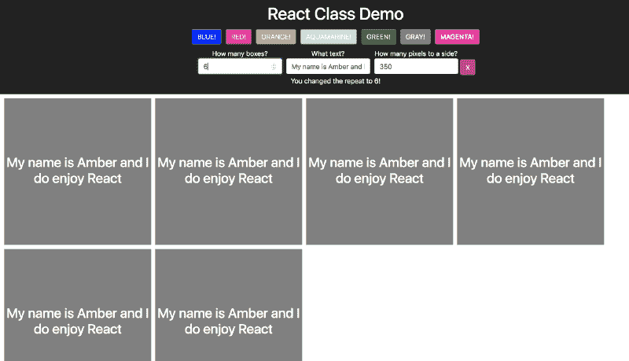

# JavaScript 代码清理:如何重构以使用类

> 原文：<https://www.freecodecamp.org/news/javascript-code-cleanup-how-you-can-refactor-to-use-classes-3948118e4468/>

在较小的 React 项目中，将所有组件方法保留在组件本身中效果很好。在中等规模的项目中，您可能会发现自己希望能够将这些方法从您的组件中分离出来，成为一个“助手”。在这里，我将向您展示如何使用一个类(而不是导出单独的函数和变量)来组织您的代码。

**注意**:我在 React 工作，所以这就是我们在这里要讨论的例子。

### 典型重构

在一个典型的重构中，你需要将组件上的一个函数移动到另一个助手上。

出发地:

```
const MyComponent = () => {
  const someFunction = () => 'Hey, I am text'
  return (
    <div>
      {someFunction()}
    </div>
  )
}
```

收件人:

```
import { someFunction } from 'functionHelper.js'
const MyComponent = () => {
  return (
    <div>
      {someFunction()}
    </div>
  )
}
```

和

```
export const someFunction = () => 'Hey, I am text'
```

这个例子真的很傻，但是你知道我们要去哪里:

1.  把你的函数复制到一个单独的文件中
2.  导入它们并正常调用它们。

然而，当事情变得复杂时，您将不得不向这些函数传递一堆东西——对象、用于操纵状态的函数等等。今天我遇到了一个问题，我想从一个组件中提取三个函数，它们都需要相同的输入(一个`resource`和一个更新`resource`的函数)。一定有更好的方法…

### 用类重构

我为这个帖子做了一个大的演示。你可以在 Github 上看到代码[。最初的提交显示了主组件(`App.js`)中的所有功能，随后的提交重构代码以使用一个类。](https://github.com/AmberWilkie/class-demo)



你可以自己运行它，做任何你想做的事情。记得`yarn install`。

我们从一个组件开始，该组件“获取”一个对象(模仿我们从 API 中获取的方式)，该对象具有某些属性:repeat(框的数量)、side(高度和宽度)、text、color。然后，我们有许多方法来操纵视图——改变颜色、更新文本等等。每次更改后，我们都会显示一条消息。

例如，下面是我们改变宽度和高度的方法:

```
changeSide = side => {
  const obj = {...this.state.obj, side}
  this.fetchObject(obj);
  this.setState({ message: `You changed the sides to ${side} pixels!` });
}
```

我们可能有许多其他方法需要类似的操作——或者可能是非常不同的方法。我们可能会开始考虑将这些代码提取给一个助手。然后，我们将创建一个不同的方法来调用`setState`动作，我们必须传递它、`this.fetchObject`、状态中的对象和作为方法参数的`side`。如果我们有几个类似的方法，那就需要传递大量的参数，可能实际上并没有那么有用(或者可读性)。

相反，我们可以使用一个带有构造函数方法的类:

```
export default class ObjectManipulator {
  constructor( { object, fetchObject, markResettable, updateMessage, updateStateValue } ) {
    this.fetchObject = fetchObject;
    this.markResettable = markResettable;
    this.updateMessage = updateMessage;
    this.updateStateValue = updateStateValue;
  }

  changeSide = ( object, side ) => {
    const newObject = { ...object, side };
    this.fetchObject(newObject);
    this.updateMessage(`You changed the sides to ${side} pixels!`);
    this.markResettable();
    this.updateStateValue('side', side);
  };
};
```

这允许我们创建一个对象，我们可以在主组件内部调用它的函数:

```
const manipulator = new ObjectManipulator({
  object,
  fetchObject: this.fetchObject,
  markResettable: this.markResettable,
  updateMessage: this.updateMessage,
  updateStateValue: this.updateStateValue,
});
```

这创建了一个对象`manipulator`——我们的`ObjectManipulator`类的一个实例。当我们调用`manipulator.changeSide(object, '800')`时，它将运行我们上面定义的`changeSide`方法。不需要传入`updateMessage`或任何其他方法——当我们创建实例时，我们从构造函数中获取它们。

你可以想象，如果我们有很多这样的方法要处理，这将变得非常有用。在我的例子中，我需要在我试图提取的所有东西之后调用`.then(res => myFunction(r` es。在类实例上定义，而不是传递给每个函数，为我节省了大量代码。

### 保持一切井然有序

这种组织方法确实有助于让所有东西都保持在原位。例如，我有一个颜色数组，我映射它来得到你在例子中看到的颜色按钮。通过将这个常量移动到`ObjectManipulator`中，我可以确保它不会与我的应用程序其余部分中的任何其他`colors`冲突:

```
export default class ObjectManipulator {
  [...]

  colors = ['blue', 'red', 'orange', 'aquamarine', 'green', 'gray', 'magenta'];
};
```

我可以使用`manipulator.colors`为这个页面获取正确的颜色，而可能有一个全局的`colors`常量用于其他用途。

### 参考

[优秀的老 Mozilla 类文档](https://developer.mozilla.org/en-US/docs/Web/JavaScript/Reference/Classes)