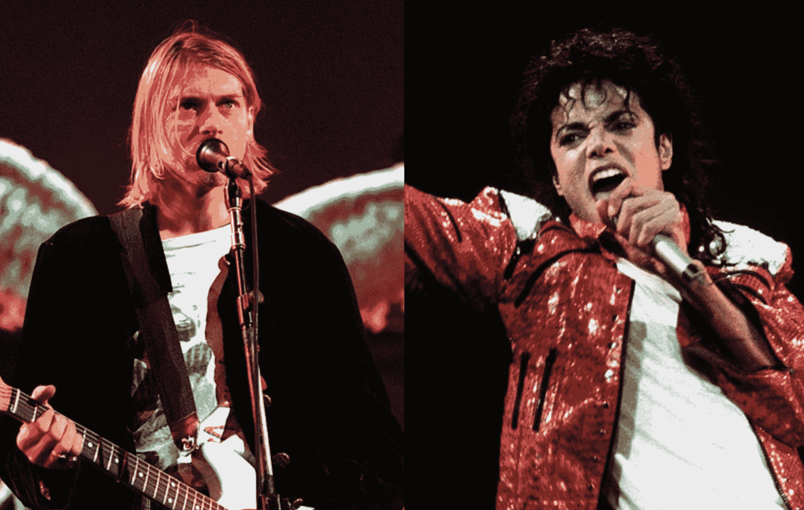
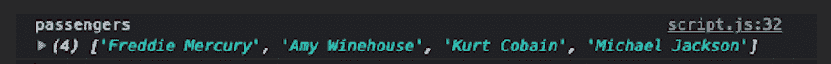
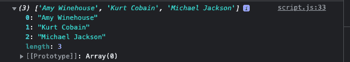
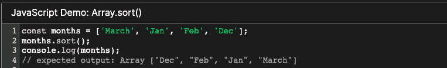
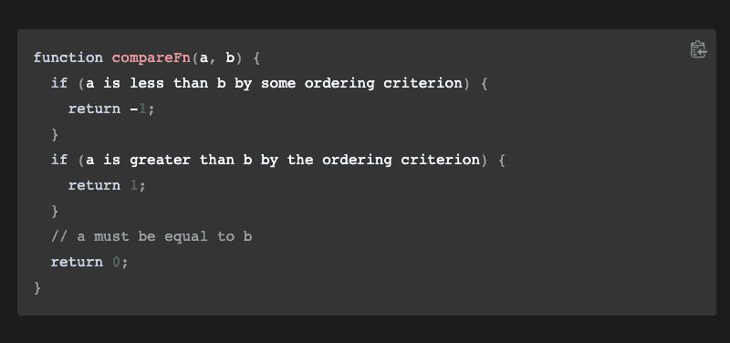
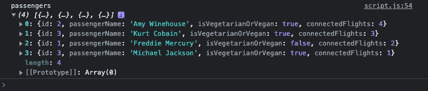

# JavaScript 编码面试练习–面试问题和解决方案示例

> 原文：<https://www.freecodecamp.org/news/javascript-coding-interview-practice/>

大卫·高金斯(David Goggins)是一名超级马拉松运动员，一名公共演说家，一名退役海军海豹突击队，著有《 [**伤不了我:掌控你的思想，战胜困难**](https://www.amazon.com/Cant-Hurt-Me-Master-Your/dp/1544512287) 》一书。他是我的榜样之一，因为他的体力和精神韧性。

你可能会说:“等一下！我们明白了。这个人显然是成功的缩影。但他有非技术技能。那么，为什么他与 JavaScript 编码面试相关呢？”

好吧，如果你准备好了，让我们一起来探索这个。

### 洛奇·巴尔博亚作为导师

在回答一个问题时，大卫说，“洛基电影改变了我的生活。“在[那段鼓舞人心的话](https://www.youtube.com/watch?v=dse1afiGbx4&t=193s)中，他指的是[这一幕](https://www.youtube.com/watch?v=25NmudB2fqg)(分钟 1.30-1.42)中，虚构的角色洛奇——尽管在最后一轮拳击赛中被对手痛打一顿——无论如何都不肯放弃。

大卫将那个特殊的时刻描述为洛奇-最初被编剧描绘成一个失败者-克服所有的困难并对他的对手产生敬畏的时刻。


[Illustration Source](https://www.amazon.com/Eye-Tiger-Rocky/dp/B004GY1FTQ)

我们承认吧。成为一名优秀的程序员并不容易。尤其是如果你正处于职业生涯的开端，技术性工作面试可能会非常令人生畏。简而言之，达到大卫(和洛奇)的心态可能会很好。

有了这种动力和信心，你就不太可能考虑放弃，不管你在获得开发人员工作的美好而艰难的旅程中面临什么样的挑战。

## 为什么编写面试代码很难

在编码面试中，你需要用一些理论知识来解决编码问题。但是警告是你必须实时完成，这有时会吓跑新的开发者。

编码面试有几种类型。但最具挑战性的可能是白板面试。在这类面试中，你必须在未来的雇主/高级软件开发人员面前编写代码。


[<nr-sentence class="nr-s20" id="nr-s20" page="0">Illustration by HackerRank</nr-sentence>](https://www.hackerrank.com/blog/virtual-whiteboarding-for-system-design-interviews/)

这些面试可能会有额外的压力，因为你通常不允许用电脑搜索任何未知的概念或从互联网上获取一些代码片段。顾名思义，我们只给你一支马克笔，让你在白板上解决问题。

### 面试反映了你在工作中会做什么吗？

不一定。那么他们为什么要举行这些可怕的编码面试呢？嗯，原因是为了测试你一般的解题技巧。有时候，找到正确的答案可能并不那么重要。

重要的是你如何得出结论/解决方案，以及在这个过程中你更喜欢使用哪种算法。换句话说，科技公司正在测试你在压力下正常工作的能力。


[<nr-sentence class="nr-s30" id="nr-s30" page="0">Image Source</nr-sentence>](https://www.reddit.com/r/ProgrammerHumor/comments/l6wnvt/interview_vs_job/)

让我们面对现实吧。在未来的工作中，你会遇到很多压力，如何处理某些问题尤为重要。因此，你未来的雇主自然希望亲眼见证你是否适合这份工作。

## 这个教程的目的是什么？

在这篇文章中，我将通过例子向你介绍一些流行的 JavaScript 面试概念。我也会尽我所能向你展示招聘人员/面试官在候选人面前编码时，他们实际上可能在寻找什么。

简单来说，我们将检查一些模型，并尝试一起解决相关的难题。

在本教程结束时，您将有望对一些重要的数组方法有所了解。但最重要的是，您将了解如何以最佳方式应对一些编码挑战。

## 记忆宫法到底是什么？

在我们开始之前，请注意，在下面的样本数据中，我故意使用了一些已故名人的名字，以便所有这些细节从长远来看都引人注目。

一项名为[记忆宫殿](https://www.wired.co.uk/article/memory-palace-technique-explained)的古老技术清楚地表明，细节越古怪，就越容易记住——编造故事/创造背景甚至更有效。

如果您尝试生动地想象相关的情况，并将给定的编程概念与您脑海中的一些奇怪细节联系起来，当您下次看到类似的问题时，您可能会感到压力和困惑较小。这是因为你可能更容易创建特定的链接，这样就更容易记住事情。这就是我们大脑的工作方式。

好吧，即使是虚构的人物'[夏洛克·福尔摩斯](https://www.smithsonianmag.com/arts-culture/secrets-sherlocks-mind-palace-180949567/)'，这个星球上最聪明的人，在解决复杂的犯罪时也从这种方法中受益——那么我们为什么不可以呢？


[<nr-sentence class="nr-s43" id="nr-s43" page="0">Illustration by Savanahcat</nr-sentence>](https://www.deviantart.com/savanahcat/art/Mind-Palace-387601041)

## 如何解决编码问题

在我们想象的采访中，你会看到过去的四位非凡的音乐家被列为航班上的乘客。我们有他们的食物选择，以及他们在世界不同地方的舞台上进行精彩表演后需要乘坐的中转航班的数量。

为了便于讨论，我们的明星(佛莱迪·摩克瑞、艾米·怀恩豪斯、柯特·科本和迈克尔·杰克逊)将从不同的目的地飞往洛杉机，只为了能在一家豪华的餐厅一起用餐，因为他们非常喜欢彼此的陪伴。

毕竟这是我们自己的私人记忆宫殿，所以我们绝对可以在脑海中做任何我们想做的事情。记住不寻常的细节会更容易记住。这就是为什么我试图添加更多的东西来增加趣味。

这种方法明确建议用一些生动的形容词来描述每一个细节，这样你就可以将它们与你计划长期学习的东西联系起来。

科学家说短期记忆和长期记忆的功能非常不同。简而言之，我们需要一种方法将所有关于编程的核心概念(不一定是语法)放入我们的长期记忆中。这就是为什么在我们的旅程中受益于记忆宫殿法会很好。



[<nr-sentence class="nr-s56" id="nr-s56" page="0">Image Source</nr-sentence>](https://www.nme.com/news/music/producer-goes-viral-for-mixing-nirvana-and-michael-jackson-songs-with-drill-beats-2747204)

另外，我觉得你可以面带微笑地想象这个不寻常的场景。那么，如果这些令人敬畏的灵魂能够看到他们现在作为 freeCodeCamp 文章的嘉宾帮助我们/编程社区，这不是很好吗？

### 面试问题示例

现在让我们回到现实生活中来。记住你还在面试中，正如你在下面看到的，一连三个问题在等着你。

```
 // Main Question: Get the passengers' names using the data provided 
// Bonus Part (a)- Return vegetarians/vegans
// Bonus Part (b)- Sort passengers by the number of connected flights in descending order 
```

### 数据

为了解决这些难题，你需要以实际的方式使用以下对象数组中的数据。

你当然需要想出正确的算法，并试图找到最有效的解决方案，让面试官满意。

```
 const passengers = [
  {
    id: 1,
    passengerName: "Freddie Mercury",
    isVegetarianOrVegan: false,
    connectedFlights: 2,
  },
  {
    id: 2,
    passengerName: "Amy Winehouse",
    isVegetarianOrVegan: true,
    connectedFlights: 4,
  },
    {
    id: 3,
    passengerName: "Kurt Cobain",
    isVegetarianOrVegan: true,
    connectedFlights: 3,
  },
     {
    id: 3,
    passengerName: "Michael Jackson",
    isVegetarianOrVegan: true,
    connectedFlights: 1,
  },
];
```

以上问题其实没那么难。但是，我们将如何处理它们是一个很好的机会来比较单一问题的替代解决方案。归根结底，质量是招聘人员/面试官最看重的。

### 面试问题 1:如何获取乘客姓名

让我们按要求得到乘客的名字。第一种解决方案是通过一个[‘for 循环’](https://www.freecodecamp.org/news/javascript-for-loop-how-to-loop-through-an-array-in-js/)的方法。所以我们首先需要使用一个空数组，在循环结束时将乘客的名字放入数组中。

下面，`[i]`代表当前的乘客，我们简单地通过“乘客”数组来访问乘客的名字。然后，我们需要将它们锁定在我们的空数组/ passengerNames 中。

```
 const passengerNames = [];
for (let i = 0; i < passengers.length; i++) {
    passengerNames.push(passengers[i].passengerName)
}
console.log("passengers", passengerNames); 
```



<nr-sentence class="nr-s81" id="nr-s81" page="0">RESULT - using 'for loop'</nr-sentence>

好了，我们解决了这个难题，但这就足够了吗？或者面试官可能希望你提出一个更好的解决方案？

### 备选解决方案#1:

我们也可以通过使用' [forEach](https://www.freecodecamp.org/news/javascript-foreach-how-to-loop-through-an-array-in-js/) '函数来达到预期的结果。这个解决方案甚至比前一个好一点，因为在这个解决方案中没有索引表达式。

```
 const passengerNames = [];
passengers.forEach((passenger) => {
    passengerNames.push(passenger.passengerName);
})
```


<nr-sentence class="nr-s89" id="nr-s89" page="0">RESULT - using 'forEach'</nr-sentence>

为了从“forEach”中获益，我们需要一个回调函数。通过这种安排，我们能够联系到名单上的每一位乘客。然而，就像前面的解决方案一样，我们首先需要一个空数组来推送商品/乘客的姓名。

即使结果是一样的，这段代码更短。事实上，编写更整洁的代码是对你的期望。

换句话说，招聘人员不仅会评估解决方案，还会评估你如何达成目标。因此，计划你的行动是一个好主意，而不是把你脑海中的第一个想法写在白板上。

### 替代解决方案 2:

最佳解决方案来了。我们也可以利用' [map](https://www.freecodecamp.org/news/javascript-map-how-to-use-the-js-map-function-array-method/) '函数来解决同样的问题。让我们看看怎么做。

```
 const passengerNames = passengers.map((passenger) => passenger.passengerName); 
```


<nr-sentence class="nr-s103" id="nr-s103" page="0">RESULT - using 'map'</nr-sentence>

map 函数还遍历数组，并为列表中的每一项返回一个新数组。通过这种设置，我们简单地返回单个元素，而不是一个对象。

控制台中的结果也是一样的，但是您的代码甚至会比第一个和第二个更好，因为这一次，我们不需要在实际任务之前创建一个空数组。

以下是关于这个话题的思考。说到写代码，那些说“少即是多”的人是有道理的。

### 面试问题二:如何获得素食/纯素食歌手

现在让我们来看看下一个挑战。新任务要求我们通过保留主问题部分的第一个参数，仅从乘客列表中获取素食者/纯素食者歌手。

### 如何用“For 循环”求解

同样，我们也可以对这个使用相同的旧“for 循环”。我们所需要做的就是通过我们现有函数中的‘if’语句来检查我们的乘客列表中是否有素食者/纯素食歌手。

```
 const passengerNames = [];
for (let i = 0; i < passengers.length; i++) {
    if(passengers[i].isVegetarianOrVegan) {
    passengerNames.push(passengers[i].passengerName)
    }
}
console.log(passengerNames); 
```



<nr-sentence class="nr-s117" id="nr-s117" page="0">RESULT - using 'for loop'</nr-sentence>

我们用对象中的`isVegetarianOrVegan`属性来做这件事。基本上，我们说的是这样的:如果相关的声明是真的(如果列表中有任何素食主义者/素食主义者乘客)，就把那些项目推到我们的新数组中。结果将给出三个歌手的名字，因为这些名字在数据部分被列为“素食者或纯素食者”。

### 如何用“forEach”求解

事实上,‘forEach’函数处理问题的方式类似。但是，正如你在下面看到的，它有太多的代码行，所以它不是理想的版本。

```
 const passengerNames = [];
passengers.forEach((passenger) => {
      if (passenger.isVegetarianOrVegan)
        passengerNames.push(passenger.passengerName);
});

console.log(passengerNames);
```


<nr-sentence class="nr-s126" id="nr-s126" page="0">RESULT / 'forEach'</nr-sentence>

### 如何用“过滤器”和“地图”解决

为了提出最佳方案，这一次，我们将使用两种不同的方法。在解决给定问题时，'[过滤器](https://www.freecodecamp.org/news/javascript-array-filter-tutorial-how-to-iterate-through-elements-in-an-array/)和' map '函数将在某种程度上协作创建更好的逻辑。现在让我们仔细检查下面的代码片段。

```
 const passengerNames = passengers.filter((passenger) => passenger.isVegetarianOrVegan).map((passenger) => passenger.passengerName);

console.log(passengerNames);
```


<nr-sentence class="nr-s133" id="nr-s133" page="0">RESULT / 'filter' + 'map'</nr-sentence>

使用 filter 方法，我们首先只从数组中获取素食者/纯素食者乘客。如果它发现一些非素食者/纯素食者乘客(就像我们心爱的‘弗雷迪’)，它会自动摆脱他们。

简而言之，等式的第一部分，“过滤”方法将简单地通过“是”或“否”模型工作。

然后,“map”函数将会出现，最终给我们一个全新的数组，只显示素食者/纯素食者乘客。

这个最终的解决方案将向你未来的雇主证明，你真的知道你在做什么，并且你真的在采取正确的步骤成为一名优秀的开发者。

### 面试问题#3:如何通过转机航班对乘客进行排序

最后一部分要求我们将超级酷乘客的名单按照他们最终到达洛杉矶的中转航班数量进行排序。让我们看看谁有更多，这样的话，会非常疲惫。

剧透警报！总共有四次转接航班的艾米在那家高级餐厅的聚会上可能会有点困。但毫无疑问，无论她走到哪里，她都会以某种方式摇滚起来。


[Image Source](https://variety.com/2022/music/global/amy-winehouse-freddie-mercury-john-lennon-tupac-shakur-bbc-studios-sales-1235196177/)

无论如何，我们需要知道' [sort](https://www.freecodecamp.org/news/javascript-array-sort-tutorial-how-to-use-js-sort-methods-with-code-examples/) '函数是如何操作的。

首先，它逐个比较项目并返回结果。在我们的情况下，它将是连接航班的数量。但是它是如何进行比较的呢？这背后的逻辑是什么？



[<nr-sentence class="nr-s149" id="nr-s149" page="0">Source Code: MDN</nr-sentence>](https://developer.mozilla.org/en-US/docs/Web/JavaScript/Reference/Global_Objects/Array/sort)

一般来说，上面几行代码非常清楚。多亏了“排序”功能，我们可以按字母顺序排列月份。

好了，大问题来了。代码/系统如何知道“a”是字母表的第一个字母，因此，列表从“d”开始(十二月)？

原因是“排序功能”默认情况下按升序排列。但是我们不能改变这个设置吗？也许，我们需要按降序列出项目。当然可以。

让我们看看怎么做。为了实现我们想要的，我们可以利用“a”和“b”字母作为指向不同方向的参数。



[<nr-sentence class="nr-s160" id="nr-s160" page="0">Source Code: MDN</nr-sentence>](https://developer.mozilla.org/en-US/docs/Web/JavaScript/Reference/Global_Objects/Array/sort)

同时，我们可以受益于三个数字的帮助:-1，+1，0，如上所示。当按降序或升序排序项目或查找相等的值时，它们会非常方便。

### “排序”功能的棘手之处

在下面的示例中，列表按升序排序。为什么会这样？原因是这样的。当我们返回那些' a '和' b '参数时，我们使用这个顺序:' a - b '。默认情况下，这给了我们升序的值。


[<nr-sentence class="nr-s169" id="nr-s169" page="0">Source Code: MDN</nr-sentence>](https://developer.mozilla.org/en-US/docs/Web/JavaScript/Reference/Global_Objects/Array/sort)

但是，如果我们将它们交换，说“b - a ”,这次列表将按降序排列。对于“排序”功能来说，这是一个棘手的问题。

在上面的例子中，第一个版本(常规函数)和第二个版本(箭头函数)本质上是相同的，但是要注意的是[箭头函数](https://www.freecodecamp.org/news/arrow-function-javascript-tutorial-how-to-declare-a-js-function-with-the-new-es6-syntax/)是和 [ES6](https://www.freecodecamp.org/news/these-are-the-features-in-es6-that-you-should-know-1411194c71cb/) 一起提供的。

尽管 arrow 函数可以帮助开发人员编写更少的代码，但是您不能在任何地方都使用它们。(阅读此以了解何时使用它们。)

### 测试我们的新知识

我们现在可以通过新的视角来分析我们的乘客的情况吗？我们知道最后一个任务要求我们按降序排列航班数量。但是下面的设置正好相反。

它只能给我们升序排列的列表。为什么？这只是因为预定义的顺序(passenger 1 . connected flights-passenger 2 . connected flights)就像 a - b 示例的情况一样。

```
 const numberOfFlights = passengers.sort(
  (passenger1, passenger2) =>
    passenger1.connectedFlights -  passenger2.connectedFlights 
); 
console.log(numberOfFlights); 
```

<nr-sentence class="nr-s184" id="nr-s184" page="0">Sort - Ascending Order</nr-sentence>

正如您在下面的代码片段中所看到的，一旦我们交换了顺序(passenger 2 . connected flights-passenger 1 . connected flights ),我们的问题就解决了，列表将按降序排列。

```
 const numberOfFlights = passengers.sort(
  (passenger1, passenger2) =>
    passenger2.connectedFlights -  passenger1.connectedFlights 
); 
console.log(numberOfFlights); 
```

<nr-sentence class="nr-s188" id="nr-s188" page="0">Sort - Descending Order</nr-sentence>



<nr-sentence class="nr-s189" id="nr-s189" page="0">RESULT - Descending Order by the Number of Connected Flights / Michael is the luckiest :-)</nr-sentence>

### 我们还可以使用“for loop”或“forEach”吗？

嗯，是和不是。两者都是这个问题的低级解决方案。

我们应该记住，排序函数会使数组发生变异。这是一种改变原始数组的副作用，如果我们使用“for loop”或“forEach”作为解决方案，这可能是一个问题。

当然有[种方法](http://www.buginit.com/javascript/javascript-sort-without-mutating-array/)来避免排序函数中的突变，但是在我们的例子中，这将导致更多的代码行，这一点都不实用。

## 包扎

我们从大卫·高金斯开始这篇文章，他是韧性和勇气的象征，所以让我们以他鼓舞人心的存在和想法来结束这篇文章。

如果你碰巧读了这本当代英雄的书，或者听了其中一个著名的播客片段(例如，[这一个](https://www.youtube.com/watch?v=5tSTk1083VY))他是演讲嘉宾，你会立刻明白他并不是生来如此。相反，他的秘密在于他从不放弃，克服一切困难。

编码面试是艰难的，但是如果你通过一遍又一遍地在脑海中想象成功的场景来继续追求你的目标，它迟早会是你的。


[Image Source](https://castromarina.info/david-goggins-inspirational-quotes)

非常感谢你阅读这篇文章。如果你喜欢这篇文章，支持我的最好方式之一就是分享它。如果您有任何问题或意见，您可以随时通过 [LinkedIn](https://www.linkedin.com/in/damla-erkiner-000b76227/) 联系我。我非常乐意帮助你解决你的疑问。

编码快乐！

****“知识就是力量。”——弗朗西斯·培根****