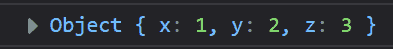
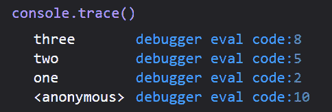
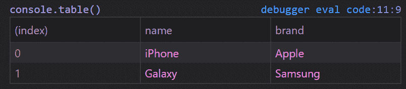
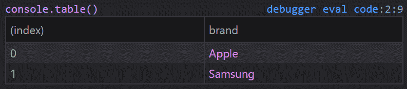

# JavaScript Console.log()示例——如何用 JS 打印到控制台

> 原文：<https://www.freecodecamp.org/news/javascript-console-log-example-how-to-print-to-the-console-in-js/>

将消息记录到控制台是对代码中的小问题进行诊断和故障排除的一种非常基本的方法。

但是，你知道吗，除了 T1 之外，还有更多关于 T0 的事情呢？在这篇文章中，我将向你展示如何在 JS 中打印到控制台，以及所有你不知道`console`可以做的事情。

## Firefox 多行编辑器控制台

如果你从来没有使用过 Firefox 的多行编辑模式，你应该马上尝试一下！

只要打开控制台，`Ctrl+Shift+K`或者`F12`，在右上方会看到一个按钮，上面写着“切换到多行编辑器模式”。或者，你可以按下`Ctrl+B`。

这给了你一个 Firefox 中的多行代码编辑器。

## console.log

让我们从一个非常基本的日志示例开始。

```
let x = 1
console.log(x)
```

在 Firefox 控制台中输入并运行代码。您可以点击“运行”按钮或按下`Ctrl+Enter`。

在本例中，我们应该在控制台中看到“1”。很简单，对吧？

## 多重值

您知道可以包含多个值吗？在开头添加一个字符串，以便于识别您正在记录的内容。

```
let x = 1
console.log("x:", x)
```

但是如果我们想要记录多个值呢？

```
let x = 1
let y = 2
let z = 3
```

我们可以把它们都包括进来，而不是输入三次`console.log()`。如果我们愿意，也可以在它们前面添加一个字符串。

```
let x = 1
let y = 2
let z = 3
console.log("x:", x, "y:", y, "z:", z)
```

但那太费事了。用花括号把它们包起来就行了！现在，您获得了一个具有指定值的对象。

```
let x = 1
let y = 2
let z = 3
console.log( {x, y, z} )
```



Console Output

你可以对一个物体做同样的事情。

```
let user = {
  name: 'Jesse',
  contact: {
    email: 'codestackr@gmail.com'
  }
}
console.log(user)
console.log({user})
```

第一个日志将打印用户对象中的属性。第二个将对象标识为“user”并打印其中的属性。

如果您将许多事情记录到控制台，这可以帮助您识别每个日志。

## 日志中的变量

您知道可以将日志的一部分用作变量吗？

```
console.log("%s is %d years old.", "John", 29)
```

在本例中，`%s`是指包含在初始值之后的字符串选项。这里指的是“约翰”。

`%d`指初始值后包含的数字选项。这里指的是 29。

该语句的输出将是:“约翰 29 岁。”。

## 原木的变化

有几种不同的日志。还有最广泛使用的`console.log()`。但是也有:

```
console.log('Console Log')
console.info('Console Info')
console.debug('Console Debug')
console.warn('Console Warn')
console.error('Console Error') 
```

这些变化为控制台中的日志增加了样式。例如，`warn`将被涂成黄色，`error`将被涂成红色。

注意:不同的浏览器有不同的风格。

## 可选日志

我们可以用`console.assert()`有条件地将消息打印到控制台。

```
let isItWorking = false
console.assert(isItWorking, "this is the reason why")
```

如果第一个参数为 false，则消息将被记录。

如果我们将`isItWorking`更改为`true`，那么该消息将不会被记录。

## 包括…在内

你知道你可以用控制台数数吗？

```
for(i=0; i<10; i++){
  console.count()
}
```

这个循环的每次迭代都会将一个计数打印到控制台。你会看到“默认:1，默认:2”，以此类推，直到达到 10。

如果您再次运行相同的循环，您将看到计数从它停止的地方重新开始；11 - 20.

要重置计数器，我们可以使用`console.countReset()`。

而且，如果您想将计数器命名为“default”之外的名称，您可以这样做！

```
for(i=0; i<10; i++){
  console.count('Counter 1')
}
console.countReset('Counter 1')
```

现在我们已经添加了一个标签，您将看到“计数器 1，计数器 2”，以此类推。

为了重置这个计数器，我们必须将名称传递给`countReset`。这样，您可以同时运行几个计数器，并且只重置特定的计数器。

## 跟踪时间

除了计数，你还可以计时，比如秒表。

要启动计时器，我们可以使用`console.time()`。这本身不会做任何事情。因此，在这个例子中，我们将使用`setTimeout()`来模拟代码运行。然后，在超时时间内，我们将使用`console.timeEnd()`停止计时器。

```
console.time()
setTimeout(() => {
  console.timeEnd()
}, 5000)
```

如您所料，5 秒钟后，我们将有一个 5 秒钟的计时器结束日志。

我们还可以记录计时器运行时的当前时间，而不用停止它。我们通过使用`console.timeLog()`来做到这一点。

```
console.time()

setTimeout(() => {
  console.timeEnd()
}, 5000)

setTimeout(() => {
  console.timeLog()
}, 2000)
```

在这个例子中，我们将首先得到我们的 2 秒`timeLog`，然后是我们的 5 秒`timeEnd`。

就像计数器一样，我们可以给定时器贴标签，让多个同时运行。

## 组

你可以用`log`做的另一件事是将他们分组。？

我们用`console.group()`开始分组。并且我们以`console.groupEnd()`结束一组。

```
console.log('I am not in a group')

console.group()
console.log('I am in a group')
console.log('I am also in a group')
console.groupEnd()

console.log('I am not in a group')
```

这组日志将是可折叠的。这使得识别日志集变得容易。

默认情况下，该组不会折叠。您可以使用`console.groupCollapsed()`代替`console.group()`将其设置为折叠。

标签也可以传递到`group()`中，以便更好地识别它们。

## 堆栈跟踪

您也可以使用`console`进行堆栈跟踪。把它加到一个函数里就行了。

```
function one() {
  two()
}
function two() {
  three()
}
function three() {
  console.trace()
}
one() 
```

在这个例子中，我们有一些非常简单的函数，它们只是互相调用。然后，在最后一个函数中，我们调用`console.trace()`。



Console Output

## 桌子

这里有一个最令人兴奋的关于控制台的用法:`console.table()`。

因此，让我们设置一些要记录的数据:

```
let devices = [
  {
    name: 'iPhone',
    brand: 'Apple'
  },
  {
    name: 'Galaxy',
    brand: 'Samsung'
  }
]
```

现在我们将使用`console.table(devices)`记录这些数据。



Console Output

但是等等——事情会变得更好！

如果我们只想要品牌，就`console.table(devices, ['brand'])`！



Console Output

一个更复杂的例子怎么样？在这个例子中，我们将使用 jsonplaceholder。

```
async function getUsers() {
  let response = await fetch('https://jsonplaceholder.typicode.com/users')
  let data = await response.json()

  console.table(data, ['name', 'email'])
}

getUsers()
```

这里我们只是打印“姓名”和“电子邮件”。如果您`console.log`所有的数据，您将看到每个用户有更多的属性。

## 风格？

你知道你可以使用 CSS 属性来设计你的日志吗？

为此，我们使用`%c`来指定我们要添加的样式。样式被传递到`log`的第二个参数中。

```
console.log("%c This is yellow text on a blue background.", "color:yellow; background-color:blue")
```

你可以用它来突出你的日志。

## 清楚的

如果您试图使用日志来解决问题，您可能会刷新很多，您的控制台可能会变得混乱。

只需将`console.clear()`添加到代码的顶部，每次刷新时你都会有一个新的控制台。？

只是不要把它加到你代码的底部，lol。

## 感谢阅读！

如果你想通过视频重温本文中的概念，你可以看看我在这里制作的视频版本。

[https://www.youtube.com/embed/_-bHhEGcDiQ?feature=oembed](https://www.youtube.com/embed/_-bHhEGcDiQ?feature=oembed)

YouTube: There's More To Console Than Log


我是来自德克萨斯州的杰西。查看我的其他内容，让我知道如何帮助你成为一名 web 开发人员。

*   [订阅我的 YouTube](https://youtube.com/codeSTACKr)
*   打个招呼！ [Instagram](https://instagram.com/codeSTACKr) | [推特](https://twitter.com/codeSTACKr)
*   [注册我的简讯](https://codestackr.com/)