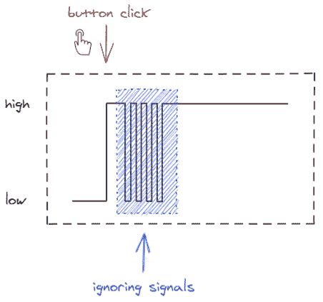

# 去抖——如何在 JavaScript 中延迟一个函数(JS ES6 示例)

> 原文：<https://www.freecodecamp.org/news/javascript-debounce-example/>

在 JavaScript 中，去抖功能确保您的代码在每次用户输入时只被触发一次。搜索框建议、文本字段自动保存和消除双击都是去抖的用例。

在本教程中，我们将学习如何用 JavaScript 创建一个去抖函数。

## 什么是去抖？

术语**去抖**来自电子学。比方说，当你按下电视遥控器上的一个按钮时，信号会迅速传到遥控器的微芯片上，以至于在你设法松开按钮之前，它会反弹，微芯片会多次记录你的“点击”。



为了减轻这种情况，一旦收到来自按钮的信号，微芯片就会停止处理来自按钮的信号几微秒，而你实际上不可能再按下它。

## 用 javascript 谴责

在 JavaScript 中，用例是相似的。我们想要触发一个函数，但是每个用例只触发一次。

假设我们想要显示一个搜索查询的建议，但是只有在访问者完成输入之后。

或者我们希望保存对表单的修改，但是只有当用户没有主动处理这些修改时，因为每次“保存”都要花费我们一次数据库之旅。

我最喜欢的是——有些人真的习惯了 Windows 95，现在双击一切😁。

这是*去抖*功能的一个简单实现( [CodePen 此处](https://codepen.io/ondrabus/pen/WNGaVZN)):

```
function debounce(func, timeout = 300){
  let timer;
  return (...args) => {
    clearTimeout(timer);
    timer = setTimeout(() => { func.apply(this, args); }, timeout);
  };
}
function saveInput(){
  console.log('Saving data');
}
const processChange = debounce(() => saveInput()); 
```

它可用于输入:

```
<input type="text" onkeyup="processChange()" /> 
```

或者一个按钮:

```
<button onclick="processChange()">Click me</button> 
```

或窗口事件:

```
window.addEventListener("scroll", processChange); 
```

和其他元素，比如一个简单的 JS 函数。

这里发生了什么？`debounce`是处理两个任务的特殊函数:

*   为*定时器*变量分配一个作用域
*   安排您的功能在特定时间触发

让我们解释一下在文本输入的第一个用例中这是如何工作的。

当访问者写下第一个字母并释放按键时，`debounce`首先用`clearTimeout(timer)`重置计时器。在这一点上，这一步是不必要的，因为还没有任何计划。然后，它调度所提供的函数——`saveInput()`——在 300 毫秒内被调用

但是让我们假设访问者一直在写，所以每次释放按键都会再次触发`debounce`。每次调用都需要重置计时器，或者换句话说，用`saveInput()`取消之前的计划，并重新安排一个新的时间—未来的 300 ms。只要访问者在 300 毫秒内持续敲击键盘，这种情况就会持续下去。

最后一个调度不会被清除，所以最后会调用`saveInput()`。

## 反过来——如何忽略后续事件

这有利于触发自动保存或显示建议。但是对于多次点击单个按钮的用例呢？我们不想等待最后一次点击，而是注册第一次，忽略其余的( [CodePen 此处](https://codepen.io/ondrabus/pen/bGwmXjN))。

```
function debounce_leading(func, timeout = 300){
  let timer;
  return (...args) => {
    if (!timer) {
      func.apply(this, args);
    }
    clearTimeout(timer);
    timer = setTimeout(() => {
      timer = undefined;
    }, timeout);
  };
} 
```

这里我们在第一次点击按钮引起的第一个`debounce_leading`调用时触发`saveInput()`函数。我们将计时器销毁时间安排为 300 毫秒。在该时间范围内的每个后续按钮点击都已经定义了计时器，并且只会将销毁时间推迟 300 毫秒。

## 谴责图书馆中的实现

在本文中，我向您展示了如何用 JavaScript 实现一个去抖功能，并使用它去抖由网站元素触发的事件。

然而，如果你不想的话，你不需要在你的项目中使用你自己的*去抖*实现。广泛使用的 JS 库已经包含了它的实现。这里有几个例子:

| ***库*** | ***例如*** |
| [jQuery(通过库)](http://benalman.com/projects/jquery-throttle-debounce-plugin/) | `$.debounce(300, saveInput);` |
| [洛达什](https://lodash.com/docs/4.17.15#debounce) | `_.debounce(saveInput, 300);` |
| [下划线](https://underscorejs.org/#debounce) | `_.debounce(saveInput, 300);` |