# JavaScript 析构和扩展操作符——用示例代码解释

> 原文：<https://www.freecodecamp.org/news/javascript-destructuring-and-spread-operator-explained/>

JavaScript 有两个非常棒的数据结构，可以帮助您编写干净高效的代码。但是处理它们有时会很麻烦。

在这篇博客中，我将向你展示如何在 JavaScript 中处理数组和对象的析构。我们还将学习如何使用 spread 操作符。

让我们开始吧。

## JavaScript 中什么是数组析构？

假设我们有一个包含五个数字的数组，如下所示:

```
let array1 = [1, 2, 3, 4, 5]
```

Array with five numbers

要从数组中获取元素，我们可以做一些类似于根据索引获取数字的事情:

```
array1[0];
array1[1];
array1[2];
array1[3];
array1[4]; 
```

Getting the array elements

但是这种方法既陈旧又笨拙，有一种更好的方法——使用数组析构。看起来是这样的:

```
let [ indexOne, indexTwo, indexThree, indexFour, indexFive ] = array1;
```

Using Array Destructuring

上述两种方法将产生相同的结果:

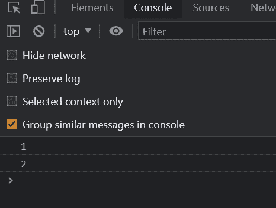

现在，我们在数组中有五个元素，我们打印它们。但是如果我们想跳过中间的一个元素呢？

```
let [ indexOne, indexTwo, , indexFour, indexFive ] = array1;
```

这里，我们跳过了`indexThird`，在 indexTwo 和 indexTwo 之间有一个空格。

```
let [ indexOne, indexTwo, , indexFour, indexFive ] = array1;

console.log(indexOne);
console.log(indexTwo)
console.log(indexFour)
console.log(indexFive)
```

Skipping the third element

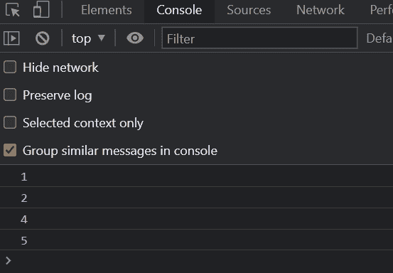

您可以看到，我们没有获得第三个元素，因为我们已经将其设置为空。

## JavaScript 中什么是对象析构？

这种析构也适用于对象。我给你举个例子。

```
let object = {
    name: "Nishant",
    age: 24, 
    salary: 200,
    height: '20 meters',
    weight: '70 KG'
}
```

An JavaScript Object

假设我们希望在控制台中打印出这个对象的姓名、薪水和体重。

```
console.log(object.name)
console.log(object.salary)
console.log(object.weight)
```

Getting the name, salary and weight from the object

我们可以使用关键字来获取它们，这些关键字是姓名、薪水和体重。

但是这些代码有时会变得难以理解。这就是析构派上用场的时候:

```
let { name, salary, weight } = object;

console.log(name)
console.log(salary)
console.log(weight)
```

Destructuring Objects

现在，我们可以只记录姓名、薪水和体重，而不是使用旧方法。

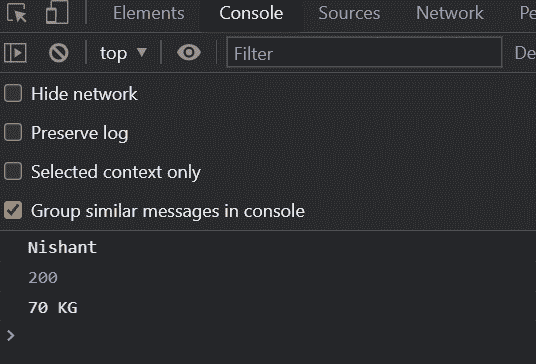

如果默认值不在对象中，我们也可以使用析构来设置默认值。

```
let object = {
    name: "Nishant",
    age: 24, 
    height: '20 meters',
    weight: '70 KG'
}

let { name, salary, weight } = object;

console.log(name)
console.log(salary)
console.log(weight)
```

这里，我们在对象中显示姓名和体重，但不显示工资:


我们将得到一个未定义的工资值。

为了纠正这个问题，我们可以在析构对象时设置默认值。

```
let object = {
    name: "Nishant",
    age: 24, 
    height: '20 meters',
    weight: '70 KG'
}

let { name, salary = 200, weight } = object;

console.log(name)
console.log(salary)
console.log(weight)
```

Setting default value for Salary

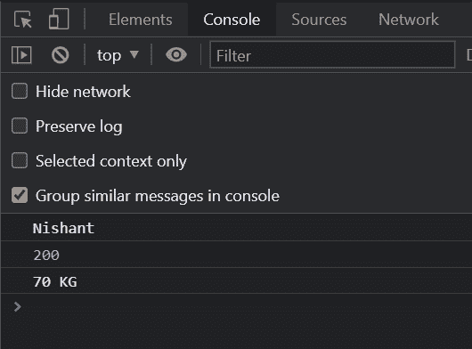

你可以看到我们的工资是 200 英镑。只有当我们在对象中没有那个键，并且我们想要设置一个缺省值的时候，这才起作用。

```
let object = {
    name: "Nishant",
    age: 24, 
    salary: 300,
    height: '20 meters',
    weight: '70 KG'
}

let { name, salary = 200, weight } = object;

console.log(name)
console.log(salary)
console.log(weight)
```

在对象中加上薪水，你会得到 300 作为薪水。

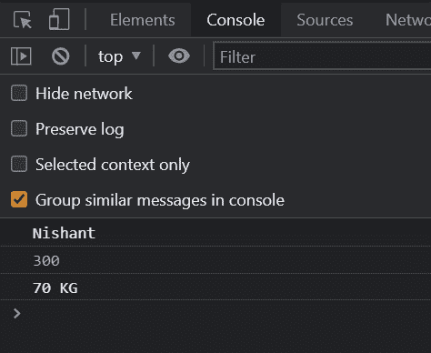

## 如何在函数中使用对象析构

假设我们有一个将数组中的所有数据打印到控制台的函数。

```
let object = {
    name: "Nishant",
    age: 24, 
    salary: 300,
    height: '20 meters',
    weight: '70 KG'
}

function printData(){

}

printData(object) 
```

Function to print data in the console

当函数被调用时，我们将对象作为参数传递给函数:

```
let object = {
    name: "Nishant",
    age: 24, 
    salary: 300,
    height: '20 meters',
    weight: '70 KG'
}

function printData(object){
    console.log(object)
}

printData(object)
```

通常，我们会这样做——传递对象并将其记录在控制台中。

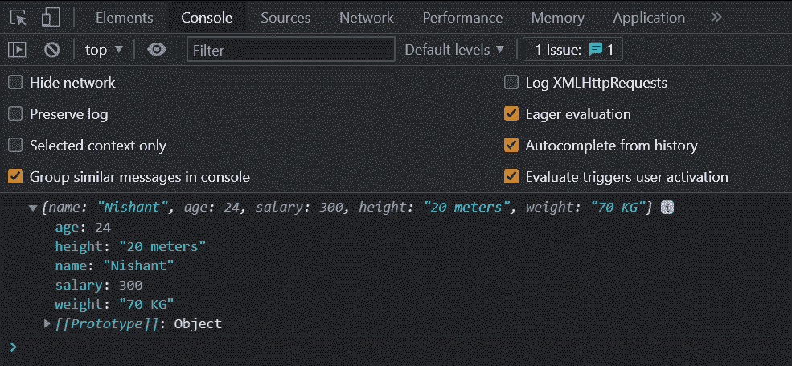

但是同样，我们可以使用析构来做同样的事情。

```
let object = {
    name: "Nishant",
    age: 24, 
    salary: 300,
    height: '20 meters',
    weight: '70 KG'
}

function printData({name, age, salary, height, weight}){
    console.log(name, age, salary, height, weight)
}

printData(object)
```

Using Destructuring in Functions

这里，我们在函数参数中将对象分解为姓名、年龄、工资、身高和体重，并将所有内容打印在同一行上。

你可以看到析构是如何让它变得更容易理解的。

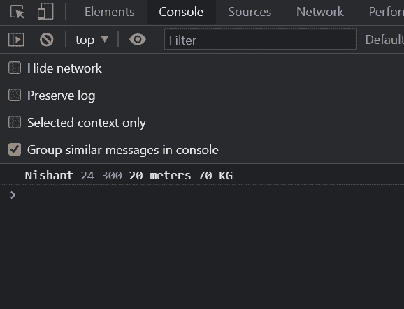

Printing object data using Destructuring

让我们看最后一个例子。

```
function sample(a, b) {
    return [a + b, a * b]
}

let example = sample(2, 5);
console.log(example)
```

Function to Add and Multiply two numbers

我们这里有一个接受两个数字的函数。它返回一个数组，将它们相加和相乘，并将它们记录到控制台中。

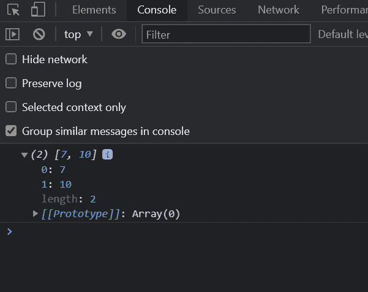

让我们在这里使用析构来代替。

我们可以把它分解成加法和乘法变量，就像这样:

```
let [addition, multiplication] = sample(2, 5);
console.log(addition)
console.log(multiplication)
```

Using Destructuring

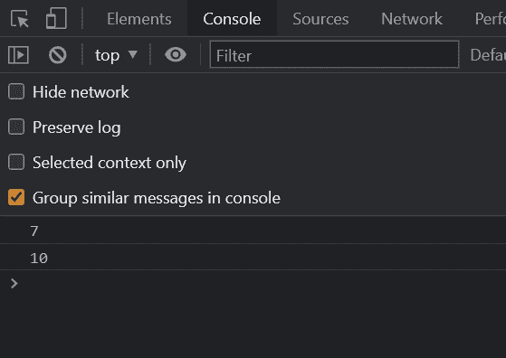

在输出中，你可以看到我们得到了两个数的*加法*和*乘法*。

## JavaScript 中的 Spread 运算符是什么？

Spread 的意思是扩散或扩展。JavaScript 中的 spread 运算符由三个点表示。

这个扩展运算符有许多不同的用途。让我们一个一个来看。

### 扩展运算符示例

假设我们有两个数组，我们想合并它们。

```
let array1 = [1, 2, 3, 4, 5]
let array2 = [6, 7, 8, 9, 10]

let array3 = array1.concat(array2);
console.log(array3)
```

Merging two arrays with concat method

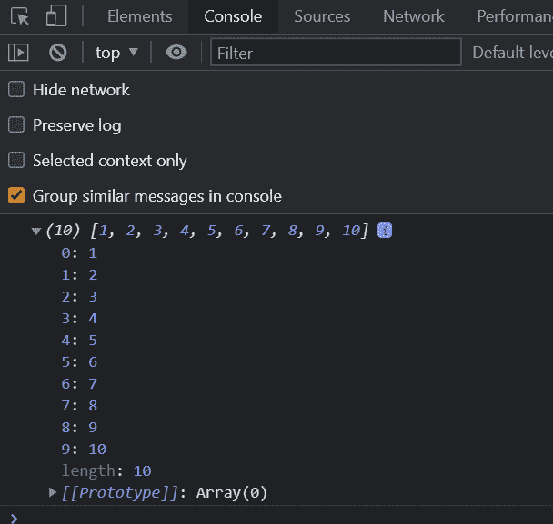

我们得到了两个数组的组合，分别是数组 1 和数组 2。

但是有一种更简单的方法可以做到这一点:

```
let array1 = [1, 2, 3, 4, 5]
let array2 = [6, 7, 8, 9, 10]

let array3 = [...array1, ...array2]
console.log(array3)
```

Merging two arrays with Spread Operator

在这种情况下，我们使用 spread 运算符来合并两个数组。

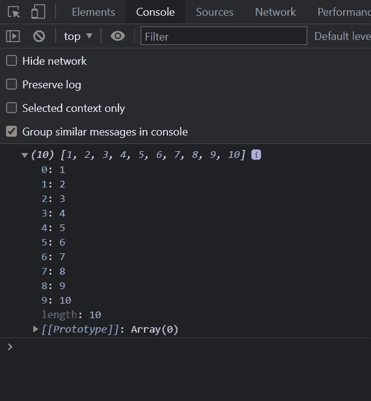

你可以看到，我们会得到相同的输出。

让我们想象另一个用例，我们必须在*数组 2* 的元素之间插入*数组 1* 。

例如，我们想在*数组 1* 的第二个和第三个元素之间插入*数组 2* 。

那么，我们该怎么做呢？我们可以这样做:

```
let array1 = [1, 2, 3, 4, 5]
let array2 = [6, 7, ...array1, 8, 9, 10]

console.log(array2);
```

Inserting array1 between 7 and 8 of array2

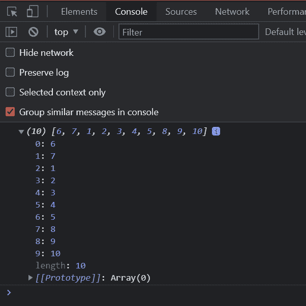

你可以看到，数组 1 的元素在 7 和 8 之间。

现在，让我们使用 spread 操作符将两个对象合并在一起。

```
let object1 = {
    firstName: "Nishant",
    age: 24, 
    salary: 300,
}

let object2 = {
    lastName: "Kumar",
    height: '20 meters',
    weight: '70 KG'
}
```

Two objects ready to merge

这里有两个物体。一个包含名字、年龄和薪水。第二个包含姓氏、身高和体重。

让我们把它们合并在一起。

```
let object1 = {
    firstName: "Nishant",
    age: 24, 
    salary: 300,
}

let object2 = {
    lastName: "Kumar",
    height: '20 meters',
    weight: '70 KG'
}

let object3 = {...object1, ...object2}
console.log(object3);
```

Merging the two objects into an third Object

现在，我们已经使用 spread 操作符合并了两个对象，并在控制台中记录了值。

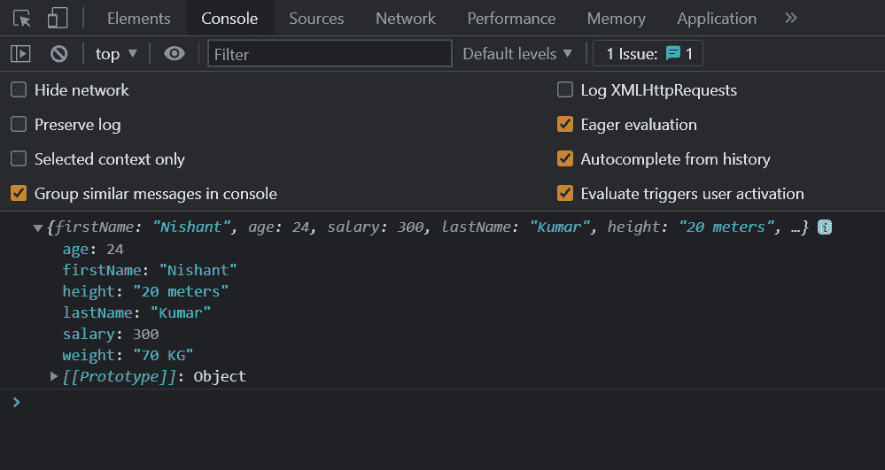

Combination of previous objects

你可以看到我们得到了两个物体的组合。

最后，我们还可以使用 spread 操作符将一个数组复制到另一个数组中。让我向你展示它是如何工作的:

```
let array1 = [1, 2, 3, 4, 5]
let array2 = [...array1]
console.log(array2);
```

Copying array1 into array2

这里，我们使用 spread 操作符将*数组 1* 复制到*数组 2* 中。

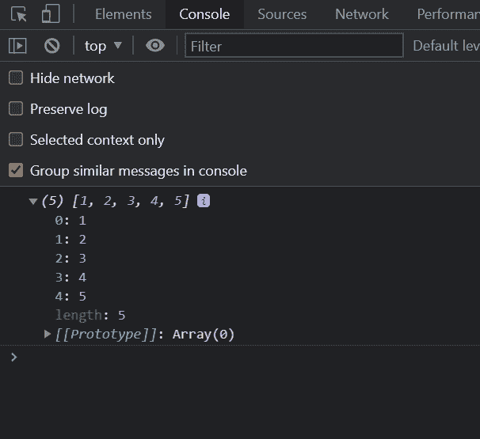

我们正在控制台中登录*数组 2* ，并且正在获取*数组 1* 的项目。

## 结论

就这些了，伙计们！在本文中，我们学习了数组和对象的析构以及扩展操作符。

如果你想补充你的学习，你也可以看我在 Youtube 上的关于[数组和对象析构以及扩展操作符](https://youtu.be/QvQ4o0K9_g0)的视频。

> 快乐学习。