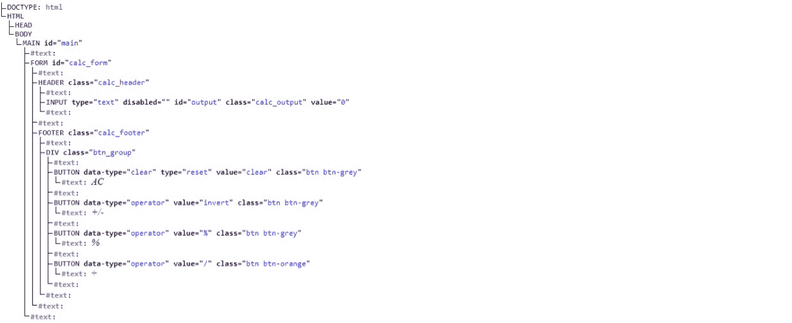

# JavaScript DOM 教程——如何用 JS 构建计算器应用程序

> 原文：<https://www.freecodecamp.org/news/javascript-dom-build-a-calculator-app/>

当使用 JavaScript 时，你将花费大量的时间在网页上。事实上，当你使用 JavaScript 时，网页是所有令人兴奋和重要的事情发生的地方。

对于 JavaScript 开发人员来说，网页是一个大文档，因为页面上的每个元素都是相连的(就像一个大家庭)。都是由父节点(parentNodes)和子节点(childNodes)组成的。文档对象模型是这个系列(DOM)的名称。

在本文中，您将通过构建一个简单的 iOS 计算器应用程序来了解 DOM 以及循环和事件。

## 目录

1.  [先决条件](#prerequisites)
2.  什么是 DOM？
3.  [如何在 DOM 中选择元素](#how-to-select-elements-in-the-dom)
4.  [如何在 DOM 中创建和添加元素](#how-to-create-and-add-elements-to-the-dom)
5.  [如何修改 DOM 中的元素](#how-to-modify-elements-in-the-dom)
6.  [如何从 DOM 中移除元素](#how-to-remove-elements-from-the-dom)
7.  [循环和迭代](#loops-and-iterations)
8.  [DOM 事件](#dom-events)
9.  [JavaScript 事件处理](#javascript-event-handling)
10.  [如何构建计算器 App](#how-to-build-the-calculator-app)
11.  [如何为计算器添加功能](#how-to-add-functionality-to-the-calculator)
12.  [结论](#conclusion)

### 先决条件

那么，你需要什么来充分利用这个教程呢？

您需要一个浏览器、一个文本编辑器(Vscode)和一些基本的 JavaScript 知识。作为开端，我推荐参加中的[课程。](https://www.freecodecamp.org/news/learn-javascript-free-js-courses-for-beginners/)

你也可以阅读这篇关于 JavaScript 基础知识的文章。

如果你已经阅读了这篇文章并参与了挑战，以下是我的简单解决方案。

[https://codepen.io/Spruce_khalifa/embed/preview/PoRLqGL?default-tabs=css%2Cresult&height=300&host=https%3A%2F%2Fcodepen.io&slug-hash=PoRLqGL](https://codepen.io/Spruce_khalifa/embed/preview/PoRLqGL?default-tabs=css%2Cresult&height=300&host=https%3A%2F%2Fcodepen.io&slug-hash=PoRLqGL)

本文还假设您对 HTML 和 CSS 以及 web 的工作原理有基本的了解。

就这样，让我们开始吧。

## 这只狗是什么

文档对象模型(DOM)是一种逻辑结构，它定义了如何操作和更改文档中的元素。因为 DOM 是以这种方式构造的，所以它通常被称为一棵树，其中所有的东西都是相互关联的。

这里有一个例子:



您可以使用 DOM 访问、修改、删除文档，或者向文档中添加新元素或内容。总之，DOM 允许你操作网页上的几乎所有东西。

既然我们对 DOM 有了更好的理解，那就卷起袖子开始工作吧。

## 如何在 DOM 中选择元素

使用 DOM 时，首先要做的事情之一就是选择文档中的元素。

事实上，在操作 DOM 之前，您必须首先学习如何访问 DOM 中的元素。

您可以用几种不同的方式选择(或访问)元素。下面，我们将讨论几个你最需要的:

### 如何通过 ID 选择 DOM 元素

使用`getElementById(),`，您可以选择网页上任何带有`id`的元素。你所需要做的就是传入你想要选择的元素的`id`。

```
...
 <body>
  <form>
    <input type="text" />
    <button id="btn">Submit</button>
  </form>
...
```

下面是 JavaScript 代码:

```
const button = document.getElementById("btn");

console.log(button)
```

重要的是要记住，如果有许多项目具有相同的`id`，那么`getElementById`方法只选择页面上的第一个唯一元素。

```
...
 <body>
  <form>
    <input type="text" />
    <button id="btn">one</button>
    <button id="btn">two</button>
    <button id="btn">three</button>
     ...
  </form>
...
```

这是 JavaScript:

```
const button = document.getElementById("button");

console.log(button); // only the first button is selected
```

### 如何通过类名选择 DOM 元素

您可以使用`getElementsByClassName`方法来选择任何有类的元素:

```
...
<body>
    <form>
      <input type="text" />
      <button class="btn">Submit</button>
    </form>
  </body>
...
```

JavaScript:

```
const button = document.getElementsByClassName("button");

console.log(button); 
```

请记住，它说的是 get Elements——带“s”的元素。这表明选择器将选择所有具有类`btn`的项目，并且它们都将被添加到一个`HTMLCollection`(一个数组)中。你还记得什么是数组吧？

```
...
 <body>
  <form>
    <input type="text" />
    <button class="btn">one</button>
    <button class="btn">two</button>
    <button class="btn">three</button>
     ...
  </form>
...
```

JavaScript:

```
const buttons = document.getElementsByClassName("button");

console.log(buttons); // returns an HTMLCollection of all the buttons 
```

### 如何通过标记名选择 DOM 元素

这与`getElementsByClassName`的工作方式类似:它返回文档中所有标签的 html 集合。

```
...
  <body>
    <article class="article">
      <p>This is a paragraph</p>
      <p>This is the second paragraph</p>
      <p>This is the third paragraph</p>
      <p>This is fourth paragraph</p>
    </article>
  </body>
... 
```

JavaScript:

```
const p_tag = document.getElementsByTagName("p");

console.log(p_tag);
```

### 如何使用 CSS 选择器选择元素

下面是我最喜欢的选择器:`querySelector()`和`querySelectorAll()`。使用这些选择器，您可以像使用 CSS 选择任何元素一样选择 DOM 中的任何元素

```
const img = document.querySelector("img"); // select element by tag name
const input = document.querySelector("input[type='text']");
const last_div = document.querySelector("form > *:last-child");
const button = document.querySelector(".btn") // select element by class name
const button = document.querySelector("#btn") // select element by id 
```

使用`querySelector()`来选择一个元素。如果选择器匹配页面上的许多元素，则只返回第一个元素。

```
HTML file
...
  <body>
    <article class="article">
      <p>This is a paragraph</p>
      <p>This is the second paragraph</p>
      <p>This is the third paragraph</p>
      <p>This is fourth paragraph</p>
    </article>
  </body>
...
```

JavaScript:

```
const p_tag = document.querySelector("p)

console.log(p_tag)
```

另一方面，`querySelectorAll()`将选择文档中与选择器匹配的所有项目，并将它们存储在一个类似于上面所见的 NodeList(一个数组)中。

```
const p_tags = document.querySelectorAll("p");

console.log(p_tags);
```

值得注意的是，当您使用`document.querySelector()`时，您是在整个文档中搜索该元素。但是当您执行`element.querySelector()`时，您只是在搜索所选择的元素。

考虑下面这个例子:`querySelector()`。选择器将只查找元素中匹配的项目。

```
HTML file
...
 <body>
    <form>
      <input type="text" />
      <button class="btn">one</button>
      <button class="btn">two</button>
      <button class="btn">two</button>
    </form>
    <button class="btn">button one outside the form</button>
    <button class="btn">button two outside the form</button>
  </body>
...
```

JavaScript:

```
const form = document.querySelector("form")

const form_btns = form.querySelectorAll(".btn")

console.log(form_btns); // only buttons within the form will get selected 
```

`form.querySelectorAll()`只会选择表单中的按钮。这也适用于所有元素和选择器。

## 如何在 DOM 中创建和添加元素

在学习了如何选择已经在 DOM 中创建的 HTML 元素之后，让我们尝试使用 JavaScript 创建我们自己的元素。

使用 JavaScript 向 DOM 添加元素需要几个步骤。我们将在下面逐一介绍。

### 如何创建一个 DOM 元素

JavaScript 要求任何元素在被添加到 DOM 之前都要被创建。为此，我们使用`document.createElement()`方法。

```
const new_div = document.createElement("div");
const new_paragraph = document.createElement("p");
const new_link = document.createElement("a");
const new_image = document.createElement("img");
```

我们刚刚在 JavaScript 中创建了上述标记，还没有将它们添加到 DOM 中。尽管如此，它们仍然只是没有属性或文本内容的标签，所以让我们马上纠正这一点。

### 如何设置元素的属性

要设置属性，比如添加一个类、更改 ID 或更改 SRC，我们只需在新元素上使用`setAttribute()`方法。

`setAttribute("attribute", "value")`方法有两个参数，属性和应用于属性的值。

```
const new_div = document.createElement("div");
const new_paragraph = document.createElement("p");
const new_link = document.createElement("a");
const new_image = document.createElement("img");

//setting the attributes
new_div.setAttribute("class", "my_div"); // setting a class attribute
new_paragraph.setAttribute("id", "my_paragraph"); // setting an id attribute
new_link.setAttribute("href", "https://example.com"); // setting the href attribute
new_image.setAttribute("src", "https://image-link.png"); // setting the src attribut of image 
```

### 如何添加文本内容

我们新创建的一些元素仍然需要添加文本，以便我们在文档中使用它们——即使在添加了属性之后。

要创建文本并将它们添加到我们新创建的元素中，使用方法`createTextNode()`。

```
const new_div = document.createElement("div");
const new_paragraph = document.createElement("p");
const new_link = document.createElement("a");
const new_image = document.createElement("img");

...

//creating the textNodes
const new_div_text = document.createTextNode("Hello world");
const new_paragraph_text = document.createTextNode("This is a paragraph");
const new_link_text = document.createTextNode("Click to visit link");

//append the textsNodes to the elements
new_div.append(new_div_text);
new_paragraph.append(new_paragraph_text);
new_link.append(new_link_text);

console.log(new_div, new_paragraph, new_link, new_image);
```

从这里，我们可以将新创建的元素添加到 DOM 中。

### 如何向 DOM 添加元素

将新创建的元素添加到 DOM 的唯一方法是将它们插入到现有的元素中。

```
HTML file
 <body>
    <div class="container">

    </div>
  </body>
...
```

JavaScript:

```
const new_div = document.createElement("div");
const new_paragraph = document.createElement("p");
const new_link = document.createElement("a");
const new_image = document.createElement("img");

...

// adding elements to the DOM

// selecting parent element
const container = document.querySelector(".container");

container.appendChild(new_div);
container.appendChild(new_paragraph);
container.appendChild(new_link);
container.appendChild(new_image); 
```

使用 appendChild()方法，新元素将作为子元素添加到已经选择的现有元素中。

当然，有更多的方法可以向 DOM 中添加新元素，但是我将它们留给您自己阅读。

## 如何修改 DOM 中的元素

除了在 DOM 中创建和添加元素，JavaScript 还允许我们修改已经存在的 DOM 元素。我们可以改变它们的内容，添加或删除属性，甚至改变它们的样式。

### 如何修改文本

使用`textContent`或`innerText`修改任何元素的文本。请参见下面的示例:

```
HTML file
...
  <body>
    <article class="article">
      <p>This is a paragraph</p>
    </article>
  </body>
...
```

JavaScript:

```
const p_tag = document.querySelector("article p");

// modify text content using textContent
p_tag.textContent = "Overide existing text";

// modify text content using innerText
p_tag.innerText = "Overide existing text using innerText";
```

除了文本，我们还可以修改属性。

### 如何修改属性

除了添加新的属性之外，您还可以使用`setAttribute()`方法来更改元素可能拥有的任何属性，正如我们在上一节中已经看到的那样。

```
HTML file
...
<body>
    <article class="article">
      <p class="my_paragraph">This is a paragraph</p>
    </article>
  </body>
...
```

JavaScript:

```
const p_tag = document.querySelector("article p");

p_tag.setAttribute("class", "new_paragraph");

console.log(p_tag);
```

因为我们讨论的是改变属性，所以我们还可以分别使用 classList.add()、classList.remove()和 classList.toggle()方法添加、删除元素的类属性，以及在添加和删除类属性之间切换。

```
const p_tag = document.querySelector("article p");

p_tag.classList.add("active") // add a new tag
p_tag.classList.remove("active") // remove a class
p_tag.classList.toggle("active") // would remove the class if it exits or add it if it dosent 
```

### 如何修改元素样式

您可以直接在 JavaScript 中更改元素的样式。只需选择元素并添加 style 属性，后跟您想要使用的 CSS 样式。

```
HTML file
...
<body>
    <div class="container">
      <p>This is a paragraph</p>
    </div>
  </body>
... 
```

JavaScript:

```
const container = document.querySelector(".container");

container.style.display = "none"; 
```

您可以添加任何想要的 CSS 样式。主要区别在于 CSS 属性由连字符(-)分隔，例如`background-color`。但是在 JavaScript 中 CSS 属性是用 camel case-`backgoundColor`编写的。

```
container.style.backgroundColor = "red";
```

## 如何从 DOM 中移除元素

可以创建的东西也可以删除，包括 DOM 中的元素。例如，您可以使用`removeChild()`删除父元素的子元素。类似地，您可以使用`removeChild()`删除下面 div 中的 p 元素:

```
HTML file
...
<body>
    <div class="container">
      <p>This is a paragraph</p>
    </div>
  </body>
... 
```

JavaScript:

```
const parent_element = document.querySelector(".container");
const child_element = document.querySelector(".container p");

parent_element.removeChild(child_element); 
```

上面我们选择了父元素，然后移除了子元素。您也可以使用`remove()`直接移除`p`。

```
const child_element = document.querySelector(".container p");

child_element.remove(); 
```

如何删除元素完全取决于您。

## 循环和迭代

循环让我们完成重复的任务，比如多次打印一个数字或者遍历一个数组。

通过循环，我们可以访问数组中的每一项，如下例所示，我们打印出数组中的所有元素。

```
const my_array = [1, 3, 5, "hello", 55, "60", "JavaScript"];

for (let i = 0; i < my_array.length; i++) {
  const item = my_array[i];

  console.log(item);
} 
```

上面的代码会打印出数组中的每一项，直到执行到最后一项。

但是如果我们想在某一点停下来呢？您可以使用`break`语句来退出循环。例如，当到达第五个数组时，我们可能决定停止打印该数组中的元素。

```
const my_array = [1, 3, 5, "hello", 55, "60", "JavaScript"];

for (let i = 0; i < my_array.length; i++) {
  const item = my_array[i];

  if (i == 5) {
    break;
  }

  console.log(item);
} 
```

break 语句终止循环的执行。

你看，很多年前，for 循环(上面的循环)是一个很好的方法来迭代数组中的元素。但是由于世界和 JavaScript 已经改变，我们现在有了更好更快的方法来迭代数组。现在我们要探索最常见的。

### 如何使用 forEach()和 Map()方法

`forEach()`方法是循环数组的一种新奇方式。forEach()方法将遍历数组，并运行您为数组中的每一项定义的函数。

```
const my_array = [1, 3, 5, "hello", 55, "60", "JavaScript"];

my_array.forEach(function (item) {
  console.log(item);
});
```

当您使用箭头函数时，它甚至更短:

```
const my_array = [1, 3, 5, "hello", 55, "60", "JavaScript"];

my_array.forEach((item) => console.log(item));
```

您提供的函数必须至少接受一个参数，该参数是数组中的当前项。另外两个参数是可选的:index(当前项的索引，是一个数字)和最后一个参数是正在循环的原始数组。

```
my_array.forEach(callback_function, index, original_array)
```

Array.map()和 Array.forEach()的唯一区别是 Array.map()会在回调函数后返回一个新数组，而 Array.forEach()不返回任何数组。Array.map()将执行 forEach()将执行的操作，即对数组中的每一项执行一个函数。

与 for 循环相反，break 语句在 Array.forEach()和 Array.map()方法中无效。

### 森林...循环的

森林...of loop 接受一个变量和您想要迭代的数组，是我们可以对任何可迭代项进行循环的一种新的奇特方式。

```
const my_array = [1, 3, 5, "hello", 55, "60", "JavaScript"];

for (const item of my_array) {
 console.log(item);
}
```

就像在常规循环中一样，break 语句可以在 for 中使用...循环的。

```
const my_array = [1, 3, 5, "hello", 55, "60", "JavaScript"];
for (const item of my_array) {
  console.log(item);
  if (item >= 6) {
    break;
  }
} 
```

## DOM 事件

用户在使用您的应用程序时会进行各种各样的操作，比如点击按钮、悬停在屏幕上的项目上、提交表单、刷新页面以及其他用户喜欢的活动。

在 JavaScript 中，所有这些用户交互都被称为事件。

JavaScript 中有许多事件，因此它包含可用于响应每个事件的事件侦听器。然而，我们在这篇文章中只谈论最典型的。

| 事件 | 描述 |
| --- | --- |
| 点击 | 当用户单击某个元素时，会触发此事件。 |
| 鼠标悬停 | 悬停在 DOM 中的元素上会触发该事件。 |
| 投入 | 当输入或选择元素的值更改时，将触发此事件。 |
| 使服从 | 提交表单时，会触发此事件 |
| 按键 | 当按下键盘键时，keydown 事件被触发。 |
| 好好享受吧 | 当按下的键被释放时触发。它是 Keydown 的反义词。 |
| DOMContentLoaded | 这个事件在 DOM 加载后被触发，但是在任何外部资源(比如 css 和图像)下载前被触发。 |
| 负荷 | 另一方面，直到所有 DOM 元素(包括外部资源)都被加载后，这个事件才会被触发。 |

JavaScript 中还有许多其他事件，但我们将在此停止。您可以在 [MDN DOM 事件参考](https://developer.mozilla.org/en-US/docs/Web/Events)中查看其他事件。

现在我们已经看到了几种类型的事件，让我们来看看我们应该如何应对它们。

## JavaScript 事件处理

addEventListener 方法是 JavaScript 中处理事件的推荐方法。此方法允许您定义一个函数，当您指定的事件被触发时，该函数将被执行。

```
const input = document.querySelector("input[type='text']");

const handle_input = (e) => {
  console.log(e.target.value);
};

input.addEventListener("input", handle_input);
```

传递给`addEventListener()`方法的函数将接受一个参数:对事件对象的引用，该对象有一组描述刚刚发生的事件的属性。

您还可以使用`removeEventListener()`从元素中移除事件监听器。该方法必须采用与您传递给`addEventListener()`方法的函数完全相同的函数。

```
const input = document.querySelector("input[type='text']");

const handle_input = (e) => {console.log(e.target.value)};

const handle_input2 = (e) => {
console.log(e.target.value);
console.log(e);
};

input.removeEventListener("input", handle_input); // this will work

input.removeEventListener("input", handle_input2); // passing in a different function will not work
```

现在，事件和事件处理就到此为止。说得够多了，让我们把到目前为止所学的都练习一下。

## 如何构建计算器应用程序

我们将构建基本的 iPhone 计算器来测试我们新的 JavaScript 技能。首先，创建一个 HTML 文件、一个 CSS 文件，然后创建一个 JavaScript 文件。

到目前为止，我假设您知道如何使用这三个工具来设置一个基本环境。如果你没有可以生成这些文件的电脑，你可以使用在线代码编辑器，比如 codepen，这就是我在这节课中要做的。

我们将从构建应用程序的基础开始。打开准备好的 HTML 文件，将以下代码粘贴到其中。

```
<!DOCTYPE html>
<html lang="en">
  <head>
    <meta charset="UTF-8" />
    <meta http-equiv="X-UA-Compatible" content="IE=edge" />
    <meta name="viewport" content="width=device-width, initial-scale=1.0" />
    <title>iPhone Calculator</title>
    <script defer src="script.js"></script>
    <link rel="stylesheet" href="style.css" />
  </head>
  <body>
    <main id="main">
      <form id="calc_form">
        <header class="calc_header">
          <input
            type="text"
            disabled
            id="output"
            class="calc_output"
            value="0"
          />
        </header>
        <footer class="calc_footer">
          <div class="btn_group">
            <button
              data-type="clear"
              type="reset"
              value="clear"
              class="btn btn-grey"
            >
              AC
            </button>
            <button data-type="operator" value="invert" class="btn btn-grey">
              +/-
            </button>
            <button data-type="operator" value="%" class="btn btn-grey">
              %
            </button>
            <button data-type="operator" value="/" class="btn btn-orange">
              ÷
            </button>
          </div>
          <div class="btn_group">
            <button
              data-type="operand"
              value="7"
              class="btn btn-dark-grey"
              id="7"
            >
              7
            </button>
            <button data-type="operand" value="8" class="btn btn-dark-grey">
              8
            </button>
            <button data-type="operand" value="9" class="btn btn-dark-grey">
              9
            </button>
            <button data-type="operator" value="*" class="btn btn-orange">
              x
            </button>
          </div>
          <div class="btn_group">
            <button data-type="operand" value="4" class="btn btn-dark-grey">
              4
            </button>
            <button data-type="operand" value="5" class="btn btn-dark-grey">
              5
            </button>
            <button data-type="operand" value="6" class="btn btn-dark-grey">
              6
            </button>
            <button data-type="operator" value="-" class="btn btn-orange">
              -
            </button>
          </div>
          <div class="btn_group">
            <button data-type="operand" value="1" class="btn btn-dark-grey">
              1
            </button>
            <button data-type="operand" value="2" class="btn btn-dark-grey">
              2
            </button>
            <button data-type="operand" value="3" class="btn btn-dark-grey">
              3
            </button>
            <button data-type="operator" value="+" class="btn btn-orange">
              +
            </button>
          </div>
          <div class="btn_group">
            <button
              data-type="operand"
              value="0"
              class="btn btn-grow btn-dark-grey"
            >
              0
            </button>
            <button data-type="operand" value="." class="btn btn-dark-grey">
              .
            </button>
            <button value="=" data-type="operator" class="btn btn-orange">
              =
            </button>
          </div>
        </footer>
      </form>
    </main>
  </body>
</html> 
```

正如你在上面看到的，我们的计算器基本上是一个 HTML 表单，有很多按钮和一个输入框。为了设计它的样式，让我们添加一些 CSS，使它类似于 iPhones 上的计算器。打开您创建的 CSS 文件，并添加以下代码:

```
*,
*::after,
*::before {
  padding: 0px;
  margin: 0px;
  font-family: inherit;
}

body {
  background-color: #333333;
  display: flex;
  align-items: center;
  justify-content: center;
  font-size: 16px;
}
body,
html {
  height: 100vh;
  font-family: sans-serif;
}
button {
  cursor: pointer;
  border: 0px;
}
input[type="text"] {
  background-color: transparent;
  text-align: end;
  width: 100%;
  color: #d2d2d2;
  border: 0px;
  font-size: 4rem;
}
#main {
  border: 2px solid #ededed;
  border-radius: 50px;
  width: 100%;
  max-width: 280px;
  background-color: #000000;
  padding: 2rem 1rem;
}
.calc_header {
  margin-top: 90px;
  padding: 12px;
}

.calc_footer > * + * {
  margin-top: 1rem;
}
.calc_footer > *:last-child {
  gap: 1rem;
}
.btn_group {
  display: flex;
  justify-content: space-between;
  align-items: center;
  gap: 0.3rem;
}

.btn {
  display: flex;
  justify-content: center;
  align-items: center;
  border-radius: 50%;
  width: 60px;
  height: 60px;
  color: #ffffff;
  font-size: 20px;
  transition: all 0.3s cubic-bezier(0.19, 1, 0.22, 1);
}
.btn.btn-grow {
  flex-grow: 1;
  border-radius: 40px;
}
.btn:hover {
  transform: translate(-2px, -3px);
}
.btn.active {
  background-color: #ffffff;
  color: #f69906;
}

.btn-grey {
  background-color: #9f9f9f;
  color: #000;
}
.btn-grey:hover {
  background-color: #ededed;
}

.btn-dark-grey {
  background-color: #313131;
}
.btn-dark-grey:hover {
  background-color: #999999;
}
.btn-orange {
  background-color: #f69906;
}
.btn-orange:hover {
  background-color: orange;
} 
```

现在，我们有一个简单的计算器应用程序，目前没有任何功能。这是实时预览的显示方式:

[https://codepen.io/Spruce_khalifa/embed/preview/PoRvYXV?default-tabs=html%2Cresult&height=300&host=https%3A%2F%2Fcodepen.io&slug-hash=PoRvYXV](https://codepen.io/Spruce_khalifa/embed/preview/PoRvYXV?default-tabs=html%2Cresult&height=300&host=https%3A%2F%2Fcodepen.io&slug-hash=PoRvYXV)

从上面的例子中，每当你点击一个按钮，表单被提交，页面被重新加载。但我们不希望这种情况发生。

如果您还记得 Events 部分，我们讨论过提交表单时触发的 submit 事件。每当我们单击按钮时，我们可以使用该事件来阻止表单提交。

为此，请打开您创建的 JavaScript 文件，并添加以下代码:

```
const form = document.getElementById("calc_form");

form.addEventListener("submit", (e) => {
 e.preventDefault();
});
```

如果您返回到上面的 HTML 代码并仔细观察，您会发现每个按钮都有一个值属性和一个数据类型属性，该属性可以是运算符或操作数:

```
<button data-type="operand" value="6" class="btn btn-dark-grey">
6
</button>
<button data-type="operator" value="-" class="btn btn-orange">
-
</button>
```

这样做的原因是为了让我们在 JavaScript 中选择按钮时能够区分数字(操作数)和运算符。

### 如何给计算器添加功能

现在我们已经完成了这些，我们可以开始向我们的应用程序添加功能了。

首先，让我们在单击按钮时显示操作数的值。将以下代码添加到您的 JavaScript 文件中。

```
const output = document.getElementById("output");
const form = document.getElementById("calc_form");
const operand_btns = document.querySelectorAll("button[data-type=operand]");
...
let is_operator = false;
operand_btns.forEach((btn) => {
  btn.addEventListener("click", (e) => {
    if (output.value == "0") {
      output.value = e.target.value;
    } else if (output.value.includes(".")) {
      output.value = output.value + "" + e.target.value.replace(".", "");
    } else if (is_operator) {
      is_operator = false;
      output.value = e.target.value;
    } else {
      output.value = output.value + "" + e.target.value;
    }
  });
}); 
```

我们使用了`querySelectorAll()`，而不是一个接一个地选择所有的按钮(顺便说一下，这很乏味)。这将选择我们指定的所有按钮，并将它们放入 NodeList(一个包含节点项的数组)。

```
const operand_btns = document.querySelectorAll("button[data-type=operand]");
```

如果您还记得我们在循环和迭代小节中讨论的内容，那么除非您使用我们在该小节中讨论的循环方法之一来迭代数组，否则您将无法访问任何选定的按钮。

```
operand_btns.forEach((btn) => {
 // you can access each button here
});
```

最后，我们为每个按钮添加了一个`click`事件监听器，如下所示:

```
btn.addEventListener("click", (e) => {
 // control what happens when a button is clicked
});
```

现在，只要我们单击任何操作数值，该数值就会显示在计算器上。

在`else..if`语句中，我们检查输出值中是否有小数。如果有，我们只需用一个空字符串替换它，不再添加任何小数点。

```
output.value = output.value + "" + e.target.value.replace(".", "");
```

另一个`else..if`语句检查我们之前是否点击了一个操作按钮。如果我们点击了一个操作数按钮，我们希望将`is_operator`的值设置为假，并从新值重新开始输出。

```
else if (is_operator) {
 is_operator = false;
 output.value = e.target.value;
}
```

这是上面例子的实时预览:

[https://codepen.io/Spruce_khalifa/embed/preview/ZExggXX?default-tabs=html%2Cresult&height=300&host=https%3A%2F%2Fcodepen.io&slug-hash=ZExggXX](https://codepen.io/Spruce_khalifa/embed/preview/ZExggXX?default-tabs=html%2Cresult&height=300&host=https%3A%2F%2Fcodepen.io&slug-hash=ZExggXX)

现在让我们用`data-type`操作符选择按钮，并指定当我们点击任何按钮时会发生什么。

打开您的 JavaScript 文件并添加以下代码:

```
const operator_btns = document.querySelectorAll("button[data-type=operator]");

...
let equation = [];
operator_btns.forEach((btn) => {
  btn.addEventListener("click", (e) => {
    e.currentTarget.classList.add("active");

    switch (e.target.value) {
      case "%":
        output.value = parseFloat(output.value) / 100;
        break;
      case "invert":
        output.value = parseFloat(output.value) * -1;
        break;
      case "=":
        equation.push(output.value);
        output.value = eval(equation.join(""));
        equation = [];
        break;
      default:
        let last_item = equation[equation.length - 1];
        if (["/", "*", "+", "-"].includes(last_item) && is_operator) {
          equation.pop();
          equation.push(e.target.value);
        } else {
          equation.push(output.value);
          equation.push(e.target.value);
        }
        is_operator = true;
        break;
    }
  });
});
```

在向按钮添加了 click 事件侦听器之后，我们在上面的代码中做的第一件事是向我们单击的任何操作按钮添加类`active`。我们之前已经在 CSS 中定义了这个活动类的样式。

```
.btn.active {
 background-color: #ffffff;
 color: #f69906;
}
```

每当我们按下 operator 按钮时，我们希望将这些样式应用到我们刚刚单击的按钮上。

我们也可以在这里使用`if..else`语句，但是谁说我们不能尝试新事物呢？下面的 switch 语句是 JavaScript 中的一个条件语句，很像我们看到的 if 语句。

`switch`语句接受一个值(条件)，在本例中是被点击按钮的值。对于每种情况，都会检查该值。在第一种情况下，`%`只是将输出中的数字转换成一个百分比。

```
case "%":
 output.value = parseFloat(output.value) / 100;
 break;
```

如果是`invert`按钮，我们只需将输出结果乘以“-1”即可“反转”

```
case "invert":
 output.value = parseFloat(output.value) * -1;
 break;
```

如果点击了`=`按钮，我们将输出值中的最后一个值添加到我们的方程数组中，使用`eval()`快速计算那里的每个方程，然后清除方程数组。

```
case "=":
 equation.push(output.value);
 output.value = eval(equation.join(""));
 equation = [];
 break;
```

注意:`eval()`是一个危险的函数。它可以在作为输入传递时执行代码，用户可以用它来编写危险的恶意代码。只有当您信任将要提供的输入源时，才使用 ever。

默认情况下，如果单击了我们之前没有列出的任何其他操作按钮，就会运行代码。在默认的 first 中，我们使用以下代码获取数组中的最后一项:

```
let last_item = equation[equation.length - 1];
```

然后，如果我们点击的前一个按钮是一个操作符——也就是说，如果它是下列按钮之一:`/`、`*`、`+`或`-`—我们只需使用`equation.pop()`将其从等式中删除，并添加我们用`equation.push()`点击的新按钮。

如果我们的最后一个数组项不是操作符，我们将输出值和我们单击的按钮的值添加到等式数组中。

```
else {
 equation.push(output.value);
 equation.push(e.target.value);
}
```

最后，我们还可以在任何时候点击任何`operator`按钮，将`is_operator`的值设置为真:

```
default:
 let last_item = equation[equation.length - 1];
 if (["/", "*", "+", "-"].includes(last_item) && is_operator)
 {
  equation.pop();
  equation.push(e.target.value);
 } else {
  equation.push(output.value);
  equation.push(e.target.value);
 }
 is_operator = true;
 break;
```

您会注意到，对于我们在`break`语句中传递的每个案例。这里的`break`语句将在案例为真且代码执行完毕时停止开关的执行。

这就是你要的——一个全功能的计算器应用程序！这是现场预告:

[https://codepen.io/Spruce_khalifa/embed/preview/vYjBBjy?default-tabs=html%2Cresult&height=300&host=https%3A%2F%2Fcodepen.io&slug-hash=vYjBBjy](https://codepen.io/Spruce_khalifa/embed/preview/vYjBBjy?default-tabs=html%2Cresult&height=300&host=https%3A%2F%2Fcodepen.io&slug-hash=vYjBBjy)

在结束之前，我们的计算器还有一个小问题:我们添加到操作按钮的`active`类在被点击时仍然保持活动状态，即使我们点击了另一个按钮。

让我们通过创建一个从任何操作按钮中删除活动按钮的函数来解决这个问题。

```
const remove_active = () => {
 operator_btns.forEach((btn) => {
  btn.classList.remove("active")
 ;});
};
```

现在我们只需要在将活动类添加到任何按钮之前调用这个函数。

```
operator_btns.forEach((btn) => {
 btn.addEventListener("click", (e) => {
  remove_active();
  e.currentTarget.classList.add("active");
  ...
 });
});
```

每当点击操作数按钮时，我们还需要从操作符中删除活动类。

```
operand_btns.forEach((btn) => {
 btn.addEventListener("click", (e) => {
  remove_active();
  ...
 });
});
```

现在好多了。您可以在下面的 pen 中找到我们应用程序的完整代码和实时预览:

[https://codepen.io/Spruce_khalifa/embed/preview/zYjOOjg?default-tabs=html%2Cresult&height=300&host=https%3A%2F%2Fcodepen.io&slug-hash=zYjOOjg](https://codepen.io/Spruce_khalifa/embed/preview/zYjOOjg?default-tabs=html%2Cresult&height=300&host=https%3A%2F%2Fcodepen.io&slug-hash=zYjOOjg)

### 
JavaScript 挑战

尽管我们的计算器应用程序现在已经完全正常工作了，但还有一些功能我没有包括在内，我相信这将是您练习新的 JavaScript 技能的绝佳机会。

*   清除按钮:当我们点击任何操作数按钮时，按钮的值应该从 AC 变为 c。当点击该按钮时，我们清除表单，并从操作符按钮中删除任何活动的类。
*   iPhone 计算器最多只允许 9 个数字作为操作数。你不能超过这个限制，我相信这对我们的计算器软件也是一个有用的特性。
*   在 iPhone 计算器的输出中，逗号会自动附加到数字后面，我们的程序目前还没有这个功能。

你相信你能完成这些挑战吗？祝你好运！

## 结论

恭喜你，JavaScript 高手！你已经走到这一步了。在本教程中，我们学习了 DOM、循环、JavaScript 事件以及如何处理它们，最后我们构建了一个简单的计算器。

如果你参与了本帖中的挑战，请在线分享你的解决方案，并在 Twitter 上给我贴上标签 [@sprucekhalifa](https://twitter.com/sprucekhalifa) 。别忘了关注我，因为我在推特上谈论 JavaScript。

哦，祝编码愉快！