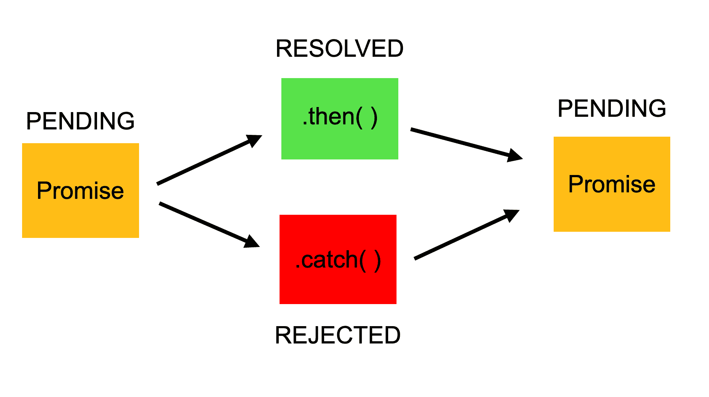

# JavaScript Promise 教程:JS 和 ES6 中的解决、拒绝和链接

> 原文：<https://www.freecodecamp.org/news/javascript-es6-promises-for-beginners-resolve-reject-and-chaining-explained/>

承诺是我们在 JavaScript 中处理异步操作的方式之一。许多人都很难理解承诺是如何运作的，所以在这篇文章中，我将尽可能简单地解释它们。

承诺是一个广泛的话题，所以我不能在这篇文章中详细讨论。但是您会发现对什么是承诺的全面介绍，对 resolve、reject 和 chaining 等术语的解释，以及创建和使用承诺的代码示例。

先决条件:为了更好地理解这篇文章，看看我的另一篇关于 [JavaScript 回调](https://www.freecodecamp.org/news/javascript-callback-functions-what-are-callbacks-in-js-and-how-to-use-them/)的文章。

## 什么是承诺？

JavaScript 中的承诺类似于现实生活中的承诺。当我们在现实生活中做出承诺时，这是对我们将来要做某事的保证。因为承诺只能给未来。

一个承诺有两种可能的结果:要么到时候遵守，要么不遵守。

JavaScript 中的承诺也是如此。当我们在 JavaScript 中定义一个承诺时，它将在适当的时候被解析，或者被拒绝。

### JavaScript 中的承诺

首先，承诺是一个客体。承诺对象有 3 种状态:

*   **待定:**初始状态，承诺成功或失败前
*   **已解决:**已完成承诺
*   **拒绝:**承诺失败



**Representation of the process of Promises**

例如，当我们通过使用 Promise 从服务器请求数据时，它将处于挂起模式，直到我们收到数据。

如果我们能从服务器获取信息，这个承诺就能成功实现。但是如果我们得不到信息，那么承诺就会处于被拒绝的状态。

此外，如果有多个请求，那么在第一个承诺被解决(或拒绝)后，一个新的流程将开始，我们可以通过一个称为链接的方法直接将它附加到该流程。

如果你愿意，你也可以观看下面的视频版本:

[https://www.youtube.com/embed/OXpZfyVXeI8?feature=oembed](https://www.youtube.com/embed/OXpZfyVXeI8?feature=oembed)

### 回调和承诺有什么区别？

回调函数和承诺的主要区别在于，我们将回调附加到承诺上，而不是传递它。所以我们仍然使用带有承诺的回调函数，但是以不同的方式(链接)。

这是使用承诺最大的好处之一，但是为什么呢？

### 什么是链接？

多年来，回调函数一直被单独用于 JavaScript 中的异步操作。但在某些情况下，使用承诺可能是更好的选择。

如果有多个异步操作要完成，并且如果我们试图为它们使用传统的回调，我们会很快发现自己处于一种叫做[回调地狱](http://callbackhell.com/)的情况中:

```
firstRequest(function(response) {  
    secondRequest(response, function(nextResponse) {    
        thirdRequest(nextResponse, function(finalResponse) {     
            console.log('Final response: ' + finalResponse);    
        }, failureCallback);  
    }, failureCallback);
}, failureCallback);
```

然而，如果我们用承诺来处理相同的操作，因为我们可以附加回调而不是传递它们，这一次上面的代码看起来更加清晰易读:

```
firstRequest()
  .then(function(response) {
    return secondRequest(response);
}).then(function(nextResponse) {  
    return thirdRequest(nextResponse);
}).then(function(finalResponse) {  
    console.log('Final response: ' + finalResponse);
}).catch(failureCallback);
```

上面的代码显示了如何一个接一个地链接多个回调函数。连锁是承诺最好的特征之一。

### 逐步创建和使用承诺

首先，我们使用一个构造函数创建一个 Promise 对象:

```
const myPromise = new Promise();
```

它有两个参数，一个表示成功(解决)，一个表示失败(拒绝):

```
const myPromise = new Promise((resolve, reject) => {  
    // condition
});
```

最后，还会有一个条件。如果满足条件，承诺将被解决，否则将被拒绝:

```
const myPromise = new Promise((resolve, reject) => {  
    let condition;  

    if(condition is met) {    
        resolve('Promise is resolved successfully.');  
    } else {    
        reject('Promise is rejected');  
    }
});
```

所以我们创造了我们的第一个承诺。现在让我们使用它。

### then()表示已解决的承诺:

如果你再看一下这篇文章开头的图片，你会发现有两种情况:一种是解决承诺，另一种是拒绝承诺。如果承诺得到解决(成功案例)，那么接下来会发生一些事情(取决于我们如何处理成功的承诺)。

```
myPromise.then();
```

在承诺被解析后调用 then()方法。然后，我们可以决定如何处理已解决的承诺。

例如，让我们将从承诺中获得的消息记录到控制台:

```
myPromise.then((message) => {  
    console.log(message);
});
```

### 拒绝承诺的 catch():

但是，then()方法仅用于已解析的承诺。承诺落空怎么办？然后，我们需要使用 catch()方法。

同样，我们附加了 then()方法。我们也可以在 then()之后直接附加 catch()方法:

```
myPromise.then((message) => { 
    console.log(message);
}).catch((message) => { 
    console.log(message);
});
```

因此，如果承诺被拒绝，它将跳转到 catch()方法，这一次我们将在控制台上看到不同的消息。

## 包裹

这就是我们如何用 JavaScript 创建一个承诺，并将其用于解决和拒绝的案例。承诺是一个更广泛的话题，关于承诺还有很多东西要学。所以理解它们是如何工作的需要时间。

这篇文章只是对承诺的一个介绍，我希望它对你了解 JavaScript 承诺是什么以及如何使用它们有所帮助。

如果你想了解更多关于网络开发的知识，欢迎访问我的 Youtube 频道。

感谢您的阅读！