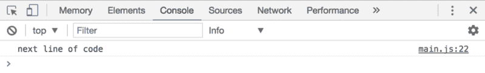
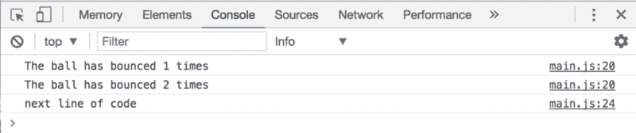
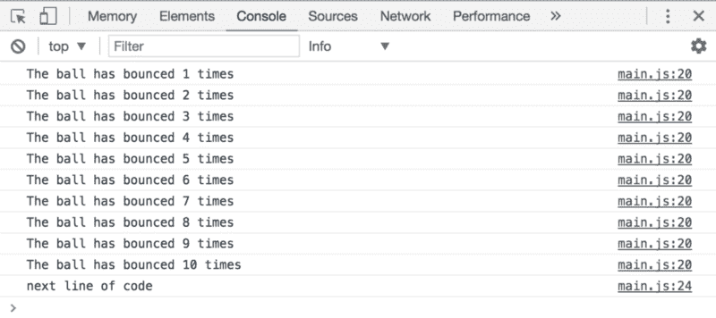

# JavaScript Essentials:如何理解循环

> 原文：<https://www.freecodecamp.org/news/javascript-essentials-how-to-wrap-your-head-around-for-loops-64e1a7248c9e/>

作者 Zell Liew

# JavaScript Essentials:如何理解循环


假设您想要运行一个函数`bounceBall`四次。你会怎么做？像这样？

```
function bounceBall() {   // bounce the ball here } 
```

```
bounceBall() bounceBall() bounceBall() bounceBall()
```

如果你只需要`bounceBall`几次，这种方法是很棒的。如果需要`bounceBall`一百次会怎么样？

更好的方法是通过一个`for`循环。

### “for”循环

`for`循环运行一个代码块，次数不限。下面是一个运行`bounceBall`十次的 for 循环:

```
for (let i = 0; i < 10; i++) {   bounceBall() }
```

它被分解成四个部分——`initialExpression`、`condition`、`incrementalExpression`和`statement`:

```
for (initialExpression; condition; incrementExpression) {   statement }
```

在循环之前，你需要有一个**语句**。这条语句是您想要多次运行的代码块。您可以在这里编写任意数量的代码行。你甚至可以使用函数。

下面是以`bounceBall`为语句的`for`循环的样子:

```
for (initialExpression; condition; incrementExpression) {     bounceBall() }
```

接下来，你需要一个**初始表达式**来开始一个循环。这是你声明变量的地方。对于大多数循环，这个变量叫做`i`。它也被设置为 0。

下面是将`initialExpression`放入`for`循环时的样子:

```
for (let i = 0; condition; incrementExpression) {   bounceBall() }
```

语句运行后，变量`i`会增加或减少。您可以增加或减少**增量表达式**中`i`的值。

要将`i`的值增加 1，您需要重新分配`i`，使其变成带有`i = i + 1`的`i + 1`。这种重新分配的简写是`i++`，这是你会在大多数`for`循环中发现的。

要将`i`的值减 1，您需要重新分配`i`，使其变成带有`i = i - 1`的`i - 1`。这种重新分配的简写是`i--`，这是你会在大多数`for`循环中发现的另一种变化。

在上面的`bounceBall`示例中，每次代码运行时，我们都将变量`i`加 1:

```
for (let i = 0; condition; i++) {   bounceBall() }
```

但是应该增加还是减少`i`？

答案在于**条件**。该条件语句评估为`true`或`false`。如果该语句的计算结果为`true`，则运行该语句。

当语句运行后，JavaScript 运行增量表达式并检查条件是否再次评估为`true`。它重复这个过程，直到条件评估为`false`。

一旦条件评估为`false`，JavaScript 跳过循环，继续执行代码的其余部分。

因此，如果不希望循环运行，可以设置一个立即计算为 false 的条件:

```
// This loop will not run since the condition evaluates to false for (let i = 0; i < 0; i++) {   bounceBall()   const timesBounced = i + 1   console.log('The ball has bounced ' + timesBounced + ' times') } 
```

```
// You will only see this console.log('next line of code')
```



如果您想让循环**运行两次**，您可以更改条件，以便当增量表达式运行两次时，它的计算结果为 false。

```
// This loop will run twice for (let i = 0; i < 2; i++) {   bounceBall()   const timesBounced = i + 1   console.log('The ball has bounced ' + timesBounced + ' times')") } 
```

```
console.log('next line of code')
```



如果您想让循环**运行十次**，您可以更改条件，这样当增量表达式运行十次时，它的计算结果为 false。

```
// This loop will run ten times for (let i = 0; i < 10; i++) {   bounceBall()   const timesBounced = i + 1   console.log('The ball has bounced ' + timesBounced + ' times')") } 
```

```
console.log('next line of code')
```



### 无限循环

当`for`循环的**条件**总是返回`true`时，就会出现无限循环。如果你运行一个无限循环，你的浏览器将会挂起。

要从无限循环中恢复，需要强行退出浏览器。在苹果电脑上，这意味着你右击你的浏览器图标，选择“强制退出”在 Windows 的机器上，你用`ctrl` + `alt` + `del`打开 Windows 任务管理器，选择你的浏览器，点击“结束任务”

### 遍历数组

实际上，你几乎不会像上面的`bounceBall`例子那样写一个运行十次的循环。你总是在一个数组或一个对象中循环。

当您循环(或迭代)数组时，您将遍历数组中的每一项一次。为此，您可以使用长度或数组作为条件:

```
const fruitBasket = ['banana', 'pear', 'guava'] 
```

```
// fruitBasket.length is 3 for (let i = 0; i < fruitBasket.length; i++) {   console.log("There's a " + fruitBasket[i] + " in the basket") } 
```

```
// => There's a banana in the basket // => There's a pear in the basket // => There's a guava in the basket
```

编写这个`for`循环的另一种方法是使用负增量表达式。这个版本比上面的`for`循环运行得稍微快一点，但是从末尾开始循环数组。

```
for (let i = fruitBasket.length - 1; i >= 0; i--) {  console.log("There's a " + fruitBasket[i] + " in the basket") } 
```

```
// => There's a guava in the basket // => There's a pear in the basket // => There's a banana in the basket
```

### 使用“for of”循环遍历数组

另一种(更好的)遍历数组的方法是使用`for...of`循环。这是 ES6 附带的一个新的循环语法。看起来是这样的:

```
const fruitBasket = ['banana', 'pear', 'guava'] 
```

```
for (let fruit of fruitBasket) {   console.log(fruit) } 
```

```
// => There's a banana in the basket // => There's a pear in the basket // => There's a guava in the basket
```

`for...of`循环优于标准的`for`循环，因为它总是遍历数组一次。没有必要编写`array.length`，这使得你的代码更容易阅读和维护。

您可以对任何可迭代对象使用`for...of`。这些是包含`Symbol.iterator`属性的对象。数组就是这样一种对象。如果你`console.log`一个空数组，你会看到它有`Symbol.iterator`作为它的一个键(在数组`__proto__`键内):


### 循环中的逻辑

您可以在 for 循环中使用`if/else`或任何其他逻辑。

例如，假设您有一个数字列表，您想要创建第二个小于 20 的数字列表。

为了完成这个目标，你首先要遍历这些数字。

```
const numbers = [25, 22, 12, 56, 8, 18, 34]
```

```
for (let num of numbers) {   // do something here }
```

这里，你要检查每个`num`是否小于 20。

```
const numbers = [25, 22, 12, 56, 8, 18, 34]
```

```
for (let num of numbers) {   if (num < 20) {     // do something   } }
```

如果`num`小于 20，你想把它加到另一个数组里。为此，您可以使用`push`方法。

```
const numbers = [25, 22, 12, 56, 8, 18, 34]let smallerThan20 = [] 
```

```
for (let num of numbers) {   if (num < 20) {     smallerThan20.push(num)   } } 
```

```
// smallerThan20 === [12, 8 , 18]
```

### 包扎

当您想要多次执行同一个任务(或一组任务)时，可以使用`for`循环。

你很少会在代码中循环十次。通常情况下，您会希望循环遍历一个数组。

要遍历一个数组一次，可以使用`for...of`循环，这比传统的`for`循环更容易编写和理解。

请记住，您可以在循环中编写任意数量的逻辑。可以使用函数、`if/else`语句，甚至可以在循环中使用循环。

如果你喜欢这篇文章，你会喜欢 Learn**Learn JavaScript**——这是一门帮助你学习用 JavaScript 从零开始**构建真正的组件**的课程。[如果你感兴趣，点击这里了解更多关于学习 JavaScript 的信息](https://learnjavascript.today/)。

(哦，对了，如果你喜欢这篇文章，如果你能[分享一下](http://twitter.com/share?text=Understanding%20Javascript%20for%20Loops%3A%20you%20can%20write%20any%20amount%20of%20logic%20you%20want%20in%20loops.%20You%20can%20use%20functions%2C%20%60if%2Felse%60%20statements%20or%20even%20use%20loops%20in%20loops%20?%20&url=https://zellwk.com/blog/js-for-loops/&hashtags=)，我会很感激。？)

*最初发表于[zellwk.com](https://zellwk.com/blog/js-for-loops/)。*