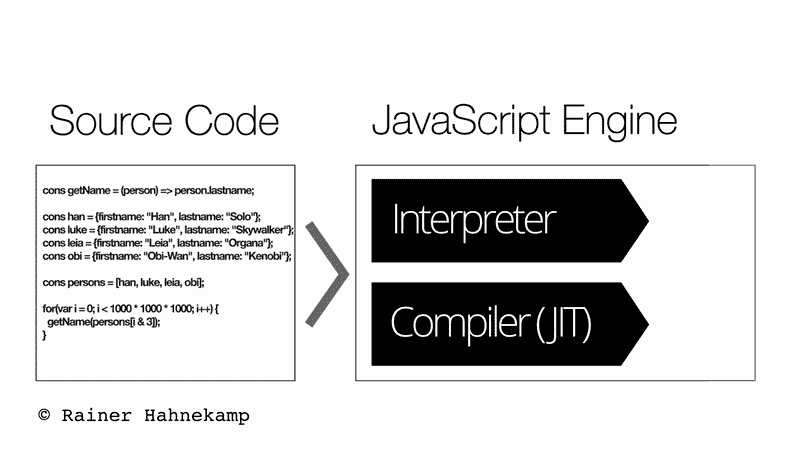
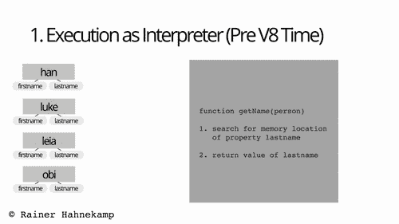
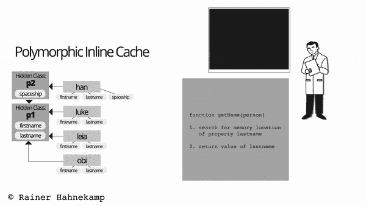
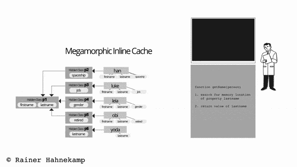

# JavaScript 要点:为什么你应该知道引擎是如何工作的

> 原文：<https://www.freecodecamp.org/news/javascript-essentials-why-you-should-know-how-the-engine-works-c2cc0d321553/>

赖纳·哈内坎普

# JavaScript 要点:为什么你应该知道引擎是如何工作的


Photo by [Moto “Club4AG” Miwa](https://www.flickr.com/photos/moto_club4ag/ "Geh zum Fotostream von Moto ") on [Flickr](https://www.flickr.com/photos/moto_club4ag/4342364192/in/datetaken/)

这篇文章还有西班牙语版本。

在本文中，我想解释使用 JavaScript 编写应用程序的软件开发人员应该了解哪些引擎知识，以便编写的代码能够正确执行。

您将在下面看到一个单行函数，它返回所传递参数的属性 lastName。仅仅通过向每个对象添加一个属性，我们最终的性能下降超过 700%！

正如我将详细解释的，JavaScript 缺乏静态类型导致了这种行为。它曾被视为优于 C#或 Java 等其他语言的优势，结果却更像是“浮士德式的讨价还价”。

### 全速刹车

通常，我们不需要知道运行我们代码的引擎的内部结构。浏览器供应商投入巨资让引擎运行代码非常快。

太好了！

让其他人来干重活吧。为什么要担心引擎是如何工作的？

在下面的代码示例中，我们有五个对象存储星球大战角色的名字和姓氏。函数`getName`返回姓氏的值。我们测量了这个函数运行 10 亿次的总时间:

```
(() => {   const han = {firstname: "Han", lastname: "Solo"};  const luke = {firstname: "Luke", lastname: "Skywalker"};  const leia = {firstname: "Leia", lastname: "Organa"};  const obi = {firstname: "Obi", lastname: "Wan"};  const yoda = {firstname: "", lastname: "Yoda"};  const people = [    han, luke, leia, obi,     yoda, luke, leia, obi   ];  const getName = (person) => person.lastname;
```

```
 console.time("engine");  for(var i = 0; i < 1000 * 1000 * 1000; i++) {     getName(people[i & 7]);   }  console.timeEnd("engine"); })();
```

在英特尔 i7 4510U 上，执行时间约为 1.2 秒。到目前为止一切顺利。我们现在向每个对象添加另一个属性，并再次执行它。

```
(() => {  const han = {    firstname: "Han", lastname: "Solo",     spacecraft: "Falcon"};  const luke = {    firstname: "Luke", lastname: "Skywalker",     job: "Jedi"};  const leia = {    firstname: "Leia", lastname: "Organa",     gender: "female"};  const obi = {    firstname: "Obi", lastname: "Wan",     retired: true};  const yoda = {lastname: "Yoda"};
```

```
 const people = [    han, luke, leia, obi,     yoda, luke, leia, obi];
```

```
 const getName = (person) => person.lastname;
```

```
 console.time("engine");  for(var i = 0; i < 1000 * 1000 * 1000; i++) {    getName(people[i & 7]);  }  console.timeEnd("engine");})();
```

我们的执行时间现在是 8.5 秒，比我们的第一个版本慢了大约 7 倍。这感觉就像全速踩刹车。怎么会这样呢？

是时候仔细看看引擎了。

### 合力:解释器和编译器

引擎是读取和执行源代码的部分。各大浏览器厂商都有自己的引擎。Mozilla Firefox 有 Spidermonkey，微软 Edge 有 Chakra/ChakraCore，苹果 Safari 将其引擎命名为 JavaScriptCore。谷歌 Chrome 使用的是 V8，这也是 Node.js 的引擎
2008 年 V8 的发布标志着引擎史上的一个关键时刻。V8 取代了浏览器相对较慢的 JavaScript 解释。

这种大规模改进背后的原因主要在于解释器和编译器的结合。今天，所有四个引擎都使用这种技术。解释器几乎立即执行源代码。编译器生成用户系统直接执行的机器码。

当编译器处理机器代码生成时，它会应用优化。尽管编译阶段需要额外的时间，但是编译和优化都可以加快代码的执行。

现代发动机背后的主要理念是结合两个世界的优点:

*   解释器的快速应用启动。
*   编译器的快速执行。


A Modern Engine uses an Interpreter and a Compiler. Source: i[mgflip](https://imgflip.com/i/23g834)

实现这两个目标都要从翻译开始。同时，引擎将频繁执行的代码部分标记为“热路径”，并将它们与执行期间收集的上下文信息一起传递给编译器。这个过程让编译器适应和优化当前上下文的代码。

我们称编译器的行为为“实时”或简称 JIT。当引擎运行良好时，你可以想象 JavaScript 甚至优于 C++的某些场景。难怪该引擎的大部分工作都是“上下文优化”。



Interplay between Interpreter and Compiler

### 运行时的静态类型:内联缓存

内联缓存(IC)是 JavaScript 引擎中的一项主要优化技术。解释器必须先执行搜索，然后才能访问对象的属性。该属性可以是对象原型的一部分，有一个 getter 方法，甚至可以通过代理访问。就执行速度而言，搜索资产的成本相当高。

引擎将每个对象分配给它在运行时生成的“类型”。V8 将这些“类型”称为隐藏类或对象形状，它们不是 ECMAScript 标准的一部分。要使两个对象共享相同的对象形状，这两个对象必须以相同的顺序具有完全相同的属性。因此对象`{firstname: "Han", lastname: "Solo"}`将被分配到与`{lastname: "Solo", firstname: "Han"}`不同的类。

在对象形状的帮助下，引擎知道每个属性的内存位置。引擎将这些位置硬编码到访问该属性的函数中。

内联缓存的作用是消除查找操作。难怪这会产生巨大的性能提升。

回到我们之前的例子:第一次运行中的所有对象只有两个属性，`firstname`和`lastname`，顺序相同。假设这个物体形状的内部名称是`p1`。当编译器应用 IC 时，它假定函数只传递对象形状`p1`，并立即返回`lastname`的值。



Inline Caching in Action (Monomorphic)

然而，在第二轮测试中，我们处理了 5 种不同的物体形状。每个对象都有一个额外的属性，而`yoda`完全缺少`firstname`。当我们处理多个物体形状时会发生什么？

### 干预鸭或多种类型

函数式编程有一个众所周知的“鸭子类型化”的概念，即良好的代码质量需要能够处理多种类型的函数。在我们的例子中，只要传递的对象有一个属性 lastname，一切都很好。

内联缓存消除了昂贵的属性内存位置查找。当在每个属性访问中，对象具有相同的对象形状时，效果最好。这叫做单态 ic。

如果我们有多达四种不同的物体形状，我们就处于多态 ic 状态。像在单态中一样，优化的机器码已经“知道”了所有四个位置。但是它必须检查传递的参数属于四种可能的对象形状中的哪一种。这导致性能下降。

一旦我们超过了 4，情况会变得更糟。我们现在正处于所谓的大变形时期。在这种状态下，不再有内存位置的本地缓存。相反，它必须从全局缓存中查找。这导致了我们上面看到的极端性能下降。

### 行动中的多态和变形

下面我们看到一个多态内联缓存，有两种不同的对象形状。



Polymorphic Inline Cache

我们的代码示例中的巨型 ic 有 5 种不同的对象形状:



Megamorphic Inline Cache

### JavaScript 类来拯救

好的，我们有 5 个物体形状，然后遇到了一个巨型异形。我们如何解决这个问题？

我们必须确保引擎将我们的所有 5 个对象标记为相同的对象形状。这意味着我们创建的对象必须包含所有可能的属性。我们可以使用对象文字，但是我发现 JavaScript 类是更好的解决方案。

对于没有定义的属性，我们简单地通过`null`或者忽略它。构造函数确保这些字段用一个值初始化:

```
(() => {  class Person {    constructor({      firstname = '',      lastname = '',      spaceship = '',      job = '',      gender = '',      retired = false    } = {}) {      Object.assign(this, {        firstname,        lastname,        spaceship,        job,        gender,        retired      });    }  }
```

```
 const han = new Person({    firstname: 'Han',    lastname: 'Solo',    spaceship: 'Falcon'  });  const luke = new Person({    firstname: 'Luke',    lastname: 'Skywalker',    job: 'Jedi'  });  const leia = new Person({    firstname: 'Leia',    lastname: 'Organa',    gender: 'female'  });  const obi = new Person({    firstname: 'Obi',    lastname: 'Wan',    retired: true  });  const yoda = new Person({ lastname: 'Yoda' });  const people = [    han,    luke,    leia,    obi,    yoda,    luke,    leia,    obi  ];  const getName = person => person.lastname;  console.time('engine');  for (var i = 0; i < 1000 * 1000 * 1000; i++) {    getName(people[i & 7]);  }  console.timeEnd('engine');})();
```

当我们再次执行这个函数时，我们看到我们的执行时间返回到 1.2 秒。任务完成。

### 摘要

现代 JavaScript 引擎结合了解释器和编译器的优点:快速的应用程序启动和快速的代码执行。

内联缓存是一种强大的优化技术。当只有一个对象形状传递给优化函数时，效果最佳。

我的极端例子展示了不同类型的内联缓存的效果以及巨型缓存的性能损失。

使用 JavaScript 类是很好的实践。静态类型转换程序，如 TypeScript，更有可能是单态 ic。

#### 进一步阅读

*   大卫·马克·克莱门茨:涡轮换挡和点火的性能杀手:[https://github.com/davidmarkclements/v8-perf](https://github.com/davidmarkclements/v8-perf)
*   Victor Felder: JavaScript 引擎隐藏类
    [https://draft . Li/blog/2016/12/22/JavaScript-Engines-Hidden-Classes](https://draft.li/blog/2016/12/22/javascript-engines-hidden-classes)
*   约尔格·w·米塔希:JIT 编译器和解释器概述
    [https://software engineering . stack exchange . com/questions/246094/understanding-the-differences-traditional-Interpreter-JIT-Compiler-JIT-interp/269878 # 269878](https://softwareengineering.stackexchange.com/questions/246094/understanding-the-differences-traditional-interpreter-jit-compiler-jit-interp/269878#269878)
*   维亚切斯拉夫·叶戈罗夫:单态主义怎么了
    [http://mrale . ph/blog/2015/01/11/What-up-with-mono morphism . html](http://mrale.ph/blog/2015/01/11/whats-up-with-monomorphism.html)
*   网络漫画解释谷歌浏览器
    [https://www.google.com/googlebooks/chrome/big_00.html](https://www.google.com/googlebooks/chrome/big_00.html)
*   惠仁宇:V8 与 ChakraCore 的区别
    [https://developers . red hat . com/blog/2016/05/31/JavaScript-engine-performance-comparison-V8-char kra-chakra-core-2/](https://developers.redhat.com/blog/2016/05/31/javascript-engine-performance-comparison-v8-charkra-chakra-core-2/)
*   塞思·汤普森:V8，高级 JavaScript，下一个性能前沿
    [https://www.youtube.com/watch?v=EdFDJANJJLs](https://www.youtube.com/watch?v=EdFDJANJJLs)
*   franziska hinkel Mann—V8
    [https://www.youtube.com/watch?v=j6LfSlg8Fig](https://www.youtube.com/watch?v=j6LfSlg8Fig)的性能分析
*   bene dikt Meurer:V8
    [投机优化简介 https://pony foo . com/articles/An-Introduction-to-Speculative-Optimization-in-V8](https://ponyfoo.com/articles/an-introduction-to-speculative-optimization-in-v8)
*   马蒂亚斯·拜恩斯:JavaScript 引擎基础:形状和内嵌缓存
    [https://mathiasbynens.be/notes/shapes-ics](https://mathiasbynens.be/notes/shapes-ics)