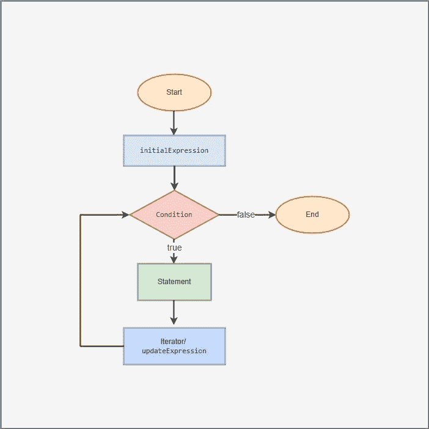

# JavaScript For 循环——用例子解释

> 原文：<https://www.freecodecamp.org/news/javascript-for-loops/>

循环是我们作为 JavaScript 开发人员经常遇到和实现的编程概念。

许多开发人员都熟悉循环，但并不是每个人都了解它们是如何工作的，以及为什么或何时应该使用特定类型的循环。

在本文中，我们将学习什么是 for 循环，它们是如何工作的，以及我们为什么使用它们。我们还要记住，有几种类型的循环，每种循环执行一个特定的功能，尽管它们几乎都可以执行相同的公共功能。

## 什么是循环？

循环是一种计算机程序，它将一组指令或一段代码执行一定的次数，而无需重新编写，直到满足一定的条件。换句话说，循环允许您的代码根据需要多次执行一个或多个语句。

同样，循环有很多种类型，但在本文中我们只看 for 循环。

几乎所有的高级编程语言，包括 JavaScript，都有 for 循环。在本文中，我们只看 JavaScript，我们将看它的语法和一些例子。

### JavaScript 中的 For 循环

for 循环是一个迭代语句，用于检查某些条件，然后只要满足这些条件就重复执行一段代码。



Flowchart for the for loop

### for 循环的语法

```
for (initialExpression; condition; updateExpression) {
    // for loop body: statement
}
```

上面的代码块是 for 循环使用的标准语法。让我们来看看每个参数的含义和作用:

*   `initialExpression`:用于设置一个计数器变量的值，在循环开始之前，只计算一次。根据作用域的不同，这些计数器变量通常用关键字`var`或`let`来声明。
*   `condition`:这是一个常量求值表达式，决定是否应该执行循环。简单地说，如果该条件返回 true，则执行 for 循环的代码块。如果返回 false，for 循环终止。
*   `updateExpression`:常用于更新或增加`initialExpression`计数器变量。换句话说，当条件为真时，它更新`initialExpression`的值。

总之，只要满足条件，for 循环就使设置为起始值的`initialExpression`变量响应于`updateExpression`而增加或减少。最后，如果条件的计算结果为真，将始终执行语句。

## JavaScript 中的 For 循环示例

至此，我们已经了解了什么是循环，所以让我们来看一些例子，看看如何使用循环。

### 如何多次显示文本

让我们从多次显示一些文本开始，直到满足我们的条件。

```
for (var i = 0; i < 3; i++) {
  let name = "John Doe";
  console.log("Hi, my name is " + name);
}
```

**输出:**

```
"Hi, my name is John Doe"
"Hi, my name is John Doe"
"Hi, my name is John Doe"
```

下面是程序如何处理这个循环:

| 迭代 | 变量 | 条件:本人<3 | 动作&变量更新 |
| 第一名 | T2`i = 0` | T2`true` | `Hi, my name is John Doe` 是印刷体。`i` 增加为 1。 |
| 第二 | T2`i = 1` | T2`true` | `Hi, my name is John Doe` 是印刷体。`i` 增加为 2。 |
| 第三 | T2`i = 2` | T2`true` | `Hi, my name is John Doe` 是印刷体。`i` 增加到 3。 |
| 第四 | T2`i=3` | T2`false` | 循环终止。 |

**注意:**由于 3 不小于 3，循环终止，所以返回`false`。

### 如何用 For 循环显示数字序列

这一次，让我们通过显示迭代值来显示一系列数字。

```
for (let i = 2; i <= 5; i++) {
    console.log(i);  // printing the value of i
}
```

**输出:**

```
2
3
4
5
```

下面是程序如何处理这个循环:

| 迭代 | 变量 | 条件:我< = 5 | 动作&变量更新 |
| 第一名 | T2`i = 2` | T2`true` | 2 被打印。i 增加到 3。 |
| 第二 | T2`i = 3` | T2`true` | 3 被打印出来。i 增加到 4。 |
| 第三 | T2`i = 4` | T2`true` | 4 是打印的。i 增加到 5。 |
| 第五名 | T2`i = 5` | T2`true` | 5 被打印。i 增加为 **6** 。 |
| 第六 | T2`i = 6` | T2`false` | 循环终止。 |

**注意:**循环终止是因为 6 不小于等于 5，所以条件返回 false。

### 如何显示偶数序列

现在让我们通过显示迭代值来显示偶数序列:

```
for (let i = 2; i <= 10; i+=2) {
    console.log(i);  // printing the value of i
}
```

**输出:**

```
2
4
6
8
10 
```

下面是程序如何处理这个循环:

| 迭代 | 变量 | 条件:我< = 10 | 动作&变量更新 |
| 第一名 | T2`i = 2` | T2`true` | 2 被打印。i 增加到 4。 |
| 第二 | T2`i = 4` | T2`true` | 4 是打印的。i 增加到 6。 |
| 第三 | T2`i = 6` | T2`true` | 6 是打印的。i 则增加到 8。 |
| 第五名 | T2`i = 8` | T2`true` | 8 是打印的。i 增加到 10。 |
| 第六 | T2`i = 10` | T2`true` | 10 被打印出来。i 增加到 12。 |
| 第七 | T2`i = 12` | T2`false` | 循环终止。 |

假设我们想得到奇数。我们所要做的就是将`initialExpression`改为等于`1`或者任何我们希望开始的奇数，如下图所示

```
for (let i = 1; i <= 10; i+=2) {
    console.log(i);  // printing the value of i
}
```

### 如何中断 For 循环操作

到目前为止，我们已经看到了如何创建 for 循环，但是同样重要的是要提到我们可以使用`break`来中断循环。break 语句用于在遇到循环时立即终止循环。

```
for (let i = 1; i <= 10; i++) {    
    if (i == 5) {
        break;
    }
    console.log(i);
}
```

**输出:**

```
1
2
3
4
```

### 如何显示自然数的和

现在让我们从 1-10 开始循环，然后随着迭代的增加将这些数字相加:

```
let sum = 0;

for (let i = 1; i <= 10; i++) {
    sum += i;  // This is same as: sum = sum + i
}

console.log('The sum of 1 to 10 is: ', sum); // "The sum of 1 to 10 is:  55"
```

**注意:**我们在循环外增加了`console.log(…)`，所以它只在循环终止时给我们最后的输出。

我们也可以这样决定使用变量来设置条件的最大数量:

```
let sum = 0;
let n = 10;

for (let i = 1; i <= n; i++) {
    sum += i;  // this is same as: sum = sum + i
}

console.log('The sum of 1 to 10 is: ', sum); // "The sum of 1 to 10 is:  55"
```

### 如何用 For 循环执行无限循环

这可能会挂起您的系统，因为它会继续运行，直到内存满为止，因为条件总是评估为真。

```
for(let i = 1; i > 0; i++) {
    // block of code
} 
```

### 如何在数组中循环检查奇数和偶数

大多数情况下，您将使用数组，所以让我们看看如何循环遍历一个数字数组，以输出所有奇数和偶数:

```
var numbers = [1, 4, 44, 64, 55, 24, 32, 55, 19, 17, 74, 22, 23];
var evenNumbers = [];
var oddNumbers = [];

for (var i = 0; i < numbers.length; i++) {
    if (numbers[i] % 2 != 1) {
        evenNumbers.push(numbers[i]);
    } else {
        oddNumbers.push(numbers[i]);
    }
}

console.log("The even numbers are: " + evenNumbers); // "The even numbers are: 4,44,64,24,32,74,22"
console.log("The odd numbers are: " + oddNumbers); // "The odd numbers are: 1,55,55,19,17,23"
```

### 如何遍历一个数字数组以获得最大和最小的数字

最后，在结束本文之前，让我们看看如何使用 for 循环从数组中获取最大值和最小值:

**最大值:**

```
var numbers = [1, 4, 44, 64, 55, 24, 32, 55, 19, 17, 74, 22, 23];
var max = 0;

for (var i = 0; i < numbers.length; i++) {
    if (numbers[i] > max) {
        max = numbers[i];
    }
}

console.log(max); // 74
```

**最小值:**

```
var numbers = [4, 44, 64, 55, 24, 32, 55, 19, 17, 74, 22, 23];
var min = numbers[0];

for (var i = 0; i < numbers.length; i++) {
    if (numbers[i] < min) {
        min = numbers[i];
    }
}

console.log(min); // 4
```

## 结论

在本文中，我们学习了什么是 JavaScript 循环，并查看了一些例子。

了解还有许多其他类型的循环很重要，包括 while 循环，它最适合在不知道迭代次数的情况下使用。否则，当您知道迭代次数时，请始终使用 for 循环。