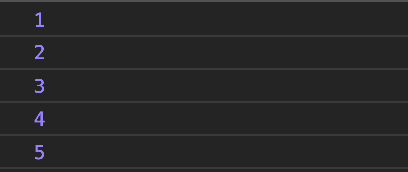
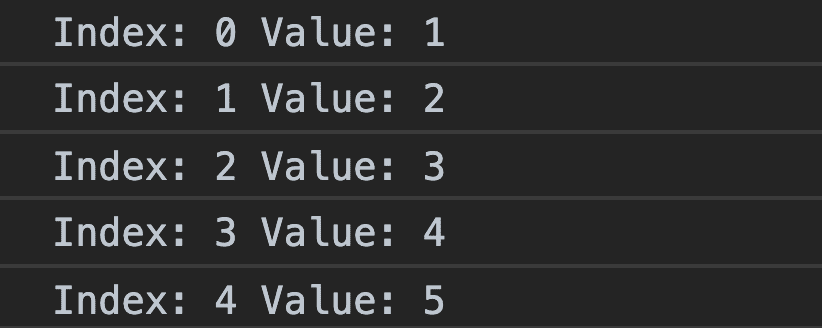
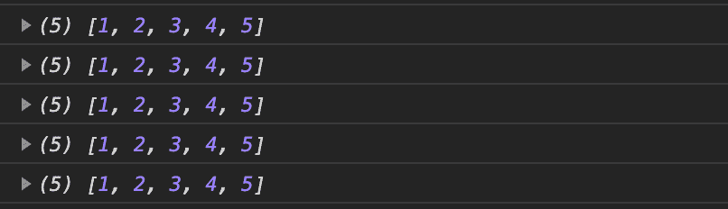
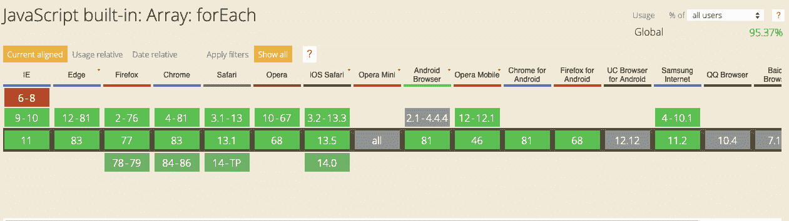

# JavaScript forEach——如何在 JS 中遍历数组

> 原文：<https://www.freecodecamp.org/news/javascript-foreach-how-to-loop-through-an-array-in-js/>

JavaScript forEach 方法是遍历数组的几种方法之一。每种方法都有不同的特性，由您决定使用哪一种，这取决于您正在做什么。

在这篇文章中，我们将仔细研究 JavaScript forEach 方法。

考虑到我们有下面的数组:

```
const numbers = [1, 2, 3, 4, 5];
```

使用传统的“for 循环”来循环遍历数组，如下所示:

```
for (i = 0; i < numbers.length; i++) {
  console.log(numbers[i]);
} 
```

## forEach()方法有何不同？

forEach 方法也用于循环遍历数组，但它使用的函数与经典的“for 循环”不同。

forEach 方法为数组的每个元素传递一个[回调函数](https://www.freecodecamp.org/news/javascript-callback-functions-what-are-callbacks-in-js-and-how-to-use-them/)以及以下参数:

*   当前值(必需)-当前数组元素的值
*   Index(可选)-当前元素的索引号
*   Array(可选)-当前元素所属的数组对象

让我一步一步解释这些参数。

首先，要使用 forEach 方法遍历数组，需要一个回调函数(或匿名函数):

```
numbers.forEach(function() {
    // code
});
```

该函数将对数组的每个元素执行。它必须至少接受一个表示数组元素的参数:

```
numbers.forEach(function(number) {
    console.log(number);
});
```

这就是我们遍历数组所要做的全部工作:



或者，您可以使用 ES6 箭头函数表示来简化代码:

```
numbers.forEach(number => console.log(number));
```

Arrow Function Representation

## 可选参数

### 索引

好了，现在让我们继续可选参数。第一个是“index”参数，它表示每个元素的索引号。

基本上，如果我们将一个元素作为第二个参数包含进来，我们就可以看到它的索引号:

```
numbers.forEach((number, index) => {
    console.log('Index: ' + index + ' Value: ' + number);
});
```



### 排列

数组参数是数组本身。它也是可选的，如果需要，可以在各种操作中使用。否则，如果我们调用它，它将被打印的次数与数组的元素数一样多:

```
numbers.forEach((number, index, array) => {
    console.log(array);
});
```



您可以在此视频中看到 forEach()方法的示例用法:

[https://www.youtube.com/embed/E2GawbHDFfs?feature=oembed](https://www.youtube.com/embed/E2GawbHDFfs?feature=oembed)

## 浏览器支持

Array.forEach 方法在除 IE 版本 8 或更早版本之外的所有浏览器中都受[支持](https://caniuse.com/#search=Array.foreach):



[caniuse.com](https://caniuse.com)

如果你想了解更多关于网络开发的知识，欢迎访问我的 Youtube 频道。

感谢您的阅读！