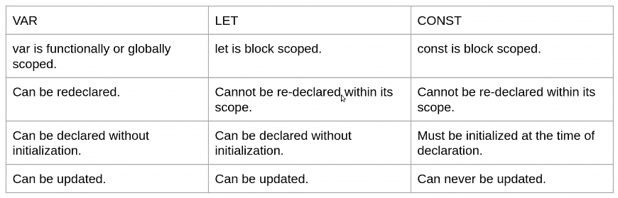
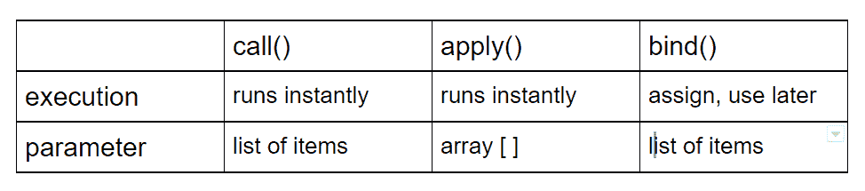
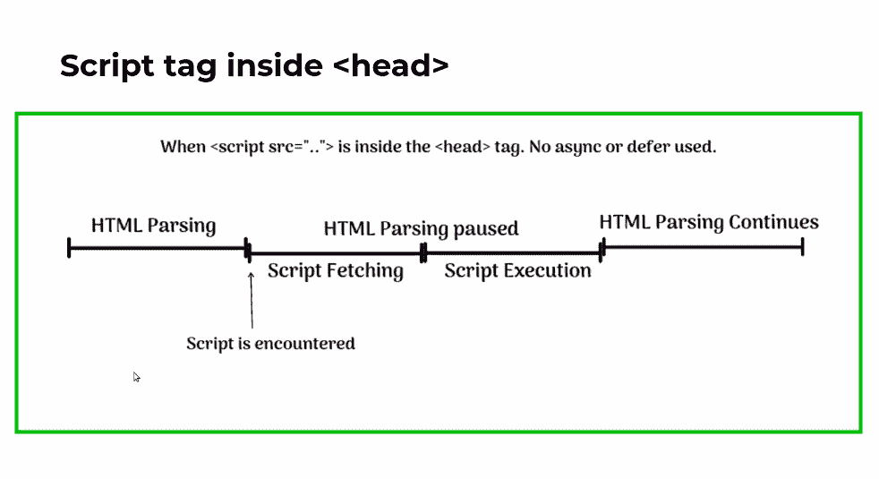
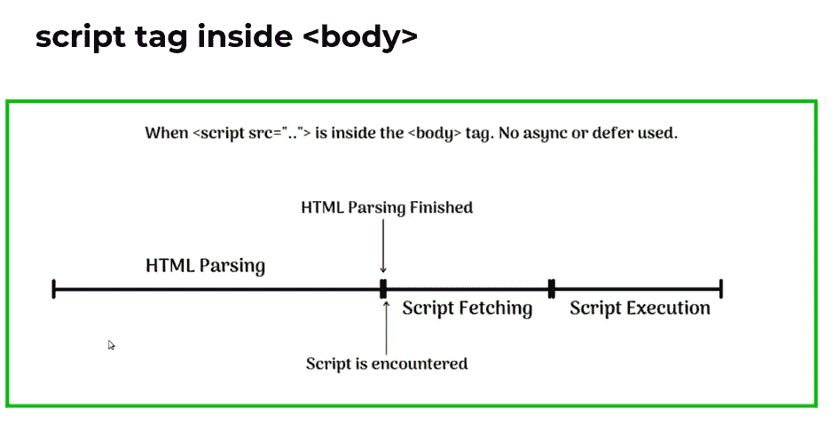
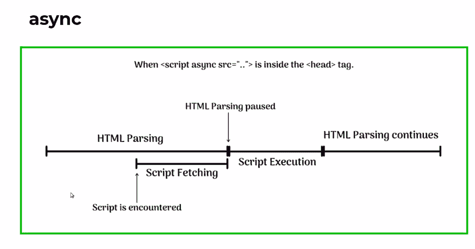

# JavaScript 面试准备备忘单——用这些概念提升你的编码面试

> 原文：<https://www.freecodecamp.org/news/javascript-interview-prep-cheatsheet/>

我仔细查阅了 50 多种资源，参加了 T2 的 10 次 JavaScript 面试，并在一家独角兽初创公司找到了一份 T4 的工作。

在整个过程中，我开始在最常被问到的 JS 面试问题中看到一个*模式*。

在这篇文章中，我试图列出涵盖任何优秀 JS 面试的 80%的概念。

所以，如果你正在为下一次 JS 面试做准备，这是你复习和巩固你的技能的完美小抄。经历这些，你就准备好摇滚了。💃

## 📝先决条件

*   网络和编程的基础知识
*   熟悉 HTML/CSS 和 JavaScript(尤其是 ES6+语法)

## 目录📜

*   [JavaScript 基础知识](#javascriptbasics)–JS 变量和数组方法
*   [JavaScript 中的函数式编程](#functionalprogramminginjavascript)——作用域、闭包和提升
*   [JavaScript 中的对象](#objectsinjavascript)——原型和“这个”
*   [异步 JavaScript](#asynchronousjavascript)——事件循环、计时器和承诺
*   [需要了解的高级 JavaScript 概念](#advancedjavascriptconceptstoknow) -异步/延迟、聚合填充、去抖动和节流
*   [JavaScript 中的存储](#storageinjavascript)

注意:这里的重点主要是涵盖与面试相关的概念，而不是创建一个全面的语言学习手册。把这个看做一个小抄。

如果你想深入研究并学习更多的 JS 概念，请查看 [freeCodeCamp 的课程](https://www.freecodecamp.org/learn/)。

别挡路了-我们走！

## JavaScript 基础知识👶

让我们从每个 JS 开发者需要知道的一些基本概念开始。

### JavaScript 中的变量📥

变量是每种编程语言的组成部分。你用它们来存储值。变量可以是数字、字符串和许多其他类型。

现在，JS 是一种松散类型的语言。你不必陈述变量的类型。你只要声明一下就可以了，JS 会自己搞清楚的。

现在，在 JavaScript 中我们有三种**方法来声明变量:`var`、`let`和`const`。**

以下是主要区别:



让我们试着通过例子来理解它们。

我们稍后将讨论范围。现在，让我们把注意力放在其他的不同点上。

```
var a = 3
var a = 4

console.log(a) // 4 as var variables can be redeclared + updated

let b = 3
let b = 4

console.log(b) // Syntax Error as let variables cannot be redeclared

// If we just do, it will work because it can be updated
b = 4 

const c = 3
const c = 4

console.log(c) // Syntax Error as const variables cannot be redeclared or updated

const d

// Will this throw an error? Go through the table and try to find the answer. 
```

**注意:**在 JavaScript 中，在语句结束后放一个分号是可选的。为了可读性，我将在这里跳过它。

### == vs ===在 JavaScript 中

我们来比较一些变量。有两种方法可以做到这一点。

`==`仅检查值

`===`检查值+类型

```
 let a = 5 // number
let b = '5' // string

console.log(a == b) // true

console.log(a === b) // false 
```

### JavaScript 中的数组

现在我们知道了一些关于变量的知识，让我们继续学习数组和数组方法。

如果我们已经声明了很多变量，将它们存储在某个地方是有意义的。否则，很难跟踪所有的人。数组是存储变量的一种方式。

```
 let a = 4
const b = 5
var c = 'hello'

const array = [a, b, c]

// or you can just directly do

const arr = [4,5,'hello'] 
```

但是只在数组中存储变量有点无聊。我们可以用这个数组做更多的事情*填充*(比如访问这些变量或者改变它们的存储顺序或者存储方式)。

为此，JS 有很多方法。现在让我们来看看其中的一些。

## JavaScript 数组方法🧰

JS 中最常用的数组方法有:`map`、`filter`、`find`、`reduce`、`forEach`。

让我们来看看`map`、`filter`和`forEach`。你可以在[这篇有用的文章](https://www.freecodecamp.org/news/complete-introduction-to-the-most-useful-javascript-array-methods/)中探索更多。

### `map`阵列法

`map`创建原始数组的新副本。当我们想对原始数组的元素做些什么，但又不想改变它时，我们就使用它。

`map`遍历原始数组，并接受一个回调函数(我们将在后面介绍)作为参数。在回调函数中，我们告诉它如何处理元素。

```
const a = [1,2,3,4,5]

// Create a new array which multiplies every element by 2

const d = a.map(function(item){ return item*2 })

console.log(d) // [2,4,6,8,10] 
```

### `filter`阵列法

用满足给定条件的元素创建一个新数组。

让我们看一个例子。我在这里使用了[箭头函数](https://www.freecodecamp.org/news/arrow-function-javascript-tutorial-how-to-declare-a-js-function-with-the-new-es6-syntax/)。如果您对函数有点不适应，可以先学习下一节，然后再回来。

```
// Return the words with more than 6 letters
const words = ['react', 'script', 'interview', 'style', 'javascript']

const ans = words.filter((word) => word.length > 6)

console.log(ans) // ['interview', 'javascript'] 
```

试着先自己做练习来测试你的知识。如果你有不同的或更好的解决方案，请告诉我！

一般来说，接下来的问题是:没有数组方法你能做到吗？

```
let newArr = []

for (let i = 0; i < words.length; i++) {
  if (words[i].length > 6) {
    newArr.push(words[i])
  }
}
console.log(newArr) 
```

### `forEach`阵列法

`forEach`与`map`非常相似，但有两个主要区别:

首先，`map`返回一个新数组，而`forEach`没有。

```
// Return a new array where even numbers are multiplied by 2 
let arr = [1, 2, 3, 4, 5, 6, 7]

function consoleEven(arr) {
  let data = arr.map((num) => (num % 2 === 0 ? num * 2 : num * 1))

  console.log(data)  // [1,  4, 3, 8, 5, 12, 7]
}

// ? is the ternary operator. If the condition is true - first statement is returned otherwise the second one.

consoleEven(arr) 
```

```
 function consoleEven(arr) {
  let data = arr.forEach((num) => (num % 2 === 0 ? num * 2 : num * 1))
  console.log(data) // undefined
}

consoleEven(arr) 
```

第二，你可以在`map`中做方法链接，但不能在`forEach`中做。

```
 // Convert  the new array back to original

function consoleEven(arr) {
  let data = arr
    .map((num) => (num % 2 === 0 ? num * 2 : num * 1))
    .map((item) => (item % 2 === 0 ? item / 2 : item / 1))

  console.log(data)
}

consoleEven(arr) 
```

**注意:**`map``forEach`不要突变(改变)原数组。

## JavaScript 🛠中的函数式编程

上面我们已经用过函数了。现在让我们更详细地介绍它们。

就像我们如何使用变量来存储值一样，我们可以使用函数来存储一段可以重用的代码。

您可以通过两种方式实现功能:

```
function a(){
 console.log('I am a normal function');
 }

const b = () => {
console.log('I am an arrow function')
}

// They are essentially the same but with a few differences which we will cover as we go along this tutorial. 

// We can pass variables as arguments

const c = (name) => {
console.log(`My name is ${name}`)
}

// `` template literal are a new addition to the language. Very useful for string formatting. Values are accessed using ${} inside them.

// We can even pass functions as arguments to a function. Will see more on this when we try to understand closures.

const greet = () =>  {
    const prefix = 'Mr'
    return (name) => {
        console.log(`${prefix} ${name}, welcome!`)
    }
}

console.log(greet()('Jack')) 
```

现在，让我们介绍一些与函数相关的重要概念。

### JavaScript 🕵️中的函数作用域

范围决定了从哪里可以访问变量。

有三种类型的范围:

*   全局(任何函数之外的声明)
*   函数(函数内部的声明)
*   块(块内声明)

记住之前的内容，即`var`是全局范围的，而`let`和`const`是块范围的。现在让我们明白这一点。

```
 var a = 5 // we can access this a anywhere

function adder(){
    let b = 7
    console.log(a + b)
 }

console.log(adder())

console.log(b) // Error as b is not accessible outside the function

{
const c = 10
console.log(c) // 10
}

console.log(c) // Error as c is not accessible outside the block 
```

### JavaScript 中的闭包(❗important)🔒

我们已经在没有意识到的情况下使用了闭包。在下面的例子中，`prefix`是一个封闭变量。

```
const greet = () =>  {
    const prefix = 'Mr'
    return (name) => {
        console.log(`${prefix} ${name}, welcome!`)
    }
}

console.log(greet()('Jack')) 
```

这一节会有很多花里胡哨的话，多包涵。我们将逐一介绍。

MDN 说:

> 一个函数和它的词法环境捆绑在一起形成了一个闭包。

好吧，什么是词汇环境？

它本质上是周围的状态——**本地内存**以及其父代的词汇环境。

怎么了？🤯我知道这有点疯狂。我们用一个简单的例子来理解一下。

```
function x() {
  var a = 7
  function y() {
    console.log(a)
  }
  return y
}

var z = x()
console.log(z) // [Function: y]
z() 
```

当调用 x 时，返回 y。现在，y 正等着被处决。有点像一把上膛的枪等着发射！🔫

所以，当我们最终调用 z 时，y 被调用。现在，y 必须记录`a`,所以它首先试图找到🔍它在**的本地记忆里**但它不在那里。它会转到它的父函数。它在那里找到了`a`。

瞧啊。好了，这是结束。

即使函数被返回(在上面的例子 y 中),它们仍然记得它们的词法范围(它来自哪里)

完全不相关的报价踢👻：

> 他们可能会忘记你说过的话——但他们永远不会忘记你给他们的感受——卡尔·w·比纳

我发誓文章的其余部分是合法的🤞继续读。

### JavaScript 中闭包的优势😎

*   携带

```
let add = function (x) {
  return function (y) {
    console.log(x + y)
  }
}

let addByTwo = add(2)
addByTwo(3) 
```

*   数据隐藏/封装

假设您想要创建一个计数器应用程序。每调用一次，计数就加 1。但是你不想在函数之外暴露变量。怎么做？

你猜对了——闭包！

```
function Counter() {
  var count = 0
  this.incrementCount = function () {
    count++
    console.log(count)
  }
}

console.log(count) // Error: count is not defined
var adder = new Counter()
adder.incrementCount() // 1 
```

不用担心`this`和`new`。我们下面有一整块区域专门介绍他们。

### JavaScript 中闭包的缺点😅

*   可能会发生内存过度消耗或内存泄漏。

例如，封闭变量不会被垃圾收集。这是因为，即使外部函数已经运行，返回的内部函数仍然有一个对封闭变量的引用。

**注意:**垃圾回收基本上是自动从内存中移除不用的变量。

### 在 JavaScript 中提升🚩

这是 JavaScript 将声明移到程序顶部的默认行为。

*   `var`申报上升，用`undefined`初始化。
*   `let`和`const`声明被提升但未初始化。
*   `function`定义也照原样吊起存放。

让我们看一个例子:

```
function consoleNum() {
  console.log(num)
  var num = 10
}

consoleNum() // undefined

// Why no error?

// This is how runtime sees this
{
  var num
  console.log(num)
  num = 9
}

// If instead of var -> let, it will give an error as let values are not initialized 
```

唷！我在这里已经完成了函数，但是如果你想要更多的话，可以看看 Anjana Vakil 关于函数式编程的精彩演讲。

## JavaScript 中的对象🔮

就像数组一样，对象也是存储数据的一种方式。我们在键值对的帮助下做到这一点。

```
 const developer = {
        name: "Raj",
        age: 22
        } 
```

`name`是`key`，`Raj`是`value`。键通常是对象属性的名称。

我们可以存储各种数据，比如对象内部的函数。您可以在 [MDN](https://developer.mozilla.org/en-US/docs/Web/JavaScript/Reference/Global_Objects/Object) 上了解更多信息。

### JavaScript 中的`this`是什么？

现在，在 JS 中使用对象与在其他流行的编程语言如 C++中不同。为了正确理解这一点，我们需要很好地掌握`this`关键字。

让我们试着一步步理解它。

在程序中，有时，我们需要一种指向东西的方法。比如说这个函数属于这个物体。有助于我们了解这一背景。

当我们看一些例子时，你会更好地理解我所说的。

现在，把`this`看作是提供上下文的东西。请记住这一点:它的价值取决于调用的方式和地点。

我知道，我知道。很多`this`😬。让我们慢慢来。

启动一个新程序，只需登录`this`。

```
 console.log(this) 
```

它将指向窗口对象。

现在，让我们以一个对象为例:

```
function myFunc() {
    console.log(this)     
  }

const obj = {
  bool: true,
  myFunc: myFunc,
}

obj.myFunc() 
```

现在，`this`将指向对象。这里发生了什么？

在第一个例子中，`.`什么都没有了，所以它默认为`window`对象。但是在这个例子中，我们有了对象`obj`。

如果你这样做:

```
 myFunc() // window 
```

我们再次得到了`window`对象。因此，我们可以看到`this`的值取决于我们如何以及在哪里进行调用。

我们上面做的叫做**隐式绑定**。`this`的值被绑定到对象上。

使用`this`还有另外一种方法。**显式绑定**是当你强制一个函数使用某个对象作为它的`this`。

我们通过一个例子来理解为什么需要显式绑定。

```
 const student_1 =  {
    name: 'Randall',
    displayName_1: function displayName() {
        console.log(this.name)
    }
}
const student_2 =  {
    name: 'Raj',
    displayName_2: function displayName() {
        console.log(this.name)
    }
}

student_1.displayName_1()
student_2.displayName_2() 
```

我们正在正确地使用`this`，但是你能看出上面代码的问题吗？

我们在重复代码。好的编程的原则之一是保持你的代码干燥！(不要重复)

所以，让我们去掉`displayName_2`，简单地做:

```
 student_1.displayName_1.call(student_2) // Raj 
```

`call`强制`displayName_1`使用第二个对象作为它的`this`。

我们还有很多其他方法可以做到这一点。



试着自己解决给定的问题。

```
const myData = {
  name: 'Rajat',
  city: 'Delhi',
  displayStay: function () {
    console.log(this.name, 'stays in', this.city)
  },
}
myData.displayStay()

// create an object yourData and try to use displayStay
const yourData = {
 name: 'name',
 city: 'city'
}

// answer
myData.displayStay.call(yourData) 
```

最后，记得我说过 arrow 和正则函数是有区别的。

`this`的案例就是其中之一。

对于 arrow 函数，值取决于词法范围，也就是说，声明 arrow 函数的外部函数。

所以，如果我们让`displayName()`从上面成为一个箭头函数，什么都不会起作用。

箭头函数基本上继承了父元素的上下文，在上面的例子中是`window`。

### JavaScript 中的原型和原型继承👪

> 每当我们用 JavaScript 创建任何东西(比如对象或函数)时，JS 引擎都会自动为那个东西附加一些属性和方法。

所有这些都来自于`prototypes`。

`__proto__`是 JS 在放的全部的对象。

让我们看一些例子。打开你的控制台！

```
let arr = ['Rajat', 'Raj']
console.log(arr.__proto__.forEach)
console.log(arr.__proto__) // same as Array.prototype
console.log(arr.__proto__.__proto__) // same as Object.prototype
console.log(arr.__proto__.__proto__.__proto__) // null 
```

这一切被称为`prototype chain`。

我们也可以对对象和函数做同样的事情。

我们总会在幕后找到`Object.prototype`。这就是为什么你可能听说过 JS 中的一切都是对象。🤯

### JavaScript 中的原型继承是什么？

```
let object = {
  name: 'Rajat',
  city: 'Delhi',
  getIntro: function () {
    console.log(`${this.name}, ${this.city}`)
  },
}

let object2 = {
  name: 'Aditya',
} 
```

**注意:**不要这样修改原型。只是为了理解。[下面是正确的做法](https://javascript.plainenglish.io/how-prototypal-inheritance-works-in-javascript-and-how-to-convert-it-to-class-based-inheritance-632e31e6350d)。

```
object2.__proto__ = object 
```

通过这样做，`object2`可以访问对象的属性。所以，现在我们可以做:

```
console.log(object2.city) 
```

这是**原型继承**。

## 异步 JavaScript ⚡

所以，JS 是一种*单线程*语言。事情一件一件发生。一件事做完了，才能转入下一件事。

但是这在现实世界中产生了问题，尤其是当我们使用浏览器的时候。

例如，当我们需要从网上获取数据时——通常我们不知道获取数据需要多长时间。以及我们是否能成功获取数据。

为了帮助解决这个问题，异步 JS 开始发挥作用。

需要理解的最重要的概念是事件循环。

### JavaScript ➰中的事件循环

如果你还没有看过菲利普·罗伯茨的这个视频，我强烈推荐你观看，而不是在这里提供一个不成熟的解释:

[在这里](https://youtu.be/8aGhZQkoFbQ)了解 JS 中的所有事件循环。

### JavaScript 中的计时器 settimeout、setInterval、clearInterval

希望你看了视频。它提到了计时器。现在让我们更多地谈论他们。这些是面试中经常被问到的问题。

`setTimeout()`方法在指定的毫秒数后调用一个函数或计算一个表达式。

`setInterval()`在指定的时间间隔内执行相同的操作。

```
 setTimeout(() => {
    console.log('Here - I am after 2 seconds')
}, 2000);

const timer = setInterval(() => {
    console.log('I will keep on coming back until you clear me')
}, 2000); 
```

你用`clearInterval()`来停止计时器。

```
clearInterval(timer) 
```

让我们复习一些使用这些概念的问题。

```
 console.log('Hello')
  setTimeout(() => {
    console.log('lovely')
  }, 0)
  console.log('reader')

  // output
  Hello
  reader
  lovely 
```

这里有一个稍微棘手的问题:

```
 for (var i = 1; i <= 5; i++) {
    setTimeout(function () {
      console.log(i)
    }, i * 1000)
  }

// output
6
6
6
6
6 
```

这里有一个简短的解释:当`setTimeout`再次出现时，整个循环已经运行，并且 `i`的值变为 6，

现在，假设我们希望结果是 1 2 3 4 5，我们该怎么做？

➡️用`let`代替`var`。

为什么这行得通？

`var`是全局作用域，但`let`是局部作用域。所以对于`let`来说，每次迭代都会创建一个新的`i`。

### JavaScript 中的承诺(❗important)🤝

承诺是异步 JS 的核心。

> Promise 对象表示异步操作的最终完成(或失败)及其结果值。

承诺可以是以下三种状态之一:

*   待定:初始状态，既未完成也未被拒绝
*   已完成:操作成功完成
*   拒绝:操作失败

```
const promise = new Promise((resolve, reject) => {
  let value = true
  if (value) {
    resolve('hey value is true')
  } else {
    reject('there was an error, value is false')
  }
})

promise
  .then((x) => {
    console.log(x)
  })
  .catch((err) => console.log(err)) 
```

**注:**`resolve``reject`只是约定俗成的称呼。叫它披萨吧🍕如果你喜欢的话。

我们也可以用`async/await`代替`then/catch`:

```
async function asyncCall() {
  const result = await promise
  console.log(result)
}

asyncCall() 
```

承诺的优点之一是它们是一种更干净的语法。在我们有承诺之前，我们很容易陷入[回调地狱](http://callbackhell.com/)🌋

## 需要了解的高级 JavaScript 概念

### 📚JavaScript 中的聚合填充

> polyfill 是一段代码(通常是 Web 上的 JavaScript ),用于在不支持它的旧浏览器上提供现代功能。 [MDN](https://developer.mozilla.org/en-US/docs/Glossary/Polyfill)

*   我们来实现一下`map`:

```
// this - array
// this[i] - current value
Array.prototype.myMap = function (cb) {
  var arr = []
  for (var i = 0; i < this.length; i++) {
    arr.push(cb(this[i], i, this))
  }
  return arr
}

const arr = [1, 2, 3]
console.log(arr.myMap((a) => a * 2)) // [2, 4, 6] 
```

注意我们如何使用`this`。在这里，我们基本上创建了一个新的数组，并向它添加值。

### JavaScript ✔️中的异步和延迟

这些概念在亚马逊、沃尔玛和 Flipkart 等大公司的采访中经常被问到。🏢

为了理解`async`和`defer`，我们需要了解浏览器是如何渲染网页的。首先，它们解析 HTML 和 CSS。然后创建 DOM 树。从这些，渲染树被创建。最后，从渲染树中——创建一个布局并开始绘画。

想要更详细的了解，请看这个视频。

Async 和 defer 是可以和脚本标签一起加载的`boolean`属性。它们有助于将外部脚本加载到您的网页中。

我们借助图片来了解一下。






如果有多个相互依赖的脚本，使用`defer`。延迟脚本按照定义的顺序执行。

如果您想加载不依赖于任何其他脚本执行的外部脚本，使用`async`。

**注意:**async 属性不保证脚本的执行顺序。

### 在 JavaScript ⛹️‍♂️中去抖

去抖是面试官另一个喜欢的话题。

让我们通过创建一个搜索栏来理解它。

**试玩:**【https://codesandbox.io/s/debounce-input-field-o5gml】T2

在`index.html`中创建一个简单的输入字段，如下所示:

```
<input type='text' id='text' /> 
```

现在，在`index.js`。别忘了先把它加到`index.html`里:

```
const getData = (e) => {
  console.log(e.target.value)
}
const inputField = document.getElementById('text')

const debounce = function (fn, delay) {
  let timer
  return function () {
    let context = this
    clearTimeout(timer)
    timer = setTimeout(() => {
      fn.apply(context, arguments)
    }, delay)
  }
}

inputField.addEventListener('keyup', debounce(getData, 300)) 
```

首先，我们选择了输入，并为其添加了一个`event listener`。然后我们创建了一个去抖函数，它采用了一个回调函数和延迟。

现在，在去抖函数中，我们使用`setTimeout`创建一个定时器。现在，这个定时器的工作是确保下一次调用`getData`只发生在 300 ms 之后，这就是去抖。

同样，我们使用`clearTimeout`来删除它。不要让太多的它们占用内存空间！

唷！很多理论。让我们做一个有趣的挑战。你一定看过比赛开始前的倒计时(10，9，8，....其间有一些延迟)。试着为它写一个程序。

你应该这么做:

```
let count = 10

for (let i = 0; i < 10; i++) {
  function timer(i) {
    setTimeout(() => {
      console.log(count)
      count--
    }, i * 500)
  }
  timer(i)
} 
```

你能解决它吗？你做得不同吗？让我知道你的解决方案。

### JavaScript 🛑中的节流

我们再来看一个例子。假设在每个窗口调整事件中，我们调用一个昂贵的函数。现在，我们希望这个昂贵的函数在给定的时间间隔内只执行一次。这就是节流。

用以下代码创建一个`index.html`和一个`index.js`:

```
const expensive = () => {
  console.log('expensive')
}

const throttle = (fn, limit) => {
  let context = this
  let flag = true
  return function () {
    if (flag) {
      fn.apply(context, arguments)
      flag = false
    }
    setTimeout(() => {
      flag = true
    }, limit)
  }
}
const func = throttle(expensive, 2000)
window.addEventListener('resize', func) 
```

和去抖差不多。关键的区别是`flag`变量。只有当它为真时，我们才调用回调函数。并且在`setTimeout`内设置为`true`。所以只有在期望的时间限制之后，该值才是`true`。

### 那么，去抖和 throttling❓有什么区别

让我们看看搜索栏🔍上面的例子。当我们对输入字段进行去抖时，我们是说仅当两个`keyup`事件之间的差值至少为 300 ms 时才提取数据。

在节流的情况下，我们只在一段时间后进行函数调用。

假设您正在搜索栏中搜索百科全书。第一个呼叫是在`e`发出的，我们花了 300 毫秒到达`p`。下一个电话只会在那时打。其间的所有事件都将被忽略。

所以，总结一下，去抖就是两个`keyup`事件相差 300 ms 的时候，节流就是两个函数调用相差 300 ms 的时候，基本上是在一定的时间间隔后调用函数。

## JavaScript 中的存储💾

最后，用一个小但重要的话题来总结一下。

**本地存储:**即使在关闭会话后，数据仍然存在

**会话存储:**当会话结束时，您会丢失数据，就像当您关闭选项卡上的浏览器时一样。

```
// save
localStorage.setItem('key', 'value')
// get saved data
let data = localStorage.getItem('key')
// remove saved data
localStorage.removeItem('key')
// Same for sessionStorage 
```

我们完了。🏁我希望你现在对你的下一次 JS 面试更有信心。祝你一切顺利。

如果你有任何疑问/建议/反馈，你可以在推特上联系我:[https://twitter.com/rajatetc](https://twitter.com/rajatetc)。

## 🗃️主要参考文献

*   [MDN 文档](https://developer.mozilla.org/en-US/)
*   [轴索拿](https://www.youtube.com/channel/UC3N9i_KvKZYP4F84FPIzgPQ)
*   [编码上瘾者](https://www.youtube.com/channel/UCMZFwxv5l-XtKi693qMJptA)
*   [Javascript _ 访谈](https://www.instagram.com/javascript_interviews/)