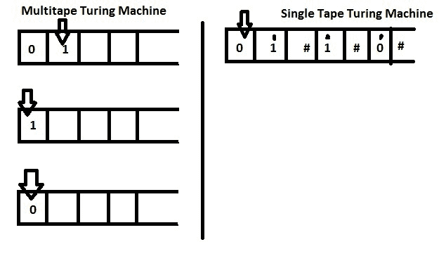

# 图灵完成了吗——解释

> 原文：<https://www.freecodecamp.org/news/javascript-is-turing-complete-explained-41a34287d263/>

作者 rajaraodv

# 图灵完成了吗——解释

如果你开始学习 JavaScript 的函数式编程，你可能会听说过[λ演算](https://en.wikipedia.org/wiki/Lambda_calculus)、[图灵机](https://en.wikipedia.org/wiki/Turing_machine)、[图灵完成](https://en.wikipedia.org/wiki/Turing_completeness)以及不知怎么的“JavaScript 就是图灵完成”。

但是，似乎没有人用简单术语解释它的实际含义。图灵“机器”和 JavaScript“语言”是什么关系？而且，大多数人用行话来解释行话，就像这样:

> 在[可计算性理论](https://en.wikipedia.org/wiki/Computability_theory)中，一个数据操作规则系统(比如一台计算机的[指令集](https://en.wikipedia.org/wiki/Instruction_set)，一种[编程语言](https://en.wikipedia.org/wiki/Programming_language)，或者一种[细胞自动机](https://en.wikipedia.org/wiki/Cellular_automaton))被称为**图灵完成**或者**计算通用**，如果它可以被用来模拟任何单带[图灵机](https://en.wikipedia.org/wiki/Turing_machine)。这个概念是以英国数学家艾伦·图灵的名字命名的。一个经典的例子是[λ演算](https://en.wikipedia.org/wiki/Lambda_calculus)。

所以这是我试图简单地解释这些概念。

### 图灵机

在过去，人们想知道如何创造一种机器来完成他们用手做的所有计算。他们想知道如何建造这样一台机器，以及它是如何工作的。

艾伦·图灵(Alan Turing)提出了一个假想的机器，它可以运行任何复杂程度的程序。它可以用一个简单的磁带来实现，一个左右移动的磁头，可以通过读取、写入和擦除方形单元的内容来存储数据。只要有足够长的磁带和足够的时间，它可以计算任何程序。

换句话说，他解释了一个人如何建造一台计算机。并将计算机称为“图灵机”

> 在艾伦·图灵的时代，“计算机”这个词的意思是人工计算程序的人(不是机器) :)

#### 如此强大却又如此简单

图灵机很快变得非常流行，并最终成为一个标准，因为虽然它们提供了一个强大的机制来计算任何东西，但它们也很容易理解。正如下面的视频所描述的，图灵机使用磁带来跟踪状态和运行计算。

#### “单”与“多”磁带图灵机

你会听到的另一个关于图灵机的术语是“单一”磁带的概念。

图灵机的最初版本只有一条长长的磁带。后来，人们提出了“多重”磁带图灵机的概念，使用两到五个磁带。多带图灵机并不比单带图灵机更强大，但它们有助于简化程序。

**所以明确地说“单一”磁带是没有必要的。**

### 图灵完成

如果一个物理机器(比如计算机)或者虚拟机，也就是一个软件，(比如 JavaVM)可以像图灵机一样获取**任何**程序并运行它，那么这个机器就叫做“图灵完备”。PS:算是一种认证吧。

#### 例子:图灵完全机器对图灵不完全机器

Not Turing Complete

计算器是一个很好的图灵不完全机器的例子，因为它只能执行一小部分预定义的计算。

然而，一台家用电脑(Mac 或 PC)是一台图灵机，因为如果我们给它足够的内存和时间，它可以做图灵机可以做的任何计算。

### “JavaScript 是图灵完成的吗”

如果你想一想，图灵机只是一个概念——它意味着任何接受并运行任何程序的“*事物*”(物理的或虚拟的)本质上都是图灵机。而如果那个“东西”能运行一个“图灵机”能运行的每一个程序，那么它就叫“图灵完备”。

现在，如果你考虑任何现代编程语言，它们也将程序(由我们编写)作为输入并运行它们。此外，任何理论上可以编写为在图灵机上运行的程序也可以用 JavaScript 编写。由此可见，JavaScript 是图灵完备的。

**就是这样！**

*？？？如果你喜欢这篇文章，请 1。❤❤❤的* 它的 ***在中等和 2 以下。请在推特上分享。你可以转发下面的卡片？？？***

### *我的其他帖子*

***最新:**[JS 中的函数式编程—结合实例(上)](https://medium.com/@rajaraodv/functional-programming-in-js-with-practical-examples-part-1-87c2b0dbc276#.fbgrmoa7g)*

#### *功能编程*

1.  *[*JavaScript 图灵全集—解说*](https://medium.com/@rajaraodv/javascript-is-turing-complete-explained-41a34287d263#.6t0b2w66p)*
2.  *[JS 中的函数式编程—结合实例(上)](https://medium.com/@rajaraodv/functional-programming-in-js-with-practical-examples-part-1-87c2b0dbc276#.fbgrmoa7g)*

#### *ES6*

1.  *[*5 ES6*](https://medium.com/@rajaraodv/5-javascript-bad-parts-that-are-fixed-in-es6-c7c45d44fd81#.7e2s6cghy)*中修复的 JavaScript“坏”部分
2.  *[*ES6 中的“类”是新的“坏”的部分吗？*](https://medium.com/@rajaraodv/is-class-in-es6-the-new-bad-part-6c4e6fe1ee65#.4hqgpj2uv)*

#### *网络包*

1.  *[*Webpack —令人困惑的部分*](https://medium.com/@rajaraodv/webpack-the-confusing-parts-58712f8fcad9#.6ot6deo2b)*
2.  *[*Webpack &热模块更换【HMR】*](https://medium.com/@rajaraodv/webpack-hot-module-replacement-hmr-e756a726a07#.y667mx4lg)*(引擎盖下)**
3.  *[*Webpack 的 HMR 和 React-Hot-Loader —失踪手册*](https://medium.com/@rajaraodv/webpacks-hmr-react-hot-loader-the-missing-manual-232336dc0d96#.fbb1e7ehl)*

#### *Draft.js*

1.  *[*为什么要投稿*](https://medium.com/@rajaraodv/why-draft-js-and-why-you-should-contribute-460c4a69e6c8#.jp1tsvsqc)*
2.  *[*draft . js 如何表示丰富的文本数据*](https://medium.com/@rajaraodv/how-draft-js-represents-rich-text-data-eeabb5f25cf2#.hh0ue85lo)*

#### *反应并还原:*

1.  *[*逐步建立 React Redux 应用指南*](https://medium.com/@rajaraodv/step-by-step-guide-to-building-react-redux-apps-using-mocks-48ca0f47f9a#.s7zsgq3u1)*
2.  *[*React Redux CRUD App*](https://medium.com/@rajaraodv/a-guide-for-building-a-react-redux-crud-app-7fe0b8943d0f#.g99gruhdz)*(3 页 app)** 构建指南
3.  *[*在 React Redux Apps 中使用中间件*](https://medium.com/@rajaraodv/using-middlewares-in-react-redux-apps-f7c9652610c6#.oentrjqpj)*
4.  *[*添加一个健壮的表单验证来反应 Redux Apps*](https://medium.com/@rajaraodv/adding-a-robust-form-validation-to-react-redux-apps-616ca240c124#.jq013tkr1)*
5.  *[*用 JWT 令牌保护 React Redux 应用*](https://medium.com/@rajaraodv/securing-react-redux-apps-with-jwt-tokens-fcfe81356ea0#.xci6o9s6w)*
6.  *[*在 React Redux 应用中处理事务性邮件*](https://medium.com/@rajaraodv/handling-transactional-emails-in-react-redux-apps-8b1134748f76#.a24nenmnt)*
7.  *[*解剖一个 React Redux App*](https://medium.com/@rajaraodv/the-anatomy-of-a-react-redux-app-759282368c5a#.7wwjs8eqo)*

#### *Salesforce*

1.  *[*在 Salesforce 的 Visualforce 中开发 React Redux 应用*](https://medium.com/@rajaraodv/developing-react-redux-apps-in-salesforce-s-visualforce-3ad7be560d1c#.f6bao6mtu)*

***感谢阅读！***