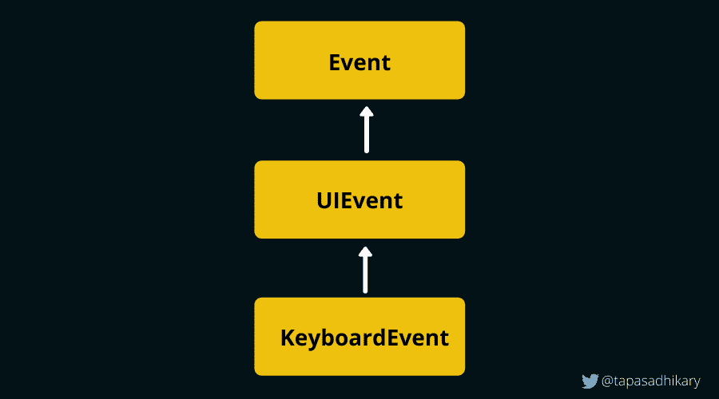
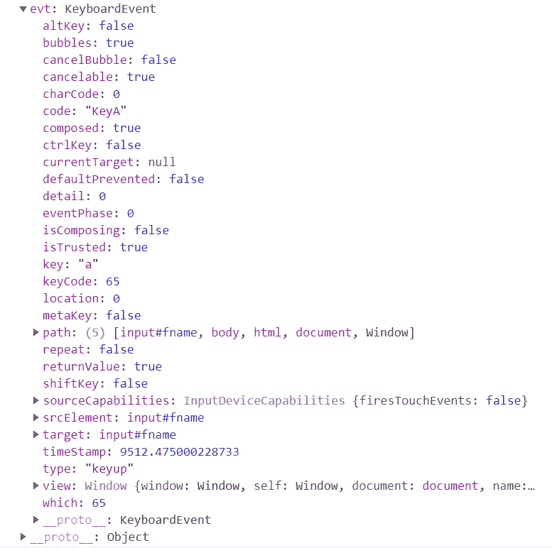

# JavaScript 键码列表–Enter、Space、Backspace 等的按键事件键码

> 原文：<https://www.freecodecamp.org/news/javascript-keycode-list-keypress-event-key-codes/>

JavaScript 键盘事件帮助您捕获用户与键盘的交互。

像许多其他 JavaScript 事件一样，`KeyboardEvent`接口提供了处理用户使用键盘进行的每一次击键所需的所有属性和方法。

已经有许多关于它们如何工作以及如何使用它们的文章。与此同时，[W3.org](https://www.w3.org/TR/uievents/#events-keyboardevents)通过引入新的属性，放弃现有的属性，以及将某些代码标记为遗留代码来不断更新规范。

正因为如此，对于 web 开发者来说，不断学习关于`KeyboardEvent`接口的知识是非常必要的，这样才能知道他们到底应该使用什么，什么不再相关。

在本文中，我们将了解:

*   键盘事件接口。
*   我们需要关注的键盘事件类型。
*   我们可能永远不需要的键盘事件类型。
*   实践中需要哪些属性，不同的浏览器是如何处理的。
*   哪些已被弃用，哪些正在使用。
*   一个在我们学习的时候尝试新事物的操场。
*   最后，列出当前的关键代码，以供参考和将来使用。

希望你喜欢它。

# 键盘事件接口和事件类型

KeyboardEvent 接口使用定义的常量、属性和单一方法提供信息(截至 2021 年 1 月)。它扩展了`UIEvent`接口，该接口最终扩展了`Event`接口。



KeyboardEvent Hierarchy

主要有三种键盘事件类型，`keydown`、`keypress`和`keyup`。我们可以从`KeyboardEvent`接口的属性和方法中获得关于这些事件的上下文信息。

您可以使用`addEventListener`方法将这些事件类型添加到 HTML 元素或`document`对象中。下面是一个监听 id 为“type-here”的元素上的`keydown`事件的例子:

```
let elem = document.getElementById('type-here');

elem.addEventListener("keydown", function (event) {
    // The parameter event is of the type KeyboardEvent
  	addRow(event);
});
```

或者，您可以对元素使用类似于、`onKeydown(event)`、`onKeyup(event)`、`onKeypress(event)`的处理程序方法来处理键盘事件。下面是一个在输入元素上处理`keyup`事件的例子:

```
<input type="text" id="type-here" onkeyup="doSomething(event)">
```

如果在浏览器的控制台中打印出`event`对象，您将会看到它的所有属性和方法，以及它从`UIEvent`和`Event`接口继承的属性和方法。



I have pressed the key, `a` while handling the `keyup` event

# 试试这个交互式键盘活动游乐场

在我们更进一步之前，不如来一个游乐场，探索所有的键盘事件、它们的属性、特征等等。我认为将它与本文一起使用会很棒。

只需将光标放在下面嵌入的应用程序中的任意位置，然后键入任意键即可查看相关的上下文信息。

您也可以通过取消选中顶部的复选框来过滤出您想要的事件。所以试一试吧:

[https://stackblitz.com/edit/js-keycodes?embed=1&file=index.html&hideExplorer=1&hideNavigation=1&view=preview](https://stackblitz.com/edit/js-keycodes?embed=1&file=index.html&hideExplorer=1&hideNavigation=1&view=preview)

The Keyboard Events Playground

> 如果您在访问上面的游乐场时有任何问题，您可以直接在这里访问该工具:[https://keyevents.netlify.app/](https://keyevents.netlify.app/)
> 您可以在这里找到演示的源代码:[https://github.com/atapas/js-keyevents-demo](https://github.com/atapas/js-keyevents-demo)

# keydown，keypress，keyup -你应该使用哪一个？

键盘事件包括:

*   当任何一个键被按下时就会触发。
*   `keypress`:只有当产生一个[字符值](https://www.w3.org/TR/uievents/#character-value)的键被按下时才会触发。例如，如果您按下键`a`，当键`a`产生一个字符值`97`时，该事件将被触发。另一方面，当你按下`shift`键时，这个事件不会被触发，因为它不会产生一个字符值。
*   释放任意键时触发。

如果所有三个事件都附加到一个 DOM 元素，触发顺序将是:

1.  首先，keydown
2.  接下来，按键(在上述条件下)
3.  最后，键入

在这些事件中，使用最多的键盘事件是(或者，应该是)`keydown`因为:

*   `keydown`事件具有产生上下文信息的最大覆盖范围的键。`keypress`事件只对键的子集有效。您无法通过按键捕获 Alt、Ctrl、Shift、Meta 和其他类似的按键事件。这也意味着我们不能用`Ctrl Z`、`Shift Tab`等组合键来触发按键事件。
*   而且，[`keypress`事件](https://www.w3.org/TR/uievents/#event-type-keypress)已经被弃用。这是一个足够大的理由来避免它。
*   虽然`keydown`和`keyup`事件覆盖了所有的按键，并且被大多数浏览器很好地支持，但是有一些不同之处使得`keydown`领先于`keyup`。keydown 事件在浏览器处理密钥之前触发，而 keyup 事件在浏览器处理密钥之后触发。如果你取消一个按键事件(比如使用`event.preventDefault()`，浏览器的动作也会被取消。对于 keyup 事件，即使您取消了该事件，浏览器的操作也不会被取消。

在下面的例子中，当`keydown`或`keyup`事件触发时，我们使用`event.preventDefault()`。bowser 将关键字符写入文本框的动作在`keydown`的情况下不会被执行，但在`keyup`中会继续发生。

[https://stackblitz.com/edit/js-key-down-up-test?devtoolsheight=33&embed=1&file=index.html](https://stackblitz.com/edit/js-key-down-up-test?devtoolsheight=33&embed=1&file=index.html)

`keydown` vs `keyup`

有了所有这些解释，`keydown`事件显然是赢家，应该成为最流行(使用)的关键事件类型。

# 如何在实践中使用 KeyboardEvent 属性

这是十亿美元的问题！最简短的回答是，视情况而定。但是在什么上面？这取决于:

*   应用程序的浏览器支持
*   你的应用程序代码有多老，你愿意重构多少？

但是在我们到达那里之前，让我们看一下`KeyboardEvent`接口的一些有用的属性和方法的预览。

| 属性/方法 | 描述 | 已弃用/过时 |
| --- | --- | --- |
| 阿蒂 | 返回一个布尔值(真/假)。按下`Alt`键时，数值为`true`。 | 不 |
| ctrlKey | 返回一个布尔值(真/假)。按下`Control`键时，数值为`true`。 | 不 |
| 快速键 | 返回一个布尔值(真/假)。按下`Shift`键时，数值为`true`。 | 不 |
| 元键 | 返回一个布尔值(真/假)。当按下任何一个`Meta`键时，数值为`true`。 | 不 |
| 密码 | 物理键的代码值。 | 不 |
| 键 | 按下的键的实际值。 | 不 |
| getModifierState()方法 | 返回一个布尔值(真/假)。值`true`表示这些按键的`on`状态，`CapsLock`，`NumLock`，`Alt`，`Control`，`Shift`，`Meta`等。 | 不 |
| 字符代码 | 返回 Unicode 值。这已经被否决了，我们应该使用`key`属性来代替。 | 是 |
| 键码 | 返回按下的值的 neumeric 代码。这已经被否决了，我们应该使用`key`属性来代替。 | 是 |
| 哪个 | 返回按下的值的 neumeric 代码。这已经被否决了，我们应该使用`key`属性来代替。 | 是 |

最后三个属性已被否决，您应该使用`key`属性来代替。`key`属性拥有[最广泛的浏览器支持](https://caniuse.com/?search=Keyboardevent.key)。

它在以下平台上受支持:

*   Microsoft Edge:版本> = 79
*   Firefox:版本> = 29
*   谷歌浏览器:版本> = 51
*   Safari:版本> = 10.1

因此，只要您没有使用任何较旧的浏览器，`event.key`属性应该足以让您识别一个键。如果你必须支持一个旧的浏览器，一个更好的选择是`event.which`属性。

```
window.addEventListener("keydown", function (event) {

  if (event.key !== undefined) {
    // Handle the event with KeyboardEvent.key
  } else if (event.which !== undefined) {
    // Handle the event with KeyboardEvent.which
  }
});
```

如果您的代码使用了任何不推荐使用的属性，并且您有机会重构该代码，那么使用它总是更好。

## 编辑关键点

修饰键是键盘上的特殊键，用于修改其他键的默认行为。`Control`、`Shift`和`Alt`是一些修饰键。当修饰键与另一个键组合时，可以预期会发生不同的动作。

例如，如果您按下`z`键，应该会返回字母 z 的键和代码。如果您将它与修饰符`Control`结合并按下`Control z`，您将很可能得到一个`Undo`操作。让我们在下一节通过更多的例子来看看它。

属性`event.altKey`、`event.ctrlKey`、`event.shiftKey`等有助于检测修改键是否被按下。

## 组合键

我们可以组合多个键，并根据组合键执行操作。下面的代码片段显示了如何组合`Control`和`z`键来定义一个动作:

```
document
  .getElementById("to_focus")
  .addEventListener("keydown", function(event) {
    if (event.ctrlKey && event.key === "z") {
      // Do Something, may be an 'Undo' operation
    }
});
```

这是另一个例子，演示了更多的组合键。请试一试:

[https://stackblitz.com/edit/js-key-combinations?embed=1&file=index.js&hideExplorer=1&view=preview](https://stackblitz.com/edit/js-key-combinations?embed=1&file=index.js&hideExplorer=1&view=preview)

Try Key Combinations

# 关键事件值的完整列表

下表显示了带有`event.which`、`event.key`和`event.code`值的按键列表。

| 键名 | 哪个事件 | 事件.关键字 | 事件.代码 | 笔记 |
| --- | --- | --- | --- | --- |
| 退格键 | eight | 退格 | 退格 |  |
| 标签 | nine | 标签 | 标签 |  |
| 进入 | Thirteen | 进入 | 进入 |  |
| 移位(向左) | Sixteen | 变化 | 左移 | `event.shiftKey`是真的 |
| 移位(右) | Sixteen | 变化 | 右移 | `event.shiftKey`是真的 |
| ctrl(左) | Seventeen | 控制 | 向左控制 | `event.ctrlKey`是真的 |
| ctrl(右) | Seventeen | 控制 | 控制权 | `event.ctrlKey`是真的 |
| alt(左) | Eighteen | 中高音 | alt 向左 | `event.altKey`是真的 |
| alt(右) | Eighteen | 中高音 | 没问题的 | `event.altKey`是真的 |
| 暂停/中断 | Nineteen | 中止 | 中止 |  |
| 大写锁定 | Twenty | CapsLock | CapsLock |  |
| 逃跑 | Twenty-seven | 逃跑 | 逃跑 |  |
| 空间 | Thirty-two |  | 空间 | `event.key`值是一个空格。 |
| 页上移 | Thirty-three | PageUp | PageUp |  |
| 下一页 | Thirty-four | 向下翻页 | 向下翻页 |  |
| 结束 | Thirty-five | 结束 | 结束 |  |
| 家 | Thirty-six | 主页 | 主页 |  |
| 向左箭头 | Thirty-seven | 向左箭头 | 向左箭头 |  |
| 向上箭头 | Thirty-eight | 向上箭头 | 向上箭头 |  |
| 向右箭头 | Thirty-nine | 向右箭头 | 向右箭头 |  |
| 下箭头键 | Forty | 向下箭头 | 阿罗敦 |  |
| 打印屏幕 | forty-four | 打印屏幕 | 打印屏幕 |  |
| 插入 | Forty-five | 插入 | 插入 |  |
| 删除 | Forty-six | 删除 | 删除 |  |
| Zero | Forty-eight | Zero | 数字 0 |  |
| one | forty-nine | one | 数字 1 |  |
| Two | Fifty | Two | 数字 2 |  |
| three | Fifty-one | three | 数字 3 |  |
| four | fifty-two | four | 数字 4 |  |
| five | Fifty-three | five | 数字 5 |  |
| six | Fifty-four | six | 数字 6 |  |
| seven | Fifty-five | seven | 数字 7 |  |
| eight | fifty-six | eight | 数字 8 |  |
| nine | Fifty-seven | nine | 数字 9 |  |
| a | Sixty-five | a | KeyA |  |
| b | Sixty-six | b | KeyB |  |
| c | Sixty-seven | c | 钥匙 |  |
| d | sixty-eight | d | KeyD，你好吗 |  |
| e | sixty-nine | e | 柯叶 |  |
| f | Seventy | f | 玩得开心 |  |
| g | Seventy-one | g | 基格 |  |
| h | seventy-two | h | 凯赫 |  |
| 我 | Seventy-three | 我 | 易科 |  |
| j | Seventy-four | j | KeyJ |  |
| k | Seventy-five | k | KeyK |  |
| l | Seventy-six | l | KeyL |  |
| m | Seventy-seven | m | KeyM |  |
| n | seventy-eight | n | 凯恩斯 |  |
| o | Seventy-nine | o | KeyO |  |
| p | Eighty | p | 关键点 |  |
| q | Eighty-one | q | KeyQ |  |
| r | Eighty-two | r | 键控器 |  |
| s | Eighty-three | s | 键 |  |
| t | Eighty-four | t | KeyT |  |
| u | eighty-five | u | KeyU |  |
| v | Eighty-six | v | KeyV |  |
| w | Eighty-seven | w | KeyW |  |
| x | Eighty-eight | x | KeyX |  |
| y | eighty-nine | y | KeyY |  |
| z | Ninety | z | 祝你愉快 |  |
| 左窗键 | Ninety-one | 自指的 | 金属左 | `event.metaKey`是真的 |
| 右窗键 | Ninety-two | 自指的 | 元权利 | `event.metaKey`是真的 |
| 选择键(上下文菜单) | Ninety-three | 上下文菜单 | 上下文菜单 |  |
| 数字小键盘 0 | Ninety-six | Zero | Numpad0 |  |
| numpad1 | Ninety-seven | one | Numpad1 |  |
| 数字小键盘 2 | Ninety-eight | Two | Numpad2 |  |
| 数字小键盘 3 | Ninety-nine | three | Numpad3 |  |
| 数字小键盘 4 | One hundred | four | Numpad4 |  |
| 数字小键盘 5 | One hundred and one | five | Numpad5 |  |
| 数字小键盘 6 | One hundred and two | six | Numpad6 |  |
| 数字小键盘 7 | One hundred and three | seven | 数字小键盘 7 |  |
| 数字小键盘 8 | One hundred and four | eight | 数字小键盘 8 |  |
| 数字小键盘 9 | One hundred and five | nine | 数字小键盘 9 |  |
| 多样地 | One hundred and six | * | NumpadMultiply |  |
| 增加 | One hundred and seven | + | NumpadAdd |  |
| 减去 | One hundred and nine | - | NumpadSubtract |  |
| 小数点 | One hundred and ten | 。 | NumpadDecimal |  |
| 划分 | One hundred and eleven | / | 数字分割 |  |
| 第一子代 | One hundred and twelve | 子一代 | 子一代 |  |
| 第二子代 | One hundred and thirteen | 第二子代 | 第二子代 |  |
| 第三子代 | One hundred and fourteen | 第三子代 | 第三子代 |  |
| 法乐四联症 | One hundred and fifteen | 法乐四联症 | 法乐四联症 |  |
| f5 | One hundred and sixteen | F5 | F5 |  |
| f6 | One hundred and seventeen | F6 | F6 |  |
| f7 | One hundred and eighteen | F7 | F7 |  |
| f8 | One hundred and nineteen | F8 | F8 |  |
| f9 | One hundred and twenty | F9 | F9 |  |
| f10 | One hundred and twenty-one | F10 | F10 |  |
| f11 | One hundred and twenty-two | F11 | F11 |  |
| f12 | One hundred and twenty-three | F12 | F12 |  |
| 数字锁定键 | One hundred and forty-four | 数字锁 | 数字锁 |  |
| 滚动锁定 | One hundred and forty-five | ScrollLock | ScrollLock |  |
| 音量静音 | One hundred and seventy-three | 音频音量 |  | ⚠️在火狐浏览器中的`event.which`值是 181。FF 也提供代码值为，`VolumeMute` |
| 音量调低 | One hundred and seventy-four | 音频音量音量 |  | ⚠️在火狐浏览器中的`event.which`值是 182。FF 也提供代码值为，`VolumeDown` |
| 音量调高 | One hundred and seventy-five | 音频音量 |  | ⚠️在火狐浏览器中的`event.which`值是 183。FF 也提供代码值为，`VolumeUp` |
| 媒体播放机 | One hundred and eighty-one | 启动媒体播放器 |  | ⚠️️`event.which`值在火狐中为 0(无值)。FF 也提供代码值为，`MediaSelect` |
| 启动应用程序 1 | One hundred and eighty-two | 启动应用程序 1 |  | ⚠️️`event.which`值在火狐中为 0(无值)。FF 也提供代码值为，`LaunchApp1` |
| 启动应用程序 2 | One hundred and eighty-three | 启动应用程序 2 |  | ⚠️️`event.which`值在火狐中为 0(无值)。FF 也提供代码值为，`LaunchApp2` |
| 分号 | One hundred and eighty-six | ； | 分号 | ⚠️在火狐浏览器中的`event.which`值是 59 |
| 等号 | One hundred and eighty-seven | = | 平等的 | ⚠️在火狐浏览器中的`event.which`值是 61 |
| 逗号 | One hundred and eighty-eight | , | 逗号 |  |
| 破折号 | One hundred and eighty-nine | - | 负的 | ⚠️在火狐浏览器中的`event.which`值是 173 |
| 时期 | One hundred and ninety | 。 | 时期 |  |
| 斜杠 | One hundred and ninety-one | / | 斜线 |  |
| 反引号/重音符 | One hundred and ninety-two | ` | 反报价 |  |
| 开括号 | Two hundred and nineteen | [ | BracketLeft |  |
| 反斜杠 | Two hundred and twenty | \ | 反斜线符号 |  |
| 关闭括号 | Two hundred and twenty-one | ] | 布雷克特里赫特 |  |
| 单引号 | Two hundred and twenty-two | ' | 引用 |  |

请注意:

*   `event.which`已被弃用(或过时)
*   小写字母(A)和大写字母(A)的`event.code`值相同。然而,`event.key`值代表实际的字母。
*   在 Firefox(FF)和其他浏览器中，`equal(=)`、`semicolon(;)`和`dash/minus(-)`键的`event.which`值是不同的

# 虚拟键盘怎么样？

那么虚拟键盘呢，比如使用我们的手机、平板电脑或任何其他输入设备？

[规范说](https://w3c.github.io/uievents/#code-virtual-keyboards)如果虚拟键盘具有与标准键盘相似的按键布局和功能，那么它必须产生适当的代码属性。否则，它不会返回正确的值。

# 概括起来

总结一下:

*   您可以使用`KeyboardEvent`来捕捉使用键盘的用户交互。
*   主要有三个关键事件，`keydown`、`keypress`和`keyup`。
*   我们应该尽可能多地使用`keydown`事件类型，因为它满足大多数用例。
*   `keypress`事件类型已被否决。
*   `event.which`属性已被弃用。尽可能使用`event.key`。
*   如果您必须支持较旧的浏览器，请使用适当的回退来进行按键检测。
*   我们可以组合多个键并执行操作。
*   只要布局和功能与标准键盘相似，虚拟键盘就支持这些事件。

目前就这些。谢谢你读到这里！我们来连线。你可以在 [Twitter 上@我(@tapasadhikary)](https://twitter.com/tapasadhikary) 发表评论或者随意关注。


From https://giphy.com/