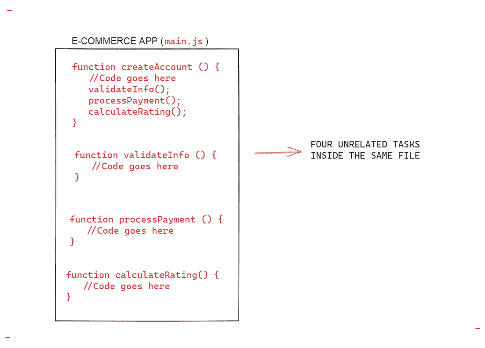

# JavaScript 模块——用例子解释

> 原文：<https://www.freecodecamp.org/news/javascript-modules-explained-with-examples/>

模块是一个函数或一组相似的函数。它们在一个文件中被组合在一起，并且包含在被更大的应用程序调用时执行特定任务的代码。

创建模块是为了更好地组织和构建代码库。您可以使用它们将大型程序分解成更小、更易管理、更独立的代码块，这些代码块执行一个或几个相关的任务。

模块应该是:

1.  **独立/自包含:**一个模块必须尽可能地从其他依赖关系中分离出来。
2.  **具体:**一个模块需要能够执行单个或一组相关的任务。首先创建它们的核心本质是创建独立的功能。一个模块，一种任务。
3.  可重用:一个模块必须易于集成到各种程序中来执行它的任务。

为了更好地解释，我给你打个比方:

假设我们想从头开始建造一座巨大的房子。我们建造这座大楼所需的所有工具都集中在一个房间里。

在这种情况下，以正确的方式组织工具以便我们可以开始构建将是困难的。

我们不应该把独立的依赖关系堆在一个房间里，而是应该把每组相关的工具组织起来，并把它们分在不同的房间里。每个房间都是独立的，设备齐全，有解决特定任务的工具。

我们可以贴上这样的标签:**“这些工具是盖屋顶的】、**、**这些工具是砌砖的**、**这些工具是挖地基的**等等。

每当我们需要一个工具来完成一个特定的任务时，我们都知道在哪个房间可以找到它。这样，一切都更有组织性和可定位性。

此外，假设我们完成了房子的建造，然后决定建造一些不同的东西。我们仍将拥有同样的一套工具。这加强了**可重用性**的原则。模块是可重用的，因为它们是自包含的。

## 模块的示例

对于代码来说，模块非常重要。

让我们考虑一个简化的电子商务应用程序，它允许个人和企业在线销售产品。这个程序通常由两个或多个不相关的任务组成。举个例子，

*   一种创建账户的程序，
*   一个验证信息的程序，
*   处理付款的另一个程序
*   另一个计算用户评分的程序

诸如此类。



与其将所有这些不相关的程序放在一个模块/文件中，不如为每个任务创建几个文件或模块。在这种情况下，模块成为依赖关系。

然后从主应用程序或程序中，你简单地导入/加载依赖项(即你需要的模块)并相应地执行它们。因此，你的主应用程序变得更加简洁。


main.js has been broken down into four modules

例如，假设您需要在代码库中的其他应用程序中处理支付，那么重用相同的功能就变得非常容易。无需复制粘贴或从头开始编写新功能。

## JavaScript 模块

JavaScript 中的模块只是一个包含相关代码的文件。

在 JavaScript 中，我们使用`import`和`export`关键字分别在不同的模块间共享和接收功能。

*   关键字`export`用于使变量、函数、类或对象可被其他模块访问。换句话说，它变成了一个公共代码。
*   关键字`import`用于从另一个模块引入公共代码。

让我们看一个简单的例子:

```
function getPower(decimalPlaces) {
	return 10 ** decimalPlaces;
}

function capitalize(word) {
	return word[0].toUpperCase() + word.slice(1);
}

function roundToDecimalPlace(number, decimalPlaces = 2) {
	const round = getPower(decimalPlaces);
	return Math.round(number * round) / round;
}

export { capitalize, roundToDecimalPlace };
```

filepath/main.js

该模块中定义了三个功能:

*   `getPower`:这个函数获取一个数的幂
*   这个函数将单词的第一个字母大写
*   `roundToDecimalPlace`:该函数将给定的数字四舍五入到指定的小数位数。

在文件的末尾，您可以看到三个函数中的两个被导出。换句话说，它们变成了可以被任何其他脚本使用的公共函数。

要导出三个函数中的两个，您可以使用`export`关键字，后跟一个包含您想要访问的函数的对象。一旦你这样做了，代码库中任何需要这些函数的程序都可以访问它们。

让我们看看如何使用它们:

```
import { capitalize, roundToDecimalPlace } from './main';

function displayTotal(name, total) {
	return `${capitalize(name)}, your total cost is: ${roundToDecimalPlace(total)}`;
}

displayTotal('kingsley', 20.4444444);
// "Kingsley, your total cost is: 20.44"

export { displayTotal };
```

filepath/displayTotal.js

`displayTotal.js`模块没有`capitalize()`和`roundToDecimalPlace()`，但是想要使用大写和四舍五入到小数功能。那我们是怎么把它带进来的呢？用`import`！

我们通过使用关键字`import`后跟我们想要从模块中导入的函数名来实现这一点，在我们的例子中是`capitalize`和`roundToDecimalPlace`。

如果您只想将`capitalize`函数导入到您的程序中呢？

简单–仅导入`capitalize()`，就像这样:

```
import { capitalize } from './main';

function warn(name) {
	return `I am warning you, ${capitalize(name)}!`;
}

warn('kingsley');
// I am warning you, Kingsley!

export { warn };
```

> 注意:当使用模块时，理解文件结构是如何工作的是非常重要的。在上面的例子中，我们只是从同一个目录中的一个文件导入，这就是为什么我们使用符号`'./import'`。

如果你想从另一个模块导入每个公共函数，使用星号`*`关键字:

```
import * as mainfunctions from './main';

function warn(name) {
return `I am warning you, ${mainfunctions.capitalize(name)}!`;
}
warn('kingsley');
// I am warning you, Kingsley!

export { warn };
```

filepath/warn.js

> 提示:如果你从一个模块中导入所有的东西，你应该使用星号，而不是一个接一个地明确拼写所有的函数。

你可能已经注意到了`as`这个关键词。我们用它将公共函数导入到一个新的对象中，在我们的例子中，这个对象就是`mainfunctions`对象。然后，我们访问并调用我们希望在程序中使用的函数。

到目前为止，我们只考虑了导出发生在文件末尾的例子。但是您同样可以通过在函数、变量或类的定义前面注册`export`关键字来导出函数、变量或类，就像这样:

```
function getPower(decimalPlaces) {
	return 10 ** decimalPlaces;
}

export function capitalize(word) {
	return word[0].toUpperCase() + word.slice(1);
}

export function roundToDecimalPlace(number, decimalPlaces = 2) {
	const round = getPower(decimalPlaces);
	return Math.round(number * round) / round;
}
```

filepath/anothermain.js

如果将它与第一个示例进行比较，您会注意到语法上的差异:

*   在第一个例子中，`export`关键字用于在脚本末尾导出两个函数。在上面的例子中，`export`关键字在定义时被附加到两个函数上。

然而，它们都交付相同的结果:`capitalize`和`roundToDecimalPlace`都将被导出。

## 默认导出

如果您想要导出所有三个函数，但是想要将其中一个作为默认函数(可能因为您最有可能使用这个函数)，那么您只需使用`default`关键字。

default 关键字使导入函数变得更加容易。让我们考虑下面的例子:

```
export function getPower(decimalPlaces) {
	return 10 ** decimalPlaces;
	}

export default function capitalize(word) {
	return word[0].toUpperCase() + word.slice(1);
	}

export function roundToDecimalPlace(number, decimalPlaces = 2) {
	const round = getPower(decimalPlaces);
	return Math.round(number * round) / round;
	}
```

filepath/default.js

如您所见，我们已经将`capitalize`设为默认函数。这实质上意味着我们给了它某种特权。

假设我们想将模块中的`capitalize`函数导入到另一个程序中。语法将非常相似，除了您不必将函数导入到花括号中:

```
import capitalize from './main';

function warn(name) {
	return `I am warning you, ${capitalize(name)}!`;
}

warn('kingsley');
// I am warning you, Kingsley!

export { warn };
```

filepath/warndefault.js

如果您想将默认函数与任何其他函数一起导入，您可以将裸露的“默认”函数与花括号中的其他函数混合使用:

```
import capitalize, { getPower } from './main';

function warn(name) {
	return `I am warning you, ${capitalize(name)}!`;
}

warn('kingsley');
// I am warning you, Kingsley!

export { warn };
```

filepath/mixed.js

## 包扎

模块是独立的、自包含的代码块。您可以通过将一个较大的程序分割成逻辑部分或依赖项来创建它们。

模块应该是独立的、专门化的和可重用的。

您使用`import`和`export`关键字在 JavaScript 中的模块之间交换功能。

您可以使用`default`关键字来指定一个函数、对象、变量或类，作为首选导入。

至此，我们已经了解了 JavaScript 中模块的基础知识。

我希望你能从这篇文章中得到一些有价值的东西。我每周都会在我的个人博客上写一些与编程相关的文章

感谢您的阅读。

> 如果你正在学习 JavaScript，我创作了一本电子书，用手绘数字笔记教授 50 个 JavaScript 主题。[点击这里查看](https://ubahthebuilder.gumroad.com/l/js-50)。