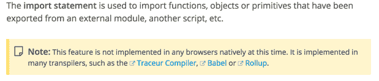

# JavaScript 模块第 2 部分:模块捆绑

> 原文：<https://www.freecodecamp.org/news/javascript-modules-part-2-module-bundling-5020383cf306/>

作者:Preethi Kasireddy

# JavaScript 模块第 2 部分:模块捆绑

[http://alpha.wallhaven.cc/wallpaper/33246](http://alpha.wallhaven.cc/wallpaper/33246)

在这篇文章的第一部分，我谈到了什么是模块，为什么开发者使用它们，以及将它们整合到你的程序中的各种方法。

在第二部分中，我将讨论“捆绑”模块的确切含义:我们为什么要捆绑模块，这样做的不同方式，以及模块在 web 开发中的未来。

### 什么是模块捆绑？

从高层次上来说，模块绑定就是将一组模块(及其依赖项)按照正确的顺序拼接成一个文件(或一组文件)的过程。

就像 web 开发的所有方面一样，细节决定成败。:)

### 为什么要捆绑模块？

当您将程序划分为模块时，通常会将这些模块组织到不同的文件和文件夹中。很有可能，你也会有一组你正在使用的库的模块，比如下划线或者反应。

因此，这些文件中的每一个都必须包含在您的主 HTML 文件中的一个 ***< scri*** pt >标签中，当用户访问您的主页时，浏览器就会加载这个标签。具有 sep**T5 arate&lt；为每个文件编写脚本>标签意味着浏览器必须单独加载每个文件:一个接一个。**

…这对页面加载时间来说是个坏消息。

为了解决这个问题，我们将所有文件捆绑或“连接”成一个大文件(或几个文件，视情况而定)，以减少请求的数量。当你听到开发人员谈论“构建步骤”或“构建过程”时，这就是他们正在谈论的。

加速捆绑操作的另一种常见方法是“缩小”捆绑的代码。缩小是从源代码中删除不必要字符的过程(例如空白、注释、换行符等)。)，以便在不改变代码功能的情况下减少内容的整体大小。

更少的数据意味着更少的浏览器处理时间，从而减少下载文件的时间。如果你曾经见过像“[underscript-min . js](https://github.com/jashkenas/underscore/blob/master/underscore-min.js)这样的“min”扩展名的文件，你可能会注意到，与[完整版](https://github.com/jashkenas/underscore/blob/master/underscore.js)相比，缩小版非常小(而且不可读)。

像 Gulp 和 Grunt 这样的任务运行器使开发人员可以直接进行连接和缩小，确保开发人员可以看到人类可读的代码，而机器优化的代码可以为浏览器绑定。

### 捆绑模块有哪些不同的方式？

当你使用一种标准模块模式(在[前一篇文章](https://medium.freecodecamp.com/javascript-modules-a-beginner-s-guide-783f7d7a5fcc#.y8hs0nsne)中讨论过)来定义你的模块时，串联和缩小你的文件会很有效。您真正做的只是将一堆普通的 JavaScript 代码混合在一起。

然而，如果你坚持浏览器不能解释的*非本机*模块系统，如 CommonJS 或 AMD(甚至是*本机* ES6 模块格式)，你将需要使用一个专门的工具来将你的模块转换成适当排序的浏览器友好代码。这就是 Browserify、RequireJS、Webpack 和其他“模块打包器”或“模块加载器”发挥作用的地方。

除了绑定和/或加载你的模块，模块绑定器还提供了很多额外的特性，比如当你做了修改时自动重新编译代码，或者为调试生成源代码图。

让我们来看看一些常见的模块捆绑方法:

### 捆绑普通商品

正如你从[第 1 部分](https://medium.freecodecamp.com/javascript-modules-a-beginner-s-guide-783f7d7a5fcc#.y8hs0nsne)中所知道的，CommonJS 同步加载模块，这很好，除了对浏览器不实用。我提到过有一个解决方法——其中之一是一个叫做 Browserify 的模块捆绑器。Browserify 是一个为浏览器编译 CommonJS 模块的工具。

例如，假设您有一个 main.js 文件，它导入一个模块来计算一组数字的平均值:

所以在这种情况下，我们有一个依赖(myDependency)。使用下面的命令，Browserify 递归地将所有需要的模块从 main.js 开始捆绑到一个名为 bundle.js 的文件中:

Browserify 通过跳转来解析每个*调用的 [AST](https://en.wikipedia.org/wiki/Abstract_syntax_tree) ，以便遍历项目的整个依赖图。一旦它弄清楚了你的依赖关系是如何构成的，它就把它们按照正确的顺序打包成一个文件。此时，您所要做的就是将一个带有 ***您的“bund*** le.js”文件的 ***< scri*** pt >标签插入到您的 html 中，以确保您的所有源代码都在一个 HTTP 请求中下载。嘭！打包带走。*

*类似地，如果您有多个具有多个依赖项的文件，您只需告诉 Browserify 您的入口文件是什么，然后在它发挥其神奇作用的时候坐下来。*

*最终产品:打包的文件已经准备好，可以让 Minify-JS 之类的工具缩小打包的代码。*

### *捆绑 AMD*

*如果你使用 AMD，你会想要使用 AMD *loader* 比如 RequireJS 或者 Curl。模块加载器(相对于捆绑器)动态加载程序运行所需的模块。*

*提醒一下，AMD 与 CommonJS 的主要区别之一是它异步加载模块。从这个意义上来说，使用 AMD，从技术上讲，您实际上不需要将您的模块捆绑到一个文件中的构建步骤，因为您正在异步加载您的模块——这意味着您正在逐步下载那些对于执行程序绝对必要的文件，而不是在用户第一次访问页面时一次下载所有文件。*

*然而，在现实中，随着时间的推移，每个用户操作的大量请求的开销在生产中没有太大意义。大多数 web 开发人员仍然使用构建工具来捆绑和缩小他们的 AMD 模块以获得最佳性能，例如使用 RequireJS optimizer、 [r.js](http://requirejs.org/docs/optimization.html) 等工具。*

*总的来说，AMD 和 CommonJS 在捆绑方面的区别是:在开发过程中，AMD 应用程序可以不经过构建步骤。至少，直到你把代码推出来，那时像 r.js 这样的优化器可以介入处理它。*

*关于 CommonJS 与 AMD 的有趣讨论，请查看汤姆·戴尔的博客:)*

### *网络包*

*就捆扎机而言，Webpack 是市场上的新手。它被设计成与您使用的模块系统无关，允许开发人员适当地使用 CommonJS、AMD 或 ES6。*

*你可能想知道为什么我们需要 Webpack，因为我们已经有了 Browserify 和 RequireJS 这样的捆绑软件，它们可以完成任务，而且做得非常好。首先，Webpack 提供了一些有用的特性，比如“代码分割”——一种将你的代码库分割成按需加载的“块”的方法。*

*例如，如果您有一个 web 应用程序，其中的代码块只在特定情况下需要，那么将整个代码库放入一个大规模的捆绑文件中可能效率不高。在这种情况下，您可以使用代码分割将代码提取到可以按需加载的捆绑块中，从而避免在大多数用户只需要应用程序的核心时使用大量预先有效负载的麻烦。*

*代码分割只是 Webpack 提供的众多引人注目的功能之一，互联网上充斥着关于 Webpack 和 Browserify 哪个更好的强烈意见。以下是一些我认为有助于我思考这个问题的更冷静的讨论:*

*   *[https://gist.github.com/substack/68f8d502be42d5cd4942](https://gist.github.com/substack/68f8d502be42d5cd4942)*
*   *[http://mattdesl.svbtle.com/browserify-vs-webpack](http://mattdesl.svbtle.com/browserify-vs-webpack)*
*   *[http://blog.namangoel.com/browserify-vs-webpack-js-drama](http://blog.namangoel.com/browserify-vs-webpack-js-drama)*

### *ES6 模块*

*已经回来了？很好！因为接下来我想谈谈 ES6 模块，它在某种程度上可以减少未来对捆扎机的需求。(你马上就会明白我的意思。)首先我们来了解一下 ES6 模块是如何加载的。*

*当前 JS 模块格式(CommonJS，AMD)和 ES6 模块之间最重要的区别是，ES6 模块的设计考虑了静态分析。这意味着当您导入模块时，导入是在编译时解决的——也就是说，在脚本开始执行之前。这允许我们在运行程序之前删除其他模块不使用的导出。删除未使用的导出可以节省大量空间，减轻浏览器的压力。*

*一个常见的问题是:这与使用像 UglifyJS 这样的东西来精简代码时发生的死代码消除有什么不同？一如既往，答案是“视情况而定。”*

**(注意:死代码消除是一个优化步骤，它会删除未使用的代码和变量——可以把它想象成删除捆绑程序不需要运行的多余包袱，*在*它被捆绑之后)。**

*有时候，死代码消除在 UglifyJS 和 ES6 模块之间可以完全一样地工作，而其他时候则不行。如果你想了解一下，在 [Rollup 的 wiki](https://github.com/rollup/rollup) 上有一个很酷的例子。*

*ES6 模块的不同之处在于消除死代码的不同方法，称为“树抖动”。树摇动本质上是死代码消除反转。它只包含您的包需要运行的代码，而不是排除您的包不需要的代码。让我们看一个树摇晃的例子:*

*假设我们有一个包含以下函数的 utils.js 文件，我们使用 ES6 语法导出每个函数:*

*接下来，假设我们不知道要在程序中使用什么 utils 函数，那么我们继续导入 main.js 中的所有模块，如下所示:*

*然后我们最终只使用了 each 函数:*

*一旦加载了模块，main.js 文件的“树摇动”版本将如下所示:*

*请注意，所包含的唯一导出是我们所使用的: **each** 。*

*同时，如果我们决定使用 filter 函数而不是 each 函数，我们最终会看到这样的结果:*

*树摇动的版本看起来像:*

*请注意这一次如何将*和 ***滤镜*** 都包含在内。这是因为 ***过滤器*** 被定义为使用*中的每一个，所以我们需要两个出口来让模块工作。***

***很圆滑，是吧？***

***我挑战你在 Rollup.js 的[现场演示和编辑器](http://rollupjs.org/)中玩一玩和探索摇树。***

### ***构建 ES6 模块***

***好了，我们知道 ES6 模块的加载方式不同于其他模块格式，但是我们仍然没有谈到使用 ES6 模块时的构建步骤。***

***不幸的是，ES6 模块仍然需要一些额外的工作，因为还没有浏览器如何加载 ES6 模块的本地实现。***

***

[https://developer.mozilla.org/en-US/docs/Web/JavaScript/Reference/Statements/import](https://developer.mozilla.org/en-US/docs/Web/JavaScript/Reference/Statements/import)*** 

***以下是构建/转换 ES6 模块以在浏览器中工作的几个选项，其中 **#1** 是当今最常见的方法:***

1.  ***使用转换程序(例如 Babel 或 Traceur)将你的 ES6 代码转换成 CommonJS、AMD 或 UMD 格式的 ES5 代码。然后通过 Browserify 或 Webpack 之类的模块捆绑器来创建一个或多个捆绑文件。***
2.  ***使用 [Rollup.js](http://rollupjs.org/) ，这与选项#1 非常相似，除了 Rollup 依赖于 ES6 模块的能力，在绑定之前静态分析您的 ES6 代码和依赖项。它使用“摇树”在你的包中包含最少的。总的来说，当您使用 ES6 模块时，Rollup.js 相对于 Browserify 或 Webpack 的主要好处是树抖动可以使您的包更小。需要注意的是，Rollup 提供了几种可以捆绑代码的格式，包括 ES6、CommonJS、AMD、UMD 或 IIFE。IIFE 和 UMD 捆绑包可以在您的浏览器中正常工作，但如果您选择捆绑到 AMD、CommonJS 或 ES6，您需要找到其他方法将代码转换为浏览器可以理解的格式(例如，通过使用 Browserify、Webpack、RequireJS 等)。).***

### ***穿过铁圈***

***作为 web 开发人员，我们必须经历许多磨难。将我们漂亮的 ES6 模块转换成浏览器可以解释的东西并不总是容易的。***

***问题是，什么时候 ES6 模块可以在浏览器中运行而没有这些开销？***

***谢天谢地，答案是“宜早不宜迟”***

***ECMAScript 目前有一个名为 [ECMAScript 6 模块加载器 API](https://github.com/ModuleLoader/es6-module-loader) 的解决方案规范。简而言之，这是一个可编程的、基于承诺的 API，它应该动态加载模块并缓存它们，以便后续的导入不会重新加载新版本的模块。***

***它看起来会像这样:***

*****myModule.js*****

*****main.js*****

***或者，您也可以通过在脚本标记中直接指定“type=module”来定义模块，如下所示:***

***如果您还没有查看模块加载器 API polyfill 的 repo，我强烈建议您至少[看一眼](https://github.com/ModuleLoader/es6-module-loader)。***

***此外，如果您想测试这种方法，请查看 [SystemJS](https://github.com/systemjs/systemjs) ，它构建在 [ES6 模块加载器 polyfill](https://github.com/ModuleLoader/es6-module-loader) 的顶部。SystemJS 在浏览器和节点中动态加载任何模块格式(ES6 模块、AMD、CommonJS 和/或全局脚本)。它在“模块注册表”中跟踪所有加载的模块，以避免重新加载先前加载的模块。更不用说它还能自动传输 ES6 模块(如果你简单地设置了一个选项),并且能够从任何其他类型加载任何模块类型！相当整洁。***

### ***既然我们有了原生 ES6 模块，我们还需要捆绑器吗？***

***ES6 模块越来越受欢迎，这带来了一些有趣的结果:***

#### ***HTTP/2 会让模块捆绑器过时吗？***

***对于 HTTP/1，每个 TCP 连接只允许一个请求。这就是为什么在加载多个资源时需要多个请求。有了 HTTP/2，一切都变了。HTTP/2 是完全多路复用的，这意味着多个请求和响应可以并行发生。因此，我们可以通过一个连接同时处理多个请求。***

***因为每个 HTTP 请求的成本比 HTTP/1 低得多，所以从长远来看，加载一堆模块不会是一个很大的性能问题。一些人认为这意味着模块捆绑不再是必要的。当然有可能，但是真的要看情况。***

***首先，模块捆绑提供了 HTTP/2 没有考虑到的好处，比如删除未使用的导出以节省空间。如果你正在建立一个网站，每一点点的性能都很重要，从长远来看，捆绑销售可能会给你带来更多的优势。也就是说，如果您的性能需求不是那么极端，您可以通过完全跳过构建步骤来以最小的成本节省时间。***

***总的来说，我们离大多数网站通过 HTTP/2 提供代码还很远。我倾向于预测，构建过程在短期内至少会持续*到*。***

**PS:HTTP/2 还有其他不同之处，如果你好奇，这里有一个[很棒的资源](https://http2.github.io/faq/#what-are-the-key-differences-to-http1x)。**

#### **CommonJS、AMD 和 UMD 会过时吗？**

**一旦 ES6 成为*的*模块标准，我们真的还需要其他非原生模块格式吗？**

**我表示怀疑。**

**遵循单一的标准化方法在 JavaScript 中导入和导出模块，无需中间步骤，Web 开发将从中受益匪浅。要多久才能达到 ES6 成为模块标准的地步？**

**机会是，相当长的一段时间；)**

**此外，有许多人喜欢有“口味”可供选择，所以“一个真实的方法”可能永远不会成为现实。**

### **结论**

**我希望这篇由两部分组成的文章有助于澄清开发人员在讨论模块和模块捆绑时使用的一些行话。如果你发现上面的任何术语令人困惑，请继续查看第一部分。**

**一如既往的在评论里和我聊聊，随时提问！**

**快乐捆绑:)**