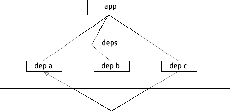
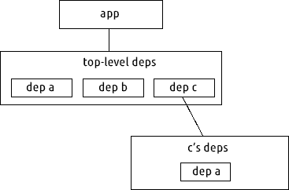
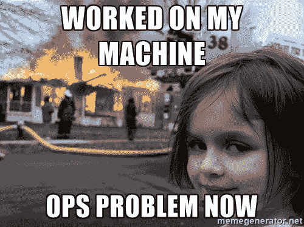

# JavaScript 包管理器如何工作的介绍

> 原文：<https://www.freecodecamp.org/news/javascript-package-managers-101-9afd926add0a/>

阿什莉·威廉姆斯是 Node.js 社区的领导者之一。她在推特上说了一个新的包装经理。

我并不真正理解她的意思，所以我决定深入研究并阅读关于包管理器是如何工作的。

就在这个时候，JavaScript 包管理器块上的新成员——[Yarn](https://yarnpkg.com/)——刚刚出现，并引起了很大的反响。

所以我利用这个机会也了解了【Yarn 如何以及为什么做事情与 npm 不同。

研究这个我很开心。我希望我很久以前就这么做了。所以我写了这篇关于 npm 和 Yarn 的简单介绍来分享我所学到的东西。

让我们从一些定义开始:

#### 什么是包？

包是一个可重用的软件，可以从全局注册表下载到开发人员的本地环境中。每个包可能依赖其他包，也可能不依赖其他包。

#### 什么是包管理器？

简而言之——包管理器是一个软件，它让你管理你的项目需要正确工作的**依赖关系**(你或其他人写的外部代码)。

大多数包管理人员会处理项目的以下部分:

#### **项目代码**

这是您需要管理各种依赖项的项目代码。通常，所有这些代码都被签入到 Git 这样的版本控制系统中。

#### **清单文件**

这是一个记录所有依赖项(要管理的包)的文件。它还包含有关项目的其他元数据。在 JavaScript 世界中，这个文件就是您的`[package.json](https://docs.npmjs.com/files/package.json)`

#### **依赖码**

这段代码构成了你的依赖项。它不应该在应用程序的生命周期中发生变化，并且应该在需要时由内存中的项目代码访问。

#### **锁定文件**

这个文件是由包管理器自己自动编写的。它包含了重新生成完整的依赖关系源树所需的所有信息。它包含有关每个项目依赖项的信息，以及它们各自的版本。

在这一点上值得指出的是，Yarn 使用锁文件，而 npm 不使用。我们稍后会谈到这种区别的后果。

现在我已经向您介绍了包管理器的各个部分，让我们来讨论依赖项本身。

### 平面依赖与嵌套依赖

为了理解平面依赖方案和嵌套依赖方案之间的区别，让我们尝试可视化项目中依赖关系的依赖图。

请记住，您的项目所依赖的依赖项可能有自己的依赖项，这一点很重要。并且这些依赖关系可能又具有一些共同的依赖关系。

为了说明这一点，假设我们的应用程序依赖于依赖项 A、B 和 C，而 C 依赖于 A。

#### **平面依赖关系**

[Dependency graph in case of flat dependencies](http://maxogden.com/nested-dependencies.html)

如图所示，app 和 C 都有一个作为它们的依赖项。对于平面依赖关系模式中的依赖关系解析，您的包管理器只需要遍历一层依赖关系。

长话短说——您的源代码树中只能有一个特定包的版本，因为您的所有依赖项都有一个公共的名称空间。

假设包 A 升级到 2.0 版。如果你的应用程序与 2.0 版本兼容，但是包 C 不兼容，那么我们需要两个版本的包 A 才能让我们的应用程序正常工作。这就是所谓的**依赖地狱。**

#### **嵌套依赖关系**

[Dependency graph in case of nested dependencies](http://maxogden.com/nested-dependencies.html)

处理依赖地狱问题的一个简单解决方案是拥有包 A 的两个不同版本——版本 1.0 和版本 2.0。

这就是嵌套依赖发挥作用的地方。在嵌套依赖关系的情况下，每个依赖关系都可以在不同的名称空间中将自己的依赖关系与其他依赖关系隔离开来。

包管理器需要遍历多个级别来解决依赖关系。

在这样的方案中，我们可以拥有单个依赖项的多个副本。

但是你可能已经猜到了，这也导致了一些问题。如果我们添加另一个包—包 D —并且它也依赖于包 A 的 1.0 版本，该怎么办？

因此，使用这种方案，我们可以以包 a 的 1.0 版本的**副本**结束。这可能会导致混乱，并占用不必要的磁盘空间。

上述问题的一个解决方案是拥有包 A 的两个版本，1.0 版和 2.0 版，但是为了避免不必要的重复，只有 1.0 版的一个副本。这是 npm v3 采用的[方法，它大大减少了遍历依赖树的时间。](https://docs.npmjs.com/how-npm-works/npm3-dupe)

正如 ashley williams 解释的那样， [npm v2 以嵌套的方式安装依赖关系](https://docs.npmjs.com/how-npm-works/npm2)。这就是为什么 npm v3 相比之下要快得多。

### **决定论与非决定论**

包管理器中的另一个重要概念是决定论。在 JavaScript 生态系统的上下文中，确定性意味着所有具有给定`package.json`文件的计算机都将在它们的`node_modules`文件夹中安装完全相同的依赖关系源树。

但是对于非确定性的包管理器，这是不能保证的。即使在两台不同的计算机上有完全相同的`package.json`，它们之间的`node_modules`布局也可能不同。

决定论是可取的。它可以帮助你避免**“在我的机器上工作正常，但在我们部署时坏了”**问题，当你在不同的计算机上有不同的`node_modules`时就会出现这种问题。

This popular developer meme illustrates the problems with non-determinism.

默认情况下，npm v3 具有非确定性安装，并提供了一个[收缩特性](https://docs.npmjs.com/cli/shrinkwrap)来使安装具有确定性。这会将磁盘上的所有包及其各自的版本写入一个锁定文件。

Yarn 提供了确定性安装，因为它使用一个锁文件在应用程序级别递归地锁定所有依赖项。所以如果包 A 依赖于包 C 的 1.0 版，包 B 依赖于包 A 的 2.0 版，那么这两个包都会被单独写入到 lockfile 中。

当您知道您正在处理的依赖项的确切版本时，您可以轻松地重现构建，然后跟踪并隔离 bug。

> “说得更清楚一点，你的`package.json`陈述了项目的**“我想要什么”**，而你的锁定文件根据依赖项陈述了**“我拥有什么”**。丹·阿布拉莫夫

所以现在我们可以回到最初让我开始疯狂学习的那个问题:**为什么为应用程序设置锁文件被认为是一个好的实践，而不是为库设置锁文件？**

主要原因是您实际上部署了应用程序。因此，您需要确定性的依赖关系，从而在不同的环境中——测试、试运行和生产环境中——产生可重复的构建。

但对于图书馆来说，情况并非如此。库未部署。它们用于构建其他库，或者应用程序本身。库需要灵活，这样它们才能最大化兼容性。

如果我们在应用程序中使用的每个依赖项(库)都有一个锁文件，并且应用程序被迫遵守这些锁文件，那么就不可能接近我们之前谈到的具有[语义版本](http://semver.org/)灵活性的平面依赖结构，这是依赖项解决方案的最佳情况。

原因如下:如果您的应用程序必须递归地遵循所有依赖项的锁文件，那么将会到处都是版本冲突——即使是在相对较小的项目中。由于[语义版本](https://docs.npmjs.com/getting-started/semantic-versioning)，这将导致大量不可避免的重复。

这并不是说库不能有锁文件。他们当然可以。但是主要的问题是，像 Yarn 和 npm 这样使用这些库的包管理器不会考虑这些锁文件。

感谢阅读！如果你认为这篇文章是有用的，请点击“︎❤”来帮助推广这篇文章给他人。

