# 40 个面向初学者的 JavaScript 项目——开始编写 JS 的简单方法

> 原文：<https://www.freecodecamp.org/news/javascript-projects-for-beginners/>

学习一门新编程语言的最好方法是构建项目。

我用普通 JavaScript、React 和 TypeScript 创建了一个 40 个初学者友好项目教程的列表。

我对教程的建议是观看视频，构建项目，分解它，然后用你自己的方式重新构建它。尝试添加新功能或使用不同的方法。

这将测试你是否真的学会了这些概念。

你可以点击下面列出的任何一个项目，跳转到文章的那个部分。

## 普通 JavaScript 项目

1.  [如何创建颜色翻板](#how-to-create-a-color-flipper)
2.  [如何创建计数器](#how-to-create-a-counter)
3.  [如何创建评论转盘](#how-to-create-a-review-carousel)
4.  [如何创建响应式导航条](#how-to-create-a-responsive-navbar)
5.  [如何创建侧边栏](#how-to-create-a-sidebar)
6.  [如何创建模态](#how-to-create-a-modal)
7.  [如何创建常见问题页面](#how-to-create-a-faq-page)
8.  [如何创建餐厅菜单页面](#how-to-create-a-restaurant-menu-page)
9.  [如何创建视频背景](#how-to-create-a-video-background)
10.  [如何在滚动条上创建导航栏](#how-to-create-a-navigation-bar-on-scroll)
11.  [如何创建显示不同内容的标签](#how-to-create-tabs-that-display-different-content)
12.  [如何创建倒计时钟](#how-to-create-a-countdown-clock)
13.  [如何创建自己的 Lorem ipsum](#how-to-create-your-own-lorem-ipsum)
14.  [如何创建购物清单](#how-to-create-a-grocery-list)
15.  [如何创建图像滑块](#how-to-create-an-image-slider)
16.  [如何创建石头剪刀布游戏](#how-to-create-a-rock-paper-scissors-game)
17.  [如何创建一个西蒙游戏](#how-to-create-a-simon-game)
18.  [如何创建一个平台游戏](#how-to-create-a-platformer-game)
19.  [如何创建涂鸦跳转](#how-to-create-doodle-jump-and-flappy-bird)
20.  [如何制作 Flappy Bird](#how-to-create-doodle-jump-and-flappy-bird)
21.  [如何创建记忆游戏](#how-to-create-seven-classic-games-with-ania-kubow)
22.  [如何创建打地鼠游戏](#how-to-create-seven-classic-games-with-ania-kubow)
23.  [如何创建连接四个游戏](#how-to-create-seven-classic-games-with-ania-kubow)
24.  [如何创建贪吃蛇游戏](#how-to-create-seven-classic-games-with-ania-kubow)
25.  [如何创建一个太空入侵者游戏](#how-to-create-seven-classic-games-with-ania-kubow)
26.  [如何制作青蛙过河游戏](#how-to-create-seven-classic-games-with-ania-kubow)
27.  [如何制作俄罗斯方块游戏](#how-to-create-seven-classic-games-with-ania-kubow)

## 反应项目

1.  [如何使用 React 挂钩构建井字游戏](#how-to-build-a-tic-tac-toe-game-using-react-hooks)
2.  [如何使用 React 钩子构建俄罗斯方块游戏](#how-to-build-a-tetris-game-using-react-hooks)
3.  [如何创建生日提醒 App](#how-to-create-a-birthday-reminder-app)
4.  [如何创建旅游页面](#how-to-create-a-tours-page)
5.  [如何创建折叠式菜单](#how-to-create-an-accordion-menu)
6.  [如何为投资组合页面创建选项卡](#how-to-create-tabs-for-a-portfolio-page)
7.  [如何创建评论滑块](#how-to-create-a-review-slider)
8.  [如何创建颜色生成器](#how-to-create-a-color-generator)
9.  [如何创建条纹支付菜单页面](#how-to-create-a-stripe-payment-menu-page)
10.  [如何创建购物车页面](#how-to-create-a-shopping-cart-page)
11.  [如何创建鸡尾酒搜索页面](#how-to-create-a-cocktail-search-page)

## TypeScript 项目

1.  [如何用 React 和 TypeScript 构建一个测验应用](#how-to-build-a-quiz-app-with-react-and-typescript)
2.  [如何用 TypeScript 创建 Arkanoid 游戏](#how-to-create-an-arkanoid-game-with-typescript)

## 普通 JavaScript 项目

如果你没有学过 JavaScript 基础知识，那么我建议你在继续项目之前先看一下[这门课](https://www.youtube.com/watch?v=PkZNo7MFNFg)。

下面[的截图很多都是出自这里](https://www.vanillajavascriptprojects.com/)。

### 如何创建一个彩色脚蹼

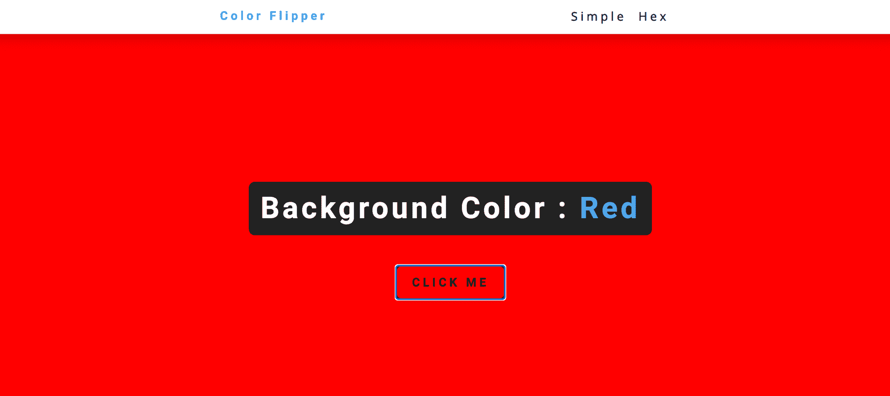

在这个 [John Smilga 教程](https://www.youtube.com/watch?v=3PHXvlpOkf4&t=421s)中，你将学习如何创建一个随机的背景颜色改变器。这是一个让您开始使用 DOM 的好项目。

在莱昂纳多·马尔多纳多关于为什么学习 DOM 很重要的文章中，他说:

> 通过操纵 DOM，你有无限的可能性。您可以创建无需刷新即可更新页面数据的应用程序。此外，您可以创建可由用户自定义的应用程序，然后无需刷新即可更改页面布局。

涵盖的主要概念:

*   数组
*   document.getElementById()
*   document.querySelector()
*   addEventListener()
*   document . body . style . background 颜色
*   Math.floor()
*   Math.random()
*   数组.长度

在你开始之前，我建议你先看一下[简介](https://www.youtube.com/watch?v=3PHXvlpOkf4&t=0s)，约翰在那里讲述了如何访问他所有项目的安装文件。

### 如何创建计数器

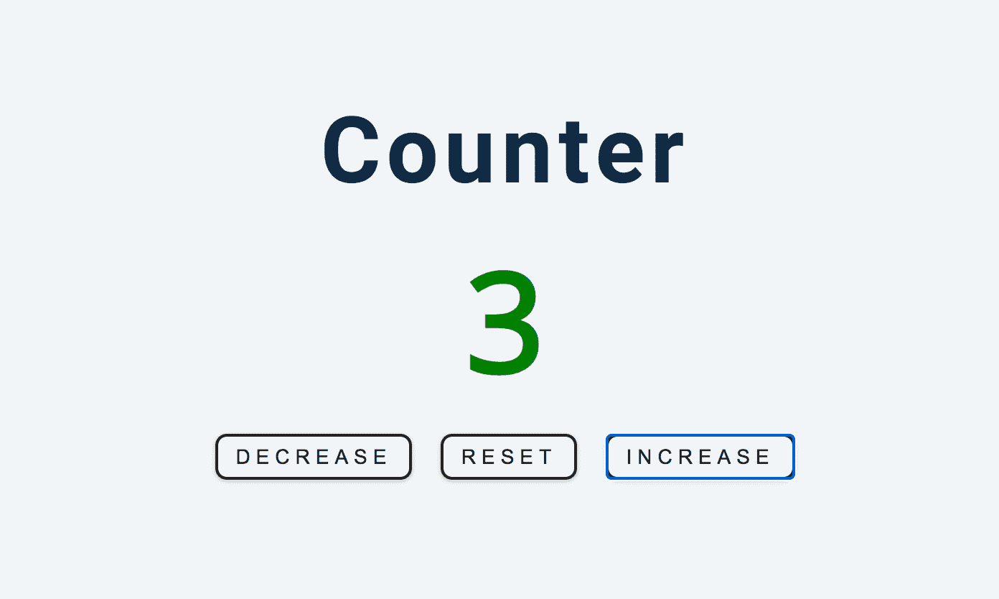

在这个 John Smilga [教程](https://www.youtube.com/watch?v=3PHXvlpOkf4&t=1825s)中，你将学习如何创建一个计数器，并编写根据显示的正数或负数改变颜色的条件。

这个项目会给你更多使用 DOM 的练习，你可以在其他项目中使用这个简单的计数器，比如番茄钟。

涵盖的主要概念:

*   document.querySelectorAll()
*   forEach()
*   addEventListener()
*   当前目标属性
*   优等生名单
*   文本内容

### 如何创建审阅转盘

在这个[教程](https://www.youtube.com/watch?v=3PHXvlpOkf4&t=2644s)中，你将学习如何用一个生成随机评论的按钮来创建一个评论转盘。

这是一个很好的功能，可以在电子商务网站上显示客户评论，或者在个人作品集上显示客户评论。

涵盖的主要概念:

*   目标
*   DOMContentLoaded
*   addEventListener()
*   数组.长度
*   文本内容

### 如何创建一个响应式导航条

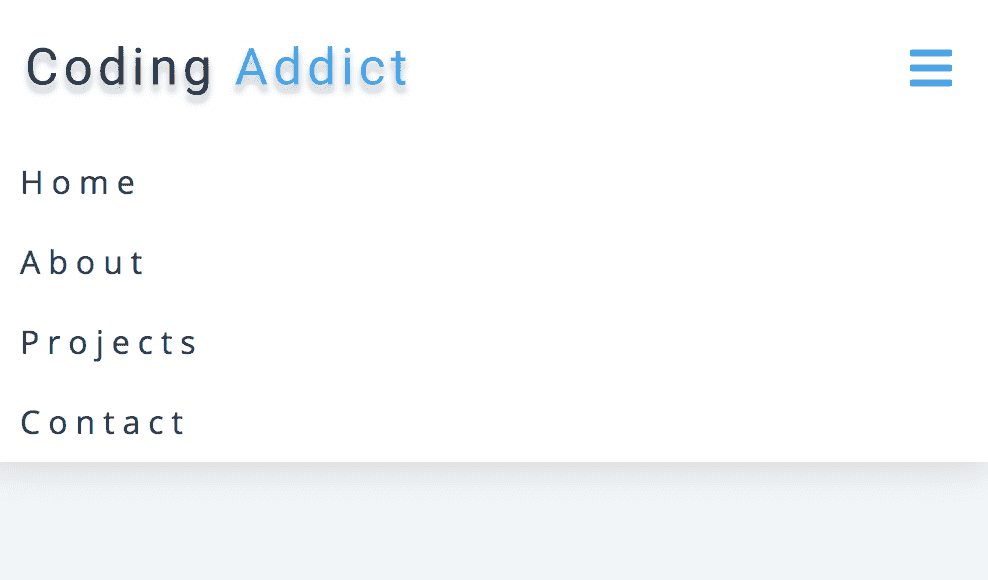

在这个[教程](https://www.youtube.com/watch?v=3PHXvlpOkf4&t=4289s)中，你将学习如何创建一个响应式导航条，为小型设备显示汉堡菜单。

学习如何开发响应式网站是 web 开发人员的重要组成部分。这是一个在很多网站上使用的流行功能。

涵盖的主要概念:

*   document.querySelector()
*   addEventListener()
*   classList.toggle()

### 如何创建侧边栏

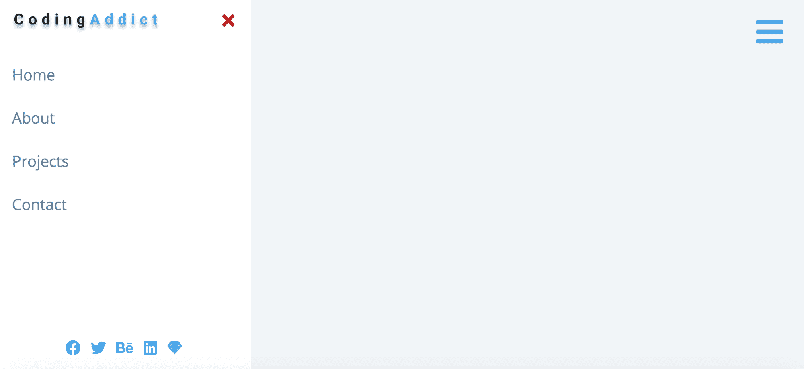

在这个[教程](https://www.youtube.com/watch?v=3PHXvlpOkf4&t=5181s)中，你将学习如何创建一个带动画的侧边栏。

这是一个很酷的功能，你可以添加到你的个人网站。

涵盖的主要概念:

*   document.querySelector()
*   addEventListener()
*   classList.toggle()
*   classList.remove()

### 如何创建模态

在本[教程](https://www.youtube.com/watch?v=3PHXvlpOkf4&t=5943s)中，你将学习如何在网站上创建一个模态窗口来让用户做或看到一些特定的事情。

模式窗口的一个很好的例子是，如果用户在站点中做了更改而没有保存，并试图转到另一个页面。您可以创建一个模式窗口，警告他们保存更改，否则信息将会丢失。

涵盖的主要概念:

*   document.querySelector()
*   addEventListener()
*   classList.add()
*   classList.remove()

### 如何创建常见问题页面

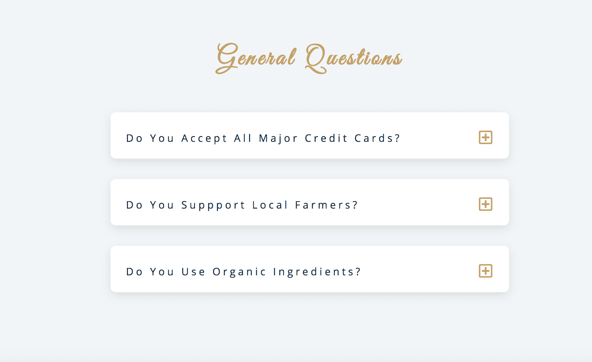

在本[教程](https://www.youtube.com/watch?v=3PHXvlpOkf4&t=6506s)中，您将学习如何创建一个常见问题页面，向用户介绍一项业务，并通过有机搜索结果增加网站流量。

涵盖的主要概念:

*   document.querySelectorAll()
*   addEventListener()
*   forEach()
*   classList.remove()
*   classList.toggle()

### 如何创建餐厅菜单页面

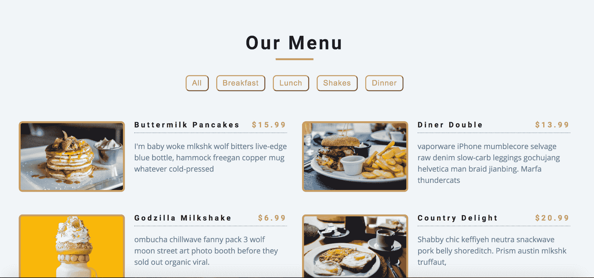

在这个[教程](https://www.youtube.com/watch?v=3PHXvlpOkf4&t=8185s)中，你将学习如何制作一个过滤不同食物菜单的餐馆菜单页面。这是一个有趣的项目，将教你像映射，减少，过滤高阶函数。

在 Yazeed Bzadough 关于高阶函数的文章中，他指出:

> HOFs 的最大好处是更大的可重用性。

涵盖的主要概念:

*   数组
*   目标
*   forEach()
*   DOMContentLoaded
*   映射、减少和过滤
*   innerHTML
*   包括方法

### 如何创建视频背景

在这个[教程](https://www.youtube.com/watch?v=3PHXvlpOkf4&t=11773s)中，你将学习如何制作一个具有播放和暂停功能的视频背景。这是很多网站的共同特征。

涵盖的主要概念:

*   document.querySelector()
*   addEventListener()
*   classList.contains()
*   classList.add()
*   classList.remove()
*   播放()
*   暂停()

### 如何在滚动条上创建导航栏

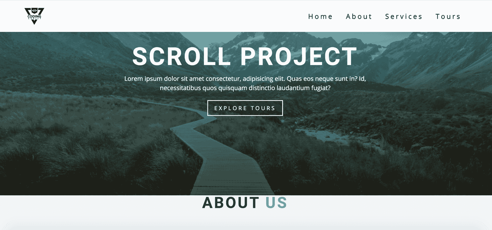

在本[教程](https://www.youtube.com/watch?v=3PHXvlpOkf4&t=12765s)中，你将学习如何创建一个导航条，当滚动时向下滑动，然后停留在某个高度的固定位置。

这是许多专业网站上的一个流行功能。

涵盖的主要概念:

*   document.getElementById()
*   getFullYear()
*   getBoundingClientRect()
*   切片法
*   window.scrollTo()

### 如何创建显示不同内容的选项卡

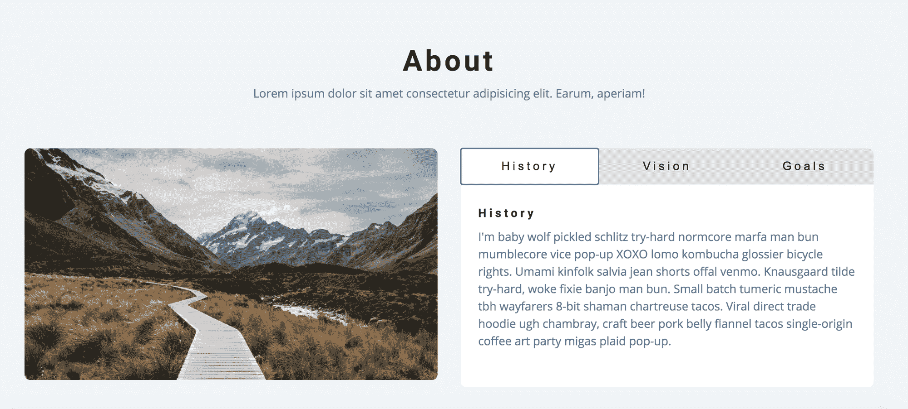

在本[教程](https://www.youtube.com/watch?v=3PHXvlpOkf4&t=16575s)中，你将学习如何创建显示不同内容的选项卡，这在创建单页应用程序时很有用。

涵盖的主要概念:

*   classList.add()
*   classList.remove()
*   forEach()
*   addEventListener()

### 如何创建倒计时钟

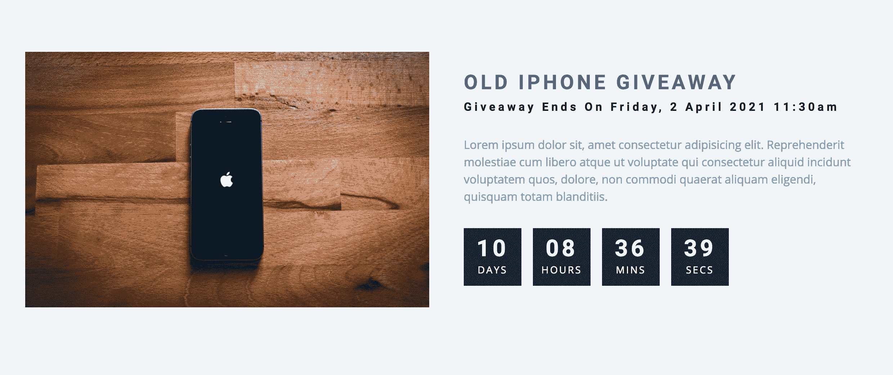

在本[教程](https://www.youtube.com/watch?v=3PHXvlpOkf4&t=17933s)中，你将学习如何制作一个倒计时钟，当一个电子商务网站上的新产品即将推出或销售即将结束时可以使用。

涵盖的主要概念:

*   getFullYear()
*   getMonth()
*   getDate()
*   Math.floor()
*   setInterval()
*   clearInterval()

### 如何创建自己的 Lorem ipsum

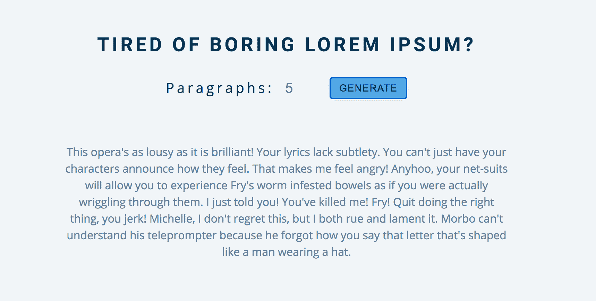

在本[教程](https://www.youtube.com/watch?v=3PHXvlpOkf4&t=21395s)中，您将学习如何创建自己的 Lorem ipsum 生成器。

Lorem ipsum 是网站的首选占位符文本。这是一个有趣的项目，展示你的创造力，创造自己的文字。

涵盖的主要概念:

*   parseInt()
*   Math.floor()
*   Math.random()
*   isNaN()
*   切片法
*   event.preventDefault()

### 如何创建购物清单

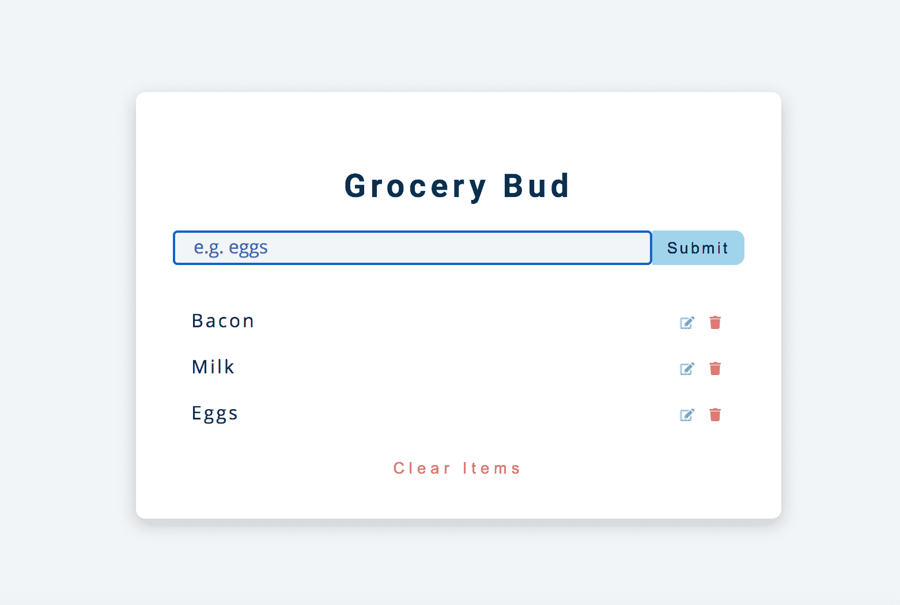

在本[教程](https://www.youtube.com/watch?v=3PHXvlpOkf4&t=22703s)中，您将学习如何从购物清单中更新和删除商品，并创建一个简单的 CRUD(创建、读取、更新和删除)应用程序。

CRUD 在开发全栈应用中起着非常重要的作用。没有它，你就不能在你最喜欢的社交媒体平台上编辑或删除帖子。

涵盖的主要概念:

*   DOMContentLoaded
*   新日期()
*   createAttribute()
*   setAttributeNode()
*   appendChild()
*   过滤器()
*   地图()

### 如何创建图像滑块

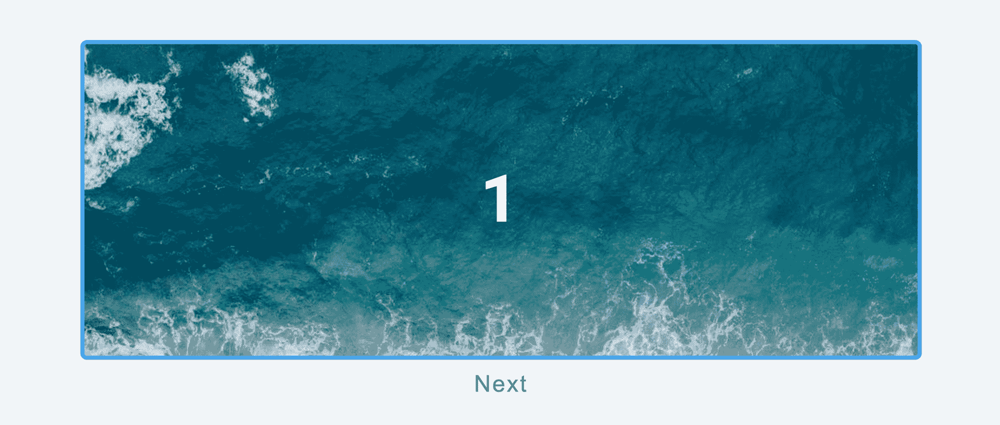

在这个[教程](https://www.youtube.com/watch?v=3PHXvlpOkf4&t=28874s)中，你将学习如何构建一个可以添加到任何网站的图片滑块。

涵盖的主要概念:

*   querySelectorAll()
*   addEventListener()
*   forEach()
*   if/else 语句

### 如何创建一个石头剪刀布游戏

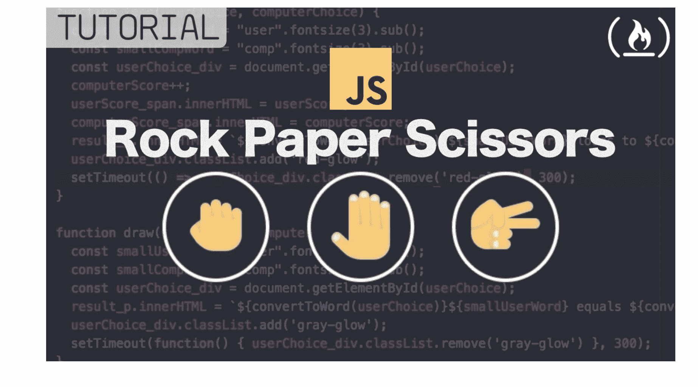

在本[教程](https://www.youtube.com/watch?v=jaVNP3nIAv0)中，丹津将教你如何创建一个石头剪刀布游戏。这是一个有趣的项目，将提供更多使用 DOM 的实践。

涵盖的主要概念:

*   addEventListener()
*   Math.floor()
*   Math.random()
*   switch 语句

### 如何创建一个西蒙游戏

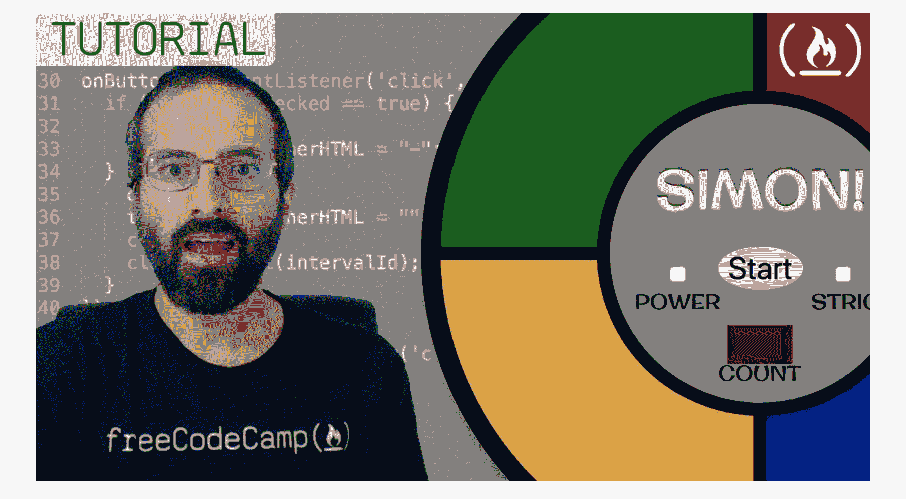

在本[教程](https://www.youtube.com/watch?v=n_ec3eowFLQ)中，博·卡恩斯将教你如何创建经典的西蒙游戏。这是一个很好的项目，它将让你思考游戏背后的不同组件，以及你将如何构建这些功能。

涵盖的主要概念:

*   查询选择器()
*   addEventListener()
*   setInterval()
*   clearInterval()
*   setTimeout()
*   播放()
*   Math.floor()
*   Math.random()

### 如何创建一个平台游戏

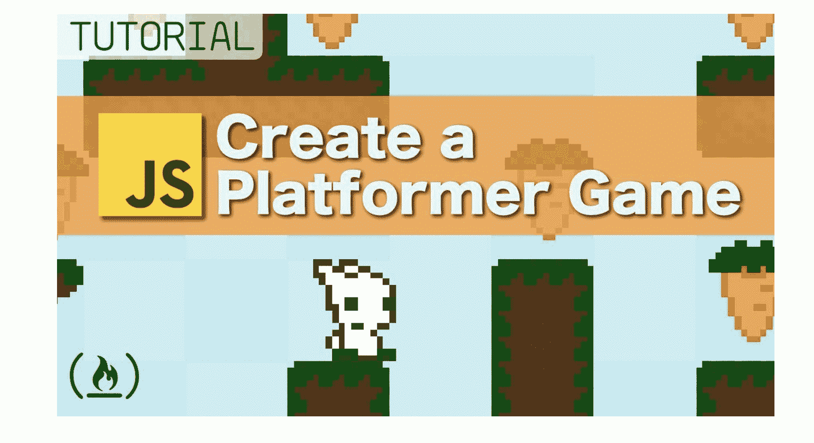

在这个[教程](https://www.youtube.com/watch?v=w-OKdSHRlfA)中，Frank Poth 将教你如何构建一个平台游戏。这个项目将向你介绍面向对象的编程原则和模型，视图，控制器软件模式。

涵盖的主要概念:

*   这个关键字
*   for 循环
*   switch 语句
*   OOP 原则
*   MVC 模式
*   画布 API

### 如何创建涂鸦跳跃和 Flappy 鸟

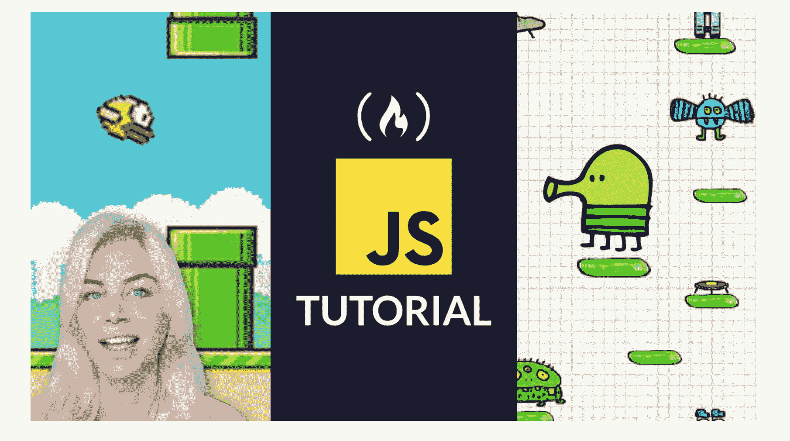

在这个[视频系列](https://www.youtube.com/watch?v=8xPsg6yv7TU&t=0s)中，Ania Kubow 将教你如何建造[嘟嘟跳](https://www.youtube.com/watch?v=8xPsg6yv7TU&t=114s)和 [Flappy Bird](https://www.youtube.com/watch?v=8xPsg6yv7TU&t=3102s) 。

构建游戏是学习更多 JavaScript 知识的一种有趣方式，将涵盖许多流行的 JavaScript 方法。

涵盖的主要概念:

*   createElement()
*   forEach()
*   setInterval()
*   clearInterval()
*   removeChild()
*   appendChild()
*   addEventListener()
*   removeEventListener()

### 如何用 Ania Kubow 打造七款经典游戏

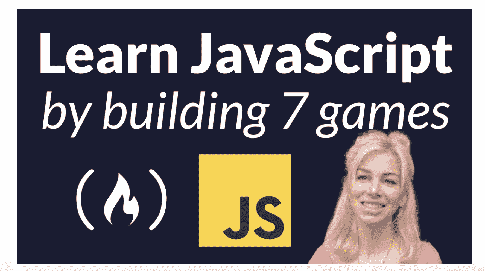

在 Ania Kubow 的[课程](https://www.youtube.com/watch?v=lhNdUVh3qCc)中，你将会非常开心地创建七个游戏:

1.  [记忆游戏](https://www.youtube.com/watch?v=lhNdUVh3qCc&t=115s)
2.  [打地鼠](https://www.youtube.com/watch?v=lhNdUVh3qCc&t=699s)
3.  [连接四个](https://www.youtube.com/watch?v=lhNdUVh3qCc&t=1187s)
4.  [蛇](https://www.youtube.com/watch?v=lhNdUVh3qCc&t=1657s)
5.  [太空入侵者](https://www.youtube.com/watch?v=lhNdUVh3qCc&t=2590s)
6.  蛙人
7.  [俄罗斯方块](https://www.youtube.com/watch?v=lhNdUVh3qCc&t=4778s)

涵盖的主要概念:

*   对于循环
*   onclick 事件
*   箭头功能
*   排序()
*   流行()
*   未移位()
*   推送()
*   indexOf()
*   包括()
*   拼接()
*   concat()

## 反应项目

如果您不熟悉 React 基础知识，那么我建议您在继续项目之前先学习[这门课程](https://www.youtube.com/watch?v=4UZrsTqkcW4)。

### 如何使用 React 钩子构建井字游戏

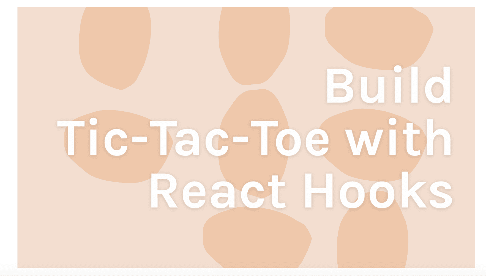

在这篇 [freeCodeCamp 文章](https://www.freecodecamp.org/news/learn-how-to-build-tic-tac-toe-with-react-hooks/)中，Per Harald Borgen 谈到了由 Thomas Weibenfalk 领导的 Scrimba 井字游戏教程。你可以在 Scimba 的 YouTube 频道上观看[的视频课程](https://www.youtube.com/watch?v=Z5RbPrK4VqM)。

这是一个开始熟悉 React 基础知识和使用钩子的好项目。

涵盖的主要概念:

*   useState()
*   进口/出口
*   JSX

### 如何使用 React 钩子构建俄罗斯方块游戏

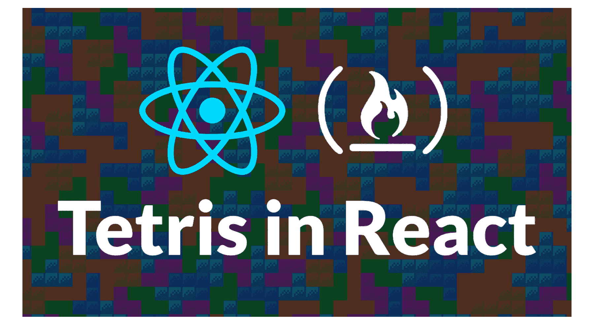

在这个[教程](https://www.youtube.com/watch?v=ZGOaCxX8HIU)中，Thomas Weibenfalk 将教你如何使用 React 钩子和样式化组件构建一个俄罗斯方块游戏。

涵盖的主要概念:

*   useState()
*   useEffect()
*   useRef()
*   useCallback()
*   样式组件

### 如何创建生日提醒应用程序

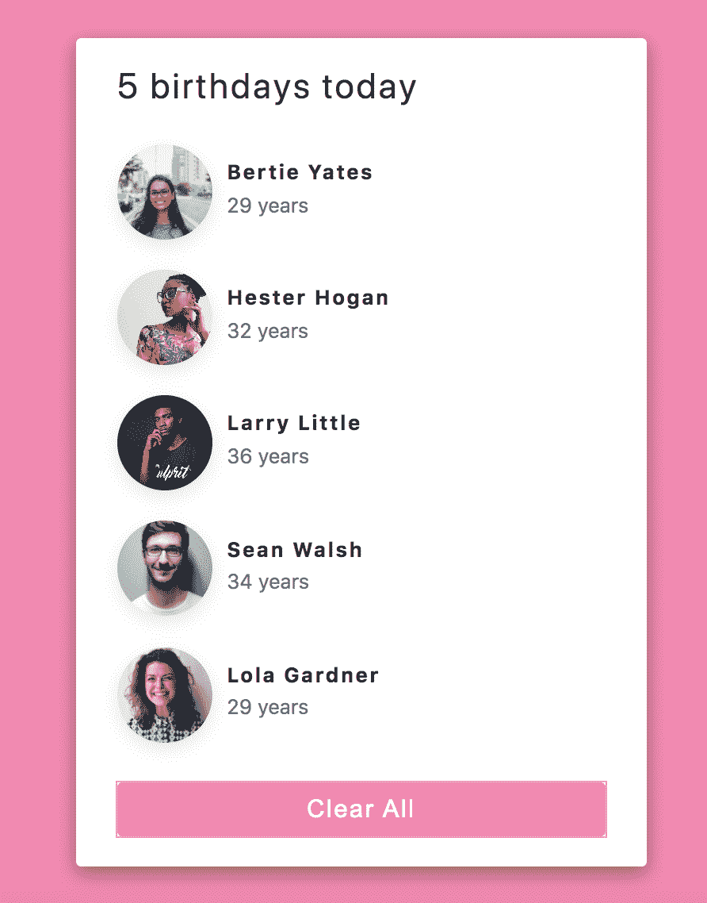

Screenshot from [https://react-projects.netlify.app/](https://react-projects.netlify.app/)

在本 [John Smilga 课程中，](https://www.youtube.com/watch?v=a_7Z7C_JCyo&t=438s)您将学习如何创建生日提醒应用程序。这是一个开始熟悉 React 基础知识和使用钩子的好项目。

我还建议观看这个项目启动文件上的约翰的视频。

涵盖的主要概念:

*   useState()
*   进口/出口
*   JSX
*   地图()

### 如何创建游览页面

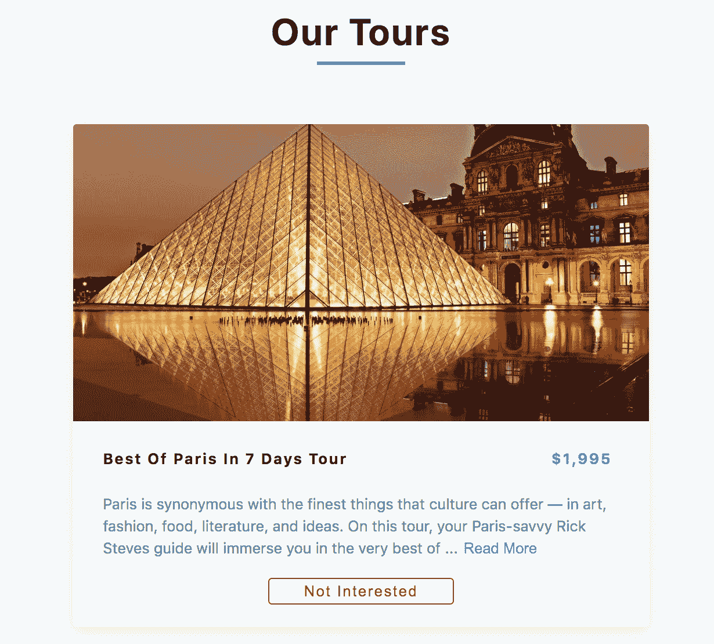

Screenshot from [https://react-projects.netlify.app/](https://react-projects.netlify.app/)

在本[教程](https://www.youtube.com/watch?v=a_7Z7C_JCyo&t=1181s)中，您将学习如何创建一个游览页面，用户可以在其中删除他们不感兴趣的游览。

这将让您练习 React 挂钩和 async/await 模式。

涵盖的主要概念:

*   尝试...catch 语句
*   异步/等待模式
*   useEffect()
*   useState()

### 如何创建折叠菜单

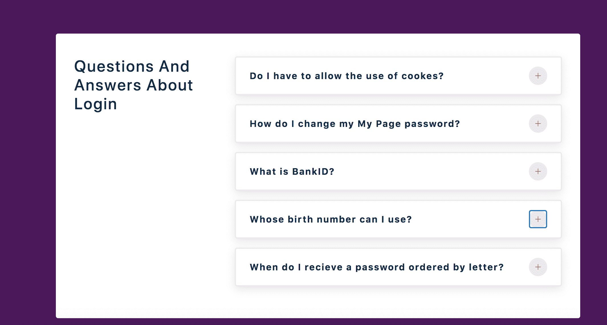

Screenshot from [https://react-projects.netlify.app/](https://react-projects.netlify.app/)

在这个[教程](https://www.youtube.com/watch?v=a_7Z7C_JCyo&t=4642s)中，你将学习如何创建一个问答折叠菜单。这些菜单有助于以渐进的方式向用户展示内容。

涵盖的主要概念:

*   反应图标
*   useState()
*   地图()

### 如何为投资组合页面创建选项卡

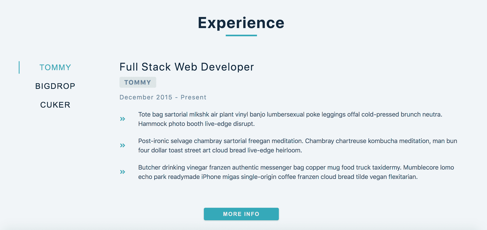

Screenshot from [https://react-projects.netlify.app/](https://react-projects.netlify.app/)

在这个[教程](https://www.youtube.com/watch?v=a_7Z7C_JCyo&t=6726s)中，你将学习如何为一个模拟作品集页面创建标签。当您希望在单页应用程序中显示不同的内容时，选项卡非常有用。

涵盖的主要概念:

*   异步/等待模式
*   反应图标
*   useEffect()
*   useState()

### 如何创建审阅滑块

Screenshot from [https://react-projects.netlify.app/](https://react-projects.netlify.app/)

在这个[教程](https://www.youtube.com/watch?v=a_7Z7C_JCyo&t=8020s)中，你将学习如何创建一个评论滑块，每隔几秒钟就会变成一个新的评论。

这是一个很酷的功能，你可以纳入电子商务网站或投资组合。

涵盖的主要概念:

*   反应图标
*   useEffect()
*   useState()
*   地图()

### 如何创建颜色生成器

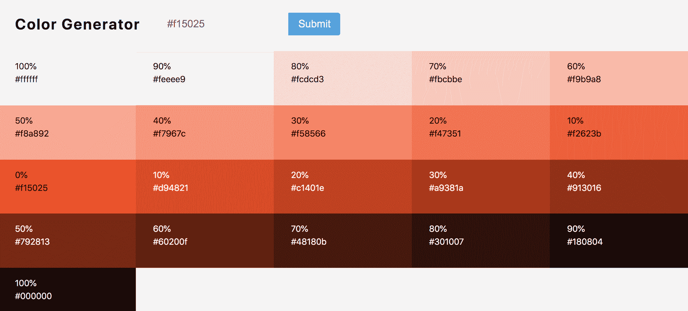

Screenshot from [https://react-projects.netlify.app/](https://react-projects.netlify.app/)

在这个[教程](https://www.youtube.com/watch?v=a_7Z7C_JCyo&t=11329s)中，你将学习如何创建一个颜色生成器。这是一个继续练习使用钩子和 setTimeout 的好项目。

涵盖的主要概念:

*   setTimeout()
*   clearTimeout()
*   useEffect()
*   useState()
*   尝试...catch 语句
*   event.preventDefault()

### 如何创建条纹支付菜单页面

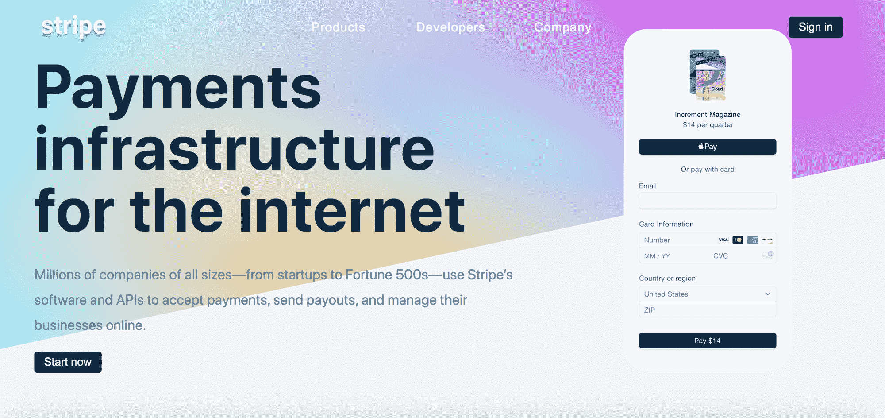

Screenshot from [https://react-projects.netlify.app/](https://react-projects.netlify.app/)

在本[教程](https://www.youtube.com/watch?v=a_7Z7C_JCyo&t=20686s)中，你将学习如何创建条纹支付菜单页面。这个项目将为您提供如何使用 React 组件设计产品登录页面的良好实践。

涵盖的主要概念:

*   反应图标
*   useRef()
*   useEffect()
*   useState()
*   useContext()

### 如何创建购物车页面

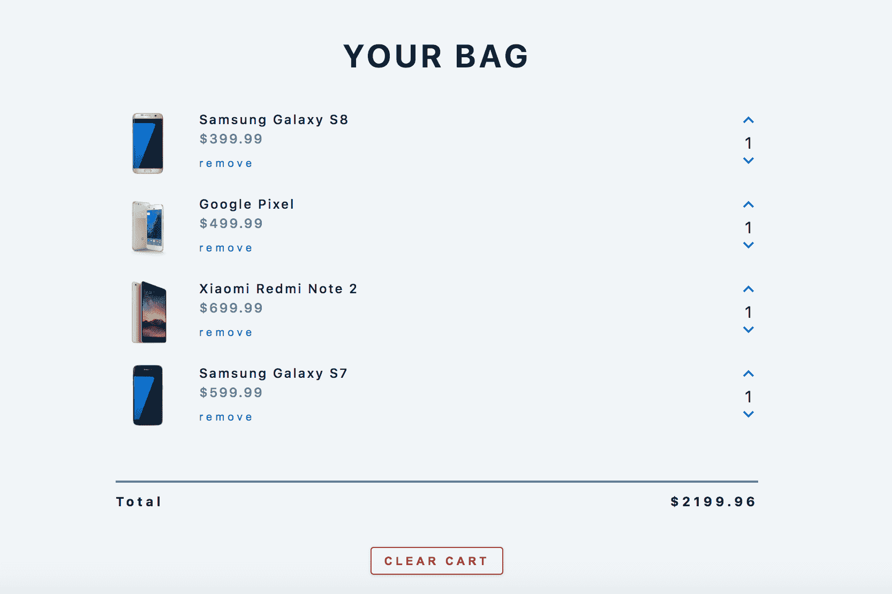

Screenshot from [https://react-projects.netlify.app/](https://react-projects.netlify.app/)

在本[教程](https://www.youtube.com/watch?v=a_7Z7C_JCyo&t=24115s)中，您将学习如何创建一个更新和删除商品的购物车页面。这个项目也将是对 useReducer 钩子的一个很好的介绍。

涵盖的主要概念:

*   地图()
*   过滤器()
*   `<svg>`元素
*   useReducer()
*   useContext()

### 如何创建鸡尾酒搜索页面

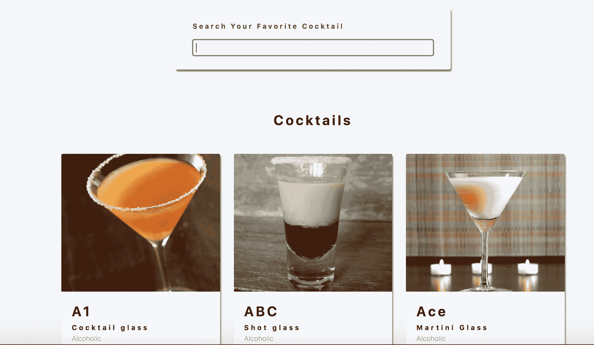

Screenshot from [https://react-projects.netlify.app/](https://react-projects.netlify.app/)

在本[教程](https://www.youtube.com/watch?v=a_7Z7C_JCyo&t=27597s)中，你将学习如何创建鸡尾酒搜索页面。这个项目将向你介绍如何使用 React 路由器。

React router 使您能够在网站上创建导航，并更改不同组件的视图，如“关于”或“联系”页面。

涵盖的主要概念:

*   `<Router>`
*   `<Switch>`
*   useCallback()
*   useContext()
*   useEffect()
*   useState()

## TypeScript 项目

如果你对 TypeScript 不熟悉，那么我建议你在继续这个项目之前先看一下这个课程。

### 如何使用 React 和 TypeScript 构建测验应用程序

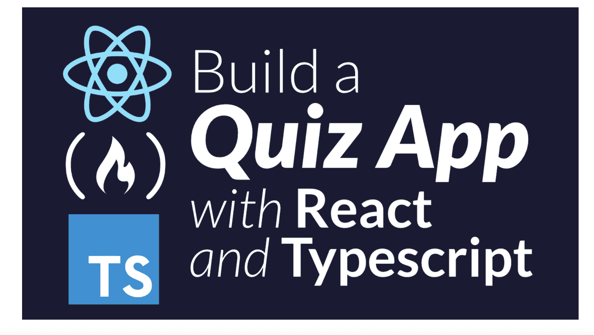

在本[教程](https://www.youtube.com/watch?v=F2JCjVSZlG0)中，Thomas Weibenfalk 将教你如何用 React 和 TypeScript 构建一个问答 app。这是练习 TypeScript 基础知识的好机会。

涵盖的主要概念:

*   做出反应。足球俱乐部
*   样式组件
*   危险的

### 如何用 TypeScript 创建一个 Arkanoid 游戏

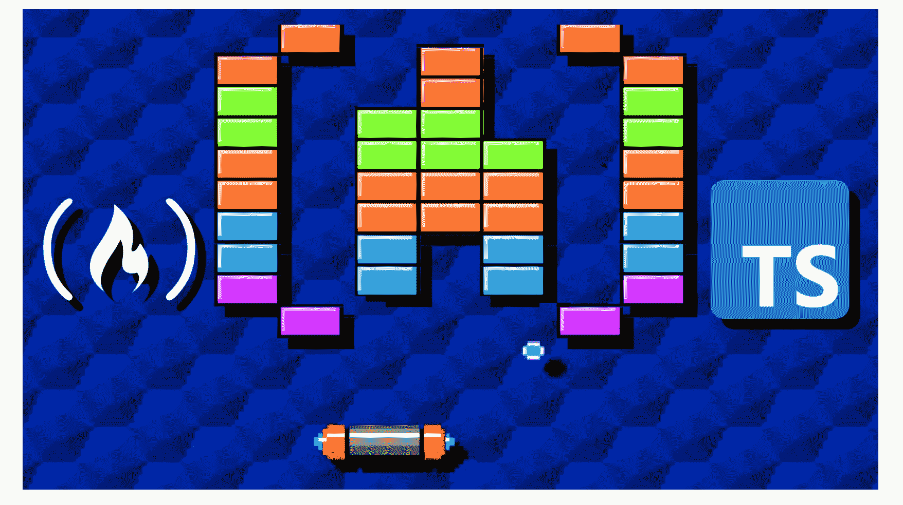

在本[教程](https://www.youtube.com/watch?v=7bejSTim38A)中，Thomas Weibenfalk 将教你如何用 TypeScript 构建经典的 Arkanoid 游戏。这是一个很好的项目，它将让您练习使用 TypeScript 的基本概念。

涵盖的主要概念:

*   类型
*   班级
*   模块
*   htmlcanvaselemont

我希望你喜欢这份包含 40 个普通 JavaScript、React 和 TypeScript 项目教程的列表。

编码快乐！