# JavaScript 承诺教程——如何解决或拒绝 JS 中的承诺

> 原文：<https://www.freecodecamp.org/news/javascript-promise-tutorial-how-to-resolve-or-reject-promises-in-js/>

在 JavaScript 中，是异步操作的重要组成部分。你可能认为承诺不容易理解、学习和运用。相信我，你并不孤单！

对许多网络开发者来说，承诺是具有挑战性的，即使在与他们共事多年之后。

In this article, I want to try to change that perception while sharing what I've learned about JavaScript Promises over the last few years. Hope you find it useful.

# JavaScript 中的承诺是什么？

一个`Promise`是一个特殊的 JavaScript 对象。在一个`asynchronous`(又名异步)操作成功完成后，它产生一个值，或者如果由于超时、网络错误等原因没有成功完成，它产生一个错误。

成功的调用由`resolve`函数调用指示，错误由`reject`函数调用指示。

您可以使用 promise 构造函数创建一个承诺，如下所示:

```
let promise = new Promise(function(resolve, reject) {    
    // Make an asynchronous call and either resolve or reject
});
```

在大多数情况下，承诺可以用于异步操作。但是，从技术上来说，您可以在同步和异步操作上解析/拒绝。

# 等等，我们不是有异步操作的`callback`函数吗？

哦，太好了！没错。JavaScript 中有`callback`函数。但是，回调在 JavaScript 中并不是一件特别的事情。这是一个常规函数，在一个`asynchronous`调用完成后产生结果(有成功/错误)。

“异步”这个词意味着某事发生在未来，而不是现在。通常，回调只在做网络调用、上传/下载、与数据库对话等事情时使用。

虽然有帮助，但也有巨大的负面影响。有时，我们可能在另一个回调中有一个回调，而在另一个回调中又有一个回调，依此类推。我是认真的！让我们用一个例子来理解这个“回调地狱”。

## 如何避免回调地狱——pizza hub 示例

我们点一份蔬菜玛格丽塔披萨吧🍕从比萨店。当我们下单时，PizzaHub 会自动检测我们的位置，找到附近的披萨店，并找到我们要的披萨是否有货。

如果可以的话，它会检测我们在披萨上免费得到的饮料种类，最后，它会下订单。

如果订单成功，我们会收到一条确认消息。

那么我们如何使用回调函数来编码呢？我想到了这样的东西:

```
function orderPizza(type, name) {

    // Query the pizzahub for a store
    query(`/api/pizzahub/`, function(result, error){
       if (!error) {
           let shopId = result.shopId;

           // Get the store and query pizzas
           query(`/api/pizzahub/pizza/${shopid}`, function(result, error){
               if (!error) {
                   let pizzas = result.pizzas;

                   // Find if my pizza is availavle
                   let myPizza = pizzas.find((pizza) => {
                       return (pizza.type===type && pizza.name===name);
                   });

                   // Check for the free beverages
                   query(`/api/pizzahub/beverages/${myPizza.id}`, function(result, error){
                       if (!error) {
                           let beverage = result.id;

                           // Prepare an order
                           query(`/api/order`, {'type': type, 'name': name, 'beverage': beverage}, function(result, error){
                              if (!error) {
                                  console.log(`Your order of ${type} ${name} with ${beverage} has been placed`);
                              } else {
                                  console.log(`Bad luck, No Pizza for you today!`);
                              }
                           });

                       }
                   })
               }
           });
       } 
    });
}

// Call the orderPizza method
orderPizza('veg', 'margherita');
```

让我们仔细看看上面代码中的`orderPizza`函数。

它调用一个 API 来获取附近披萨店的 id。之后，它会获取该餐厅中可用的披萨列表。它检查我们请求的比萨饼是否被找到，并发出另一个 API 调用来查找该比萨饼的饮料。最后，订单 API 下订单。

这里我们为每个 API 调用使用一个回调。这导致我们在前一个回调函数中使用另一个回调函数，依此类推。

这意味着我们进入了我们称之为`Callback Hell`的东西。谁想要那个？它还形成了一个代码金字塔，不仅令人困惑，而且容易出错。

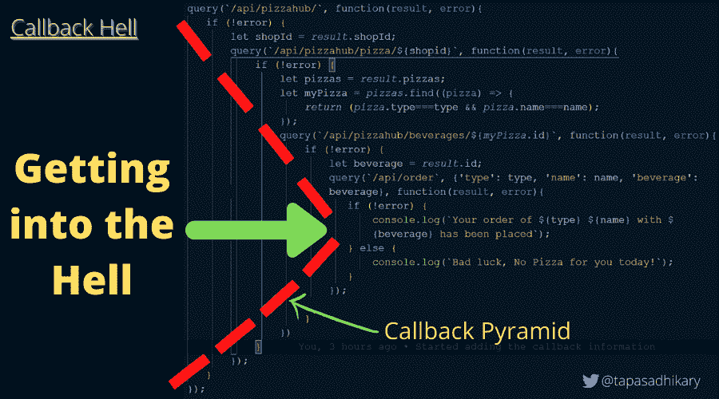

Demonstration of callback hell and pyramid

`callback hell`有几种走出来(或不进去)的方法。最常见的方法是使用`Promise`或`async`函数。然而，为了更好地理解`async`的功能，你需要先对`Promise`有一个公正的理解。

所以，让我们开始行动，投入到承诺中吧。

# 理解承诺状态

回顾一下，可以使用构造函数语法创建一个承诺，如下所示:

```
let promise = new Promise(function(resolve, reject) {
  // Code to execute
});
```

构造函数接受一个函数作为参数。这个功能叫做`executor function`。

```
// Executor function passed to the 
// Promise constructor as an argument
function(resolve, reject) {
    // Your logic goes here...
}
```

executor 函数有两个参数，`resolve`和`reject`。这些是 JavaScript 语言提供的回调。您的逻辑位于创建`new Promise`时自动运行的 executor 函数内部。

为了使承诺生效，executor 函数应该调用回调函数`resolve`或`reject`。稍后我们将详细了解这一点。

`new Promise()`构造函数返回一个`promise`对象。由于 executor 函数需要处理异步操作，返回的 promise 对象应该能够通知执行何时开始、完成(解决)或返回错误(拒绝)。

`promise`对象具有以下内部属性:

1.  `state`–该属性可以有以下值:

*   `pending`:最初当 executor 函数开始执行时。
*   `fulfilled`:承诺解决的时候。
*   `rejected`:承诺被拒绝时。

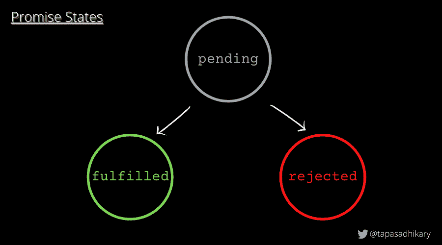

Promise states

2.`result`–该属性可以有以下值:

*   `undefined`:最初当`state`值为`pending`时。
*   `value`:调用`resolve(value)`时。
*   `error`:调用`reject(error)`时。

这些内部属性是代码不可访问的，但却是可检查的。这意味着我们将能够使用调试器工具检查`state`和`result`属性值，但是我们将不能使用程序直接访问它们。

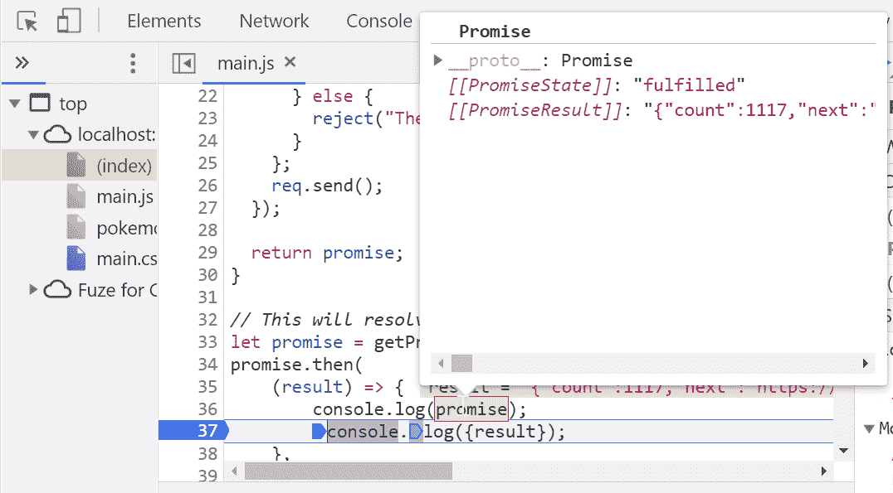

Able to inspect the internal properties of a promise

承诺的状态可以是`pending`、`fulfilled`或`rejected`。被解决或拒绝的承诺被称为`settled`。

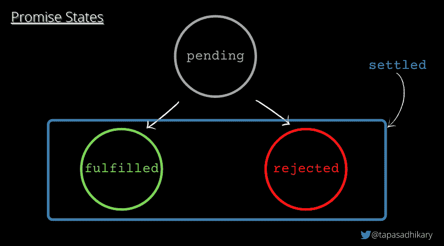

A settled promise is either fulfilled or rejected

### 承诺是如何解决和拒绝的

下面是一个将立即解决(`fulfilled` state)且值为`I am done`的承诺的示例。

```
let promise = new Promise(function(resolve, reject) {
    resolve("I am done");
});
```

以下承诺将被拒绝(`rejected`状态)，并显示错误消息`Something is not right!`。

```
let promise = new Promise(function(resolve, reject) {
    reject(new Error('Something is not right!'));
});
```

需要注意的重要一点是:

> 一个承诺执行人应该只调用一个`resolve`或一个`reject`。一旦一个状态被改变(pending = > fulfilled 或 pending = > rejected)，这就是全部。对`resolve`或`reject`的任何进一步呼叫都将被忽略。

```
let promise = new Promise(function(resolve, reject) {
  resolve("I am surely going to get resolved!");

  reject(new Error('Will this be ignored?')); // ignored
  resolve("Ignored?"); // ignored
});
```

在上面的例子中，只有第一个要解决的问题会被调用，其余的会被忽略。

# 一旦你创造了承诺，如何处理它

一个`Promise`使用一个执行器函数来完成一个任务(大部分是异步的)。当 executor 函数完成解析(成功)或拒绝(错误)时，consumer 函数(使用承诺的结果)应该得到通知。

处理程序方法`.then()`、`.catch()`和`.finally()`有助于创建执行者和消费者功能之间的链接，这样当承诺`resolve`或`reject`发生时，它们可以同步

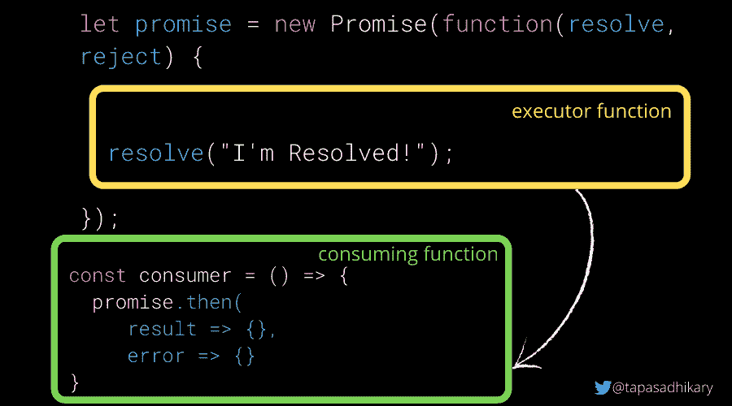

The executor and consumer functions

## 如何使用`.then()`承诺处理器

应该在 promise 对象上调用`.then()`方法来处理结果(resolve)或错误(reject)。

它接受两个函数作为参数。通常，应该从消费者函数中调用`.then()`方法，您希望知道承诺执行的结果。

```
promise.then(
  (result) => { 
     console.log(result);
  },
  (error) => { 
     console.log(error);
  }
);
```

如果你只对成功的结果感兴趣，你可以传递一个参数给它，就像这样:

```
promise.then(
  (result) => { 
      console.log(result);
  }
);
```

如果您只对错误结果感兴趣，您可以传递第一个参数的`null`,就像这样:

```
promise.then(
  null,
  (error) => { 
      console.log(error)
  }
);
```

然而，您可以使用`.catch()`方法以更好的方式处理错误，我们马上就会看到。

让我们看几个使用`.then`和`.catch`处理程序处理结果和错误的例子。我们将通过几个真正的异步请求让学习变得更有趣。我们将使用 [PokeAPI](https://pokeapi.co/) 来获取关于神奇宝贝的信息，并使用承诺来解决/拒绝它们。

首先，让我们创建一个通用函数，它接受 PokeAPI URL 作为参数并返回一个承诺。如果 API 调用成功，则返回一个已解析的承诺。被拒绝的承诺会因任何类型的错误而被退回。

从现在开始，我们将在几个例子中使用这个函数来获得一个承诺并处理它。

```
function getPromise(URL) {
  let promise = new Promise(function (resolve, reject) {
    let req = new XMLHttpRequest();
    req.open("GET", URL);
    req.onload = function () {
      if (req.status == 200) {
        resolve(req.response);
      } else {
        reject("There is an Error!");
      }
    };
    req.send();
  });
  return promise;
}
```

Utility method to get a Promise

例 1:获取 50 个神奇宝贝的信息:

```
const ALL_POKEMONS_URL = 'https://pokeapi.co/api/v2/pokemon?limit=50';

// We have discussed this function already!
let promise = getPromise(ALL_POKEMONS_URL);

const consumer = () => {
    promise.then(
        (result) => {
            console.log({result}); // Log the result of 50 Pokemons
        },
        (error) => {
            // As the URL is a valid one, this will not be called.
            console.log('We have encountered an Error!'); // Log an error
    });
}

consumer();
```

示例 2:让我们尝试一个无效的 URL

```
const POKEMONS_BAD_URL = 'https://pokeapi.co/api/v2/pokemon-bad/';

// This will reject as the URL is 404
let promise = getPromise(POKEMONS_BAD_URL);

const consumer = () => {
    promise.then(
        (result) => {
            // The promise didn't resolve. Hence, it will
            // not be executed.
            console.log({result});
        },
        (error) => {
            // A rejected prmise will execute this
            console.log('We have encountered an Error!'); // Log an error
        }
    );
}

consumer();
```

## 如何使用`.catch()`承诺处理器

您可以使用这个处理程序方法来处理承诺中的错误(拒绝)。将`null`作为第一个参数传递给`.then()`的语法并不是处理错误的好方法。所以我们让`.catch()`用一些简洁的语法做同样的工作:

```
// This will reject as the URL is 404
let promise = getPromise(POKEMONS_BAD_URL);

const consumer = () => {
    promise.catch(error => console.log(error));
}

consumer();
```

如果我们抛出类似于`new Error("Something wrong!")`的错误，而不是从 promise executor 和 handlers 调用`reject`，它仍然会被视为拒绝。这意味着这将被`.catch`处理程序方法捕获。

这同样适用于发生在承诺执行器和处理函数中的任何*同步*异常。

这里有一个例子，它将被当作一个拒绝，并且将调用`.catch`处理程序方法:

```
new Promise((resolve, reject) => {
  throw new Error("Something is wrong!");// No reject call
}).catch((error) => console.log(error)); 
```

## 如何使用`.finally()`承诺处理器

`.finally()`处理程序执行清理，比如停止加载程序、关闭活动连接等等。无论是承诺`resolve`还是`reject`都会调用`finally()`方法。它将结果或错误传递给下一个可以调用. then()或的处理程序。再次 catch()。

这里有一个例子可以帮助你理解这三种方法:

```
let loading = true;
loading && console.log('Loading...');

// Gatting Promise
promise = getPromise(ALL_POKEMONS_URL);

promise.finally(() => {
    loading = false;
    console.log(`Promise Settled and loading is ${loading}`);
}).then((result) => {
    console.log({result});
}).catch((error) => {
    console.log(error)
});
```

进一步解释一下:

*   `.finally()`方法使加载`false`。
*   如果承诺解析，将调用`.then()`方法。如果 promise 因出错而拒绝，将调用`.catch()`方法。无论是决定还是拒绝，都会调用`.finally()`。

# 什么是承诺链？

调用总是返回一个承诺。这个承诺将把`state`作为`pending`，把`result`作为`undefined`。它允许我们在新的承诺上调用下一个`.then`方法。

当第一个`.then`方法返回值时，下一个`.then`方法可以接收该值。第二个现在可以传给第三个`.then()`以此类推。这形成了一个`.then`方法链来传递承诺。这种现象被称为`Promise Chain`。

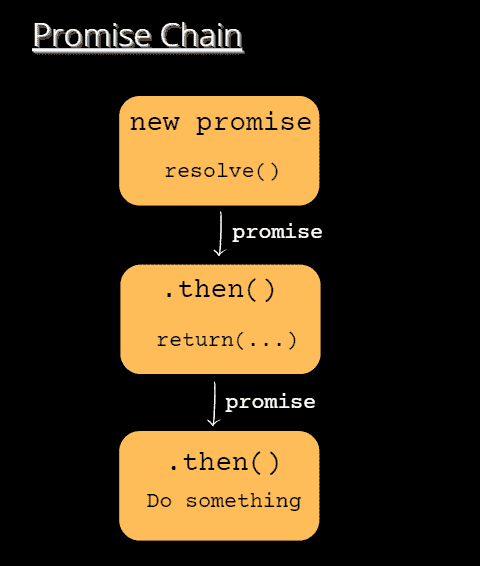

Promise Chain

这里有一个例子:

```
let promise = getPromise(ALL_POKEMONS_URL);

promise.then(result => {
    let onePokemon = JSON.parse(result).results[0].url;
    return onePokemon;
}).then(onePokemonURL => {
    console.log(onePokemonURL);
}).catch(error => {
    console.log('In the catch', error);
});
```

这里我们首先解析一个承诺，然后提取 URL 以到达第一个神奇宝贝。然后我们返回这个值，它将作为一个承诺传递给下一个。then()处理函数。因此输出，

```
https://pokeapi.co/api/v2/pokemon/1/
```

`.then`方法可以返回:

*   价值(我们已经看到了这一点)
*   一个全新的承诺。

它还会引发错误。

下面是一个例子，我们用`.then`方法创建了一个承诺链，它返回结果和一个新的承诺:

```
// Promise Chain with multiple then and catch
let promise = getPromise(ALL_POKEMONS_URL);

promise.then(result => {
    let onePokemon = JSON.parse(result).results[0].url;
    return onePokemon;
}).then(onePokemonURL => {
    console.log(onePokemonURL);
    return getPromise(onePokemonURL);
}).then(pokemon => {
    console.log(JSON.parse(pokemon));
}).catch(error => {
    console.log('In the catch', error);
});
```

在第一个`.then`调用中，我们提取 URL 并将其作为一个值返回。这个 URL 将被传递给第二个`.then`调用，在那里我们将返回一个新的承诺，把这个 URL 作为一个参数。

这一承诺将得到解决，并传递到我们获得神奇宝贝信息的环节。以下是输出:

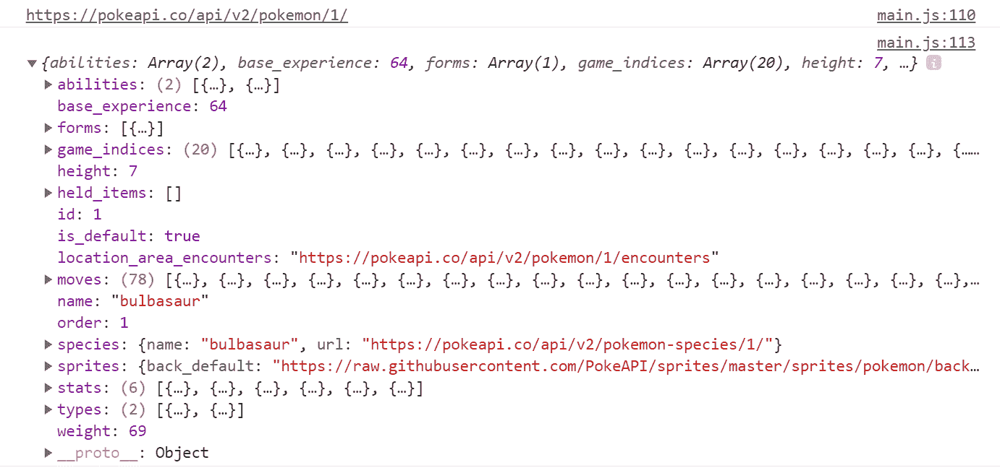

Output of the promise chain call

如果出现错误或拒绝承诺。将调用链中的 catch 方法。

需要注意的一点:多次调用`.then`并不会形成承诺链。您可能最终做了这样的事情，却在代码中引入了一个 bug:

```
let promise = getPromise(ALL_POKEMONS_URL);

promise.then(result => {
    let onePokemon = JSON.parse(result).results[0].url;
    return onePokemon;
});
promise.then(onePokemonURL => {
    console.log(onePokemonURL);
    return getPromise(onePokemonURL);
});
promise.then(pokemon => {
    console.log(JSON.parse(pokemon));
}); 
```

我们对同一个承诺调用了三次`.then`方法，但是我们没有将承诺传递下去。这与承诺链不同。在上面的例子中，输出将是一个错误。

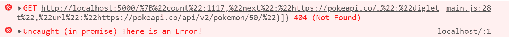

# 如何处理多重承诺

除了处理程序方法(。然后，。接住然后。最后)，Promise API 中有六个静态方法可用。前四个方法接受一组承诺，并并行运行它们。

1.  承诺。所有
2.  承诺。任何
3.  承诺。都解决了
4.  承诺.比赛
5.  承诺.决心
6.  承诺.拒绝

让我们逐一查看。

## 无极.所有()方法

接受一组承诺(例如，一个数组)作为参数，并并行执行它们。

该方法等待所有承诺解析并返回承诺结果数组。如果任何承诺因错误而拒绝或执行失败，所有其它承诺结果都将被忽略。

让我们创建三个承诺来获得关于三个神奇宝贝的信息。

```
const BULBASAUR_POKEMONS_URL = 'https://pokeapi.co/api/v2/pokemon/bulbasaur';
const RATICATE_POKEMONS_URL = 'https://pokeapi.co/api/v2/pokemon/raticate';
const KAKUNA_POKEMONS_URL = 'https://pokeapi.co/api/v2/pokemon/kakuna';

let promise_1 = getPromise(BULBASAUR_POKEMONS_URL);
let promise_2 = getPromise(RATICATE_POKEMONS_URL);
let promise_3 = getPromise(KAKUNA_POKEMONS_URL);
```

通过传递承诺数组来使用 Promise.all()方法。

```
Promise.all([promise_1, promise_2, promise_3]).then(result => {
    console.log({result});
}).catch(error => {
    console.log('An Error Occured');
});
```

输出:

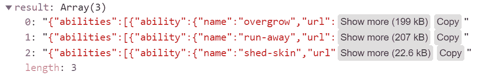

正如您在输出中看到的，所有承诺的结果都被返回。执行所有承诺的时间等于承诺运行的最大时间。

## 无极. any()方法

`Promise.any([promises])` -类似于`all()`方法，`.any()`也接受一组并行执行它们的承诺。这个方法不会等待所有的承诺都解决。当任何一个承诺达成时，它就完成了。

```
 Promise.any([promise_1, promise_2, promise_3]).then(result => {
     console.log(JSON.parse(result));
 }).catch(error => {
     console.log('An Error Occured');
 });
```

输出将是任何已解析承诺的结果:

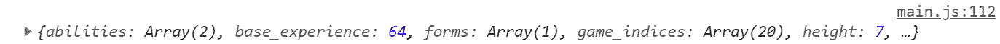

## Promise.allSettled()方法

这个方法等待所有的承诺完成(解决/拒绝)，并以对象数组的形式返回它们的结果。如果满足，结果将包含状态(满足/拒绝)和值。如果是拒绝状态，它将返回错误原因。

以下是所有兑现承诺的例子:

```
Promise.allSettled([promise_1, promise_2, promise_3]).then(result => {
    console.log({result});
}).catch(error => {
    console.log('There is an Error!');
});
```

输出:

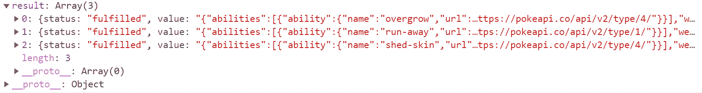

如果任何一个承诺拒绝，比如说，承诺 _1，

```
let promise_1 = getPromise(POKEMONS_BAD_URL);
```

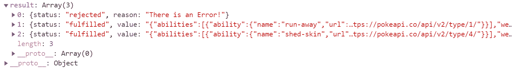

## 无极.种族()方法

`Promise.race([promises])`–它等待第一个(最快的)承诺结算，并相应地返回结果/错误。

```
Promise.race([promise_1, promise_2, promise_3]).then(result => {
    console.log(JSON.parse(result));
}).catch(error => {
    console.log('An Error Occured');
});
```

输出最快得到解决的承诺:

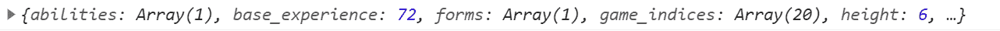

## Promise.resolve/reject 方法

`Promise.resolve(value)`–它用传递给它的值来解析一个承诺。它与以下内容相同:

```
let promise = new Promise(resolve => resolve(value));
```

它拒绝了一个传递给它错误的承诺。它与以下内容相同:

```
let promise = new Promise((resolve, reject) => reject(error));
```

# 我们能用承诺改写 PizzaHub 的例子吗？

当然，让我们做它。让我们假设`query`方法将返回一个承诺。下面是一个 query()方法的例子。在现实生活中，这个方法可能会与数据库对话并返回结果。在这种情况下，它是非常硬编码的，但服务于相同的目的。

```
function query(endpoint) {
  if (endpoint === `/api/pizzahub/`) {
    return new Promise((resolve, reject) => {
      resolve({'shopId': '123'});
    })
  } else if (endpoint.indexOf('/api/pizzahub/pizza/') >=0) {
    return new Promise((resolve, reject) => {
      resolve({pizzas: [{'type': 'veg', 'name': 'margherita', 'id': '123'}]});
    })
  } else if (endpoint.indexOf('/api/pizzahub/beverages') >=0) {
    return new Promise((resolve, reject) => {
      resolve({id: '10', 'type': 'veg', 'name': 'margherita', 'beverage': 'coke'});
    })
  } else if (endpoint === `/api/order`) {
    return new Promise((resolve, reject) => {
      resolve({'type': 'veg', 'name': 'margherita', 'beverage': 'coke'});
    })
  }
}
```

接下来是我们`callback hell`的重构。为此，首先，我们将创建几个逻辑函数:

```
// Returns a shop id
let getShopId = result => result.shopId;

// Returns a promise with pizza list for a shop
let getPizzaList = shopId => {
  const url = `/api/pizzahub/pizza/${shopId}`;
  return query(url);
}

// Returns a promise with pizza that matches the customer request
let getMyPizza = (result, type, name) => {
  let pizzas = result.pizzas;
  let myPizza = pizzas.find((pizza) => {
    return (pizza.type===type && pizza.name===name);
  });
  const url = `/api/pizzahub/beverages/${myPizza.id}`;
  return query(url);
}

// Returns a promise after Placing the order
let performOrder = result => {
  let beverage = result.id;
   return query(`/api/order`, {'type': result.type, 'name': result.name, 'beverage': result.beverage});
}

// Confirm the order
let confirmOrder = result => {
    console.log(`Your order of ${result.type} ${result.name} with ${result.beverage} has been placed!`);
}
```

使用这些功能创建所需的承诺。这是您应该与`callback hell`示例进行比较的地方。这是如此漂亮和优雅。

```
function orderPizza(type, name) {
  query(`/api/pizzahub/`)
  .then(result => getShopId(result))
  .then(shopId => getPizzaList(shopId))
  .then(result => getMyPizza(result, type, name))
  .then(result => performOrder(result))
  .then(result => confirmOrder(result))
  .catch(function(error){
    console.log(`Bad luck, No Pizza for you today!`);
  })
}
```

最后，通过传递比萨饼类型和名称来调用 orderPizza()方法，如下所示:

```
orderPizza('veg', 'margherita'); 
```

# 接下来是什么？

如果你在这里，并且已经读完了上面的大部分内容，那么恭喜你！您现在应该对 JavaScript 承诺有了更好的理解。本文中使用的所有例子都在这个 [GitHub 库](https://github.com/atapas/js-promise-example)中。

接下来，您应该学习 JavaScript 中的`async`函数，它进一步简化了事情。JavaScript 承诺的概念最好通过编写小例子并在它们的基础上构建来学习。

不管我们使用什么样的框架或库(Angular、React、Vue 等等),异步操作都是不可避免的。这意味着我们必须理解让事情更好地运转的承诺。

此外，我相信您会发现现在使用`fetch`方法要容易得多:

```
fetch('/api/user.json')
.then(function(response) {
    return response.json();
})
.then(function(json) {
    console.log(json); // {"name": "tapas", "blog": "freeCodeCamp"}
});
```

*   `fetch`方法返回一个承诺。所以我们可以在它上面调用`.then` handler 方法。
*   剩下的是我们在这篇文章中学到的承诺链。

# 在结束之前...

谢谢你读到这里！我们来连线。可以在 [Twitter (@tapasadhikary)](https://twitter.com/tapasadhikary) 上@我，有评论。

您可能也会喜欢这些其他文章:

*   [JavaScript 未定义和 null:最后说一次吧！](https://blog.greenroots.info/javascript-undefined-and-null-lets-talk-about-it-one-last-time-ckh64kmz807v848s15kdkg3dd)
*   [JavaScript:与==，===和 Object.is 的相等比较](https://blog.greenroots.info/javascript-equality-comparison-with-and-objectis-ckdpt2ryk01vel9s186ft8cwl)
*   [为 JS 初学者讲解的 JavaScript `this` Keyword + 5 键绑定规则](https://www.freecodecamp.org/news/javascript-this-keyword-binding-rules/)
*   [JavaScript Type of–如何检查 JS 中变量或对象的类型](https://www.freecodecamp.org/news/javascript-typeof-how-to-check-the-type-of-a-variable-or-object-in-js/)

目前就这些。很快在我的下一篇文章中再见。在那之前，请好好照顾自己。