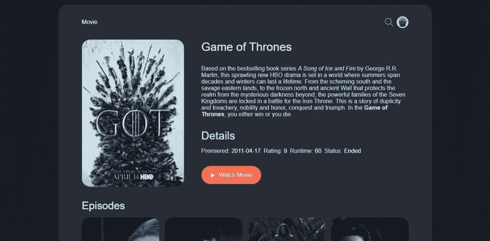

# JavaScript 向初学者承诺

> 原文：<https://www.freecodecamp.org/news/javascript-promises-for-beginners/>

在 JavaScript 中，承诺是正在进行的操作的值的占位符(代理)。

您通常使用承诺来管理必须等待操作结果的情况。例如，将文件上传到服务器并等待 API 调用的响应，或者只是要求用户从他们的计算机中选择一个文件。

通过构建如下所示的真实示例应用程序，您将在本文中了解 JavaScript 承诺:



## 什么是承诺？

承诺只是一个返回`Object`的函数，您可以将回调附加到这个函数上。

只有当操作完成时，才会调用附加到 promise 对象的回调。回调必须等到操作 ****被满足**** 或**被拒绝**:

```
fetch(`some_api_url`).then((response) => {
  // Everything here will wait the fetch operation to complete
});
```

在一个承诺最终实现之前(这个承诺要么实现，要么被拒绝),它必须经历不同的状态:

| 状态 | 描述 | 回收 |
| --- | --- | --- |
| 悬而未决的 | 表示操作仍在运行，承诺待定 | - |
| 感到满足的 | 手术完成了，而且很成功 | `.then()` |
| 拒绝 | 操作已完成，但有一个错误 | `.catch()` |
| 稳定的 | 该承诺要么已解决，要么已被拒绝，无论哪种方式调用该回调 | `.finally()` |

创建承诺时，初始状态为待定。然后，根据操作的输出，承诺要么实现，要么被拒绝。

从上表中，您可以很容易地看到根据承诺的每个状态将调用的回调:

```
fetch(`some_api_url`).then((response) => {
  // This will get called when the promise fulfills
}).catch((error) => {
  // This will get called when the promise is rejected
}).finally(() => {
  // This will get called all the time
})
```

## 如何在 JavaScript 中使用承诺

既然你已经了解了什么是 promise it，让我们通过构建我们之前看到的电影搜索应用程序来演示如何在 JavaScript 中使用 promises 。

一个基本的电影搜索应用程序应该有一个输入框，用户可以在那里搜索他们最喜欢的电影。它还应该有一个用户界面来显示他们搜索的电影的一些基本信息。

让我们从创建 **HTML** 开始。

### 如何编写 HTML

为了本教程和展示真实的例子，我将使用 **Codepen，**但是你也可以使用你最喜欢的代码编辑器。

创建一个`index.html`文件并添加以下代码:

```
 <div class="wrapper">
      <header class="header">
        <div class="header_logo">Movie</div>
        <div class="header_actions">
          <form onsubmit="handle_form(event)" id="header_form">
            <div class="header_form-icon">
            <input type="search" class="header_form-input" placeholder="Search, Press Enter to Submit" />
            <svg class="icon" width="22px" height="22px"><use href="#icon-search" /></svg>
          </div>
          </form>
          
        </div>
      </header>
      <main id="main">
        <section>
          <article class="movie">
            <div class="movie_img">
              
            </div>
            <div class="movie_info">
              <header><h1 class="movie_title"></h1></header>
              <div class="movie_desc"></div>
              <div class="movie_details">
                <h2>Details</h2>
                <ul class="flex">
                  <li>Premiered: <span id="movie_date"></span></li>
                  <li>Rating: <span id="movie_rating"></span></li>
                  <li>Runtime: <span id="movie_runtime"></span></li>
                  <li>Status: <span id="movie_status"></span></li>
                </ul>
              </div>
              <a href="" class="btn" target="_blank" rel="noopener noreferrer">
            <svg class="icon" width="16px" height="16px"><use href="#icon-play" /></svg>
                Watch Movie</a>
            </div>
          </article>
          <div class="episodes_list">
            <h3 class="episodes_title"></h3>
          <ol class="episodes" id="episodes"></ol>
        </div>
        </section>
      </main>
    </div>
```

上面我们刚刚创建了我们的电影应用程序的框架。所以现在让我们用 CSS 给它注入一些活力:

[https://codepen.io/Spruce_khalifa/embed/preview/wvygzLq?default-tabs=html%2Cresult&height=300&host=https%3A%2F%2Fcodepen.io&slug-hash=wvygzLq](https://codepen.io/Spruce_khalifa/embed/preview/wvygzLq?default-tabs=html%2Cresult&height=300&host=https%3A%2F%2Fcodepen.io&slug-hash=wvygzLq)

### 如何获取电影

为了获取我们的电影，我们将使用 TVMAZE API。创建`main.js`文件并添加以下代码:

```
const get_movie = (value = "Game of thrones") => {
   fetch(
    `https://api.tvmaze.com/singlesearch/shows?q=${value}&embed=episodes`
  ).then((response) => create_UI(response.json()));
};
```

我们创建了一个使用 JavaScript fetch API 的函数`get_movie(value = "Game of thrones")`。我们用它向电影 API 端点发出一个`GET`请求。

fetch API 返回一个承诺。为了使用来自 API 的响应，我们附加了`.then()`回调，其中我们将`response.json()`传递给一个新函数`create_UI()`。让我们继续创建`create_UI`函数:

```
const create_UI = (data) => {
  const movie_img = document.querySelector("#img_src");
  const movie_icon = document.querySelector("#img_icon");
  const movie_title = document.querySelector(".movie_title");
  const movie_desc = document.querySelector(".movie_desc");
  const movie_link = document.querySelector(".btn");
  const movie_date = document.querySelector("#movie_date");
  const movie_rating = document.querySelector("#movie_rating");
  const movie_runtime = document.querySelector("#movie_runtime");
  const movie_status = document.querySelector("#movie_status");

  // set the UI
  movie_icon.src = data.image.medium;
  movie_img.src = data.image.original;
  movie_title.textContent = data.name;
  movie_desc.innerHTML = data.summary;
  movie_link.href = data.officialSite;
  movie_date.textContent = data.premiered;
  movie_rating.textContent = data.rating.average;
  movie_runtime.textContent = data.runtime;
  movie_status.textContent = data.status;
};
```

上面的函数，顾名思义，帮助我们为我们的电影应用程序创建 UI。但是当然我们仍然需要一种从用户那里收集电影名称的方法，所以让我们来解决这个问题。

我们需要做的第一件事是向 HTML 表单添加一个`onsubmit`事件处理程序:

```
<form onsubmit="search(event)" id="header_form">
  <input type="search" class="header_form-input" placeholder="Search, Press Enter to Submit" />
//
</form>
```

现在，在我们的`main.js`文件中，我们可以处理提交表单时发生的事情:

```
// handle form submit
const search = (event) => {
  event.preventDefault();
  const value = document.querySelector(".header_form-input").value;

  get_movie(value);
};
```

每当用户提交表单时，我们都会获得他们在搜索框中输入的值，并将其传递给我们之前创建的`get_movie(value = "Game of thrones")`函数。

## 承诺链

与我们在前面的例子中看到的不同，`.then()`回调并不是真正的结束。这是因为当你返回一个承诺的值时，你得到了另一个承诺。当您想要按顺序运行一系列异步操作时，这变得非常有用。

例如，我们的电影 API 不仅仅返回一部电影的信息，它还返回所有剧集的信息。假设我们真的不想显示《权力的游戏》中的所有剧集，我们只想要前四(4)集。

通过承诺链，我们可以轻松实现这一目标:

```
const get_movie = (value = "Game of thrones") => {
  fetch(`https://api.tvmaze.com/singlesearch/shows?q=${value}&embed=episodes`)
    .then((response) => response.json())
    .then((data) => {
      if (data._embedded.episodes.length > 0) {
        const new_data = data._embedded.episodes.slice(0, 4);

        create_UI(data);
        return create_episodesUI(new_data);
      } else {
        return create_UI(data);
      }
    });
};
```

这仍然是我们的`get_movie()`函数，但是这次我们没有将数据传递给`create_UI`函数，而是返回响应`.then((response) => response.json())`。这创造了一个新的承诺，我们可以附加更多的回调。

理想情况下，只要你愿意，这个链条可以一直持续下去。记住你所要做的就是返回承诺的价值。

## 如何处理承诺中的错误

承诺中发生的错误会立即进入`.catch()`回调:

```
fetch(`https://api.tvmaze.com/singlesearch/shows?q=${value}&embed=episodes`)
    .then((response) => response.json())
    .then((data) => {
      // any error here will trigger the .catch() callback
    }).catch((error) => {
    // all errors are caught and handled here
    })
```

`.catch()`回调是`.then(null, (error) => {})`的简称。您也可以将上面的内容写成:

```
fetch(`https://api.tvmaze.com/singlesearch/shows?q=${value}&embed=episodes`)
    .then((response) => response.json())
    .then((data) => {
      // any error here will trigger the .catch() callback
    }, (error) => {
    // all errors are caught and handled here
    }) 
```

例如，使用我们的电影搜索应用程序，当我们遇到任何错误时，我们可以处理并在`.catch()`回调中向用户显示一条漂亮的错误消息:

```
const get_movie = (value = "Game of thrones") => {
  fetch(`https://api.tvmaze.com/singlesearch/shows?q=${value}&embed=episodes`)
    .then((response) => response.json())
    .then((data) => {
      if (data._embedded.episodes.length > 0) {
        const new_data = data._embedded.episodes.slice(0, 4);

        create_UI(data);
        return create_episodesUI(new_data);
      } else {
        return create_UI(data);
      }
    })
    .catch((error) => {
      console.log(error.message);
      // Challange: display your error here
    });
};
```

现在，如果因为任何原因我们得到了一个错误，调用`.catch()`回调，我们向用户显示正确的错误。

## 如何用 JavaScript 创建承诺

既然我们已经学习了什么是承诺以及如何使用它们，让我们看看如何用 JavaScript 创建一个承诺。

要在 JavaScript 中创建一个承诺，可以使用 promise 构造函数。构造函数接受一个参数:一个带有两个参数的函数，`resolve`和`reject`:

```
const is_true = true
const new_promise = new Promise((resolve,reject) => {
  if(is_true) {
    // everything went fine
    resolve()
  } else {
    // Oops there was an error
    reject()
  }
})
```

然后我们可以通过附加回调来使用我们的`new_promise`:

```
new_promise
  .then((response) => {
    // everything went fine
  })
  .catch((error) => {
    // handle errors
  });
```

## 结论

在本教程中，我们学习了承诺，它们是什么，以及如何通过构建一个电影搜索应用程序来使用它们。我们电影 app 的完整代码和现场预览可以在 Codepen 上找到:[电影搜索 App](https://codepen.io/Spruce_khalifa/pen/wvygzLq?editors=0100) 。

### 挑战

在创建我们的电影应用程序时，我遗漏了一些我认为对你练习新的承诺技巧很有帮助的部分:

1.  当我们等待 API 响应时，我们的电影应用程序看起来冻结了。您可以尝试添加一个加载器来告诉用户承诺正在等待。
2.  我们目前只是使用`console.log(error)`来记录错误。但是我们不希望这样，所以您可以想出如何以友好的方式向用户显示所有错误。

如果你用这个创造了一些美妙的东西，请随意发微博，并标记我[@ sprucehalifa](https://twitter.com/sprucekhalifa)。别忘了点击“跟随”按钮。

编码快乐！