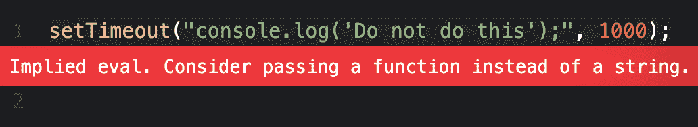

# JavaScript setTimeout()–延迟 N 秒的 JS 计时器

> 原文：<https://www.freecodecamp.org/news/javascript-settimeout-js-timer-to-delay-n-seconds/>

你有没有想过有没有一种方法可以让你的 JavaScript 代码延迟几秒？

在本文中，我将通过代码示例解释什么是`setTimeout()`方法，以及它与`setInterval()`有何不同。

## JavaScript 中的`setTimeout()`是什么？

`setTimeout()`是一个在定时器运行结束后执行一段代码的方法。

下面是`setTimeout()`方法的语法。

```
let timeoutID = setTimeout(function, delay in milliseconds, argument1, argument2,...);
```

我们来分解一下语法。

### 功能

`setTimeout()`将设置一个定时器，一旦定时器超时，该功能将运行。

### 以毫秒为单位的延迟

在这个方法中，您可以指定希望函数延迟多少毫秒。1000 毫秒等于 1 秒。

在本例中，消息将在 3 秒钟的延迟后出现在屏幕上。(3000 毫秒)

[https://codepen.io/jessica-wilkins/embed/preview/NWgqKKa?default-tabs=js%2Cresult&height=300&host=https%3A%2F%2Fcodepen.io&slug-hash=NWgqKKa](https://codepen.io/jessica-wilkins/embed/preview/NWgqKKa?default-tabs=js%2Cresult&height=300&host=https%3A%2F%2Fcodepen.io&slug-hash=NWgqKKa)

```
const para = document.getElementById("para");

function myMessage() {
  para.innerHTML = "I just appeared";
  console.log("message appeared");
}
setTimeout(myMessage, 3000);
```

如果`setTimeout()`方法中不存在延迟，则将其设置为零，消息将立即出现。

[https://codepen.io/jessica-wilkins/embed/preview/eYRNOgX?default-tabs=js%2Cresult&height=300&host=https%3A%2F%2Fcodepen.io&slug-hash=eYRNOgX](https://codepen.io/jessica-wilkins/embed/preview/eYRNOgX?default-tabs=js%2Cresult&height=300&host=https%3A%2F%2Fcodepen.io&slug-hash=eYRNOgX)

```
const para = document.getElementById("para");

function myMessage() {
  para.innerHTML = "No delay in this message";
  console.log("message appeared immediately");
}
setTimeout(myMessage);
```

### 争论

您还可以将可选参数传递给函数。

在这个对话示例中，布兰妮将提出一个问题，阿什莉的回答将延迟 3 秒。它将包括来自`lunchMenu`函数的两个可选参数。

[https://codepen.io/jessica-wilkins/embed/preview/YzQXzZa?default-tabs=js%2Cresult&height=300&host=https%3A%2F%2Fcodepen.io&slug-hash=YzQXzZa](https://codepen.io/jessica-wilkins/embed/preview/YzQXzZa?default-tabs=js%2Cresult&height=300&host=https%3A%2F%2Fcodepen.io&slug-hash=YzQXzZa)

```
const ashley = document.getElementById("ashley");

function lunchMenu(food1, food2) {
  ashley.innerHTML = `<strong>Ashley: </strong>I had ${food1} and ${food2}.`;
}

setTimeout(lunchMenu, 3000, "pizza", "salad");
```

### 超时时间

`setTimeout()`将返回`timeoutID`，它是一个正整数，是定时器的唯一 ID。

### clearTimeout()

该方法用于取消一个`setTimeout()`。在方法内部，你必须引用`timeoutID`。

下面是基本语法。

```
clearTimeout(timeoutID)
```

在本例中，消息将在 10 秒(10，000 毫秒)的延迟后出现。但是如果用户点击`Stop Timer`按钮，那么`setTimeout()`将被取消。

[https://codepen.io/jessica-wilkins/embed/preview/JjJdoWm?default-tabs=js%2Cresult&height=300&host=https%3A%2F%2Fcodepen.io&slug-hash=JjJdoWm](https://codepen.io/jessica-wilkins/embed/preview/JjJdoWm?default-tabs=js%2Cresult&height=300&host=https%3A%2F%2Fcodepen.io&slug-hash=JjJdoWm)

```
const timerMsg = document.getElementById("message1");
const stopBtn = document.getElementById("stop");

function timerMessage() {
  timerMsg.innerHTML = "Thanks for waiting!";
}

let timeoutID = setTimeout(timerMessage, 10000);

stopBtn.addEventListener("click", () => {
  clearTimeout(timeoutID);
  timerMsg.innerHTML = "Timer was stopped";
});
```

## 是否应该为 setTimeout()传入一个字符串而不是一个函数？

传入一个字符串而不是一个函数被认为是不好的做法和安全风险。

避免这样写`setTimeout()`:

```
setTimeout("console.log('Do not do this');", 1000); 
```

一些代码编辑器会警告您，并建议使用函数来代替。



在这种情况下，请始终使用函数而不是字符串。

```
setTimeout(function () {
  console.log("Do this instead");
}, 1000);
```

如果您想了解有关隐含评估的安全风险的更多信息，请阅读 MDN 文档中关于[切勿使用评估](https://developer.mozilla.org/en-US/docs/Web/JavaScript/Reference/Global_Objects/eval#never_use_eval!)的部分。

## `setInterval()`和`setTimeout()`有什么不同？

不像`setTimeout()`在延迟后只执行一次功能，`setInterval()`会每隔设定的秒数重复一次功能。如果你想停止`setInterval()`，那么你使用`clearInterval()`。

`setInterval()`的语法与`setTimeout()`相同。

```
let intervalID = setInterval(function, delay in milliseconds, argument1, argument2,...);
```

在本例中，我们有一条每秒钟打印到屏幕上的销售信息。

[https://codepen.io/jessica-wilkins/embed/preview/wveaaYX?default-tabs=js%2Cresult&height=300&host=https%3A%2F%2Fcodepen.io&slug-hash=wveaaYX](https://codepen.io/jessica-wilkins/embed/preview/wveaaYX?default-tabs=js%2Cresult&height=300&host=https%3A%2F%2Fcodepen.io&slug-hash=wveaaYX)

```
let intervalID = setInterval(() => {
  salesMsg.innerHTML += "<p>Sale ends soon. BUY NOW!</p>";
}, 1000);
```

在`setTimeout()`方法中，我们使用`clearInterval()`在 10 秒后停止打印消息。

```
setTimeout(() => {
  clearInterval(intervalID);
}, 10000);
```

就像使用`setTimeout()`一样，您必须在`clearInterval()`方法中为计时器使用唯一的 ID。

## 真实项目示例

现在我们已经了解了`setTimeout()`和`setInterval()`是如何工作的，让我们来看一个例子，看看它是如何应用于网站上的一个真实特性的。

[https://codepen.io/jessica-wilkins/embed/preview/yLXNojz?default-tabs=js%2Cresult&height=300&host=https%3A%2F%2Fcodepen.io&slug-hash=yLXNojz](https://codepen.io/jessica-wilkins/embed/preview/yLXNojz?default-tabs=js%2Cresult&height=300&host=https%3A%2F%2Fcodepen.io&slug-hash=yLXNojz)

在这个例子中，我们有一个进度条，它将在页面加载后 2 秒开始。在`setTimeout()`中，我们有一个`setInterval()`，只要条宽不是 100%,它就会执行`animate()`功能。

```
setTimeout(() => {
  let intervalID = setInterval(() => {
    if (barWidth === 100) {
      clearInterval(intervalID);
    } else {
      animate();
    }
  }, 100);//this sets the speed of the animation
}, 2000);
```

在`animate()`函数中，我们有另一个`setTimeout()`,当进度条写满时，它将显示 100%完成。

```
const animate = () => {
  barWidth++;
  progressBar.style.width = `${barWidth}%`;
  setTimeout(() => {
    loadingMsg.innerHTML = `${barWidth}% Completed`;
  }, 10100);
};
```

进度条只是你可以用`setTimeout()`和`setInterval()`创建的众多动画之一。你也可以在构建网络游戏时使用这些方法。

在博·卡恩斯的[如何构建一个西蒙游戏](https://www.youtube.com/watch?v=n_ec3eowFLQ)中，你可以看到`setTimeout()`和`setInterval()`是如何在游戏逻辑中使用的。

## 结论

`setTimeout()`是一个在定时器运行结束后执行一段代码的方法。

```
let timeoutID = setTimeout(function, delay in milliseconds, argument1, argument2,...);
```

延迟以毫秒为单位设置，1000 毫秒等于 1 秒。

如果延迟从`setTimeout()`方法中省略，那么延迟被设置为 0，函数将执行。

您还可以将可选参数传递给函数。

`setTimeout()`将返回`timeoutID`，它是一个正整数，是定时器的唯一 ID。

出于安全原因，不要用字符串代替函数，这一点很重要。

```
setTimeout("console.log('Do not do this');", 1000);
```

如果您想取消`setTimeout()`，那么您需要使用`clearTimeout()`

```
clearTimeout(timeoutID)
```

如果你想在设定的时间内重复执行一段代码，那么你可以使用`setInterval()`。

```
let intervalID = setInterval(() => {
 // this code runs every second
}, 1000);
```

`setTimeout()`可用于构建基本的 JavaScript 动画和在线游戏。

我希望你喜欢这篇关于`setTimeout()`的文章。