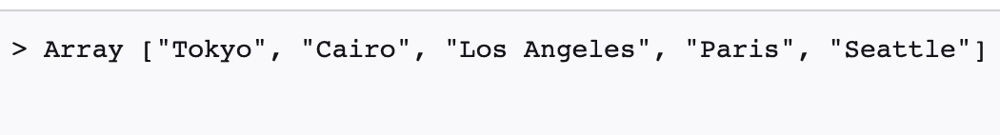
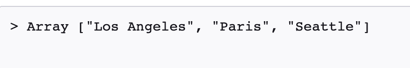
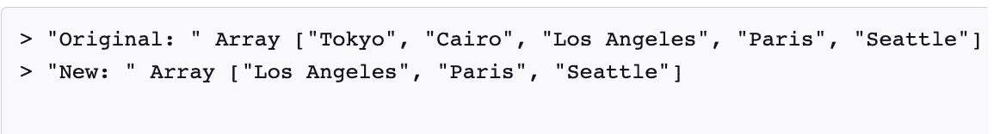
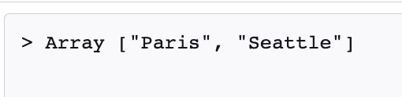
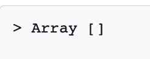
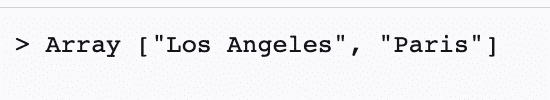
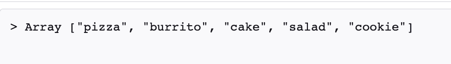
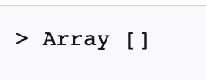
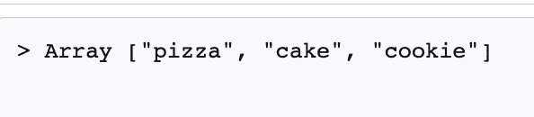

# 如何使用 slice()和 splice() JavaScript 数组方法

> 原文：<https://www.freecodecamp.org/news/javascript-slice-and-splice-how-to-use-the-slice-and-splice-js-array-methods/>

当您第一次学习 JavaScript 时，可能很难知道`slice()`和`splice()`数组方法之间的区别。

在本文中，我将通过代码示例向您展示如何使用`slice()`和`splice()`数组方法。

## 如何使用 slice() JavaScript 数组方法

方法可以用来创建数组的副本或者返回数组的一部分。值得注意的是，`slice()`方法不会改变原始数组，而是创建一个浅层副本。

下面是基本语法:

```
slice(optional start parameter, optional end parameter)
```

让我们看一些例子来更好地理解`slice()`方法是如何工作的。

## 如何使用不带开始和结束参数的 slice() JavaScript 方法

在第一个例子中，我创建了一个来自世界各地的城市列表。

```
const cities = ["Tokyo","Cairo","Los Angeles","Paris","Seattle"];
```

我可以使用`slice()`方法创建该数组的浅层副本。

```
cities.slice()
```

当我得到结果时，我会看到所有来自我的数组的元素被复制到这个新的数组中。



## 如何通过 start 参数使用 slice() JavaScript 方法

您可以使用可选的 start 参数来设置从数组中选择元素的起始位置。重要的是要记住数组是从零开始索引的。

在这个例子中，我们将在索引 2 处设置开始位置，这将选择数组中的最后三个城市，并将它们返回到一个新的数组中。

```
const newCityArr = cities.slice(2);

console.log(newCityArr)
```



正如我们在本例中看到的，原始数组没有被修改。

```
const cities = ["Tokyo","Cairo","Los Angeles","Paris","Seattle"];

const newCityArr = cities.slice(2);

console.log("Original: ", cities)
console.log("New: ", newCityArr)
```



也可以使用负索引，从数组末尾开始提取元素。

在本例中，我们将开始位置设置为-2，这将选择数组中的最后两个城市，并将它们返回到一个新数组中。

```
const newCityArr = cities.slice(-2);
```



如果 start 参数大于数组的最后一个索引，那么将返回一个空数组。

```
const newCityArr = cities.slice(5);
```



## 如何使用 start 和 end 参数来使用 slice() JavaScript 方法

如果指定了结束位置，那么`slice()`方法将从开始位置到结束位置提取元素。结束位置将不包括在新数组的提取元素中。

在本例中，我们指定了起始索引 2 和结束索引 4。新返回的数组将只包括索引 2 和 3 处的城市，因为结束位置不包括在提取的元素中。

```
const cities = ["Tokyo","Cairo","Los Angeles","Paris","Seattle"];

const newCityArr = cities.slice(2,4);
```



## 如何使用 splice() JavaScript 数组方法

与`slice()`方法不同，`splice()`方法将改变原始数组的内容。`splice()`方法用于添加或删除现有数组的元素，返回值将是从数组中删除的元素。

如果没有从数组中移除任何东西，那么返回值将只是一个空数组。

下面是基本语法。

```
splice(start, optional delete count, optional items to add)
```

在这个例子中，我们有一组食物。

```
const food = ['pizza', 'cake', 'salad', 'cookie'];
```

如果我们想在数组的索引 1 处添加另一个食物，那么我们可以使用下面的代码:

```
food.splice(1,0,"burrito")
```

第一个数字是起始索引，第二个数字是删除计数。因为我们没有删除任何项目，所以我们的删除计数为零。

这是控制台中的结果。

```
const food = ['pizza', 'cake', 'salad', 'cookie'];

food.splice(1,0,"burrito")

console.log(food)
```



如果我们`console.log(food.splice(1,0,"burrito"))`，那么我们将得到一个空数组，因为没有从数组中删除任何东西。



在下一个例子中，我们想从数组中删除“沙拉”。我们可以使用 start 和 delete 参数来实现这一点。

```
food.splice(2,1)
```

数字 2 是起始位置，数字 1 表示删除次数。因为沙拉在索引 2 处，所以它将从数组中移除。

这是我们的阵列现在的样子:

```
const food = ['pizza', 'cake', 'salad', 'cookie'];

food.splice(2,1)
console.log(food)
```



## 结论

`slice`和`splice`数组方法可能看起来彼此相似，但是有一些关键的区别。

方法可以用来创建数组的副本或者返回数组的一部分。值得注意的是，`slice()`方法不会改变原始数组，而是创建一个浅层副本。

下面是基本语法:

```
slice(optional start parameter, optional end parameter)
```

与`slice()`方法不同，`splice()`方法将改变原始数组的内容。`splice()`方法用于添加或删除现有数组的元素，返回值将是从数组中删除的元素。

如果没有从数组中移除任何东西，那么返回值将只是一个空数组。

下面是基本语法:

```
splice(start, optional delete count, optional items to add)
```

我希望您喜欢这篇 JavaScript 文章，并祝您的开发之旅好运。