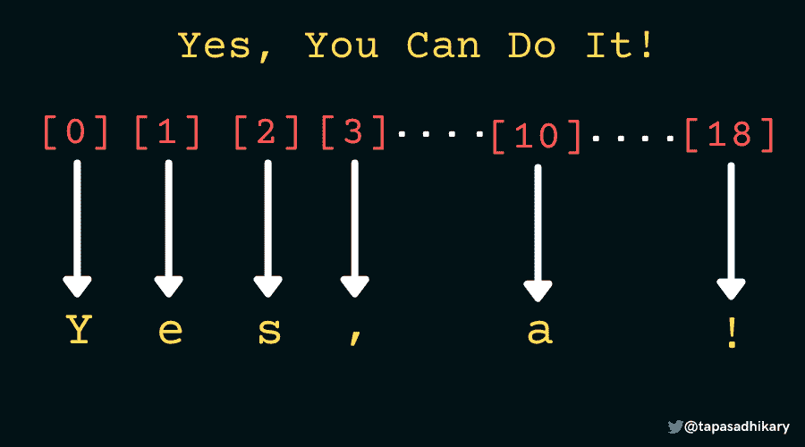
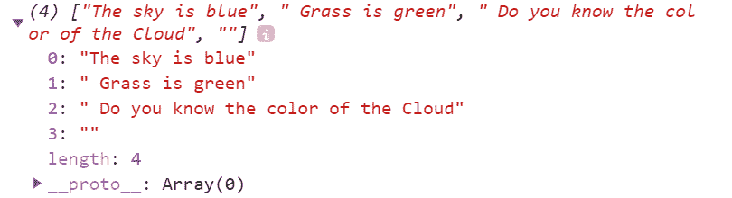
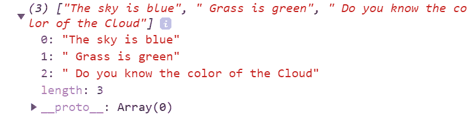

# JavaScript Split——如何在 JS 中将一个字符串拆分成一个数组

> 原文：<https://www.freecodecamp.org/news/javascript-split-how-to-split-a-string-into-an-array-in-js/>

一般来说，`string`代表编程语言中的一系列字符。

让我们看一个使用一系列字符创建的字符串的例子，“是的，你能做到！”。在 JavaScript 中，我们可以用几种方法创建字符串:

*   使用字符串文字作为原语

```
const msg = "Yes, You Can DO It!";
```

*   使用`String()`构造函数作为对象

```
const msg = new String("Yes, You Can DO It!");
```

JavaScript 中关于字符串的一个有趣的事实是，我们可以使用它的索引来访问字符串中的字符。第一个字符的索引是 0，它递增 1。因此，我们可以像这样访问字符串中的每个字符:

```
let str = "Yes, You Can Do It!";

console.log(str[0]); // Y
console.log(str[1]); // e
console.log(str[2]); // s
console.log(str[3]); // ,

console.log(str[10]); // a
```

下图代表了同样的事情:



Accessing String Characters by the Index

除了通过索引访问字符串字符的能力之外，JavaScript 还提供了大量的实用方法来访问字符、取出字符串的一部分并对其进行操作。

在本文中，我们将学习一个叫做`split()`的简便的字符串方法。我希望你喜欢读它。

# JavaScript 中的 split()方法

`split()`方法根据一个`splitter`(或者分隔符)将一个字符串分割(划分)成两个或者更多的子字符串。拆分器可以是单个字符、另一个字符串或正则表达式。

将字符串拆分成多个子字符串后，`split()`方法将它们放入一个数组中并返回。它不会对原始字符串进行任何修改。

让我们通过一个例子来理解这是如何工作的。以下是使用字符串文字创建的字符串:

```
let message = 'I am a Happy Go lucky Guy'; 
```

我们可以在`message`字符串上调用`split()`方法。让我们根据空格(`'  '`)字符分割字符串。这里，空格字符充当一个分割线或分割线。

```
// Split using a space character
let arr = message.split(' ');

// The array
console.log(arr); // ["I", "am", "a", "Happy", "Go", "lucky", "Guy"]

// Access each of the elements of the array.
console.log(arr[0]); // "I"
console.log(arr[1]); // "am"
console.log(arr[2]); // "a"
console.log(arr[3]); // "Happy"
console.log(arr[4]); // "Go",
console.log(arr[5]); // "lucky"
console.log(arr[6]); // "Guy" 
```

`split()`方法的主要目的是从字符串中获取您感兴趣的块，以便在任何进一步的用例中使用它们。

## 如何按每个字符拆分字符串

您可以使用空字符串(“”)作为拆分器，按每个字符拆分字符串。在下面的例子中，我们使用一个空字符串分割相同的消息。拆分的结果将是一个包含消息字符串中所有字符的数组。

```
console.log(message.split('')); // ["I", " ", "a", "m", " ", "a", " ", "H", "a", "p", "p", "y", " ", "G", "o", " ", "l", "u", "c", "k", "y", " ", "G", "u", "y"]
```

> 💡请注意，使用空字符串作为拆分器来拆分空字符串(“”)会返回空数组。你可能会在即将到来的工作面试中被问到这个问题。

```
''.split(''); // returns []
```

## 如何将一个字符串拆分成一个数组

您可以在没有分割器/分割器的字符串上调用`split()`方法。这仅仅意味着`split()`方法没有传递任何参数。

当您在没有拆分器的字符串上调用`split()`方法时，它返回一个包含整个字符串的数组。

```
let message = 'I am a Happy Go lucky Guy';
console.log(message.split()); // returns ["I am a Happy Go lucky Guy"]
```

> 💡再次注意，在没有拆分器的情况下对空字符串(“”)调用`split()`方法将返回一个空字符串数组。它不返回空数组。

这里有两个例子，你可以从中看出区别:

```
// Returns an empty array
''.split(''); // returns []

// Returns an array with an empty string
''.split() // returns [""]
```

## 如何使用不匹配的字符拆分字符串

通常，我们使用一个拆分器，它是我们要拆分的字符串的一部分。可能会有这样的情况，您可能传递了一个不属于字符串的拆分器，或者与字符串的任何部分都不匹配。在这种情况下，`split()`方法返回一个以整个字符串为元素的数组。

在下面的示例中，消息字符串没有逗号(，)字符。让我们尝试使用分隔符逗号(，)来拆分字符串。

```
let message = 'I am a Happy Go lucky Guy';
console.log(message.split(',')); // ["I am a Happy Go lucky Guy"]
```

> 💡您应该意识到这一点，因为这可能有助于您调试由小错误引起的问题，比如在`split()`方法中传递了错误的拆分器。

# 如何有限度地拆分

如果你以为`split()`方法只是把拆分器作为可选参数，那我告诉你还有一个。您还可以将`limit`作为可选参数传递给`split()`方法。

```
string.split(splitter, limit);
```

顾名思义，`limit`参数限制了分割的数量。这意味着生成的数组将只包含 limit 参数指定的元素数量。

在下面的示例中，我们使用空格(“”)作为分隔符来拆分字符串。我们也传递数字`4`作为极限。`The split()`方法返回一个只有四个元素的数组，忽略其余元素。

```
let message = 'I am a Happy Go lucky Guy';
console.log(message.split(' ', 4)); // ["I", "am", "a", "Happy"] 
```

# 如何使用正则表达式拆分

我们还可以将一个正则表达式(regex)作为拆分器/除法器传递给`split()`方法。让我们考虑这个字符串分裂:

```
let message = 'The sky is blue. Grass is green! Do you know the color of the Cloud?';
```

让我们在句点处拆分这个字符串。)，感叹号(！)，还有问号(？).我们可以编写一个正则表达式来标识这些字符何时出现。然后我们将正则表达式传递给`split()`方法，并在上面的字符串中调用它。

```
let sentences = message.split(/[.,!,?]/);
console.log(sentences);
```

输出如下所示:



Split using a Regular Expression

您可以使用`limit`参数将输出限制为前三个元素，如下所示:

```
sentences = message.split(/[.,!,?]/, 3);
console.log(sentences);
```

输出如下所示:



Split using a Regular Expression and Limit value

> 💡如果您想在输出数组中捕获正则表达式中使用的字符，您需要稍微调整一下正则表达式。使用括号捕获匹配的字符。更新后的正则表达式将是`/([.,!,?])/`。

# 如何使用 Split()方法替换字符串中的字符

将`split()`方法与其他字符串和数组方法结合使用，可以解决许多有趣的问题。让我们在这里看一个。用另一个字符替换字符串中出现的所有字符可能是一个常见的用例。

例如，您可能想要从一个名称值创建一个 HTML 元素的`id`。名称值可以包含空格(“”)，但在 HTML 中，id 值不得包含任何空格。我们可以通过以下方式做到这一点:

```
let name = 'Tapas Adhikary';
let subs = name.split(' ');
console.log(subs); // ["Tapas", "Adhikary"]

let joined = subs.join('-');
console.log(joined); // Tapas-Adhikary
```

假设这个名字的名(Tapas)和姓(Adhikary)之间用空格隔开。这里，我们首先使用空间拆分器来拆分名称。它返回一个包含名和姓作为元素的数组，即`['Tapas', 'Adhikary']`。

然后我们使用名为`join()`的数组方法，用`-`字符连接数组的元素。`join()`方法通过使用作为参数传递的字符连接元素来返回一个字符串。因此我们得到的最终输出是`Tapas-Adhikary`。

# ES6:如何使用数组析构进行拆分

ECMAScript2015 (ES6)引入了一种更具创新性的方法，从数组中提取元素并将其赋给变量。这种智能语法被称为`Array Destructuring`。我们可以将它与`split()`方法一起使用，用更少的代码轻松地将输出分配给一个变量。

```
let name = 'Tapas Adhikary';
let [firstName, lastName] = name.split(' ');
console.log(firstName, lastName);
```

这里，我们使用空格字符作为分隔符来拆分名称。然后，我们使用数组析构语法将数组的返回值分配给两个变量(`firstName`和`lastName`)。

# 在结束之前...

👋你想和我一起编码和学习吗？你可以在这个 YouTube 视频中找到相同的内容。只需打开您最喜欢的代码编辑器，就可以开始了。

[https://www.youtube.com/embed/xbHFdstSpvc?feature=oembed](https://www.youtube.com/embed/xbHFdstSpvc?feature=oembed)

我希望你觉得这篇文章很有见地，并且有助于你更清楚地理解 JavaScript String 的`split()`方法。请多次练习这些例子，以便更好地掌握它们。你可以在我的 GitHub 库中找到所有的[代码示例。](https://github.com/atapas/js-handbook-examples/blob/master/string/split/index.js)

我们来连线。你会发现我活跃在 [Twitter (@tapasadhikary)](https://twitter.com/tapasadhikary) 。请随时关注。

您可能也会喜欢这些文章:

*   [JavaScript 数组手册-JS 数组方法举例说明](https://www.freecodecamp.org/news/the-javascript-array-handbook/)
*   [帮助你进行 CSS 和 UX 设计的 10 个开发工具技巧](https://blog.greenroots.info/10-devtools-tricks-to-help-you-with-css-and-ux-design-ckpp7mtnu04u6whs143e7huwx)
*   JavaScript 中对象析构的实用指南
*   [你必须知道的 10 个琐碎却强大的 HTML 事实](https://blog.greenroots.info/10-trivial-yet-powerful-html-facts-you-must-know-ckmx0d7q30346c1s125iydcsa)
*   10 个 VS Code emmet 提示让你更有效率