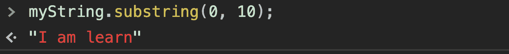
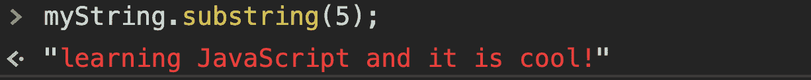
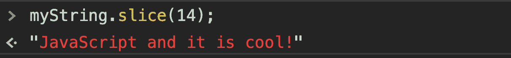
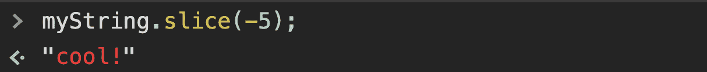
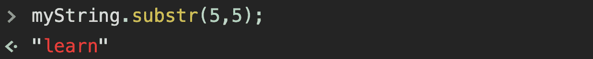

# JavaScript 子串示例——JS 中的 Slice、Substr 和 Substring 方法

> 原文：<https://www.freecodecamp.org/news/javascript-substring-examples-slice-substr-and-substring-methods-in-js/>

在日常编程中，我们经常需要使用字符串。幸运的是，JavaScript 中有许多内置方法可以帮助我们处理数组、字符串和其他数据类型。我们可以使用这些方法进行各种操作，比如搜索、替换、连接字符串等等。

从字符串中获取子串是 JavaScript 中最常见的操作之一。在本文中，您将学习如何通过使用 3 种不同的内置方法来获取子串。但是首先，让我简单解释一下什么是子串。

### 什么是子串？

子字符串是另一个字符串的子集:

```
"I am learning JavaScript and it is cool!"  -->  Original String

"I am learning JavaScript"  -->  Substring

"JavaScript is cool!"  -->  Another Substring
```

就像上面的例子一样，在某些情况下，我们需要从一个完整的句子或段落中获取一个或多个子字符串。现在让我们看看如何在 JavaScript 中以 3 种不同的方式做到这一点。

**您还可以在这里观看示例用法的视频版本:**

[https://www.youtube.com/embed/8um4gEiv5mg?feature=oembed](https://www.youtube.com/embed/8um4gEiv5mg?feature=oembed)

## 1.substring()方法

让我们从 substring()方法开始。这个方法基本上是获取原始字符串的一部分，并将其作为新字符串返回。substring 方法需要两个参数:

```
string.substring(startIndex, endIndex);
```

*   **startIndex** :表示子串的起点
*   **endIndex** :表示子串的结束点(可选)

让我们看一个例子中的用法。假设我们有下面的示例字符串:

```
const myString = "I am learning JavaScript and it is cool!";
```

现在，如果我们将 startIndex 设置为 0，将 endIndex 设置为 10，那么我们将获得原始字符串的前 10 个字符:



**The first character's index is always 0**

但是，如果我们在本例中只设置了起始索引而没有设置结束索引:



然后我们得到一个子串，从第 6 个字符开始，一直到原始字符串的末尾。

**一些附加点:**

*   如果 startIndex = endIndex，substring 方法返回一个空字符串
*   如果 startIndex 和 endIndex 都大于字符串的长度，则返回一个空字符串
*   如果 startIndex > endIndex，那么 substring 方法交换参数并返回一个子字符串，假设为 endIndex > startIndex

## 2.slice()方法

slice()方法类似于 substring()方法，它也返回原始字符串的子字符串。切片方法也需要相同的两个参数:

```
string.slice(startIndex, endIndex);
```

*   **startIndex** :表示子串的起点
*   **endIndex** :表示子串的结束点(可选)

#### **substring()和 slice()方法的共同点:**

*   如果我们没有设置结束索引，那么我们得到一个从给定索引号开始直到原始字符串结束的子字符串:



*   如果我们同时设置了 startIndex 和 endIndex，那么我们将得到原始字符串的给定索引号之间的字符:


*   如果 startIndex 和 endIndex 大于字符串的长度，则返回空字符串

#### **切片( )方法的区别:**

*   如果 startIndex > endIndex，slice()方法返回一个空字符串
*   如果 startIndex 是负数，则第一个字符从字符串的末尾开始(反向):



> **注意:**我们也可以对 JavaScript 数组使用 slice()方法。你可以在这里找到[我的另一篇关于切片方法的文章](https://www.freecodecamp.org/news/lets-clear-up-the-confusion-around-the-slice-splice-split-methods-in-javascript-8ba3266c29ae/)来看看数组的用法。

## 3.substr()方法

根据 Mozilla 文档，substr()方法被认为是一个遗留函数，应该避免使用。但是我仍然会简要地解释它的作用，因为你可能会在老的项目中看到它。

substr()方法也返回原始字符串的子字符串，并需要两个参数:

```
string.substring(startIndex, length);
```

*   **startIndex** :表示子串的起点
*   **长度**:包含的字符数(可选)

您可以在这里看到不同之处:substr()方法期望第二个参数是长度，而不是 endIndex:



在本例中，它基本上从给定的 startIndex 开始计算 5 个字符，并将其作为子字符串返回。

但是，如果我们不定义第二个参数，它将返回到原始字符串的末尾(就像前面两个方法一样):


> **注意:**所有 3 个方法都将子串作为新的字符串返回，并且它们不改变原始字符串。

## 包裹

这是 JavaScript 中获取子串的三种不同方法。在处理编程中的各种事情时，JS 中有许多其他内置方法确实对我们有很大帮助。如果你觉得这篇文章有帮助，请在社交媒体上分享。

**如果你想了解更多关于 web 开发的知识，欢迎在 Youtube 上关注我**[](https://www.youtube.com/channel/UC1EgYPCvKCXFn8HlpoJwY3Q)****！****

**感谢您的阅读！**