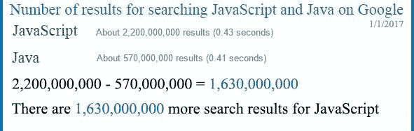
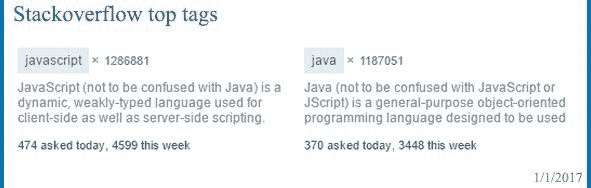
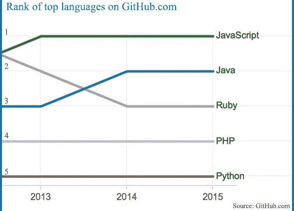
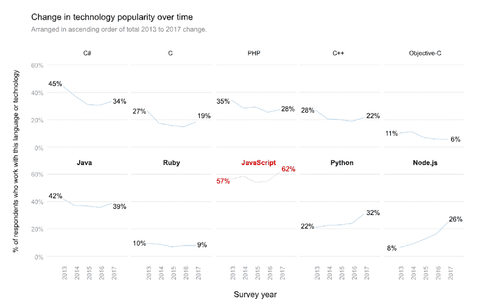

# JavaScript:有趣的部分

> 原文：<https://www.freecodecamp.org/news/javascript-the-fun-parts/>

那是现代网络的最初几年。人们已经厌倦了等待几分钟，等待他们的连接传输 8 位数据，告诉他们*“对不起，你的密码必须包含一个&或一个%。请再试一次。”*他们想要更多的即时反馈。一些感觉更像桌面应用的东西。

终于在 1995 年 5 月的一个雨夜，伟大的冠军诞生了。他的父亲 Brendan Eich 以他成功的祖父 Java 的名字给他取名 JavaScript。

([奔驰专利创始人卡尔·本茨](https://en.wikipedia.org/wiki/Karl_Benz)被认为是第一辆实用汽车之父，JavaScript 是所有浏览器的主引擎。如果我们叫他网络奔驰，这就是布兰登的样子？)

Mr. Eich, father of the champion

* * *

### JavaScript:帝国的崛起

当 JavaScript 问世时，没有人认为它会像今天这样流行。JavaScript 是一个真正的省时工具，因为它的浏览器端验证。 ****但是到底发生了什么导致 JavaScript 增长如此之快呢？****

在我学习 JavaScript 之前，我曾经用 VB6 语言编写程序。但是 VB6 不是独立的。它需要自己的平台来运行。JavaScript 如此流行的一个主要原因是几乎所有的设备都有浏览器。简而言之:JavaScript 不会把你限制在一个平台或一种设备上。你可以在任何东西上运行它。

JavaScript 的进步和流行并不是秘密，但是下面你可以看到 JavaScript 是如何与其他语言相媲美的。

#### **网页上有更多的 JavaScript 内容:**

搜索引擎在其搜索下方显示找到的结果数量；这是 Java 和 JavaScript 的搜索结果。

Google result for searching Java and JavaScript

#### **有更多的人在学习它:**

堆栈溢出标签和任何标签被问的问题的数量，它可以向我们显示有多少人正在学习标签这是一项技术；栈溢出标签也是检查一项技术如何发展及其受欢迎程度的好方法。

JavaScript is the most popular tag of Stack Overflow

#### **GitHub 上最流行的语言:**

根据 GitHub 的说法，JavaScript 是 GitHub 最受欢迎的语言，其次是 Java、Ruby 和 PHP。

#### JavaScript 已经是最流行的了，但它仍在快速增长

Stack Overflow 每年都会进行一次调查，今年的调查结果很有意思，也有值得借鉴的好东西。调查结果的下图显示 JavaScript 比以前增长得更快。

Source: [Stack Overflow developer survey 2017](http://stackoverflow.com/insights/survey/2017/?utm_source=so-owned&utm_medium=hero&utm_campaign=dev-survey-2017&utm_content=hero-questions#technology-languages-over-time)

### JavaScript 仍然被误解

所有的编程语言都有自己的规则、语法和概念，每一种语言都在某些方面是完美的，没有一种语言是完全完美的，我们不应该期望一种编程语言是万事通而不是大师。这就是为什么许多项目应该选择不同的编程语言来为他们软件的每个部分带来更好的性能。

公平地说，JavaScript 没有其他编程语言拥有的一些概念，但它可能会回到语言设计目标。JavaScript 目前公认的问题之一是缺乏静态类型，这可能会在大型应用程序中造成问题。这就是优雅的[类型脚本](https://github.com/Microsoft/TypeScript)被创建的原因。

> JavaScript 从未真正被设计来编写大型应用程序，事实上，它是在大约 3 周内发明的，在 90 年代中期，作为对 Java 的快速反应…，对于 Brendan Eich 来说，他在 3 周内完成了它，他实际上做了一件了不起的工作，JavaScript 可能是为 100 行或 1000 行代码设计的，现在人们定期构建 100，000 行应用程序，如果不是百万行应用程序的话。——*******，以打字稿、Turbo Pascal、Delphi 著称，是 C#***** *的首席架构师(来源:* [*本视频*](http://video.ch9.ms/ch9/4ae3/062c336d-9cf0-498f-ae9a-582b87954ae3/B881_mid.mp4) *，时间:01:20)***

**毫无疑问，JavaScript 的进步归功于浏览器及其对好东西的支持，如响应式 web 设计、WebGL、 [WebRTC](https://webrtc.org/) 以及许多使 JavaScript 更有用的更酷的东西。如今，开发人员正在使用 JavaScript 进行游戏开发、数据可视化、移动应用程序、后端开发以及其他有趣的事情。**

* * *

### **有动力学习 JavaScript 或者成为更好的 JavaScript 开发人员？让我们开始吧。**

**假设你已经知道一些 JavaScript 或者你是一个初学者。不要浪费时间，直接进入您喜欢的 IDE，开始编写您想要的代码。**

**最快的学习方法是 ****边做边学**** ，但是这种方法有一个问题。有些技巧你不知道或者你从来没有听说过，但是你在不知道它们的情况下编写你的代码，如果不在某个地方阅读它们，你很难学习那些规则或者技巧。您已经知道可以使用 ****var**** 关键字定义一个变量，但是您可能不知道如果不使用 ****var**** 关键字，这个变量将是全局的，不管它定义在哪里。**

**你最终会学到你需要知道的东西，但这是很难做到的。事实上，你可以边做 边学 ****的最好地方之一是 [freeCodeCamp](https://www.freecodecamp.com/) ，你可以通过 freeCodeCamp 的自定进度编码挑战，建立项目，并获得证书。这就像一头扎进代码，但仍然知道自己在做什么，并以快速有效的方式学习技巧和规则。******

#### ****学习 JavaScript 的问题****

**JavaScript 有很多技术和库让初学者觉得很恐怖。有一些著名的名字，也许你从来没有用过，但你会经常听到。**

**有些人认为*“这* [*通天塔*](https://babeljs.io/) *是什么东西大家都在谈论。所有著名的开源项目都在用它！”或者，“等等——我该用*[*browser ify*](http://browserify.org/)*还是*[*web pack*](https://webpack.github.io/)*？Gulp 和 Grunt 是从哪里来的？啊，上周又推出了一个新的库或框架！我都学不会？”***

**是的，你不能也不应该马上学会所有的方法。这些技术、框架和库旨在帮助您更智能、更快速、更轻松地工作。当你发现一些有趣的东西值得在你的项目中使用，或者是对你的一个需求的回答，那么你应该面带美丽的微笑继续学习，同时记住英语谚语*“需要是发明之母”***

> **“我鼓励人们记住我们都在同一条船上，我们的工具就在这里帮助我们。如果他们不这样做，我们应该让他们离开。”——[艾迪·奥斯马尼](https://medium.com/@addyosmani) ( [链接到他的故事](https://medium.com/@addyosmani/totally-get-your-frustration-ea11adf237e3#.t599ja0j3) )**

* * *

**最后，我要感谢[语法上的](https://www.grammarly.com/grammar-check)，因为他们完美的工具，让我可以用英语写文章，尽管我的母语不是英语。[试试看](https://www.grammarly.com/grammar-check)即使你的母语是英语**