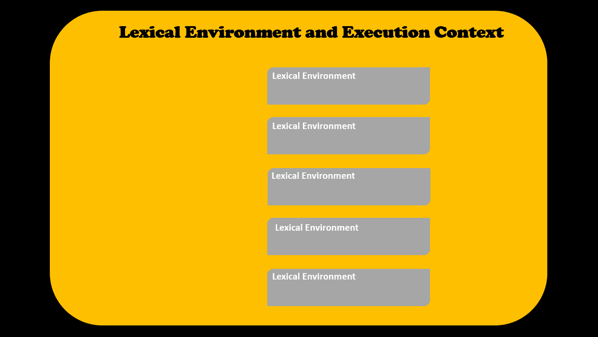

# 为 JS 初学者解释的 JavaScript“this”关键字+ 5 个键绑定规则

> 原文：<https://www.freecodecamp.org/news/javascript-this-keyword-binding-rules/>

JavaScript 的`this`关键字是该语言最难掌握的方面之一。但是它对于编写更高级的 JavaScript 代码至关重要。

在 JavaScript 中，`this`关键字允许我们:

*   在不同的执行上下文中重用函数。这意味着，一个函数一旦被定义，就可以使用`this`关键字为不同的对象调用。
*   当我们调用一个方法时，在当前执行上下文中标识对象。

`this`关键字与 JavaScript 函数紧密相关。当谈到`this`时，最基本的事情是理解一个函数在哪里被调用。因为在函数被调用之前，我们不知道`this`关键字中有什么。

`this`的用法可以分为五个不同的`binding`方面。在本文中，我们将通过示例来了解这五个方面。

# **一、什么是绑定？**

在 JavaScript 中，一个`Lexical Environment`是你的代码实际被编写的地方。在下面的例子中，函数`sayName()`中的变量名是`lexically`。

```
function sayName() {
  let name = 'someName';
  console.log('The name is, ', name);
 }
```

一个`Execution Context`指的是当前正在运行的代码和其他帮助它运行的东西。可以有很多可用的词法环境，但是当前运行的*是由 **[执行上下文](https://blog.greenroots.info/understanding-javascript-execution-context-like-never-before-ckb8x246k00f56hs1nefzpysq)** 管理的。*

*

*Lexical Environment vs Execution Context** 

*每个执行上下文包含一个`Environment Record`。当 JavaScript 引擎执行代码时，变量和函数名被添加到环境记录中。*

*这种现象在 JavaScript 中被称为`Binding`。`Binding`帮助将标识符(变量、函数名)与`execution context`的`this`关键字相关联。*

*如果你现在觉得有点难以理解，不要担心。随着我们的进行，你会更好地理解。*

# *规则 JavaScript 隐式绑定是如何工作的*

*隐式绑定涵盖了大多数处理`this`关键字的用例。*

*当我们调用一个对象的方法时，我们使用点(。)符号来访问它。在隐式绑定中，需要在调用时检查与方法相邻的对象。这决定了`this`绑定到什么。*

*让我们看一个例子来更好地理解它。*

```
*`let blog = {
    name: 'Tapas',
    address: 'freecodecamp',
    message: function() {
        console.log(`${this.name} blogs on ${this.address}`);
    }
};

blog.message();`*
```

*这里的`this`被绑定到 blog 对象。我们知道这一点是因为我们调用了 blog 对象上的方法`message()`。所以`this.name`要在控制台中记录****Tapas****`this.address`要在控制台中记录 *freeCodeCamp* 。*

让我们看另一个例子来更好地理解这个概念:

```
 function greeting(obj) {
      obj.logMessage = function() {
          console.log(`${this.name} is ${this.age} years old!`);
      }
  };

  const tom = {
      name: 'Tom',
      age: 7
  };

  const jerry = {
      name: 'jerry',
      age: 3
  };

  greeting(tom);
  greeting(jerry);

  tom.logMessage ();
  jerry.logMessage (); 
```

在这个例子中，我们有两个对象，`tom`和`jerry`。我们通过附加一个叫做`logMessage()`的方法来装饰(增强)这些对象。

注意，当我们调用`tom.logMessage()`时，它是在`tom`对象上被调用的。所以`this`被绑定到`tom`对象，它记录值 ****汤姆** 和*7(`this.name`等于汤姆，`this.age`在这里是 7)。当调用`jerry.logMessage()`时，同样适用。*

# 规则 JavaScript 显式绑定如何工作

我们已经看到 JavaScript 创建了一个环境来执行我们编写的代码。它负责在 **创建阶段** 为变量、函数、对象等创建内存。最后它执行 **执行阶段** 中的代码。这种特殊的环境被称为`Execution Context`。

在一个 JavaScript 应用程序中可以有许多这样的环境(执行上下文)。每个执行上下文独立于其他上下文运行。

但有时，我们可能希望在另一个执行上下文中使用一个执行上下文中的内容。这就是显式绑定发挥作用的地方。

在显式绑定中，当函数在对象的执行上下文之外时，我们可以用对象调用函数。

有三个非常特殊的方法，`call()`、`apply()`和`bind()`帮助我们实现显式绑定。

## JavaScript `call()`方法如何工作

使用`call()`方法，调用函数的上下文将作为参数传递给`call()`。让我们通过一个例子来看看它是如何工作的:

```
let getName = function() {
     console.log(this.name);
 }

let user = {
   name: 'Tapas',
   address: 'Freecodecamp'  
 };

getName.call(user);
```

这里的`call()`方法是在一个名为`getName()`的函数上调用的。`getName()`功能只记录`this.name`。但是这里的`this`是什么？这由传递给`call()`方法的内容决定。

这里，`this`将绑定到用户对象，因为我们已经将用户作为参数传递给了`call()`方法。所以`this.name`应该记录用户对象的 name 属性的值，即 **Tapas** 。

在上面的例子中，我们只传递了一个参数给`call()`。但是我们也可以传递多个参数给`call()`，就像这样:

```
let getName = function(hobby1, hobby2) {
     console.log(this.name + ' likes ' + hobby1 + ' , ' + hobby2);
 }

let user = {
   name: 'Tapas',
   address: 'Bangalore'  
 };

let hobbies = ['Swimming', 'Blogging'];

getName.call(user, hobbies[0], hobbies[1]);
```

这里，我们向`call()`方法传递了多个参数。第一个参数必须是调用函数的对象上下文。其他参数可能只是可以使用的值。

这里我将 **游泳** 和 **博客** 作为两个参数传递给`getName()`函数。

你注意到这里的一个痛点了吗？在`call()`的情况下，参数需要一个接一个地传递——这不是一个聪明的做事方式！这就是我们的下一个方法`apply()`的由来。

## JavaScript `apply()`方法如何工作

这种将参数传递给`call()`方法的忙乱方式可以通过另一种叫做`apply()`的方法来解决。它和`call()`完全一样，但是允许你更方便地传递参数。看一看:

```
let getName = function(hobby1, hobby2) {
     console.log(this.name + ' likes ' + hobby1 + ' , ' + hobby2);
 }

let user = {
   name: 'Tapas',
   address: 'Bangalore'  
 };

let hobbies = ['Swimming', 'Blogging'];

getName.apply(user, hobbies);
```

在这里，我们能够传递一组参数，这比一个接一个地传递要方便得多。

提示:当你只有一个值参数或者没有值参数要传递时，使用`call()`。当您有多个值参数要传递时，使用`apply()`。

## JavaScript `bind()`方法如何工作

`bind()`方法类似于`call()`方法，但有一点不同。与直接调用函数的`call()`方法不同，`bind()`返回一个全新的函数，我们可以调用它。

```
let getName = function(hobby1, hobby2) {
     console.log(this.name + ' likes ' + hobby1 + ' , ' + hobby2);
 }

let user = {
   name: 'Tapas',
   address: 'Bangalore'  
 };

let hobbies = ['Swimming', 'Blogging'];
let newFn = getName.bind(user, hobbies[0], hobbies[1]); 

newFn();
```

这里的`getName.bind()`并不直接调用函数`getName()` 。它返回一个新函数，`newFn`，我们可以调用它作为`newFn()`。

# 规则 3:JavaScript`new`绑定

`new`关键字用于从构造函数创建一个对象。

```
let Cartoon = function(name, character) {
     this.name = name;
     this.character = character;
     this.log = function() {
         console.log(this.name +  ' is a ' + this.character);
     }
 };
```

您可以使用关键字`new`创建对象，如下所示:

```
 let tom = new Cartoon('Tom', 'Cat');
 let jerry = new Cartoon('Jerry', 'Mouse');
```

当用`new`关键字调用一个函数时，JavaScript 会在函数中创建一个内部的`this`对象(比如，this = {})。新创建的`this`绑定到使用`new`关键字创建的对象。

听起来很复杂？好，我们来分解一下。走这条线，

```
let tom = new Cartoon('Tom', 'Cat');
```

这里使用关键字`new`调用功能卡通。所以内部创建的`this`会绑定到这里正在创建的新对象，也就是 **汤姆** 。

# 规则 4: JavaScript 全局对象绑定

你认为下面代码的输出会是什么？这里的`this`绑定的是什么？

```
let sayName = function(name) {
    console.log(this.name);
};

window.name = 'Tapas';
sayName();
```

如果`this`关键字没有被`implicit`、`explicit`或`new`中的任何一个绑定解析，那么`this`被绑定到`window(global)`对象。

不过有一个例外。JavaScript ****严格模式**** 不允许这种默认绑定。

```
"use strict";
function myFunction() {
  return this;
}
```

在上面的例子中，`this`就是`undefined.`

# 规则 JavaScript 中的 HTML 事件元素绑定

在 HTML 事件处理程序中，`this`绑定到接收事件的 HTML 元素。

```
<button onclick="console.log(this)">Click Me!</button>
```

当您单击按钮时，是控制台中的输出日志:

```
"<button onclick='console.log(this)'>Click Me!</button>"
```

您可以使用`this`关键字更改按钮样式，如下所示:

```
<button onclick="this.style.color='teal'">Click Me!</button>
```

但是当你在按钮上调用一个函数时要注意，点击并在函数中使用`this`。

```
<button onclick="changeColor()">Click Me!</button>
```

还有 JavaScript:

```
function changeColor() {
  this.style.color='teal';
}
```

上述代码不会像预期的那样工作。正如我们在规则 4 中看到的，这里`this`将被绑定到全局对象(在‘非严格’模式下)那里没有*样式的*对象来设置颜色。

# 概括起来

总而言之，

*   在隐式绑定的情况下，`this`绑定到与点(。)运算符，同时调用该方法。
*   在显式绑定的情况下，当函数在对象的执行上下文之外时，我们可以用对象调用函数。方法`call()`、`apply()`和`bind()`在这里起了很大的作用。
*   当用`new`关键字调用一个函数时，函数中的`this`关键字绑定到正在构造的新对象。
*   当`this`关键字没有被`implicit`、`explicit`或`new`中的任何一个绑定解析时，那么`this`被绑定到`window(global)`对象。在 JavaScript 的严格模式下，`this`将是未定义的。
*   在 HTML 事件处理程序中，`this`绑定到接收事件的 HTML 元素。

还有一种情况是`this`的行为有所不同，比如对于`ES6 arrow function` s。我们将在以后的文章中研究这个问题。

我希望你觉得这篇文章很有见地。你可能也喜欢，

*   [JavaScript 吊装内部构件](https://blog.greenroots.info/javascript-hoisting-internals-ckbuavl6f00dllas14hl9ckq1)
*   [前所未有地了解 JavaScript 执行上下文](https://blog.greenroots.info/understanding-javascript-execution-context-like-never-before-ckb8x246k00f56hs1nefzpysq)
*   [猫和老鼠的 JavaScript 作用域基础](https://blog.greenroots.info/javascript-scope-fundamentals-with-tom-and-jerry-ckcq723h4007vkxs18dxa97ae)
*   [用例子理解 JavaScript 闭包](https://blog.greenroots.info/understanding-javascript-closure-with-example-ckd17fci5001iw5s1fju4f8r0)

如果这篇文章是有用的，请分享它，这样其他人也可以阅读它。你可以在 Twitter 上@我( [@tapasadhikary](https://twitter.com/tapasadhikary) )发表评论，或者随时关注我。