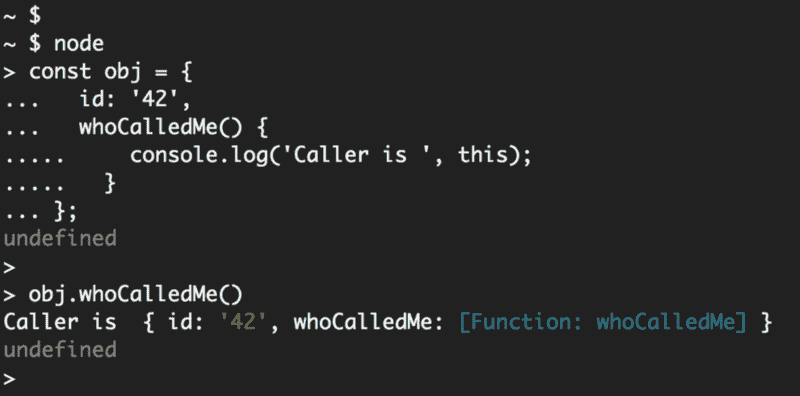
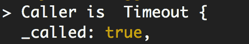

# JavaScript 计时器:您需要知道的一切

> 原文：<https://www.freecodecamp.org/news/javascript-timers-everything-you-need-to-know-5f31eaa37162/>

几周前，我在推特上发布了这个面试问题:

******继续之前先回答你脑子里的问题******

*大约一半的推特回复是错误的。*答案是**不是** V8(或者其他 VM)！！虽然以“JavaScript 计时器”而闻名，但像`setTimeout`和`setInterval`这样的函数并不是 ECMAScript 规范或任何 JavaScript 引擎实现的一部分。计时器功能是由浏览器实现的，不同浏览器的实现方式会有所不同。计时器也由 Node.js 运行时本身实现。

在浏览器中，主要的定时器函数是`Window`接口的一部分，该接口有一些其他的函数和对象。该接口使其所有元素在主 JavaScript 范围内全局可用。这就是为什么你可以在浏览器的控制台中直接执行`setTimeout`的原因。

在 Node 中，计时器是`global`对象的一部分，其行为类似于浏览器的`Window`界面。你可以在这里看到节点[中定时器的源代码。](https://github.com/nodejs/node/blob/master/lib/timers.js)

有些人可能会认为这是一个糟糕的面试问题——为什么知道这一点很重要？！作为一名 JavaScript 开发人员，我认为您应该知道这一点，因为如果您不知道，这可能表明您没有完全理解 V8(和其他虚拟机)如何与浏览器和节点交互。

我们来做几个关于定时器功能的例子和挑战，好吗？

> **更新:**这篇文章现在是我的“Node.js 完整介绍”的一部分。
> 你可以在[这里](https://jscomplete.com/g/js-timers)看到它的更新版本。

### 延迟函数的执行

计时器函数是高阶函数，可用于延迟或重复其他函数的执行(这些函数作为第一个参数接收)。

这里有一个关于延迟的例子:

```
// example1.js
setTimeout(
  () => {
    console.log('Hello after 4 seconds');
  },
  4 * 1000
);
```

本例使用`setTimeout`将问候语的打印延迟 4 秒。`setTimeout`的第二个参数是延迟(毫秒)。这就是为什么我把 4 乘以 1000 变成 4 秒。

`setTimeout`的第一个参数是将被延迟执行的函数。

如果您使用`node`命令执行`example1.js`文件，Node 将暂停 4 秒钟，然后它将打印问候消息(之后退出)。

注意，`setTimeout`的第一个参数只是一个函数**引用**。它不必像`example1.js`那样是一个内嵌函数。下面是不使用内联函数的相同示例:

```
const func = () => {
  console.log('Hello after 4 seconds');
};
setTimeout(func, 4 * 1000);
```

### 传递参数

如果使用`setTimeout`来延迟其执行的函数接受任何参数，我们可以使用`setTimeout`本身的剩余参数(在我们到目前为止了解的 2 个参数之后)来将参数值传递给延迟的函数。

```
// For: func(arg1, arg2, arg3, ...)
// We can use: setTimeout(func, delay, arg1, arg2, arg3, ...)
```

这里有一个例子:

```
// example2.js
const rocks = who => {
  console.log(who + ' rocks');
};
setTimeout(rocks, 2 * 1000, 'Node.js');
```

上面的`rocks`函数延迟了 2 秒，它接受一个`who`参数，而`setTimeout`调用将值“ *Node.js* ”作为那个`who`参数。

用`node`命令执行`example2.js`，2 秒后会打印出“ *Node.js rocks* ”。

### 计时器挑战#1

使用您目前所学的关于`setTimeout`的知识，在相应的延迟后打印以下两条消息。

*   4 秒后打印消息“*你好*”4 秒后
*   8 秒后打印消息“ *Hello after 8 秒后*”。

**约束** :
您只能在您的解决方案中定义一个函数，其中包括内联函数。这意味着许多`setTimeout`调用将不得不使用完全相同的函数。

#### 解决办法

我是这样解决这个挑战的:

```
// solution1.js
const theOneFunc = delay => {
  console.log('Hello after ' + delay + ' seconds');
};
setTimeout(theOneFunc, 4 * 1000, 4);
setTimeout(theOneFunc, 8 * 1000, 8);
```

我让`theOneFunc`接收一个`delay`参数，并在打印的消息中使用那个`delay`参数的值。这样，该函数可以根据我们传递给它的延迟值打印不同的消息。

然后我在两个`setTimeout`调用中使用了`theOneFunc`，一个在 4 秒后触发，另一个在 8 秒后触发。这两个`setTimeout`调用都有一个**第三个**参数来代表`theOneFunc`的`delay`参数。

用`node`命令执行`solution1.js`文件将打印出挑战要求，4 秒后的第一条消息，8 秒后的第二条消息。

### 重复执行一个函数

如果我让你永远每 4 秒钟打印一条信息，会怎么样？

虽然您可以将`setTimeout`放入一个循环中，但是 timers API 也提供了`setInterval`函数，这将实现永远做某事的要求。

下面是 setInterval 的一个例子:

```
// example3.js
setInterval(
  () => console.log('Hello every 3 seconds'),
  3000
);
```

该示例将每 3 秒钟打印一次消息。用`node`命令执行`example3.js`会让 Node 永远打印这个消息，直到你杀死这个进程(用 *CTRL+C* )。

### 取消计时器

因为调用定时器函数调度一个动作，所以该动作也可以在执行之前被取消。

对`setTimeout`的调用返回一个定时器“ID ”,你可以使用这个定时器 ID 和一个`clearTimeout`调用来取消这个定时器。这里有一个例子:

```
// example4.js
const timerId = setTimeout(
  () => console.log('You will not see this one!'),
  0
);
clearTimeout(timerId);
```

这个简单的计时器应该在`0` ms 后触发(使其立即触发)，但它不会触发，因为我们正在捕获`timerId`值，并在调用`clearTimeout`后立即取消它。

当我们用`node`命令执行`example4.js`时，Node 将不打印任何内容，进程将退出。

顺便说一下，在 Node.js 中，有另一种方法来处理带有`0` ms 的`setTimeout`。node . js 计时器 API 有另一个名为`setImmediate`的函数，它基本上与带有`0` ms 的`setTimeout`是一样的，但我们不必在那里指定延迟:

```
setImmediate(
  () => console.log('I am equivalent to setTimeout with 0 ms'),
);
```

*`setImmediate`功能[并非在所有浏览器中都可用](https://developer.mozilla.org/en-US/docs/Web/API/Window/setImmediate)。不要用于前端代码。*

就像`clearTimeout`一样，也有一个`clearInterval`函数，它做同样的事情，但是是针对`setInerval`调用，也有一个`clearImmediate`调用。

### 计时器延迟不是一件有保证的事情

在前面的例子中，您是否注意到在`0` ms 之后用`setTimeout`执行某件事并不意味着立即执行它(在 setTimeout 行之后)，而是在脚本中的所有其他事情(包括 clearTimeout 调用)之后立即执行它？

让我用一个例子来说明这一点。这里有一个简单的`setTimeout`调用，它应该在半秒钟后触发，但它不会:

```
// example5.js
setTimeout(
  () => console.log('Hello after 0.5 seconds. MAYBE!'),
  500,
);
for (let i = 0; i < 1e10; i++) {
  // Block Things Synchronously
}
```

在这个例子中定义了定时器之后，我们用一个大的`for`循环同步阻塞运行时。`1e10`是前面带有`10`零的`1`，因此该循环是一个`10`十亿次循环(基本上模拟一个繁忙的 CPU)。当这个循环运行时，节点什么也做不了。

这在实践中当然是一件非常糟糕的事情，但是它将帮助您理解`setTimeout`延迟不是一件有保证的事情，而是一件**最小**的事情。`500`毫秒意味着最小延迟为`500`毫秒。实际上，脚本打印问候语需要更长的时间。它必须等待阻塞循环先完成。

### 计时器挑战#2

写一个脚本，每秒打印消息“ **Hello World** ”，但只有 5 次。5 次之后，脚本应该输出消息“*完成*，并让节点流程退出。

**限制**:你不能在这次挑战中使用`setTimeout`叫牌。
**提示**:你需要一个计数器。

#### 解决办法

我是这样解决这个问题的:

```
let counter = 0;
const intervalId = setInterval(() => {
  console.log('Hello World');
  counter += 1;
if (counter === 5) {
    console.log('Done');
    clearInterval(intervalId);
  }
}, 1000);
```

我将一个`counter`值初始化为`0`，然后开始一个`setInterval`调用来获取它的 id。

延迟功能将打印消息，并每次递增计数器。在延迟函数中，`if`语句将检查我们现在是否处于`5`时刻。如果是这样，它将打印“*完成*，并使用捕获的`intervalId`常量清除间隔。间隔延迟为`1000` ms。

### 谁确切地“调用”了延迟的函数？

当您在常规函数中使用 JavaScript `this`关键字时，如下所示:

```
function whoCalledMe() {
  console.log('Caller is', this);
}
```

`this`关键字中的值将代表函数的**调用者**。如果您在节点 REPL 内部定义了上面的函数，调用方将是`global`对象。如果你在浏览器的控制台中定义函数，调用者将是`window`对象。

让我们将函数定义为对象的属性，这样会更清楚一些:

```
const obj = { 
  id: '42',
  whoCalledMe() {
    console.log('Caller is', this);
  }
};
// The function reference is now: obj.whoCallMe
```

现在，当您使用引用直接调用`obj.whoCallMe`函数时，调用者将是`obj`对象(由其 id 标识):



现在的问题是，如果我们将对`obj.whoCallMe`的引用传递给一个`setTimetout`调用，那么调用者会是谁呢？

```
// What will this print??
setTimeout(obj.whoCalledMe, 0);
```

在这种情况下，打电话的人会是谁？

根据定时器功能执行的位置，答案是不同的。在这种情况下，你根本无法确定打电话的人是谁。您失去了对调用者的控制，因为计时器实现现在将调用您的函数。如果您在节点 REPL 中测试它，您将得到一个`Timetout`对象作为调用者:



注意，只有在常规函数中使用 JavaScript 的`this`关键字时，这才重要。如果你使用的是箭头函数，你根本不需要担心调用者。

### 计时器挑战#3

编写一个脚本，以不同的延迟连续打印消息“ *Hello World* ”。开始时延迟 1 秒，然后每次延迟增加 1 秒。第二次将有 2 秒的延迟。第三次会有 3 秒的延迟，以此类推。

在打印的消息中包括延迟。预期输出如下所示:

```
Hello World. 1
Hello World. 2
Hello World. 3
...
```

**约束:**你只能用`const`来定义变量。不能用`let`或者`var`。

#### 解决办法

因为延迟量在这个挑战中是一个变量，所以我们不能在这里使用`setInterval`，但是我们可以在一个递归调用中使用`setTimeout`手动创建一个间隔执行。第一个执行的带有 setTimeout 的函数将创建另一个定时器，依此类推。

此外，因为我们不能使用 let/var，所以我们不能在每次递归调用中使用计数器来增加延迟，但是我们可以在递归调用期间使用递归函数参数来增加延迟。

这里有一个可能的方法来解决这个挑战:

```
const greeting = delay =>
  setTimeout(() => {
    console.log('Hello World. ' + delay);
    greeting(delay + 1);
  }, delay * 1000);
greeting(1);
```

### 计时器挑战#4

编写一个脚本，使用与挑战#3 相同的可变延迟概念连续打印消息" *Hello World* ",但这一次，在每个主延迟间隔中以 5 条消息为一组。开始时，前 5 条消息延迟 100 毫秒，接下来的 5 条消息延迟 200 毫秒，然后是 300 毫秒，依此类推。

脚本应该是这样的:

*   在 100 毫秒时，脚本将开始打印“Hello World ”,并以 100 毫秒的间隔重复 5 次。第一条消息将在 100 毫秒后出现，第二条消息将在 200 毫秒后出现，依此类推。
*   在前 5 条消息之后，脚本应该将主延迟增加到 200 毫秒。因此，第 6 条消息将以 500 毫秒+200 毫秒(700 毫秒)打印，第 7 条消息以 900 毫秒打印，第 8 条消息以 1100 毫秒打印，依此类推。
*   在 10 条消息之后，脚本应该将主延迟增加到 300 毫秒。所以第 11 条消息应该以 500ms + 1000ms + 300ms (18000ms)打印。第 12 条消息应在 21000 毫秒时打印，依此类推。
*   永远延续这个模式。

在打印的消息中包括延迟。预期输出如下所示(不带注释):

```
Hello World. 100  // At 100ms
Hello World. 100  // At 200ms
Hello World. 100  // At 300ms
Hello World. 100  // At 400ms
Hello World. 100  // At 500ms
Hello World. 200  // At 700ms
Hello World. 200  // At 900ms
Hello World. 200  // At 1100ms
...
```

**约束:**只能使用`setInterval`调用(不能使用`setTimeout`)，并且只能使用一个 if 语句。

#### 解决办法

因为我们只能使用`setInterval`调用，所以我们也需要递归来增加下一个`setInterval`调用的延迟。此外，我们需要一个 if 语句来控制只在 5 次调用递归函数后才这样做。

这里有一个可能的解决方案:

```
let lastIntervalId, counter = 5;
const greeting = delay => {
  if (counter === 5) {
    clearInterval(lastIntervalId);
    lastIntervalId = setInterval(() => {
      console.log('Hello World. ', delay);
      greeting(delay + 100);
    }, delay);
    counter = 0;
  }
counter += 1;
};
greeting(100);
```

感谢阅读。

如果你刚刚开始学习 Node.js，我最近在 Pluralsight 发布了一个 [**初级课程，看看吧:**](https://jscomplete.com/c/nodejs-getting-started)


[https://jscomplete.com/c/nodejs-getting-started](https://jscomplete.com/c/nodejs-getting-started)