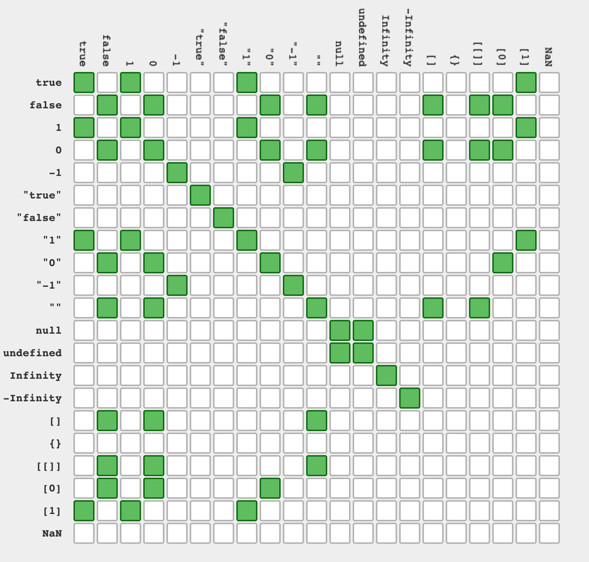

# JavaScript 三等号与双等号——用例子解释比较运算符

> 原文：<https://www.freecodecamp.org/news/javascript-triple-equals-sign-vs-double-equals-sign-comparison-operators-explained-with-examples/>

您可能在 JavaScript 中看到过双等号和三等号。但是它们是什么意思呢？

简而言之:`==`固有地转换类型，而`===`不转换类型。

Double Equals ( `==`)只检查值是否相等。它本身就有类型强制。这意味着在检查值之前，它会转换变量的类型以使它们相互匹配。

另一方面，Triple Equals ( `===`)不执行类型强制。它将验证被比较的变量是否具有相同的值**和相同类型的**。

好的——让我们通过几个例子来帮助你更好地理解它们的区别。对于其中的每一项，考虑这些语句的输出将是什么。

### 示例 1:

```
const foo = "test" 
const bar = "test"  

console.log(foo == bar) //true
console.log(foo === bar) //true 
```

`foo`和`bar`的值和类型相同。因此两者的结果都是`true`。

### 2:‌的例子

```
const number = 1234 
const stringNumber = '1234'  

console.log(number == stringNumber) //true
console.log(number === stringNumber)  //false 
```

这里`number`和`stringNumber`的值看起来很相似。然而，`number`的型号是`Number`,`stringNumber`的型号是`string`。即使值相同，类型也不相同。因此`==`检查返回`true`，但是当检查值**和**类型时，值是`false`。

### 示例 3:

```
console.log(0 == false) //true
console.log(0 === false) //false 
```

原因:价值相同，类型不同。类型强制

这是一个有趣的案例。用`false`检查时`0`的值相同。这是因为`0`和`false`对于 JavaScript 具有相同的值，但是当检查类型**和**值时，该值为假，因为`0`是`number`而`false`是`boolean`。

### 示例 4:

```
const str = ""

console.log(str == false) //true
console.log(str === false) //false
```

空字符串和`false`的值在 JavaScript 中是相同的。因此，`==`返回 true。然而，类型是不同的，因此`===`返回假。

## 什么时候该用`==`什么时候该用`===`？

如有疑问，使用`===`。这将使你免于一大堆潜在的错误。

如果您支持的用例对传入数据的类型可以稍微宽容一些，那么就使用`==`。例如，如果一个 API 接受来自客户端的`"true"`和`true`，那么使用`==`。简而言之，除非你有很强的用例，否则不要使用`==`。

这里有一个方便的 JavaScript 真值表供您参考，并向您展示 JavaScript 中的等式有多复杂:



Source: [https://dorey.github.io/JavaScript-Equality-Table/](https://dorey.github.io/JavaScript-Equality-Table/)

如果你喜欢这篇文章，一定要在 twitter 上关注我的更新。

> 问:一旦英国脱离欧盟，会释放出多少空间？
> 。
> 。
> 。
> 
> 答:1gb[# dev joke](https://twitter.com/hashtag/DevJoke?src=hash&ref_src=twsrc%5Etfw)[# not joke](https://twitter.com/hashtag/NotAJoke?src=hash&ref_src=twsrc%5Etfw)
> 
> — Shruti Kapoor (@shrutikapoor08) [October 4, 2019](https://twitter.com/shrutikapoor08/status/1180173695643348992?ref_src=twsrc%5Etfw)