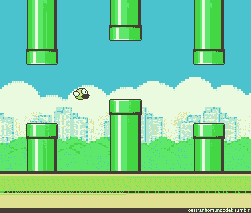

# 了解如何用 JavaScript 编写 Flappy Bird 和 Doodle Jump

> 原文：<https://www.freecodecamp.org/news/javascript-tutorial-flappy-bird-doodle-jump/>

游戏是最好玩的编程项目。一旦你完成了游戏，你就可以开始玩了！

我们在 freeCodeCamp.org YouTube 频道上发布了一个教程，通过构建两个流行的千禧年游戏来帮助你提高你的 JavaScript 技能。

在本教程中，开发人员兼教师 Ania Kubow 将向您展示如何用 JavaScript 创建 Doodle Jump 和 Flappy Bird。本教程非常适合那些懂一点 JavaScript 并想开始把所有东西放在一起制作真正的项目的人。

为了构建这两个游戏，您将练习超过 32 种 JavaScript 最流行的方法。这包括。forEach()，。push()，。shift()，。addEventListener()，。appendChild()，while 循环，类，构造函数等等。

I wonder what is at the end of this video?

以下是本教程涵盖的部分:

*   涂鸦跳跃游戏逻辑
*   设置游戏
*   创建涂鸦者
*   创建平台
*   创建平台类
*   移动平台
*   让涂鸦者跳起来
*   让涂鸦者倒下
*   用逻辑写游戏
*   连接键盘按键
*   让涂鸦者向左向右走
*   使用阵列工作移除和添加新平台
*   使用 while 循环移除网格的所有子级
*   添加分数
*   Flappy Bird 游戏逻辑
*   建立 Flappy Bird 项目
*   编写 Flappy Bird 开始游戏逻辑
*   让鸟跳起来
*   连接键盘按键
*   生成管道障碍物
*   移动障碍物
*   使用 setInterval()和 setTimeout()生成新的障碍
*   编写逻辑上的 Flappy Bird 游戏
*   将图像添加到项目
*   使用&&和||扩展冲突规则
*   添加 Flappy Bird 造型的最后阶段了解 z-index

在 freeCodeCamp.org YouTube 频道观看完整的课程(2 小时观看)。