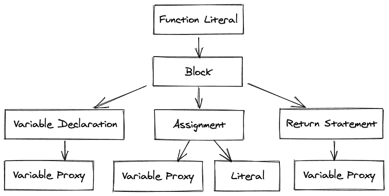
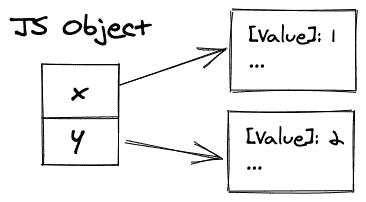
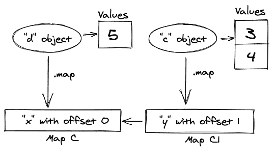
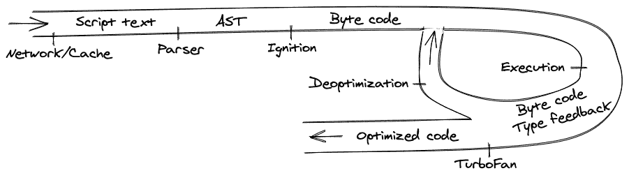

# JavaScript 如何工作:在 V8 引擎的引擎盖下

> 原文：<https://www.freecodecamp.org/news/javascript-under-the-hood-v8/>

今天我们将看看 JavaScript 的 V8 引擎，并弄清楚 JavaScript 到底是如何执行的。

在上一篇文章中，我们学习了浏览器是如何构建的，并获得了 Chromium 的[高级概述。让我们稍微回顾一下，这样我们就可以开始深入研究了。](https://www.chromium.org/developers/how-tos/getting-around-the-chrome-source-code)

## 背景

[Web 标准](https://www.w3.org/TR/)是浏览器实现的一组规则。他们定义并描述了[万维网](https://en.wikipedia.org/wiki/World_Wide_Web)的各个方面。

W3C 是一个为网络开发开放标准的国际组织。他们确保每个人都遵循相同的指导方针，而不必支持许多完全不同的环境。

一个现代的浏览器是一个相当复杂的软件，拥有数千万行代码的代码库。所以它被分成许多负责不同逻辑的模块。

浏览器最重要的两个部分是 JavaScript 引擎和渲染引擎。

[Blink](https://docs.google.com/presentation/d/1boPxbgNrTU0ddsc144rcXayGA_WF53k96imRH8Mp34Y/edit#slide=id.g60f92a5151_40_0) 是一个渲染引擎，负责整个渲染管道，包括 DOM 树、样式、事件和 V8 集成。它解析 DOM 树，解析样式，并确定所有元素的视觉几何。

在通过动画帧持续监视动态变化的同时，Blink 会在屏幕上绘制内容。JS 引擎是浏览器的一个重要部分——但是我们还没有进入这些细节。

### JavaScript 引擎 101

JavaScript 引擎执行并将 JavaScript 编译成本机代码。各大浏览器都开发了自己的 JS 引擎:谷歌的 Chrome 用 V8，Safari 用 JavaScriptCore，Firefox 用 SpiderMonkey。

我们将特别使用 V8，因为它在 Node.js 和 Electron 中使用，但其他引擎也是以同样的方式构建的。

每一步都将包含一个指向负责它的代码的链接，这样您就可以熟悉代码库并继续本文之外的研究。

我们将在 GitHub 上使用[V8 的镜像，因为它提供了一个方便且众所周知的 UI 来导航代码库。](https://github.com/v8/v8)

## 准备源代码

V8 要做的第一件事就是下载源代码。这可以通过网络、缓存或服务人员来完成。

一旦收到代码，我们需要以编译器可以理解的方式对其进行更改。这个过程称为解析，由两部分组成:扫描器和解析器本身。

[扫描器](https://github.com/v8/v8/blob/master/src/parsing/scanner.h)获取 JS 文件，并将其转换为已知令牌列表。在[的 keywords.txt 文件](https://github.com/v8/v8/blob/master/src/parsing/keywords.txt)中有一个所有 JS 令牌的列表。

[解析器](https://github.com/v8/v8/blob/master/src/parsing/parser.h)拾取它并创建一个[抽象语法树(AST)](https://github.com/v8/v8/tree/master/src/ast) :源代码的树表示。树的每个节点表示代码中出现的一个构造。

让我们看一个简单的例子:

```
function foo() {
  let bar = 1;
  return bar;
}
```

该代码将生成以下树形结构:



Example of AST tree

您可以通过执行前序遍历(根、左、右)来执行此代码:

1.  定义`foo`功能。
2.  声明`bar`变量。
3.  将`1`分配给`bar`。
4.  退出函数返回`bar`。

您还将看到`VariableProxy`——一个将抽象变量连接到内存中某个位置的元素。解决`VariableProxy`的过程称为**范围分析**。

在我们的例子中，这个过程的结果将是所有的`VariableProxy`都指向同一个`bar`变量。

## 准时制(JIT)范例

通常，要执行代码，需要将编程语言转换成机器代码。有几种方法可以说明这种转变如何以及何时发生。

转换代码最常见的方式是执行提前编译。它的工作原理和听起来一模一样:在编译阶段，在程序执行之前，代码被转换成机器代码。

这种方法被许多编程语言使用，如 C++、Java 等。

在表格的另一边，我们有解释:代码的每一行都将在运行时执行。像 JavaScript 和 Python 这样的动态类型语言通常采用这种方法，因为在执行之前不可能知道确切的类型。

因为提前编译可以一起评估所有代码，所以它可以提供更好的优化，并最终生成更高性能的代码。另一方面，解释实现起来更简单，但是它通常比编译选项慢。

为了更快、更有效地为动态语言转换代码，一种叫做实时(JIT)编译的新方法应运而生。它结合了解释和编译的精华。

当使用解释作为基本方法时，V8 可以检测比其他函数使用更频繁的函数，并使用以前执行的类型信息编译它们。

但是，类型有可能会改变。我们需要去优化编译后的代码，转而使用解释(之后，我们可以在获得新的类型反馈后重新编译函数)。

让我们更详细地探索 JIT 编译的每个部分。

### 解释者

V8 使用了一个名为[点火](https://github.com/v8/v8/blob/master/src/interpreter/interpreter.h)的解释器。最初，它采用抽象语法树并生成字节码。

字节码指令也有元数据，例如用于将来调试的源代码行位置。通常，字节码指令与 JS 抽象相匹配。

现在让我们以我们的例子为例，手动为它生成字节码:

```
LdaSmi #1 // write 1 to accumulator
Star r0   // read to r0 (bar) from accumulator 
Ldar r0   // write from r0 (bar) to accumulator
Return    // returns accumulator
```

点火有一个叫做累加器的东西——一个你可以存储/读取数值的地方。

累加器避免了推栈和弹出栈顶的需要。它也是许多字节码的隐式参数，通常保存操作的结果。Return 隐式返回累加器。

你可以在对应的源代码中检查出所有可用的字节码[。如果你对其他 JS 概念(比如循环和 async/await)如何在字节码中呈现感兴趣，我发现通读这些](https://github.com/v8/v8/blob/master/src/interpreter/bytecodes.h)[测试期望](https://github.com/v8/v8/tree/master/test/cctest/interpreter/bytecode_expectations)是很有用的。

### 执行

生成之后，Ignition 将使用一个由字节码控制的处理程序表来解释指令。对于每个字节码，Ignition 可以查找相应的处理函数，并使用提供的参数执行它们。

正如我们之前提到的，执行阶段还提供关于代码的类型反馈。让我们弄清楚它是如何收集和管理的。

首先，我们应该讨论如何在内存中表示 JavaScript 对象。在一种简单的方法中，我们可以为每个对象创建一个字典，并将它链接到内存。



The first approach for keeping the object

然而，我们通常有许多具有相同结构的对象，因此存储大量重复的字典效率不高。

为了解决这个问题，V8 用**对象形状**(或内部映射)和内存中的值向量将对象的结构与值本身分开。

例如，我们创建一个对象文字:

```
let c = { x: 3 }
let d = { x: 5 }
c.y = 4
```

在第一行中，它将生成一个形状`Map[c]`，该形状的属性`x`的偏移量为 0。

在第二行，V8 将为一个新变量重用相同的形状。

在第三行之后，它将为属性`y`创建一个偏移量为 1 的新形状`Map[c1]`，并创建一个到先前形状`Map[c]`的链接。



Example of object shapes

在上面的例子中，您可以看到每个对象都有一个到对象形状的链接，其中对于每个属性名称，V8 可以在内存中找到该值的偏移量。

对象形状本质上是链表。所以如果你写`c.x`，V8 会去列表的头，在那里找到`y`，移动到连接的形状，最后它得到`x`并从中读取偏移量。然后它会转到内存向量并返回其中的第一个元素。

你可以想象，在一个大的网络应用程序中，你会看到大量相连的形状。同时，在链表中搜索需要线性时间，这使得属性查找成为非常昂贵的操作。

在 V8 中要解决这个问题，可以使用[**【IC】**](https://github.com/v8/v8/tree/master/src/ic)。它记忆在哪里可以找到对象属性的信息，以减少查找次数。

你可以把它想象成你代码中的一个监听站点:它跟踪函数中所有的*调用*、*存储*和*加载*事件，并记录所有经过的形状。

保持 IC 的数据结构称为 [**反馈向量**](https://github.com/v8/v8/blob/master/src/objects/feedback-vector.h) **。**这只是一个数组，用来保存函数的所有 IC。

```
function load(a) {
  return a.key;
}
```

对于上面的函数，反馈向量如下所示:

```
[{ slot: 0, icType: LOAD, value: UNINIT }]
```

这是一个简单的函数，只有一个 IC，其负载类型和值为`UNINIT`。这意味着它是未初始化的，我们不知道接下来会发生什么。

让我们用不同的参数调用这个函数，看看内联缓存将如何变化。

```
let first = { key: 'first' } // shape A
let fast = { key: 'fast' }   // the same shape A
let slow = { foo: 'slow' }   // new shape B

load(first)
load(fast)
load(slow)
```

在第一次调用`load`函数之后，我们的内联缓存将获得一个更新的值:

```
[{ slot: 0, icType: LOAD, value: MONO(A) }]
```

该值现在变为单态，这意味着该缓存只能解析为形状 a。

在第二次调用之后，V8 将检查 IC 的值，它将看到它是单态的，并且与`fast`变量具有相同的形状。所以它会很快返回 offset 并解析它。

第三次，形状与存储的不同。因此 V8 将手动解析它，并用两个可能形状的数组将值更新为多态状态。

```
[{ slot: 0, icType: LOAD, value: POLY[A,B] }]
```

现在每次我们调用这个函数，V8 需要检查的不仅仅是一个形状，而是迭代几种可能性。

对于更快的代码，你*可以*用相同的类型初始化对象，并且不会过多地改变它们的结构。

注意:你可以记住这一点，但是如果这会导致代码重复或者代码缺乏表现力，就不要这样做。

内联缓存还跟踪它们被调用的频率，以决定它是否是优化编译器的好选择——涡扇。

### 编译程序

点火只能让我们到此为止。如果一个函数变得足够热，它将在编译器中进行优化，[涡扇](https://github.com/v8/v8/tree/master/src/compiler)，使它更快。

涡扇发动机从点火和类型反馈(反馈向量)中提取字节码，并在此基础上进行一系列简化，生成机器代码。

正如我们之前看到的，类型反馈并不能保证将来不会改变。

例如，涡扇优化代码基于这样一个假设，即某些加法总是将整数相加。

但是如果它收到一个字符串会怎么样呢？这个过程叫做**去优化。**我们扔掉优化的代码，回到解释的代码，恢复执行，更新类型反馈。

## 摘要

在本文中，我们讨论了 JS 引擎实现以及 JavaScript 执行的具体步骤。

总结一下，让我们从顶部看一下编译管道。



V8 overview

我们会一步一步来看:

1.  这一切都从从网络获取 JavaScript 代码开始。
2.  V8 解析源代码，并将其转换为抽象语法树(AST)。
3.  基于这个 AST，点火解释器可以开始做它的事情并产生字节码。
4.  此时，引擎开始运行代码并收集类型反馈。
5.  为了让它运行得更快，字节码可以和反馈数据一起发送给优化编译器。优化编译器基于它做出某些假设，然后生成高度优化的机器码。
6.  如果，在某个时候，其中一个假设被证明是不正确的，优化编译器会反优化并返回到解释器。

就是这样！如果你对某个特定阶段有任何疑问，或者想了解更多细节，你可以深入源代码或者在 Twitter 上联系我。

### 进一步阅读

*   [“剧本的一生](https://www.youtube.com/watch?v=voDhHPNMEzg)”视频来自谷歌
*   来自 Mozilla 的 JIT 编译器速成班
*   V8 中[内联缓存的精彩解释](https://www.youtube.com/watch?v=u7zRSm8jzvA)
*   在[物体形状](https://mathiasbynens.be/notes/shapes-ics)中的大跳水