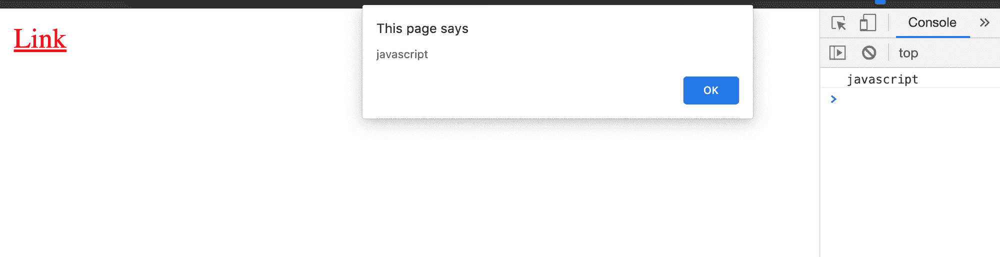

# JavaScript Void 0–JavaScript:Void(0)做什么；刻薄？

> 原文：<https://www.freecodecamp.org/news/javascript-void-keyword-explained/>

根据字典，void 一词的意思是“完全空白的空间”。这个术语在编程中使用时，指的是“空值”的返回。

## void 关键字是什么？

当函数为 void 时，意味着函数不返回任何值。这类似于 JavaScript 中显式返回`undefined`的函数，如下所示:

```
function und() {
  return undefined
}
und() 
```

或者含蓄地，像这样:

```
function und() {
}
und() 
```

不管上面函数中的表达式和语句如何(将 2 个数字相加，求 5 个数字的平均值，等等)，都不会返回结果。

现在我们知道`void`关键字是什么了。那`javascript:void(0)`呢？

## 什么是`javascript:void(0)`？

如果我们把这个分开，我们有`javascript:`和`void(0)`。让我们更详细地看一下每个部分。

### `javascript:`

这被称为**伪 URL** 。当浏览器接收到这个值作为锚标签上`href`的值时，它解释冒号(:)后面的 JS 代码，而不是将该值视为引用路径。

例如:

```
<a href="javascript:console.log('javascript');alert('javascript')">Link</a> 
```

当点击“链接”时，结果如下:



如上所述，浏览器不会将`href`视为引用路径。相反，它将它视为一些 javascript 代码，以“JavaScript:”开头，用分号分隔。

### `void(0)`

void 运算符计算给定的表达式并返回`undefined`。

例如:

```
const result = void(1 + 1);
console.log(result);
// undefined 
```

对`1 + 1`求值，但返回`undefined`。为了证实这一点，这里有另一个例子:

```
<body>
  <h1>Heading</h1>
  <script>
        void(document.body.style.backgroundColor = 'red',
             document.body.style.color = 'white'
        )
  </script>
</body> 
```

上面代码的结果是:


这是另一个例子:

```
console.log(void(0) === undefined)
// true 
```

### 组合`javascript:`和`void(0)`

有时，您不希望链接导航到另一个页面或重新加载页面。使用`javascript:`，你可以运行不改变当前页面的代码。

这个和`void(0)`一起使用意味着，**什么都不做**——不重新加载，不导航，不运行任何代码。

例如:

```
<a href="javascript:void(0)">Link</a> 
```

“链接”一词被浏览器视为链接。例如，它是可聚焦的，但是它不能导航到新的页面。

`0`是传递给`void`的参数，它什么也不做，也不返回任何值。

JavaScript 代码(如上所示)也可以作为参数传递给`void`方法。这使得 link 元素运行一些代码，但它维护同一个页面。

例如:

```
<a id='link' href="javascript:void(
  document.querySelector('#link').style.color = 'green'
)">Link</a> 
```

单击该按钮时，结果如下:


用`void`，它告诉浏览器不要返回任何东西(或者返回`undefined`)。

带有`javascript:void(0)`引用的链接的另一个用例是，有时，一个链接可能在后台运行一些 JavaScript 代码，导航可能是不必要的。在这种情况下，表达式将被用作传递给`void`的参数。

## 结论

在这篇简化的文章中，我们已经了解了什么是`void`操作符，它是如何工作的，以及它如何与链接的`href`属性的`javascript:`伪 URL 一起使用。

这可以确保页面不会在被单击时导航到另一个页面或重新加载当前页面。