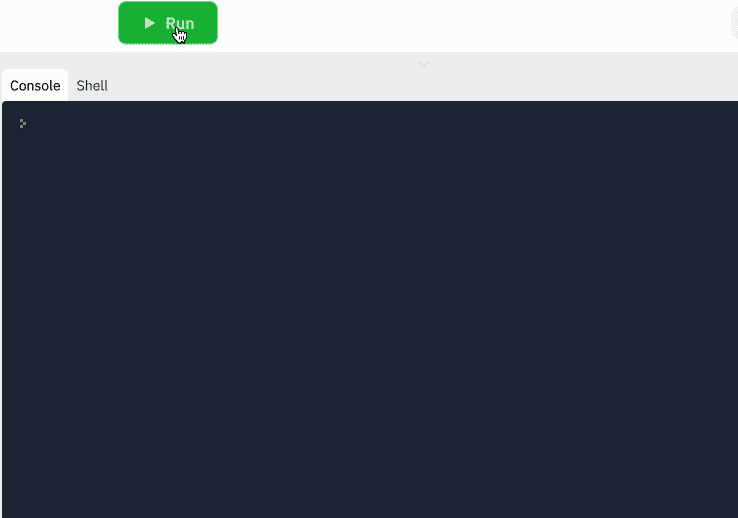
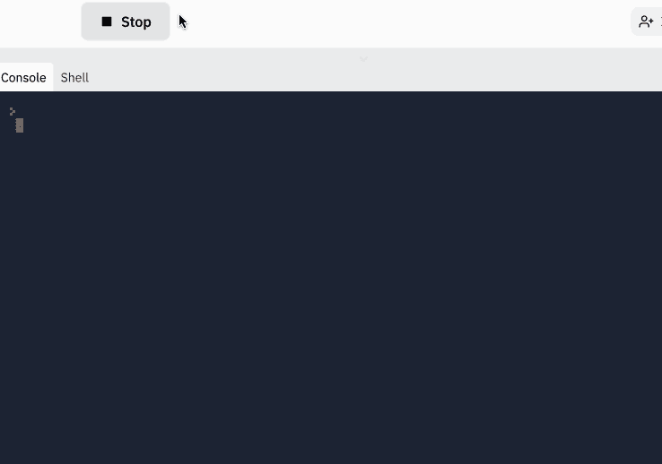
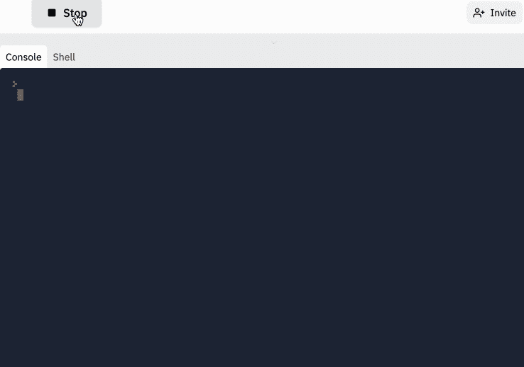
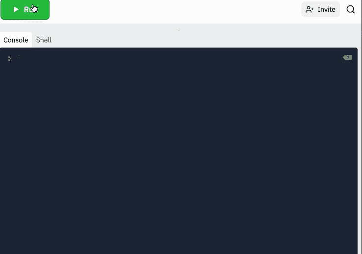

# JavaScript Wait——如何在 JS 中休眠 N 秒？setTimeout()

> 原文：<https://www.freecodecamp.org/news/javascript-wait-how-to-sleep-n-seconds-in-js-with-settimeout/>

有时您可能想要延迟代码的执行。

当您明确指定时，您可能需要在将来的某个时间点执行某些代码行，而不是同步执行所有代码。

类似的事情在 JavaScript 中是可能的。

在本文中，您将了解到`setTimeout()`方法——它是什么以及如何在您的程序中使用它。

以下是我们将在本快速指南中介绍的内容:

1.  [JavaScript 中的`setTimeout()`是什么](#intro)
2.  [JavaScript `setTimeout()`语法](#syntax)
3.  [如何在 JavaScript 中等待 N 秒](#wait)
    1.  [如何使用`clearTimeout()`方法](#clear)
4.  [`setTimeout`vs`setInterval`——有什么区别？](#difference)

## JavaScript 中的`setTimeout()`是什么？

窗口对象的异步方法`setTimeout()`的作用是设置一个将执行一个动作的定时器。该计时器指示将触发该特定动作的特定时刻。

由于`setTimeout()`是窗口对象的一部分，所以也可以写成`window.setTimeout()`。也就是说，`window`前缀是隐含的，因此通常被省略而不被指定。

## `setTimeout()`方法-语法概述

`setTimeout()`方法的一般语法如下所示:

```
setTimeout(function_name, time); 
```

让我们来分解一下:

*   `setTimeout()`是一种用于创建定时事件的方法。
*   它接受两个**必需的**参数。
*   `function_name`是第一个必需的参数。它是一个回调函数的名称，该函数包含您想要执行的代码。函数名充当包含实际代码块的函数定义的引用和指针。
*   `time`是第二个必需参数，定义单位为**毫秒**(作为参考，`1 second = 1000 milliseconds`)。它表示程序等待函数执行的指定时间。

总的来说，这意味着`setTimeout()`将执行包含在给定函数*中的代码一次*，并且仅在指定的时间量之后。

此时，值得一提的是，您可以将一个*匿名的*函数传递给`setTimeout()`，而不是传递一个函数名。

当函数不包含很多行代码时，这很方便。

*匿名*函数是指你直接将代码作为第一个参数嵌入到`setTimeout()`中，不要像上面看到的那样引用函数名。

```
setTimeout(function() {
    // function code goes here
}, time); 
```

另一件要注意的事情是，`setTimeout()`返回一个`timeoutID`——一个正整数，标识由`setTimeout()`创建的计时器。

稍后，您将看到`timeoutID`的值是如何与`clearTimeout()`方法一起使用的。

## 如何在 JavaScript 中等待 N 秒

让我们看一个如何应用`setTimeout()`的例子:

```
//this code is executed first

console.log("Where can I learn to code for free and get a developer job?");

// this line indicates that the function definition will be executed once 3ms have passed

setTimeout(codingCourse, 3000);

//function definition

function codingCourse() {
  console.log("freeCodeCamp");
} 
```



JavaScript 代码是自上而下执行的。

一旦我按下 run，第一行代码`console.log("Where can I learn to code for free and get a developer job?");`就会立即执行。

第二行代码表示在执行`codingCourse()`函数中的代码之前，需要有 3000 毫秒(或 3 秒)的预定延迟。

3000 毫秒过后，您会看到函数(`console.log("freeCodeCamp")`)内的代码成功执行。

让我们看另一个例子:

```
console.log("Good Morning!");

setTimeout(function() {
  console.log("Good Night!");
}, 1000);

console.log("Good Afternoon!"); 
```



在上面的例子中，第一行代码`console.log("Good Morning!");`立即执行。

第`console.log("Good Afternoon!");`行也是如此，尽管它是文件中的最后一行代码。

`setTimeout()`中的代码表示在它运行之前需要有一秒钟的延迟。

但是，在此期间，文件中其余代码的执行不会暂停。

而是暂时跳过那一行，执行第`console.log("Good Afternoon!");`行。

一旦这一秒过去，`setTimeout()`中的代码就会运行。

您也可以进一步将*可选的*参数传递给`setTimeout()`。

在下面的例子中，`greeting`函数接受两个参数，`phrase`和`name`。

```
function greeting(phrase,name) {
  console.log(`${phrase}, my name is ${name}` );
}

setTimeout(greeting, 3000,"Hello world","John Doe"); 
```

然后这些被传递给`setTimeout()`方法，一旦函数被调用，将有 3 秒钟的延迟:



### 如何在 JavaScript 中使用`clearTimeout()`方法

如果您想取消已经创建的计时事件，该怎么办？

您可以通过使用`clearTimeout()`方法来停止`setTimeout()`中的代码运行。这就是前面提到的`timeoutID`派上用场的地方。

`clearTimeout()`的一般语法如下:

```
clearTimeout(timeoutID) 
```

其工作方式是，您必须将每次`setTimeout()`调用返回的`timeoutID`保存到一个变量中。

然后，`timeoutID`被用作`clearTimeout()`的参数，如下所示:

```
let timeoutID = setTimeout(function(){
    console.log("Good Night");
}, 2000);

clearTimeout(timeoutID);

console.log("Good Morning!"); 
```



现在，`setTimeout()`中的代码不会执行。

## `setTimeout`和`setInterval`有什么区别？

`setTimeout()`和`setInterval()`的语法非常相似。

下面是`setInterval()`的语法:

```
setInterval(function_name, time); 
```

然而，互换使用它们并不是一个好主意，因为它们以不同的方式工作。

`setTimeout()`触发动作**一次**，而`setInterval()`重复触发动作**。**

 **在下面的例子中，函数`codingCourse`每三秒调用一次:

```
console.log("Where can I learn to code for free and get a developer job?");

setInterval(codingCourse, 3000);

//function definition
function codingCourse() {
  console.log("freeCodeCamp");
} 
```


当你想有规律地重复某事时，这是个不错的选择。

## 结论

现在你知道了！您现在知道了`setTimeout()`如何工作以及如何用 JavaScript 创建定时事件的基础知识。

要了解更多关于 JavaScript 的知识，请访问 freeCodeCamp 的 [JavaScript 算法和数据结构认证](https://www.freecodecamp.org/learn/javascript-algorithms-and-data-structures/)。

这是一个免费的、经过深思熟虑的、结构化的课程，你可以在其中进行互动学习。最后，您还将构建 5 个项目来获得认证，并通过将新技能付诸实践来巩固您的知识。

感谢阅读！**