# 用七个步骤激活你的“ZSH”终端——视觉指南

> 原文：<https://www.freecodecamp.org/news/jazz-up-your-zsh-terminal-in-seven-steps-a-visual-guide-e81a8fd59a38/>

作者 rajaraodv

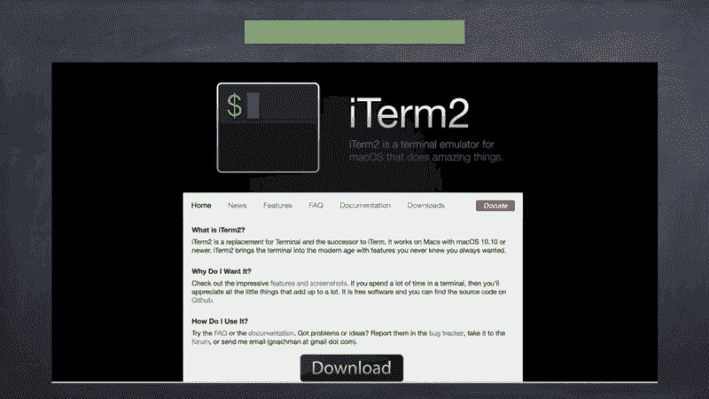

# 用七个步骤激活你的“ZSH”终端——视觉指南

在这篇博客中，我将介绍如何安装 ITerm2、ZSH shell、“哦，我的 ZSH”、主题、ITerm2 配色方案、“哦，我的 ZSH”插件，并启用“连字”支持来帮助创建一个漂亮而强大的终端。

> 如果你想让你的常规 Bash 终端变得强大，看看我以前的博客:“[让你的 Bash 终端](https://medium.com/@rajaraodv/jazz-up-your-bash-terminal-a-step-by-step-guide-with-pictures-80267554cb22)更有活力”。但是 ZSH 在这个博客中解释了更强大的东西。

#### 总结:

我们会报道很多事情。这可能会令人困惑，所以这里是我们将要做的事情的摘要。

1.  安装 ITER m2——这是默认终端的更好替代方案
2.  安装最新的 ZSH shell——这比常规的 bash shell 更强大。我们将把 ITerm2 切换到使用 ZSH shell。
3.  安装“哦，我的 ZSH”——这是一个 CLI 工具，可以轻松配置 ZSH 和添加主题和插件到 ZSH
4.  使用“哦，我的 ZSH”添加两种类型的主题——有些主题需要额外的步骤，所以我们将两者都包括在内
5.  安装不同的 ITerm2 方案——这些只是 UI 的配色方案
6.  使用“哦，我的 ZSH”添加两个不同的插件，以提高生产力
7.  启用“连字”支持，这样当你写一个箭头**=>**；，它看起来像一个真正的安排 **o** w →


### 步骤 1—安装 ITerm2

很多程序员喜欢 ITerm2 而不是默认的终端。它类似于终端，但有许多自己的功能。它当然可以在里面运行 ZSH、Bash 和其他 shells。

下面的视频展示了 Item 2 (v3)的一些新功能。

> 对于这个博客，我们将使用 ITerm2。当我提到“终端”时，我指的是 ITerm2。尽管 Terminal 或 ITerm2 的步骤是相同的。

### 步骤 2—将 Shell 更改为 ZSH

下面的视频展示了为什么 ZSH 不仅仅是一个 bash shell。

**选项 1 —使用 Mac 自带的 ZSH:**

Mac 自带 ZSH 开箱即用，所以我们不需要安装它。然而，有时它是 ZSH 的旧版本。通常它位于/bin/zsh。要使用它，我们需要做的就是改变 shell (chsh)。

1.  打开终端(或 ITerm2)并键入以下命令。

```
$ chsh -s $(which zsh)
```

2.输入密码，它将在注销和登录时更改 shell。

3.**注销并重新登录**

4.要进行测试，请打开终端并键入以下内容，它应该显示 zsh。

```
$ echo $0
zsh //should return zsh
```

**选项 2—安装自制软件，并通过自制软件安装最新的 ZSH 软件**

这个选项在用户中很常见，因为一些插件只适用于最新的 ZSH。

简单地说，家酿是各种软件的命令行安装程序。让我们先安装它。

1.  通过运行以下命令安装 Homebrew。

```
ruby -e "$(curl -fsSL https://raw.githubusercontent.com/Homebrew/install/master/install)"
```

2.如果您得到 Xcode 命令行工具错误，这意味着您没有安装 Xcode 的 CLI 工具。如果您没有收到错误，您可以跳过这一步，因为您已经安装了它。

XCode Developer CLI 工具被各种应用程序用来操作核心 OSX 功能。因此，请确保通过运行以下命令安装 Xcode CLI 工具。

`$ xcode-select —-install`

> 注意:上面的命令会打开 Mac 的安装程序并安装 XCode 开发者 CLI 工具。如果不行，尝试`*xcode-select -r*`复位。

3.通过自制软件安装 ZSH

运行以下命令安装 ZSH。它安装在`/usr/local/bin/zsh` PS: Mac 的默认 ZSH 是在`/bin/zsh`

```
brew install zsh
```

4.使用自制版的 ZSH

运行以下命令。系统会提示您输入 Mac 的密码。

```
chsh -s /usr/local/bin/zsh
```

**5。注销并重新登录。**

6.测试我们是否使用了 ZSH 和正确的 ZSH

```
$ echo $0
zsh   //correct

$ which zsh
/usr/local/bin/zsh   //correct
```

### 第三步——“哦，我的 ZSH”

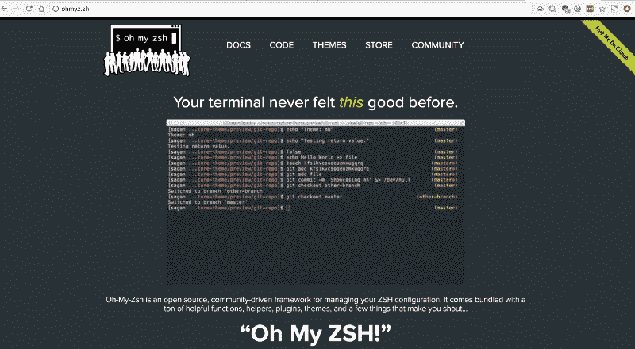

“哦，我的 ZSH”是一个运行在 ZSH 之上的插件。它为 ZSH (~/)提供默认配置。zhrc 文件),还提供了主题和更多功能。

> 据我所知，大多数使用 ZSH 的电力用户也使用“哦，我的 ZSH”。

1.  **安装“哦，我的 ZSH”**

运行以下命令来安装“哦，我的 ZSH”。

```
sh -c "$(curl -fsSL https://raw.github.com/robbyrussell/oh-my-zsh/master/tools/install.sh)"
```

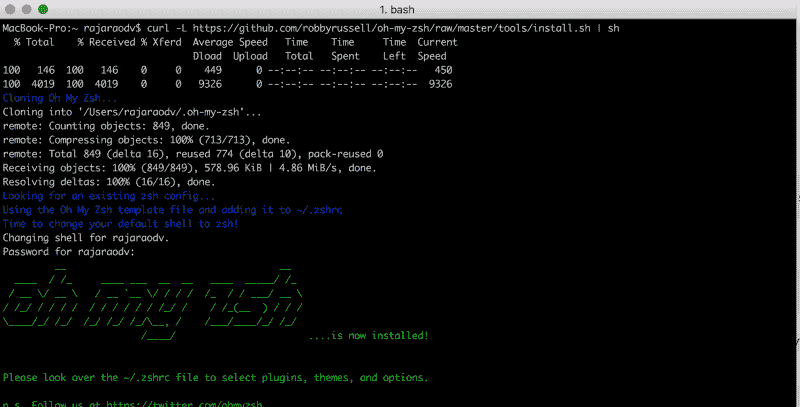

Oh My ZSH is installed

2.关闭并退出 ITerm2，然后重新打开它。

它应该看起来像下面这样。请注意，提示已经更改，主题也有所不同——这是为您准备的“哦，我的 ZSH”。

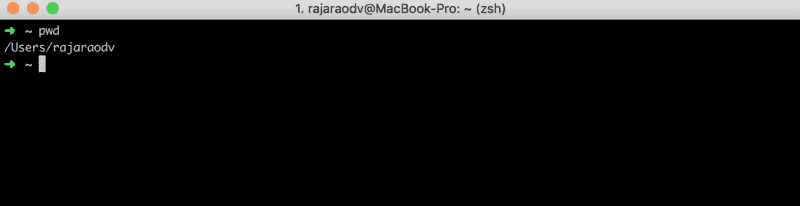

Initial Oh My ZSH Theme

### 步骤 4-更改主题并安装字体

在这一步，我们将添加两个不同的“哦，我的 ZSH”主题。“哦，我的 ZSH”有很多主题。 *PS:但是有些主题需要额外的步骤，比如安装特定的字体等等。*

要设置主题，只需打开~/。zshrc 文件(由“哦，我的 ZSH”创建)，并更改如下所示的主题。

> PS:。zshrc 是 ZSH shell 的配置文件。不使用“哦，我的 ZSH”的人将不得不手动创建这个文件，并自己添加任何配置。“哦，我的 ZSH”自动创建这个文件，如果它不存在，然后添加自己的配置集到这个文件中。

#### 主题 1 —让我们添加一个名为“**Avit”**的主题

1.  Open .zshrc

```
$ open ~/.zshrc
```

2.将主题更改为“Avit”

你可以在这里浏览“哦，我的 ZSH”的所有主题。要更改主题，只需更改~/中的 ZSH 主题值。zshrc 文件从 **robbyrussell** 到 **Avit** 。

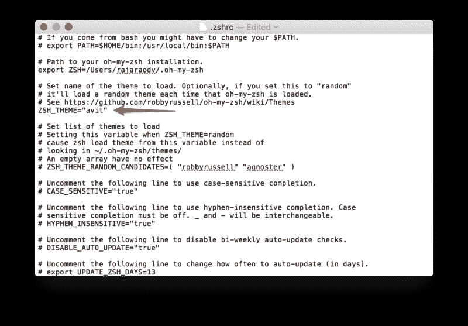

3.更新 ZSH 配置

运行以下命令来更新配置。

```
$ source ~/.zshrc
```

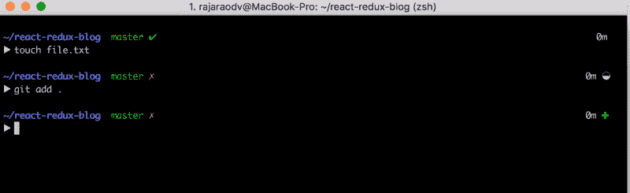

Your command prompt in Avit Theme

4.更改背景颜色和字体大小

打开 ITerm2 >首选项>配置文件>颜色，将背景颜色改为 20%灰色，如下所示。

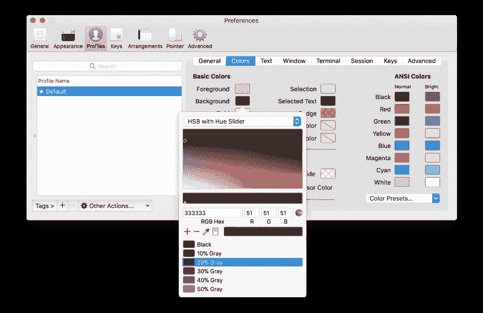

Use 20% Gray background

然后打开文本>更改字体，将大小改为 14pt。

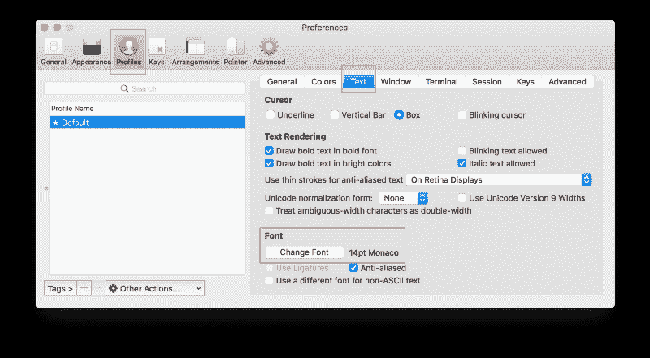

Change font to 14pt

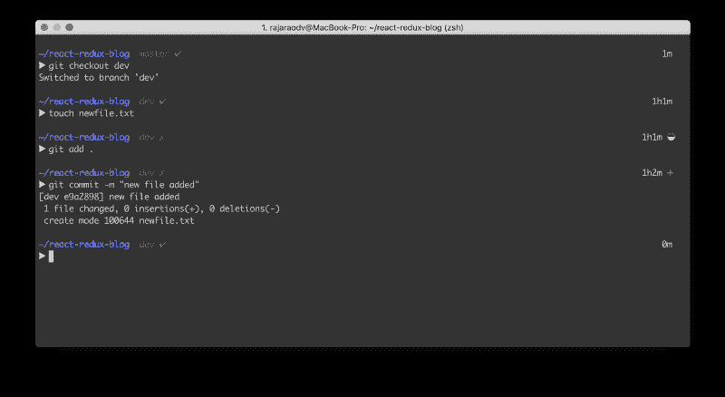

A clean and beautiful Iterm2 with ZSH!

好的，让我们安装一个不同的需要字体的主题。

#### 主题 2 —安装“agnoster”我的 ZSH 主题

这是一个流行的主题，因为它模拟了增强终端的[电力线](https://powerline.readthedocs.io/en/latest/overview.html#screenshots) Python 应用程序。下图是它的样子。但是这个主题也需要我们安装电力线主题。

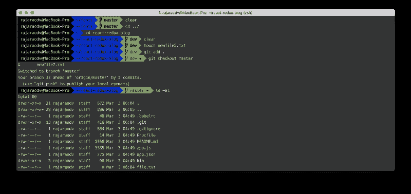

agnoster Oh My ZSH theme

**1。安装[电力线字体](https://github.com/powerline/fonts.git)**

```
$ git clone https://github.com/powerline/fonts.git
$ cd fonts
$ ./install.sh
```

**2。将主题更改为“不可知论者”**

```
$ open ~/.zshrc
Set ZSH_THEME="agnoster" and save the file
```

**3。退出 ITerm2 并重新打开它。**

**4。设置电力线字体**

您可以设置任何您喜欢的电力线修补字体。所有字体都以 ***【电力线】*** 结尾。

打开`ITerm2 > Preferences > Profiles > Text > Change Font`并将其设置为带有“for Powerline”的东西。我选择的是*****【Meslo LG DZ for power line】*****字体。

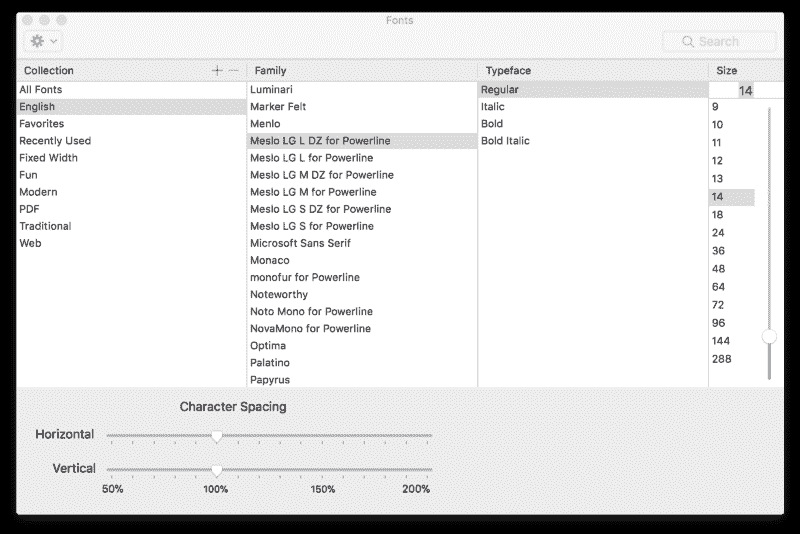

***Meslo LG DZ for Powerline Iterm2 font***

> 注意——如果你对字体和主题感到困惑:主题是“哦，我的 ZSH”和 ZSH shell，字体是 Iterm2 本身。

#### 5.全部完成

此时，您的终端应该如下所示:


### 步骤 5 —安装 iTerm2“配色方案”(ITerm2 主题)

iTerm2 有很多华丽的配色。这些方案改变前景色、背景色、光标颜色等等。你可以在[ITER m2-color-schemes](https://github.com/mbadolato/iTerm2-Color-Schemes)Github repo 找到它们。

> 注意:这些只是 ITerm2 UI 的配色方案，并不涉及命令提示符的外观和感觉，就像“哦，我的 ZSH”的主题(除了改变颜色)。

按照以下步骤安装它们。

1.  将 [iTerm2-color-schemes](https://github.com/mbadolato/iTerm2-Color-Schemes) 作为 zip 文件下载并解压
2.  “方案”文件夹包含所有的颜色方案文件——它们以`.itermcolors`结尾
3.  打开`iTerm2 > Preferences > Profile > Colors > Color Presets > Import`
4.  在导入窗口中，导航到“方案”文件夹(从步骤 2)
5.  选择所有文件，以便可以一次导入所有配色方案
6.  只需选择您喜欢的配色方案。

> 我最喜欢的是**蝙蝠侠**和**阿尔戈纳特**

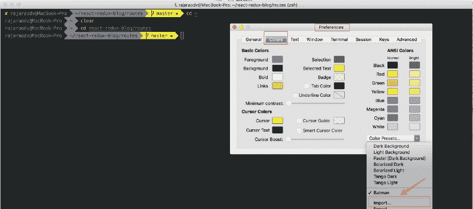

Batman Iterm2 Theme

Argonaut 配色方案如下所示:

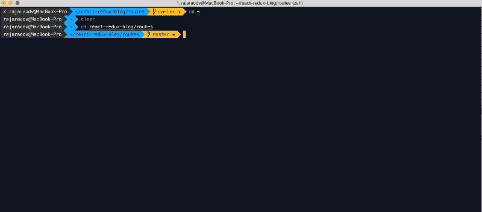

Argonaut color scheme

### 步骤 6—安装插件

插件给你的工作流程增加了更多的功能。默认情况下，“哦，我的 ZSH”已经有了“git”插件！这就是为什么您能够在前面的截图中看到所有这些 Git 状态的提示。再加一个，看看效果如何。

> 注意:在这一节中，我们将安装两个不同的插件来展示它们是如何工作的。

#### 插件 1-添加语法高亮插件

语法高亮插件给你输入的命令添加了漂亮的颜色，如下所示。

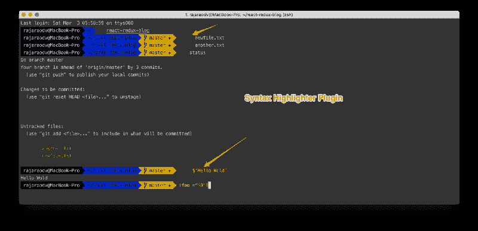

1.  克隆 zsh-syntax-highlighting 插件的 repo，并将其复制到“我的 zsh”插件目录中。

```
git clone https://github.com/zsh-users/zsh-syntax-highlighting.git ${ZSH_CUSTOM:-~/.oh-my-zsh/custom}/plugins/zsh-syntax-highlighting
```

2.通过将``zsh-syntax-highlighting`添加到插件部分来激活`~/.zshrc`中的插件，如下所示。

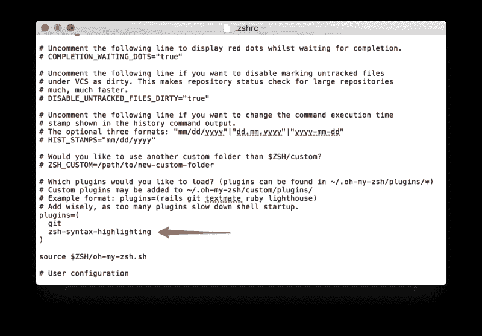

Add a new plugin in a new line inside plugins section

3.重新读取 zshrc 配置

```
source ~/.zshrc
```

#### 插件 2 —添加 ZSH-自动建议插件

这个插件自动建议任何以前的命令。非常方便！**要选择完成，只需按→键。**

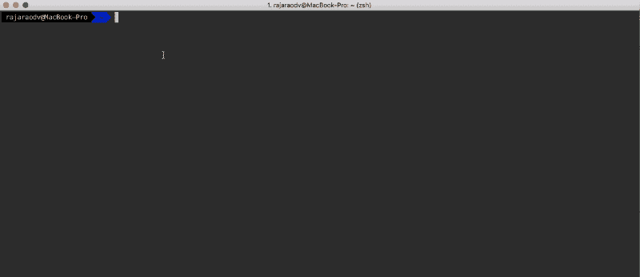

1.  安装插件

```
git clone https://github.com/zsh-users/zsh-autosuggestions $ZSH_CUSTOM/plugins/zsh-autosuggestions
```

> PS:ZSH _ 自定义指向~/。哦，我的天/习俗

2.打开`~/.zshrc`并添加 zsh-自动建议

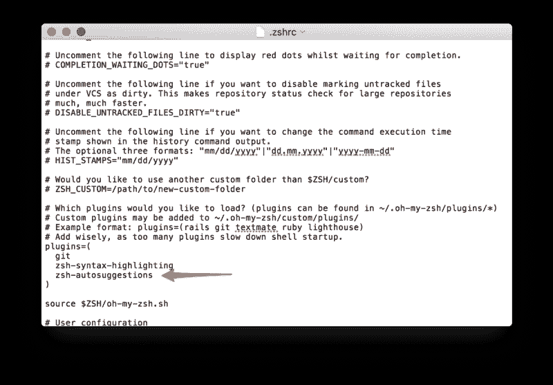

### 步骤 7 —使用结扎线支持

有各种各样的字体有助于使小于、双等于、右箭头、不等于等运算符看起来更漂亮。比如每次输入:= >，就变成:→。

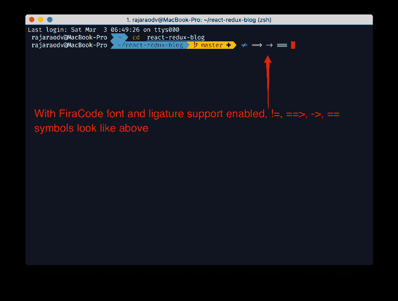

要使用它，我们需要支持连字的字体。我们还需要在 ITerm2 中启用它。FiraCode 就是这样一种字体。按照步骤安装和启用连字。

1.  下载 [FiraCode](https://github.com/tonsky/FiraCode) repo 并解压 zip 文件(或克隆它)
2.  打开`dstr > ttf`文件夹，双击所有的`*.ttf`文件，选择“安装字体”按钮，安装每种字体。
3.  导航至`ITerm2 | Preferences | Profiles | Text`
4.  ****选择**** `****Use Ligatures****` ****复选框****
5.  点击`Change Font`并选择`Fira Code Regular`字体

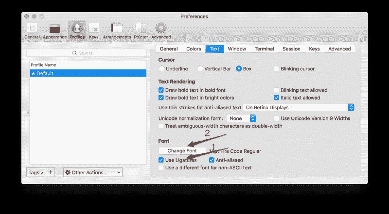

### 摘要

我们已经在这个博客中讨论了很多，从通过自制软件安装最新的 ZSH，哦，我的 ZSH，插件，主题，为 FiraCode 字体启用“连字”。

？？谢谢大家！

#### 如果这有用，请点击拍手？下面扣几下，以示支持！⬇⬇⬇ ?？

### 我的其他帖子

[*https://medium.com/@rajaraodv/latest*](https://medium.com/@rajaraodv/latest)

#### *ECMAScript 2015+*

1.  **[看看这些有用的 ECMAScript 2015 (ES6)提示和技巧](https://www.freecodecamp.org/news/check-out-these-useful-ecmascript-2015-es6-tips-and-tricks-6db105590377/)**
2.  *[*ES6*](https://medium.com/@rajaraodv/5-javascript-bad-parts-that-are-fixed-in-es6-c7c45d44fd81#.7e2s6cghy)中修复的 5 个 JavaScript“坏”部分*
3.  *[*ES6 中的“类”是新的“坏”的部分吗？*](https://medium.com/@rajaraodv/is-class-in-es6-the-new-bad-part-6c4e6fe1ee65#.4hqgpj2uv)*

#### *终端改进*

1.  **[如何让你的终端变得有趣——一步一步的图片指导](https://www.freecodecamp.org/news/jazz-up-your-bash-terminal-a-step-by-step-guide-with-pictures-80267554cb22/)**
2.  **[用七个步骤让你的“ZSH”码头焕然一新——视觉指南](https://www.freecodecamp.org/news/jazz-up-your-zsh-terminal-in-seven-steps-a-visual-guide-e81a8fd59a38/)**

#### *万维网*

1.  *一段精彩纷呈的网络和 JavaScript 历史*

#### *虚拟 DOM*

1.  *[*虚拟 DOM 的内部运作*](https://medium.com/@rajaraodv/the-inner-workings-of-virtual-dom-666ee7ad47cf)*

#### *反应性能*

1.  *[*两种快速缩减 React App 生产规模的方法*](https://medium.com/@rajaraodv/two-quick-ways-to-reduce-react-apps-size-in-production-82226605771a#.6lepbl7ae)*
2.  *[*用 Preact 代替 React*](https://medium.com/@rajaraodv/using-preact-instead-of-react-70f40f53107c#.7fzp0lyo3)*

#### *函数式编程*

1.  *[*JavaScript 是图灵全集——解释*](https://medium.com/@rajaraodv/javascript-is-turing-complete-explained-41a34287d263#.6t0b2w66p)*
2.  *[*JS 中的函数式编程—结合实例(上)*](https://medium.com/@rajaraodv/functional-programming-in-js-with-practical-examples-part-1-87c2b0dbc276#.fbgrmoa7g)*
3.  **[JS 中的函数式编程—结合实例(下)](https://www.freecodecamp.org/news/functional-programming-in-js-with-practical-examples-part-2-429d2e8ccc9e/)**
4.  *[*Redux 为什么需要还原器是“纯函数”*](https://medium.com/@rajaraodv/why-redux-needs-reducers-to-be-pure-functions-d438c58ae468#.bntrywxrf)*

#### *网络包*

1.  *[*Webpack —令人困惑的部分*](https://medium.com/@rajaraodv/webpack-the-confusing-parts-58712f8fcad9#.6ot6deo2b)*
2.  *[*Webpack &热模块更换【HMR】*](https://medium.com/@rajaraodv/webpack-hot-module-replacement-hmr-e756a726a07#.y667mx4lg)*(引擎盖下)**
3.  *[*Webpack 的 HMR 和 React-Hot-Loader —失踪手册*](https://medium.com/@rajaraodv/webpacks-hmr-react-hot-loader-the-missing-manual-232336dc0d96#.fbb1e7ehl)*

#### *Draft.js*

1.  *[*为什么选择 Draft.js，为什么要投稿*](https://medium.com/@rajaraodv/why-draft-js-and-why-you-should-contribute-460c4a69e6c8#.jp1tsvsqc)*
2.  *[*draft . js 如何表示富文本数据*](https://medium.com/@rajaraodv/how-draft-js-represents-rich-text-data-eeabb5f25cf2#.hh0ue85lo)*

#### *反应和还原:*

1.  *[*逐步构建 React Redux 应用指南*](https://medium.com/@rajaraodv/step-by-step-guide-to-building-react-redux-apps-using-mocks-48ca0f47f9a#.s7zsgq3u1)*
2.  *[*React Redux CRUD App 构建指南*](https://medium.com/@rajaraodv/a-guide-for-building-a-react-redux-crud-app-7fe0b8943d0f#.g99gruhdz) *(3 页 app)**
3.  *[*在 React Redux 应用中使用中间件*](https://medium.com/@rajaraodv/using-middlewares-in-react-redux-apps-f7c9652610c6#.oentrjqpj)*
4.  *[*添加一个健壮的表单验证来反应 Redux 应用程序*](https://medium.com/@rajaraodv/adding-a-robust-form-validation-to-react-redux-apps-616ca240c124#.jq013tkr1)*
5.  *[*用 JWT 令牌保护 React Redux 应用*](https://medium.com/@rajaraodv/securing-react-redux-apps-with-jwt-tokens-fcfe81356ea0#.xci6o9s6w)*
6.  *[*在 React Redux 应用中处理交易邮件*](https://medium.com/@rajaraodv/handling-transactional-emails-in-react-redux-apps-8b1134748f76#.a24nenmnt)*
7.  *[*解剖一个 React Redux App*](https://medium.com/@rajaraodv/the-anatomy-of-a-react-redux-app-759282368c5a#.7wwjs8eqo)*
8.  *[*Redux 为什么需要还原器是“纯函数”*](https://medium.com/@rajaraodv/why-redux-needs-reducers-to-be-pure-functions-d438c58ae468#.bntrywxrf)*
9.  *[*两种快速缩减 React App 生产规模的方法*](https://medium.com/@rajaraodv/two-quick-ways-to-reduce-react-apps-size-in-production-82226605771a#.6lepbl7ae)*

#### *如果这有用，请点击拍手？按钮下面几下，以示支持！⬇⬇⬇ ?？*

*如果你有问题，请随时在推特上问我:[https://twitter.com/rajaraodv](https://twitter.com/rajaraodv)*