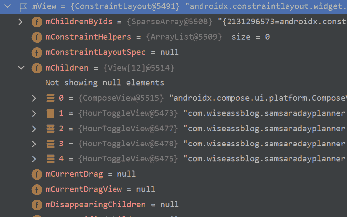
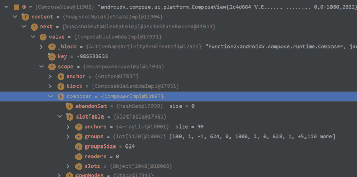
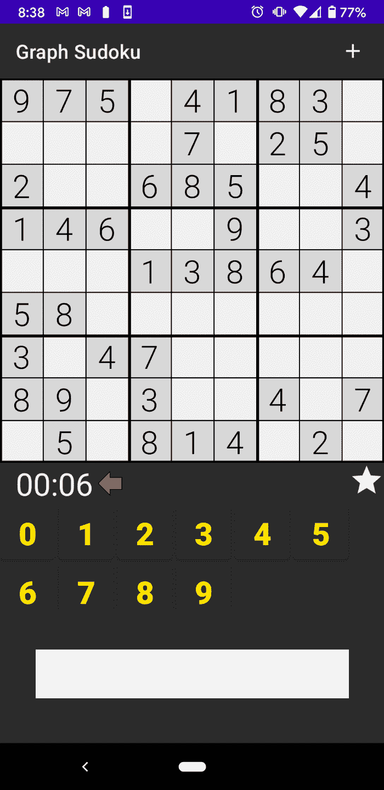

# 初学者 Jetpack Compose 教程——如何理解可组合和重组

> 原文：<https://www.freecodecamp.org/news/jetpack-compose-beginner-tutorial-composables-recomposition/>

本教程将教你一些与 Android 上的 Jetpack Compose UI 库相关的基本概念和术语。

虽然这是一个初学者编写指南，但它不是 Android 的初学者指南——所以你应该至少已经编写了一两个应用程序(尽管不一定是在 Compose 中)。

在我们开始之前，我最初计划写一篇针对更高级开发人员的后续文章，直到我看到 Leland Richardson 的两部分文章系列。Leland 不仅是 Jetpack Compose 团队的一名软件工程师，而且我认为他也是一名伟大的作家。

虽然我觉得我的文章将作为对 Jetpack Compose 基础知识的介绍而独立存在，但我强烈建议**一旦你获得了一些关于 Compose 的实践经验(或者如果你喜欢以这种方式学习，就马上去读他的文章)。**

 **[https://www.youtube.com/embed/ijwBr4oeX0I?feature=oembed](https://www.youtube.com/embed/ijwBr4oeX0I?feature=oembed)** 

### **本文中解释的关键术语/概念:**

*   **旧的视图系统和层次结构的简要回顾**
*   **组件以及它们相对于视图的位置**
*   **重新排版以及如何避免做的很差！**

# **什么是可组合的？**

**在这一节中，我们将讨论 Jetpack Compose 库的最基础的部分。如果您是一名经验丰富的 Android 开发人员，您可能希望跳到标题为“可组合视图是吗？”**

**如果你还不熟悉视图系统，你应该阅读下一部分，因为这对于激发和理解什么是可组合是必要的。**

## **视图层次结构**

**在 Android SDK(我们用来在这个平台上制作用户界面的库)的上下文中，视图是我们用来为应用程序提供结构和风格的东西。**

**它是给定用户界面(UI)的最基本类型的构建块或元素，并且这些构建块中的每一个都将包含以下类型的信息(以及其他信息):**

*   **x 和 Y 的开始和结束位置，告诉计算机在设备屏幕上绘制视图的位置**
*   **颜色和 alpha(透明度)值**
*   **字体信息、文本、符号和图像**
*   **基于用户交互(点击)或应用程序数据变化等事件的行为(稍后将详细介绍)**

**需要理解的是 ****一个视图可以是类似于按钮**** (通常称为“小部件”)、 ****之类的东西，但也可以是整个屏幕、部分屏幕的容器，或者是其他子视图**** 。**

**根据上下文，这种 ****容器**** 通常被称为布局或视图组。而且，虽然与小部件共享大部分相同种类的信息，但是它们也包含关于如何排列和显示嵌套在其中的**其他视图的信息。****

****考虑到这一点，我们开始查看视图系统的重要部分: ****视图层次**** 。对于 Web 开发人员来说，视图层次结构本质上是 Android 版本的文档对象模型(DOM)。****

**对于 Android 开发人员，您可以将视图层次结构视为所有视图的虚拟表示，这些视图是在 XML 文件中定义的，或者是在 Java 或 Kotlin 中以编程方式定义的。**

**为了说明这一点，让我们看这样一个 XML 文件(没有必要仔细研究它，只需记下名称)。然后，使用一个调试器/步进器工具，我们将看看它在膨胀这个文件的片段的内存空间中是什么样子的:**

******fragment _ hour _ view . XML:******

```
`<?xml version=”1.0" encoding=”utf-8"?>
<androidx.constraintlayout.widget.ConstraintLayout xmlns:android=”http://schemas.android.com/apk/res/android"
android:layout_width=”match_parent”
android:layout_height=”match_parent”
android:id=”@+id/root_hour_view_fragment”
xmlns:app=”http://schemas.android.com/apk/res-auto"
>
<androidx.compose.ui.platform.ComposeView
android:id=”@+id/tlb_hour_view”
//...
 />
<com.wiseassblog.samsaradayplanner.ui.managehourview.HourToggleView
android:id=”@+id/vqht_one”
//...
/>
<com.wiseassblog.samsaradayplanner.ui.managehourview.HourToggleView
android:id=”@+id/vqht_two”
//...
/>
<com.wiseassblog.samsaradayplanner.ui.managehourview.HourToggleView
android:id=”@+id/vqht_three”
//...
/>
<com.wiseassblog.samsaradayplanner.ui.managehourview.HourToggleView
android:id=”@+id/vqht_four”
//...
/>
</androidx.constraintlayout.widget.ConstraintLayout>`
```

******(片段)HourView.kt 的内存空间:******

**

Image of a View Hierarchy** 

**调试器和步进器工具是我最喜欢的一些方法，用来了解我从各种库中使用的代码背后发生了什么。有时间试试吧！**

**向您展示这个 XML 文件以及它在一个 ****进程**** (一个进程是 ****在一个设备上运行**** 的简单程序)中变成什么，目的是演示 XML 文件中的嵌套视图如何在运行时转换成嵌套视图层次结构。**

**希望有一个简单但具体的旧系统如何工作的模型，我们可以将其与新系统进行比较。**

## **是可组合视图吗？**

**这是我开始使用 Compose 时问的第一个问题，我得到的答案是 ****是**** 和 ****否**** 。**

******是的**** ，在这个意义上，一个可组合的组件履行了与旧系统中的视图 相同的概念角色**。可组合的可以是按钮之类的小部件，也可以是 ConstraintLayout 之类的容器(值得注意的是，ConstraintLayout 有一个可组合的实现)。****

******没有**** ，从这个意义上来说，UI 不再虚拟地表示在视图层次结构中(除了涉及互操作性的情况)。也就是说，compose 不使用魔法来虚拟地表示和跟踪 UI。这意味着它必须有自己的东西，在概念上类似于视图层次。**

**让我们简单地看一下这个东西。这里，我们有一个使用`setContent {…}`函数将可组合组件绑定到自身的活动:**

******activegameactivity . kt:******

```
`class ActiveGameActivity : AppCompatActivity(), ActiveGameContainer {
private lateinit var logic: ActiveGameLogic
override fun onCreate(savedInstanceState: Bundle?) {
    super.onCreate(savedInstanceState)
    val viewModel = ActiveGameViewModel()
    setContent {
        ActiveGameScreen(
            onEventHandler = {
                logic.onEvent(it)
            },
            viewModel
        )
    }
    logic = buildActiveGameLogic(this, viewModel, applicationContext)
}
//…
}`
```

******activegamescreen . kt:******

```
`@Composable
fun ActiveGameScreen(
    onEventHandler: ((ActiveGameEvent) -> Unit),
    viewModel: ActiveGameViewModel
) {
    //...

    GraphSudokuTheme {
        Column(
            Modifier
                .background(MaterialTheme.colors.primary)
                .fillMaxHeight()
        ) {
            ActiveGameToolbar(
                clickHandler = {
                    onEventHandler.invoke(
                        ActiveGameEvent.OnNewGameClicked
                    )
                }
            )

            Box {
              //content
            }
        }
    }
}`
```

**在 Compose 中，视图层次结构被替换为我们可以定位的东西，如果我们真正深入挖掘这个活动的**字段。在该字段中是视图层次结构的概念性替换:**`****Composer****` ****及其**** `****slotTable****` **。********

****

**在这一点上，如果你想详细了解`Composer` 和它的`slotTable`，我必须再次建议你阅读利兰的文章(他在[第二部分](https://medium.com/androiddevelopers/under-the-hood-of-jetpack-compose-part-2-of-2-37b2c20c6cdd)中进行了详细介绍)。除了 Composer 和它的 slotTable 之外，Compose 层次结构还有更多的内容，但这应该足以让我们开始了。**

**一般来说，Jetpack Compose 使用我们可能称之为它的 Compose 层次结构(由 Composer 和它的 slotTable 之类的东西组成并管理)。**

**同样，这是与视图层次结构相同的概念，视图层次结构是内存空间中的一组对象，它们共同表示 UI，但是实现方式非常不同。**

**尽管有一个重要的区别，从技术上很难理解，但原则上很容易理解。这是 Compose 处理合成层次更新的方式: ****重组**** 。**

# **重组:如何更新撰写用户界面**

**对我的 ESL 朋友来说，Compose 这个词来自拉丁语**componener**，大致意思是“放在一起”写音乐的人通常被称为“作曲家”，可以被认为是将来自一个或多个乐器的音符组合成作品(歌曲)的人。**

**放在一起意味着有单独的部分。重要的是要明白，几乎所有优秀的软件开发人员都至少会努力将他们的代码分解成 ****最小的合理部分**** 。**

**我提到 ****合理**** ，因为我认为像 DRY(不要重复自己)这样的原则只有在解决的问题比创造的问题多的情况下才应该被遵循。**

**应用这个概念有很多好处，这通常被称为模块化(或者我更喜欢关注点分离，或者 SOC)。我知道你们中的一些人可能会认为我只是在抄袭 Leland 在他的文章中所说的，但是我已经谈论 SOC 作为软件架构的黄金原则很多年了。**

**这与我们在流行的 Javascript 库**中看到的原理相同。正确完成后，Compose 将只“重组”(重绘、重渲染、更新等)需要重组的组件(UI 的部分/元素)。****

****当涉及到应用程序的性能时，这是非常重要的。这是因为无论是在旧的视图系统中还是在 Compose 中，重绘 UI 都会占用大量系统资源。****

****如果你不知道，旧的 RecyclerView 的整个目的(这是我在 2016 年制作的第一个教程！)将视图持有者模式应用于数据列表。这避免了为每个列表项不断膨胀(制作)新视图的需要。****

****我在这篇文章中的目标是主要关注理论，因为我将在接下来的几个月中写大量的实际内容。然而，我将以一个来自我的直接经验的故事来结束这篇文章，这将帮助你进一步理解重组是如何工作的，以及如何避免做得很差！****

# ****秒表的例子****

****对于我的第一个完整的 Compose 应用程序，我决定构建数独。原因有很多，包括我想要一个没有复杂 UI 的项目。我也想有机会深入研究图形 DS 和 Algos，它们非常适合数独游戏。****

****我想要的一件东西是一个秒表，它可以记录用户完成一个谜题所花的时间:****

****

Graph Sudoku puzzle**** 

****正如在我的职业中经常出现的情况，我期望这个计时器比实际添加起来容易得多。我摆弄了 Android 的 Chronometer 类和 Java Timer 类，它们都提出了不同但仍然会破坏应用程序的问题。****

****最终我后退了一步，意识到我是在用科特林语写作。因此，我在我的表示逻辑类中设置了一个基于协程的计时器(把它放在那里最有意义)，它将每秒更新我的视图模型:****

```
**`Class ActiveGameLogic(…):…{
//…
inline fun startCoroutineTimer(
    delayMillis: Long = 0,
    repeatMillis: Long = 1000,
    crossinline action: () -> Unit
) = launch {
    delay(delayMillis)
    if (repeatMillis > 0) {
        while (true) {
            action()
            delay(repeatMillis)
        }
    } else {
        action()
    }
}
private fun onStart() =
launch {
    gameRepo.getCurrentGame(
    { puzzle, isComplete ->
        viewModel.initializeBoardState(
            puzzle,
            isComplete
    )
        if (!isComplete) timerTracker = startCoroutineTimer {
            viewModel.updateTimerState()
        }
    },{
        container?.onNewGameClick()
    })
}
//…
}`**
```

****ViewModel(不是来自 AAC——我自己编写虚拟机。但是在我看来，Compose 已经和 AAC VMs 有了很好的互操作性。)公开了对回调函数的引用，这是我用来更新我的组件的:****

```
**`class ActiveGameViewModel {
    //…
    internal var subTimerState: ((Long) -> Unit)? = null
    internal var timerState: Long = 0L
    //…
    internal fun updateTimerState(){
        timerState++
        subTimerState?.invoke(timerState)
    }
//…
}`**
```

********现在重要的部分来了！**** 我们可以通过使用组合的某些特性来触发组合层次的重组，比如`remember` 函数:****

```
`var timerState by remember {
    mutableStateOf(“”)
}`
```

**如果你一定要知道的话，这些功能会将你正在记忆的任何东西的状态存储在`slotTable`中。简而言之，state 这个词在这里表示数据的当前“状态”，它开始只是一个空字符串。**

******这里是我把事情搞砸的地方**** 。我已经将我的简单定时器组合到它自己的函数(应用 SOC)中，并且我将`timerState` 作为参数传递给这个组合。**

**然而，上面的代码片段位于 timer 的父组件中，timer 是 UI 最复杂部分的容器(9x9 数独需要大量的小部件):**

```
`@Composable
fun GameContent(
    onEventHandler: (ActiveGameEvent) -> Unit,
    viewModel: ActiveGameViewModel
) {
    Surface(
        Modifier
            .wrapContentHeight()
            .fillMaxWidth()
    ) {
        BoxWithConstraints(Modifier.background(MaterialTheme.colors.primary)) {
            //…
            ConstraintLayout {
                val (board, timer, diff, inputs) = createRefs()
                var isComplete by remember {
                    mutableStateOf(false)
                }
                var timerState by remember {
                    mutableStateOf("")
                }
                viewModel.subTimerState = {
                    timerState = it.toTime()
                }
                viewModel.subIsCompleteState = { isComplete = it }
            //…Sudoku board
            //Timer
                Box(Modifier
                    .wrapContentSize()
                    .constrainAs(timer) {
                        top.linkTo(board.bottom)
                        start.linkTo(parent.start)
                    }
                    .padding(start = 16.dp))
                {
                    TimerText(timerState)
                }
            //…difficulty display
            //…Input buttons
            }
        }
    }
}
@Composable
fun TimerText(timerState: String) {
    Text(
        text = timerState,
        style = activeGameSubtitle.copy(color = MaterialTheme.colors.secondary)
    )
}`
```

**这导致了相当大的延迟和不响应。通过大量使用调试器，我找到了原因。因为我的`timerState` 变量是在父 Composable 内部创建和更新的，所以它触发了 UI 整个部分的重组。 ****一举。单身。滴答。******

**在将适当的代码移动到`TimerText` composable 中之后，事情变得非常顺利:**

```
`@Composable
fun TimerText(viewModel: ActiveGameViewModel) {
    var timerState by remember {
        mutableStateOf("")
    }

    viewModel.subTimerState = {
        timerState = it.toTime()
    }

    Text(
        text = timerState,
        style = activeGameSubtitle.copy(color = MaterialTheme.colors.secondary)
    )
}`
```

**希望我已经让你对重组有了一个工作上的理解，以及一个最大的错误方法。**

**避免不必要的重新计算对性能非常重要。到目前为止，严格地应用 SOC，甚至在单独的组件中保存记忆状态，似乎应该成为标准的实践。**

# **资源和支持**

**如果你喜欢这篇文章，请在社交媒体上分享，并在这里查看我在 [freeCodeCamp 上的其他文章](https://www.freecodecamp.org/news/author/ryan-michael-kay/)。我也有一个 [YouTube 频道](https://youtube.com/wiseass)，里面有数百个教程，我还是各种平台上的活跃作家。**

### **在社交媒体上与我联系**

**你可以在 [Instagram 这里](https://www.instagram.com/rkay301/)和 [Twitter 这里](https://twitter.com/wiseAss301)找到我。**

**此外，我想指出我用来开始使用 Jetpack Compose 的单一资源:[来自优秀开发人员的工作代码示例](https://github.com/android/compose-samples)。**