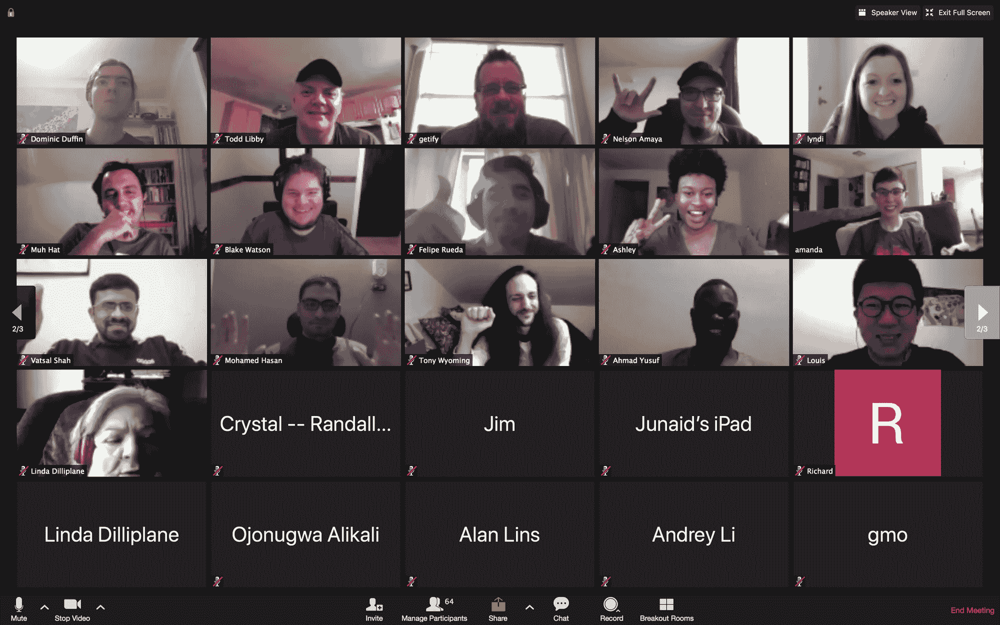

# 加入 CodeBookClub:一个虚拟的开发者聚会

> 原文：<https://www.freecodecamp.org/news/join-the-code-book-club/>

2020 年你在学编码吗？

或者你已经是一名开发人员，但还想提升自己的技能？

我想邀请你加入密码俱乐部。

我们是数百名不同经验水平的开发人员，一起学习。我们在 Zoom 免费视频会议软件上举行在线直播聚会。我们结对编程，举行小组编码会议，一起阅读/讨论教程、课程和技术书籍。

如果你想加入，请前往这篇文章的底部，加入 Discord，并在 2 分钟内成为会员。

以下是我们即将召开的一些会议:

## “你不知道的 JS”每周读书俱乐部。

每隔一周的周日，在太平洋标准时间下午 2 点/美国东部时间下午 5 点，我们会阅读凯尔·辛普森的免费“你不知道的 JS”系列丛书中的第一册“开始行动”中的一章。

随时欢迎加入每周阅读。你不必每次都来参加会议，我们会讨论一些问题来巩固我们所学到的东西，并帮助彼此明确我们仍然困惑或纠结的概念或想法。

凯尔·辛普森本人最近也加入了我们的现场问答环节！

## CodeWars 小组编码会议

我们举行集体编码会议，在那里我们一起解决编码战问题。这是一个练习编码、交流和其他技能的好方法，在你进行技术面试时会有所帮助。

我们每隔一周的周日下午 2:00(太平洋标准时间)和下午 5:00(美国东部时间)举行 CodeWars 会议。

如果你不能参加这个会议，每个月都会有更多的消息公布！

## 如果你有兴趣参加我们的任何免费聚会，以下是加入俱乐部的方法。

如何加入

1.  如果你 [u](https://madisonkanna.us14.list-manage.com/subscribe/post?u=323fd92759e9e0b8d4083d008&id=033dfeb98f) 想要加入俱乐部，注册我们的[电子邮件列表](https://madisonkanna.us14.list-manage.com/subscribe/post?u=323fd92759e9e0b8d4083d008&id=033dfeb98f)以便被邀请，获得关于如何加入俱乐部的指导并在 5 分钟内加入我们。你也会得到未来阅读和社区活动的更新。

该俱乐部的目的是提供免费、有趣的现场聚会，让你和他人一起学习。从刚开始学习如何编码的人到专业开发人员，我们俱乐部里有各种经验水平的程序员。

> 想学习计算机科学和 Python 的基础知识吗？俱乐部很快就要出版一本新书了，我们将在学习过程中一起进行编码练习、小组讨论和项目。
> 
> 加入我们？【https://t.co/xm2V1mSRrx 
> 
> — CodeBookClub (@codebookclub) [April 1, 2020](https://twitter.com/codebookclub/status/1245222157757501440?ref_src=twsrc%5Etfw)