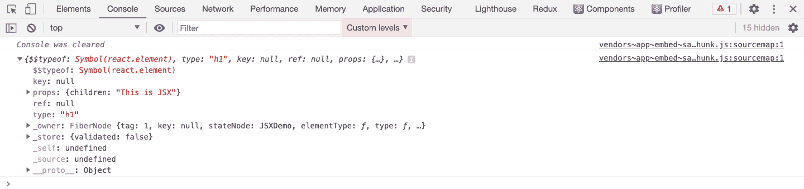
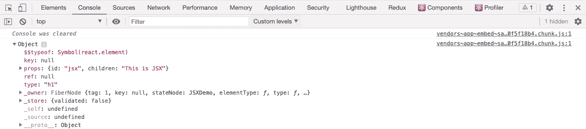
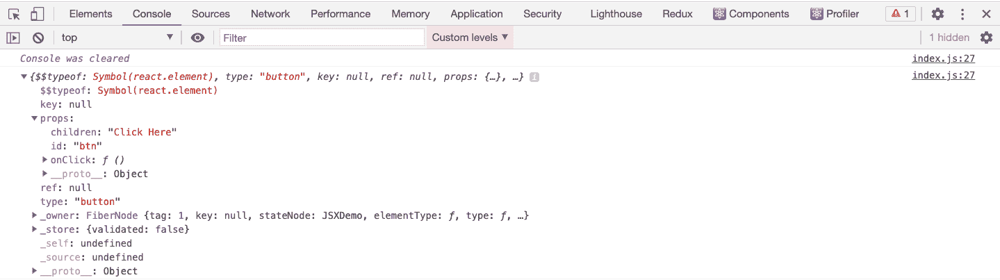
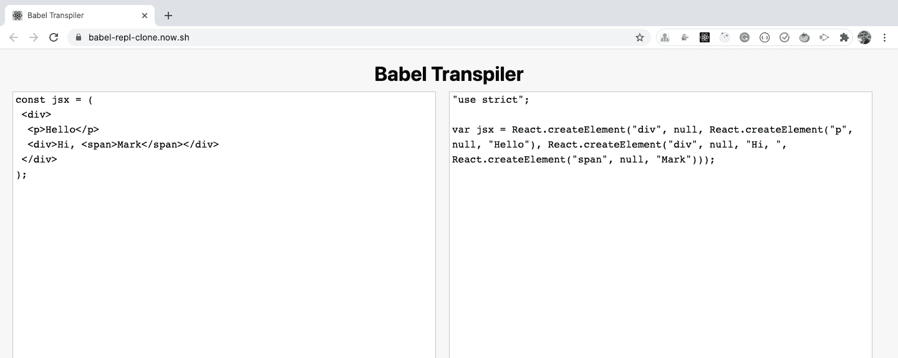
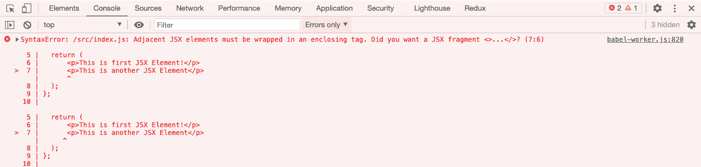
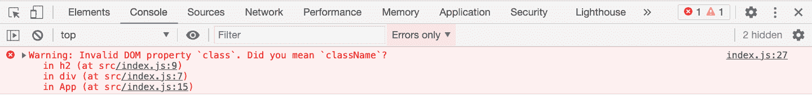
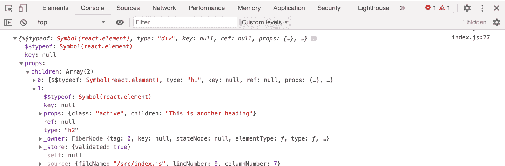

# React 中的 JSX——举例说明

> 原文：<https://www.freecodecamp.org/news/jsx-in-react-introduction/>

JSX 是 React 的核心概念之一。因此，如果你很好地理解了它，你就能写出更好的 React 代码。

在本文中，我们将探索:

*   什么是 JSX 反应和如何使用它
*   JSX 是如何转变为`React.createElement`
*   什么是 JSX 表达式，我们可以在里面写什么
*   JSX 的共同问题

还有更多。所以让我们开始吧。

## 什么是 JSX？

> JSX 是 React 中使用的 JavaScript 扩展语法，可以轻松地将 HTML 和 JavaScript 编写在一起。

看看下面的代码:

```
const jsx = <h1>This is JSX</h1>
```

这是 React 中简单的 JSX 代码。但是浏览器不理解这个 JSX，因为它不是有效的 JavaScript 代码。这是因为我们将一个 HTML 标签赋给了一个不是字符串而是 HTML 代码的变量。

因此，为了将它转换成浏览器可理解的 JavaScript 代码，我们使用了一个工具，如 [Babel](https://babeljs.io/) ，它是一个 JavaScript 编译器/transpiler。

你可以使用 Webpack 建立你自己的 babel 配置，正如我在本文的[中所展示的。或者您可以使用](https://medium.com/javascript-in-plain-english/webpack-and-babel-setup-with-react-from-scratch-bef0fe2ae3e7?source=friends_link&sk=880a6b9a35fb638eef19e5e99276428e) [create-react-app](https://github.com/facebook/create-react-app) ，它在内部使用 Babel 进行 JSX 到 JavaScript 的转换。

我们可以在 React 代码中使用上述 JSX，如下所示:

```
class JSXDemo extends React.Component {
    render() {
        return <h1>This is JSX</h1>;
    }
}

ReactDOM.render(<JSXDemo />, document.getElementById('root'));
```

这里，我们从`JSXDemo`组件返回 JSX，并使用`ReactDOM.render`方法将其呈现在屏幕上。

这里有一个[代码沙盒演示](https://codesandbox.io/s/awesome-framework-7kr3d?file=/src/index.js)。

当巴别塔执行上述 JSX 时，它会将其转换为以下代码:

```
class JSXDemo extends React.Component {
    render() {
        return React.createElement("h1", null, "This is JSX");
    }
}
```

这里有一个[代码沙盒演示](https://codesandbox.io/s/billowing-dust-b357d?file=/src/index.js)。

正如您在上面的代码沙箱中看到的，代码仍然使用`React.createElement`将内容正确地打印到屏幕上。

这是在 React 中编写代码的老方法——但是每次都编写`React.createElement`很乏味，即使是添加一个简单的 div。

因此，React 引入了 JSX 的代码编写方式，使代码易于编写和理解。

> 作为一名 React 开发者，知道如何将 JSX 转换成`React.createElement`是非常重要的(这也是一个常见的面试问题)。

## React.createElement 函数是什么？

每个 JSX 都被转换成浏览器理解的`React.createElement`函数调用。

`React.createElement`的语法如下:

```
React.createElement(type, [props], [...children])
```

我们来看看`createElement`函数的参数。

*   **类型可以是像 h1、div 这样的 HTML 标签，也可以是 React 组件**
*   ******道具**** 是你希望元素拥有的属性**
*   ******子**** 包含其他 HTML 标签或者可以是组件**

**`React.createElement`调用也将被转换成对象表示，如下所示:**

```
`{   
 type: 'h1',   
 props: {     
   children: 'This is JSX'   
 }
}` 
```

**如果您将 JSX 分配给某个局部变量，并按如下所示进行记录，您可以看到此对象表示:**

```
`class JSXDemo extends React.Component {
    render() {
        const jsx = <h1>This is JSX</h1>;
        console.log(jsx);
        return jsx;
    }
}

ReactDOM.render(<JSXDemo />, document.getElementById('root'));`
```

**这里有一个[代码沙盒演示](https://codesandbox.io/s/epic-spence-jcp5t?file=/src/index.js)。**

**您将看到如下所示的日志:**

****

**现在，看一下下面的代码:**

```
`class JSXDemo extends React.Component {
  render() {
    const jsx = <h1 id="jsx">This is JSX</h1>;
    console.log(jsx);
    return jsx;
  }
}

ReactDOM.render(<JSXDemo />, document.getElementById("root"));` 
```

**这里，我们像这样使用 JSX:**

```
`<h1 id="jsx">This is JSX</h1>`
```

**所以反应过来，将这个 JSX 转换成下面的代码:**

```
`React.createElement("h1", { id: "jsx" }, "This is JSX");`
```

**如果有任何属性添加到 HTML 标签中，就像我们的例子一样，它们将作为第二个参数传递给`React.createElement`调用。对象表示将如下所示:**

```
`{ 
  type: 'h1', 
  props: { 
   id: 'jsx',
   children: 'This is JSX'
  } 
}`
```

**这里有一个[代码沙盒演示](https://codesandbox.io/s/infallible-lake-rz7vj?file=/src/index.js)。**

**您将看到如下所示的日志:**

****

**现在，让我们给 JSX 增加一些复杂性，看看它是如何转换成`React.createElement`调用的。**

```
`class JSXDemo extends React.Component {
  handleOnClick = () => {
    console.log("clicked");
  };
  render() {
    return (
      <button id="btn" onClick={this.handleOnClick}>
        Click Here
      </button>
    );
  }
}

ReactDOM.render(<JSXDemo />, document.getElementById("root"));`
```

**这里，我们为按钮添加了一个`onClick`处理程序。**

**对于上面的代码，`React.createElement`调用将如下所示:**

```
`React.createElement("button", {
  id: "btn", 
  onClick: function() {}
}, "Click Here")`
```

**这里有一个[代码沙盒演示](https://codesandbox.io/s/new-dew-sc2rp?file=/src/index.js)。**

**对象表示将如下所示:**

****

**所以从上面所有的例子中，很明显 JSX 被转换成一个`React.createElement`调用，然后它被转换成它的对象表示。**

**如果你想看 JSX 到 T0 的转换代码，你可以导航到 T1 这个应用程序 T2，它是我在 T3 这篇文章 T4 中创建的。您可以在左边编写 JSX 代码，在右边看到转换后的代码，如下所示:**

****

## **如何回归复杂的 JSX**

**看看下面的代码:**

```
`import React from "react";
import ReactDOM from "react-dom";

const App = () => {
  return (
      <p>This is first JSX Element!</p>
      <p>This is another JSX Element</p>
  );
};

const rootElement = document.getElementById("root");
ReactDOM.render(<App />, rootElement);` 
```

**这里有一个[代码沙盒演示](https://codesandbox.io/s/objective-thunder-3hqqz?file=/src/index.js)。**

**这里，我们从 App 组件返回两段。但是如果你运行代码，你会得到这个错误:**

****

**我们得到一个错误，因为 React 要求相邻的元素被包装在父标签中。**

**正如我们所见，`<p>This is first JSX Element!</p>`将被转换为`React.createElement("p", null, "This is first JSX Element!")`,`<p>This is another JSX Element</p>`将被转换为`React.createElement("p", null, "This is another JSX Element")`。**

**转换后的代码现在将如下所示:**

```
`import React from "react";
import ReactDOM from "react-dom";

const App = () => {
  return (
            React.createElement("p", null, "This is first JSX Element!"); React.createElement("p", null, "This is another JSX Element");
        );
};

const rootElement = document.getElementById("root");
ReactDOM.render(<App />, rootElement);`
```

**这里我们从`App`组件返回两个东西，这两个东西不能工作，因为没有父元素来包装它们。**

**为了让它工作，显而易见的解决方案是将它们都包装在某个父元素中，很可能是这样的`div`:**

```
`import React from "react";
import ReactDOM from "react-dom";

const App = () => {
  return (
    <div>
      <p>This is first JSX Element!</p>
      <p>This is another JSX Element</p>
    </div>
  );
};

const rootElement = document.getElementById("root");
ReactDOM.render(<App />, rootElement);` 
```

**这里有一个[代码沙盒演示](https://codesandbox.io/s/stoic-khorana-vnrt6?file=/src/index.js)。**

**但是也有其他的方法让它发挥作用。**

**首先，您可以尝试将它作为数组返回，如下所示:**

```
`import React from "react";
import ReactDOM from "react-dom";

const App = () => {
  return (
    [<p>This is first JSX Element!</p>,<p>This is another JSX Element</p>]
  );
};

const rootElement = document.getElementById("root");
ReactDOM.render(<App />, rootElement);` 
```

**这里有一个[代码沙盒演示](https://codesandbox.io/s/crazy-banach-wy756?file=/src/index.js)。**

**这将完成工作，但是正如您在浏览器控制台中看到的，您将得到一个警告，内容是`Warning: Each child in a list should have a unique "key" prop.`**

> **因为在 React 中，数组中的每个元素(当使用 JSX 显示时)都需要添加一个惟一的键。**

**我们可以通过为相邻元素添加唯一的键来修复它:**

```
`import React from "react";
import ReactDOM from "react-dom";

const App = () => {
  return (
    [<p key="first">This is first JSX Element!</p>,<p key="second">This is another JSX Element</p>]
  );
};

const rootElement = document.getElementById("root");
ReactDOM.render(<App />, rootElement);` 
```

**这里有一个[代码沙盒演示](https://codesandbox.io/s/relaxed-resonance-ljzzf?file=/src/index.js)。**

**另一种解决方法是使用`React.Fragment`组件:**

```
`import React from "react";
import ReactDOM from "react-dom";

const App = () => {
  return (
    <React.Fragment>
      <p>This is first JSX Element!</p>
      <p>This is another JSX Element</p>
    </React.Fragment>
  );
};

const rootElement = document.getElementById("root");
ReactDOM.render(<App />, rootElement);` 
```

**这里有一个[代码沙盒演示](https://codesandbox.io/s/fervent-morse-gsvk8?file=/src/index.js)。**

**在 React 版本中添加了`React.Fragment`，因为我们总是必须在组件返回的每个 JSX 中的某个标签(如 div)中包装多个相邻的元素。但是这增加了不必要的 div 标签。**

**这在大多数情况下没问题，但在某些情况下就不好了。**

**例如，如果我们使用 Flexbox，那么在 Flexbox 的结构中就有一种特殊的父子关系。并且在中间添加 div 使得很难保持期望的布局。**

**所以使用`React.Fragment`可以解决这个问题。**

> ***Fragments* 让您不用向 DOM 添加额外的节点就可以对孩子列表进行分组。**

## **如何给 JSX 代码添加注释**

**如果您有这样一行代码:**

```
`<p>This is some text</p>`
```

**如果您想为该代码添加注释，那么您必须用 JSX 表达式语法将该代码包装在`/*`和`*/`注释符号内，如下所示:**

```
`{/* <p>This is some text</p> */}`
```

***提示:*不用手动输入评论，可以使用`Cmd + /` (Mac)或`Ctrl + /`快捷键来添加或删除评论。**

## **如何在 JSX 添加 JavaScript 代码**

**到目前为止，我们只使用了 HTML 标签作为 JSX 的一部分。但是当我们在其中添加 JavaScript 代码时，JSX 变得更加有用。**

**要在 JSX 中添加 JavaScript 代码，我们需要将它写在像这样的花括号中:**

```
`const App = () => {
 const number = 10;
 return (
  <div>
   <p>Number: {number}</p>
  </div>
 );
};`
```

**这里有一个[代码沙盒演示](https://codesandbox.io/s/keen-leftpad-jygwo?file=/src/index.js)。**

> **在花括号里，我们只能写一个计算值为某个值的表达式。**

**所以，通常这种使用花括号的语法被称为 JSX 表达式语法。**

**以下是 JSX 表达式中的有效内容:**

*   **像“你好”这样的字符串**
*   **像 10 这样的数字**
*   **类似[1，2，4，5]的数组**
*   **将计算出某个值的对象属性**
*   **返回某个值的函数调用，该值可能是 JSX**
*   **总是返回新数组的 map 方法**
*   **JSX 本身**

**以下是无效内容，不能用在 JSX 表达式中:**

*   **for 循环或 while 循环或任何其他循环**
*   **变量声明**
*   **函数声明**
*   **一个 if 条件**
*   **一个物体**

**我们可以在 JSX 表达式中编写数组，因为在渲染时`<p>{[1, 2, 3, 4]}</p>`最终被转换为`<p>{1}{2}{3}{4}</p>`(渲染时不会有任何问题)。**

**在对象的情况下，不清楚对象应该如何显示。比如应该是逗号分隔的键值对还是应该显示为 JSON？所以如果你试图在 JSX 表达式中显示这个对象，你会得到一个错误。但是我们可以用对象属性来代替。**

> **另请注意，在 JSX 内部使用时，未定义、null 和 boolean 不会显示在 UI 上。**

**因此，如果你有一个布尔值，你想在用户界面上显示它，你需要把它包装在 ES6 模板文字语法中，就像这样:**

```
`const App = () => {
  const isAdmin = true;
  return (
    <div>
      <p>isAdmin is {`${isAdmin}`} </p>
    </div>
  );
};`
```

**这里有一个[代码沙盒演示](https://codesandbox.io/s/ecstatic-shamir-7b5z6?file=/src/index.js)。**

### **JSX 表达式中的条件运算符**

**我们不能用 JSX 表达式写 if 条件，你可能会认为这是一个问题。但是 React 允许我们编写条件运算符，像三元运算符以及逻辑短路&T3 这样的运算符:**

```
`<p>{a > b ? "Greater" : "Smaller"}</p>
<p>{shouldShow && "Shown"}</p>`
```

**这里有一个[代码沙盒演示](https://codesandbox.io/s/condescending-wind-4rwtl)描述了编写 JSX 表达式的各种方法。**

## **如何嵌套 JSX 表情**

**你甚至可以像这样嵌套 JSX 表达式:**

```
`const App = () => {
  const number = 10;
  return (
    <div>
      {number > 0 ? (
        <p>Number {number} is positive</p>
      ) : (
        <p>Number {number} is Negative</p>
      )}
    </div>
  );
};`
```

**这里有一个[代码沙盒演示](https://codesandbox.io/s/frosty-dew-mj351?file=/src/index.js)。**

## **如何在 JSX 添加班级**

**我们可以给 JSX 元素添加属性，例如`id`和`class`，就像在 HTML 中一样。**

```
`import React from "react";
import ReactDOM from "react-dom";

const App = () => {
  const id = "some-id";
  return (
    <div>
      <h1 id={id}>This is a heading</h1>
      <h2 className="active">This is another heading</h2>
    </div>
  );
};

const rootElement = document.getElementById("root");
ReactDOM.render(<App />, rootElement);` 
```

**这里有一个[代码沙盒演示](https://codesandbox.io/s/great-chandrasekhar-i48t2)。**

**注意，在 React 中，我们需要使用`className`而不是`class`。**

**这是因为如果您使用`class`而不是`className`，您将在控制台中得到如下所示的警告:**

****

**这里有一个[代码沙盒演示](https://codesandbox.io/s/happy-smoke-ecbtl?file=/src/index.js)。**

**要理解为什么显示警告，请打印它的对象表示，您将看到以下内容:**

****

**这里有一个[代码沙盒演示](https://codesandbox.io/s/epic-frost-e64ll?file=/src/index.js)。**

**如您所见，props 对象具有值为`active`的`class`属性。但是在 JavaScript 中，`class`是一个保留关键字，所以访问`props.class`会导致错误。**

**这也是 React 决定用`className`而不是`class`的原因。**

**使用`className`而不是`class`是 React 面试中的常见问题。**

> **注意，在 React 中，所有的属性名都是用 camelCase 写的。**

**你可以在这里找到所有已更改和未更改的属性列表[。](https://reactjs.org/docs/dom-elements.html#all-supported-html-attributes)**

## **结论**

**在本文中，我们已经看到了如何在 React 中使用 JSX。以下是一些要点:**

*   **每个 JSX 标签都被转换成`React.createElement`调用和它的对象表示。**
*   **写在花括号内的 JSX 表达式，只允许值为某个值的东西，比如字符串、数字、数组映射方法等等。**
*   **在 React 中，我们必须使用`className`而不是`class`来向 HTML 元素添加类**
*   **React 中的所有属性名都是用 camelCase 编写的。**
*   **在 JSX 内部使用时，`undefined`、`null`、`boolean`不显示在 UI 上。**

### **感谢阅读！**

**查看我的免费[React 路由器介绍](https://yogeshchavan.podia.com/react-router-introduction)课程。**

**此外，查看我的[掌握现代 JavaScript](https://modernjavascript.yogeshchavan.dev/) 一书，详细了解所有最新的 ES6+特性，以便更好地掌握 JavaScript 和 React。**

**********订阅我的[每周简讯](https://yogeshchavan.dev/)加入 1000+其他订阅者，直接在您的收件箱中获得惊人的提示、技巧、文章和折扣优惠。**********