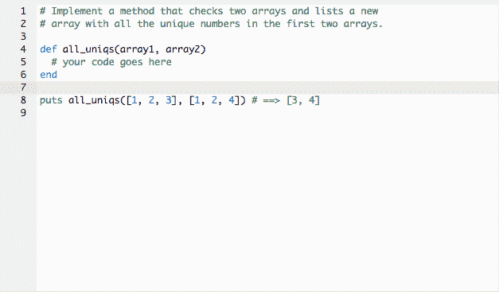

# 编码训练营也教你如何一天被拒绝 10 次。

> 原文：<https://www.freecodecamp.org/news/jumping-through-loops-at-coding-bootcamp-c5fa34947419/>

埃里克·坎农

# 编码训练营也教你如何一天被拒绝 10 次。

“您将有 60 分钟的时间来完成四个编码挑战，并使所有测试通过‘true’。有问题吗？”

沉默了很长时间。

“太好了。请开始。”

我打开了 Cloud9 文档，浏览了初步的说明，然后找到了第一种方法。以嘲弄的口吻瞪着我。它非常清楚我不知道如何开始这个问题。实现一个空数组，开始某种循环，甚至插入一个模操作符——所有这些都是我应该从哪里开始的短暂想法。

当我有点沮丧地坐着，寻找通往正确答案的起点时，压力显而易见。

这是我被精英编码训练营录取的机会，也是我科技职业生涯的开始。

我让自己陷入了什么？

### 电梯到阴阳魔界

从最真实的意义上来说，我坐在纽约市时尚区的一栋办公楼里，就在曾经自命不凡的休斯顿街(对于我们这些不“了解内情”的人来说，发音为“house-ton”)的南面，离丝芙兰的休息室只有几层楼。

这座建筑从外面看起来并不起眼，从内部看就更没有美感了。

It wasn’t quite this bad, but you get the idea. Image courtesy of [Pinterest](https://www.pinterest.com/pin/245516617159863999/)

一部摇摇欲坠的电梯耐心地等在一个小大厅里，把我送到中间的楼层，然后把我扔进了一个完全开放的办公空间。

这个空间狭长，可以看到城市街道上的美景，有一个小厨房和饮水机，配有硬木地板、白色墙壁和一排排黑色电脑显示器。

学生们勤奋地撕扯代码行，让计算机以我看过《黑客帝国》后从未见过的方式跳舞。

"嘿，你是来参加入会仪式的吗？"坐在我右边的一个精力充沛的人问道，尽管有点不修边幅。我的确是。

启动程序是这个特殊的编码训练营的一个创意。这个项目的想法是让那些看起来有能力的人(根据教育历史和 SAT 分数来判断)拥有有限的编码和计算机科学经验。这将让他们在两周内到达一个地方，在那里他们可以通过所有训练营申请者都必须通过的入学考试。

通过入学考试对个人来说非常有利，并且似乎允许自动被训练营接受——如果你相信他们网站上的统计数据的话——在纽约市有 98%的就业率，中位数工资为 89，000 美元，在旧金山甚至更高。

要理解这样一个编码训练营的吸引力，就要理解一个更深层的运动，迈克尔·刘易斯恰当地称之为“[新的新事物](https://www.amazon.com/New-Thing-Silicon-Valley-Story/dp/0393347818)”刘易斯解释说，这场运动是下一个重大的职业突破，提供了致富的可能性，有意义的工作，以及宇宙中心类型的吸引力，将一个时代最聪明的人聚集在一起。这种类型的吸引力类似于 80 年代的债券交易或 90 年代的“popy”[男孩乐队](https://www.youtube.com/watch?v=Eo-KmOd3i7s)

再加上不确定的就业市场、2008 年的金融危机、前所未有的巨额学生债务，你会开始理解为期三个月的训练营的吸引力，只需支付少量可退还的押金，就有望快速进入一个有回报的职业生涯。更详细的描述请见休斯顿女士为《华尔街日报》撰写的文章。

认为一个编码训练营可以在三个月内把你从零带到编码英雄，表面上看起来很可笑。毕竟，被认可的大学不是提供这个学科的四年学位吗？

bootcamp 校友如何在就业市场上与计算机科学学士竞争？训练营的校友得到了什么样的工作？我们说的是谷歌的产品工程师还是创业公司“X”的行政助理？另外，编码到底有多难？我决心找出答案。

### 我在营地的第一天

回到训练营总部，所有的启蒙项目学生都被带到大楼的后面，在一排排经过董事会认证的标准黑色转椅上坐下。椅子正对着一台投影仪，在雪白的墙壁上显示着麦金塔电脑的主屏幕。

自信的学生在前排走来走去，而紧张的学生则吵吵嚷嚷地走向后排的一把空转椅。在预定的开始时间后几分钟，起初看起来像是一个穿着彩色条纹 t 恤的自信的新生，他介绍自己是 John，一个高级训练营助教，并欢迎每个人参加这个项目。

约翰是一个年轻的男性，留着卷发，高于平均身高。他说话很快，很有效率，带着一点紧张的神情，好像不断提醒自己要保持冷静。在简单介绍了自己和本周的目标后，约翰向坐在他左边的六位助教示意。每个人都从他们的黑色监视器后面向上凝视，用不同程度的能量介绍他们自己。

助教是一个丰富多彩的，老实说，令人印象深刻的团体。这群人中有富布赖特学者、常青藤联盟的剧作家、高中毕业生代表、机械工程师，甚至还有一个长胡子的麦克拉温二重身。我后来发现，助教们是最近的训练营毕业生，他们仍在找工作，似乎与一些尴尬的笑话、高智商、对计算的热爱以及尚未找到梦想工作的集体团结结合在一起。他们的关系更多的是表面的，而不是深层的联系，他们似乎只是把对方当作环境中的熟人，而不是亲密的私人朋友。

约翰继续安排一周的时间表，我们很快发现第一件事就是把参加项目的学生分成六个不同的小组，每个小组由一名训练营助教带领。在 pods 中，你将与一名同学一起进行当天的编码练习，并完成 GitHub(一个程序员的网络站点，代码片段可以很容易地共享)上分配的个人工作。

在第一周结束时，会有一个评估来测试你学到了多少，看看你是否准备好参加为期三个月的训练营。评估也将在第二周结束时再次进行，如果你没有通过第一周，就有机会进行补救。

约翰结束了他的介绍性演讲，然后把我们分成几个小组。我在 4 号舱，由一个叫萨姆的助教带领。山姆非常聪明，但也非常冷漠。与其他助教不同的是，他投入了最少的监督，仍然被认为是助教。萨姆更有可能独自一人呆在电脑前，而不是去寻找需要帮助的学生。

### 我的同学们

Sam 指导我们开始学习自定进度的材料，他将我们每个人单独拉到一边，以便更好地了解我们，理解我们为什么对编程和这个训练营感兴趣。就在这个时候，我终于能够见到我的一些同学，他们和助教一样有趣，如果不是更有趣的话。

有一个从事会计工作的日本移民，一个大学生，他发誓说他的哥哥刚刚在一家大型金融公司找到了一份令人印象深刻的编码工作，一个训练营专家，他专注地研究了每个训练营的利弊，来到这里是因为它确实是最好的，一个医学预科生，在发现她对甲醛过敏后，她的医学之旅被中断了。还有数不清的其他人，他们以前的工作太枯燥、太不令人满意、或者工资太低，他们想成为这个“新的新事物”的一部分。

我的大多数同学似乎已经拥有了本科学位和至少一份初级工作。没有一个人超过 20 岁，据我所知，所有人似乎都相当聪明。

简单地做完分配的工作后，约翰宣布第一天的课已经结束了，我很快就走上了曼哈顿的人行道。

走出第一天的教室，我开始意识到第一天的感觉是多么奇怪却又有些熟悉。在某种程度上，训练营本身就像一个传统的大学课堂。有一群年轻专心的学生，活跃的助教，他们刚刚完成必修课，给他们助教证书，还有一大堆阅读材料和练习题。

A picture from my commute home from class, Washington Square Park.

唯一明显缺席的是老师。没有权威人物或无所不知的博士来引导讨论。甚至没有一个 32 岁的前程序员穿着印有 bootcamp 字样的帽衫，准备传播几年的行业知识。有年轻人，只有年轻人挤在战壕里想搞清楚。

整个组织有一种非常原始和杂乱无章的东西。非常提神和令人陶醉的东西。这种感觉我只能想象拉里和谢尔盖早年在将权力移交给埃里克·施密特之前的感受。

### 开始编码

那天晚上回到家，我说的家指的是几个大学老朋友让我睡的沙发，我完全筋疲力尽，精神枯竭，但不知何故仍然完全兴奋地醒来并开始编写代码。第二天早上我醒来，开始工作。这些概念似乎很简单。引号内的任何内容都是字符串。字母可以设置为相等的变量。好吧，我以前见过这个。方法是一个工作单元。不错不错。第一道练习题进行得相当顺利，我开始获得一些信心。然后就出现了作业问题。

家庭作业的问题比他们在阅读材料中插入的垒球例子有了很大的进步。我尽了最大的努力，而不是发誓在课堂上更好地理解它。家庭作业问题是我们每节课开始的第一件事，也是我最困惑的时候。

助教会询问开始问题的方法，然后立刻有一大群人举手。一个热心的志愿者会提供他或她解决问题的方法，助教会立即走这条路。

类似于一个数学问题，有很多方法可以得到正确的答案或者你想让程序做什么。每个学生都有不同程度的经验，并会提供我们许多人以前从未见过的解决方案。当班上的其他人还在做加法的时候，想想建议一个三角函数。这与其说是启发，不如说是令人沮丧，有些助教比其他人更好。最终，我觉得这些会议导致了大规模的恐慌，学生们绝望地感到落后于形势。

家庭作业复习之后，接下来的一天是结对编程。结对编程是我在课堂上最喜欢的时光。你不仅和其他同学建立了联系，还能看到另一个人是如何处理这个问题的。当双方都不知道如何解决这个问题时，这当然被证明是困难的，但就像大多数事情一样，两个人总比一个人好。

关于成对编程会话，最能说明问题的是，桌子是如何立即辨别出谁“明白了”，谁没有明白。一些人会比其他人提前几光年完成，并开始谈论天气，而其他人则没有读完说明。

更有趣的是，许多顶尖人物是多么谦虚。他们经常会默认说作业有多难或者他们对评估有多紧张。很明显这些程序员有多熟练，但他们在这种情况下的谦逊也许是让他们与所有其他一起奋斗的学生联系在一起的原因。

日子来了又去，我一周都有一个很好的时间表。我会醒来，锻炼身体，按下电码。在晚上去上课之前，我整天都在学习，很快就能够区分数组和字符串，循环和条件。我会尝试家庭作业的问题，然后继续阅读指定的课程，直到我发现一种新的技术，可能会让我找到答案。最终，我做错的比做对的多，但我对自己能在这么短的时间内学到这么多东西印象深刻，如果我自己这么说的话。

### 编码好玩吗？

在整个过程中，我发现编码令人难以置信地上瘾，同时令人难以置信地沮丧，而分开这两者的唯一方法就是刀刃。精神刺激是非常有益的，类似于解决一个棘手的数独或纵横字谜，然而，挫折也是非常存在的。

当一个时期可以决定成功与失败时，关注细节是关键。尤其是当你开始添加成百上千层代码的时候。同样，计算机科学概念可以增加复杂性。循环被用来一遍又一遍地执行相同的代码块，当循环被添加到其他循环中时，跟踪计算机正在做的事情类似于 Leo 试图记住他把妻子留在哪个梦里。

Loops can be tricky to understand, just like this Inception-esqu photo. Image courtesy of [Gizmodo](http://www.gizmodo.co.uk/2016/04/first-doctor-strange-trailer-shows-marvel-doing-an-inception/)

### 评估日

随着这一周接近尾声，评估日越来越近，我努力工作，尽可能多的记忆。然而，我所有的工作都是徒劳的，因为在助教上传评估的几分钟后，我很快意识到我没有在我需要的地方。这些问题太难了，在短短的一周内，我无法记住足够的有用材料来通过考试。

邻荚有几个同学觉得无望，早早放弃了。其他人尝试到最后一分钟，但无法完成每个问题。我不认为任何人能够通过第一次考试，至少我交谈过的任何人都不能，这是一种安慰。

考试结束后，学生们收拾行李准备离开，我向一位助教询问了挂在原本一尘不染的白色墙壁上的神秘装饰。装饰品上贴着“拒绝”的标签，用干擦记号笔写着一个名字，后面跟着一个数字。

助教解释说，每个数字都是每个全日制训练营学生被拒绝的公司数量。这些数字令人震惊，似乎更适合流行的 Instagram 帖子，而不是拒绝信。人数从 20 多到 50 多不等。助教继续解释说，在为期三个月的编码课程结束时，会有一个为期三周的求职过程，在训练营管理团队的帮助下，每个学生每天申请 10 份工作。

### 这一切值得吗？

就在那一刻，我意识到整个过程是多么困难，以及这些训练营在寻找什么样的人。你花了三个月的时间，每天花超过 12 个小时的时间编写代码，为的是在一家受人尊敬的公司获得一个梦寐以求的编程职位。

现在训练营可以吹嘘高工资和高就业率，但随着越来越多的训练营开放，越来越多的人变得擅长编码，市场可能很快就会充满计算机科学家。

这个问题没有明确的答案，因为技术的发展可能会以超过现有编码员数量的速度不断要求越来越多的人具备编码能力。

随着优步测试其第一批无人驾驶汽车和像 T2 霍尼韦尔 T3 这样的餐馆，通过电脑软件接受顾客订单进行精益运营，也许有理由相信这一趋势将持续到可预见的未来。

不管怎样，可以有把握地说，不管是什么行业，至少知道一些基本的计算机编程只会让一个人受益于一个越来越重技术的未来。

Honeygrow and its line of touchscreens ready to take your order. Image courtesy of [WolfeScott](http://wolfescott.com/project/honeygrow-bala-cynwyd/)

如果你对编码感兴趣，并且 100%致力于这项事业，有一些关于编码训练营的积极信息。

虽然他们可能很难进入(这个训练营的录取率不到 5%)，但 30 名学生中的 25 名或最近一批学生中的 83%在几周内找到了技术工作。训练营本身也没有前期费用。你找到工作后，公司会从你的工资中拿走一部分，以确保每个人的目标一致。

此外，总的来说，科技行业的公司往往不太关心认证学位，而是关心你知道多少信息，你能在第一天增加什么价值。对于那些不想回到大学去获得额外学士学位的人来说，这是一个有希望的事实。

尽管如此，编码训练营并不是灵丹妙药。获得认可后，大量的艰苦工作摆在面前。不是每个人都能完成训练营。每周一次的考试——其中你只能有一次不及格——以及来自雇主的严格的技术面试，在这一过程中有许多检查来确保你了解自己的知识。

你准备好迎接挑战了吗？看下面一道练习题。

### 我的道路

至于我，我决定不再继续我对这个特殊的编码训练营的追求。我没有准备好接受他们所期待的那种承诺。不过，我并没有放弃编码，因为我加入了相信编码将成为未来十年首要技能的阵营。

与此同时，我计划通过[自由代码营](https://www.freecodecamp.com/)来工作。

谁知道呢，也许明年我会在战壕里为一个编码训练营的席位而战。或者，也许我会成为一名足够强大的开发人员，然后出去找份工作。

只有时间能证明一切。

如果你想了解更多关于科技、职业和生活中的难题，你可以在 [Loose Cannon Publications](https://medium.com/loose-cannon) 和 Twitter 上的 [@loosecannonpub](https://twitter.com/loosecannonpub) 找到我的一些其他作品。