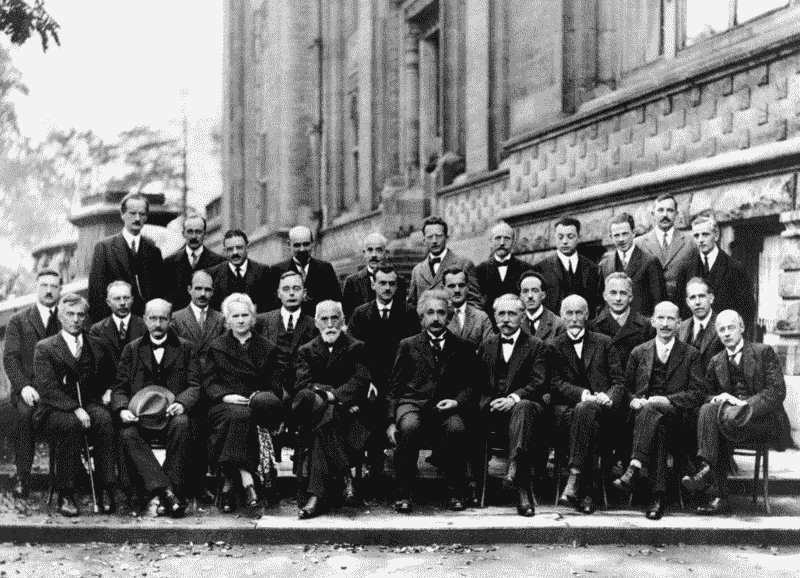

# 你自学并不意味着你必须独自学习。

> 原文：<https://www.freecodecamp.org/news/just-because-youre-self-taught-doesn-t-mean-you-have-to-learn-alone-b8724c1549e1/>

彼得·贝克

# 你自学并不意味着你必须独自学习。

Even geniuses need company.

我是一个自学成才的设计师，没有受过正规培训。没有艺术学校，没有私人课程，甚至没有 MOOCs。没有。但并不是我今天所知道的关于设计的一切都归功于我自己。相反，与他人合作并向他人学习是我进步的关键。

#### 离开大楼

当我刚开始工作时，我参加了各种行业活动、会议和研讨会。一开始，我只想出去逛逛，吃免费披萨。不一定学到什么。

然而，当我参加不同的活动时，我开始遇到更有经验的设计师。他们告诉我关于[结构网格](https://en.m.wikipedia.org/wiki/Grid_(graphic_design))、[垂直节奏](http://webdesign.tutsplus.com/articles/improving-layout-with-vertical-rhythm--webdesign-14070)和[负空间](https://en.m.wikipedia.org/wiki/Negative_space)——这些概念我都没听说过。他们向我展示了 [D3.js](https://d3js.org) 、 [Sketch](http://www.sketchapp.com) 和[名词项目](https://thenounproject.com)——我甚至不知道存在的工具。

这也是我偶然发现黑客马拉松的原因:开放式工作空间挤满了聪明人、咖啡和……更多的披萨！我喜欢它。这种设置非常适合获得高质量的实时反馈。无论我设计了什么，我都可以从有经验的设计师那里得到反馈，看看它是否好。

最重要的是，我交了朋友。我们交谈、合作、集思广益——早在我们相遇的时候。至关重要的是，我们给予了彼此精神上的支持。它帮助我们克服了不可避免的自我怀疑。而且有很多。

#### 旅行学习

大约一年后，我决定第一次去硅谷。我的现金快用完了，开始怀疑我的横渡大西洋之旅是否是个好主意。事实证明，我本不应该担心——在接下来的一个月里，我学到的东西比我去年学到的还要多。

造成差异的不仅仅是事件的质量。也许是因为我不认识任何人，但我真的多走了一步去和陌生人打招呼。

在那次最初的经历之后，我决定继续旅行。无论我去哪里——从伦敦到曼谷——我都会加入联合工作空间，报名参加活动。可以预见的是，并非所有城市都像硅谷一样提供如此多的专业知识。但是我在任何地方都学到了新的东西。

旅行也让我第一次尝到了远程工作的滋味。当我和客户用 Skyping 聊天时，有一件事变得很清楚:要做好设计，我需要更好地沟通。我学会了问更精确的问题，更快地抓住要点，毫不迟疑地说出废话。在这种情况下，我别无选择。但这并不是你通常从书本上学到的东西。

#### 寻求帮助，给予帮助

即使我在家工作，我也无法摆脱他人的影响。例如，在早期，当我无法判断我的设计是否能达到预期的功能时，我会从 Dribbble 或 Behance 那里借用创意。

这无助于我的设计脱颖而出。但是随着时间的推移，我吸收了数百种不同的解决方案、模式和其他巧妙的技巧。

最终，我开始创作原创设计并分享它们。很快，年轻的设计师和企业家开始要求我审核他们的工作。

我们的谈话进一步组织了我的知识，并经常会产生新的、意想不到的想法。

我通过帮助别人提高自己的技能来提高自己的技能。

#### 与他人一起学习

如果你正在考虑学习一个新的职业或自学一项新技能，试着和其他人一起做。学习的满足感会一样大——如果不是更大的话——而且你可能会发现你在其他情况下不会遇到的想法。

谁知道呢，你甚至可能得到一两次演出的机会。

我当然有。