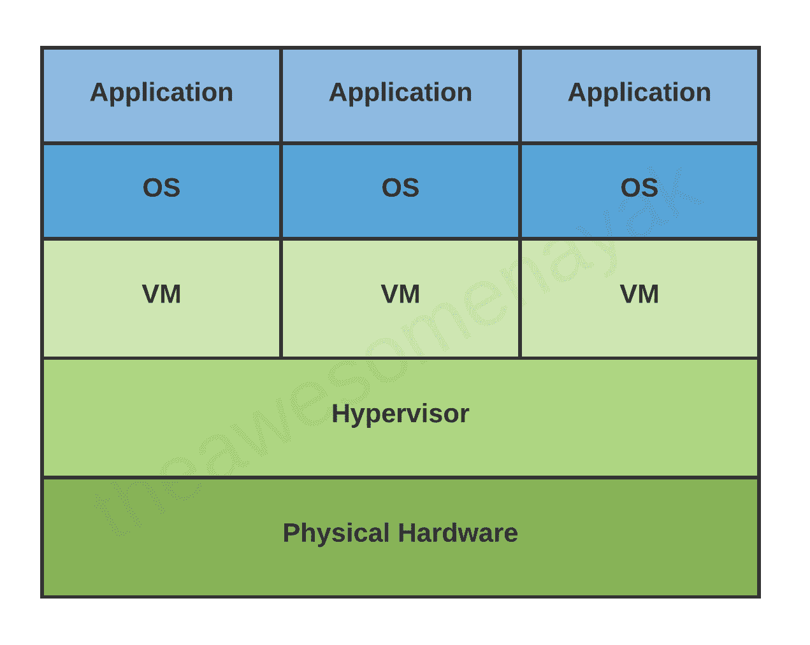
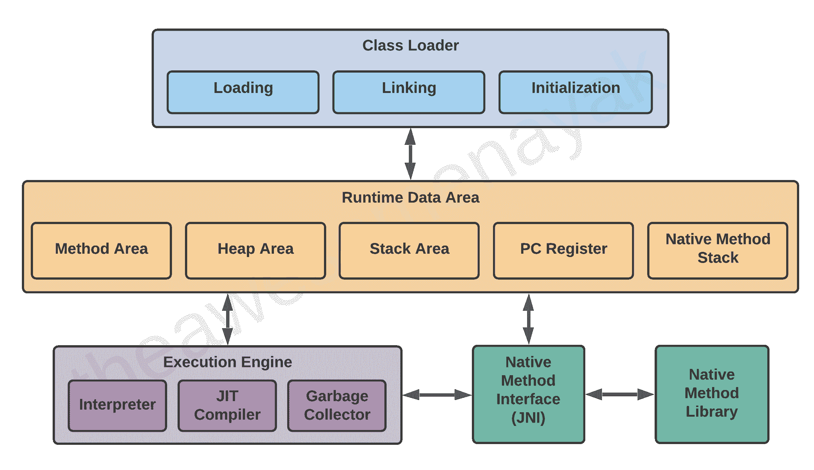
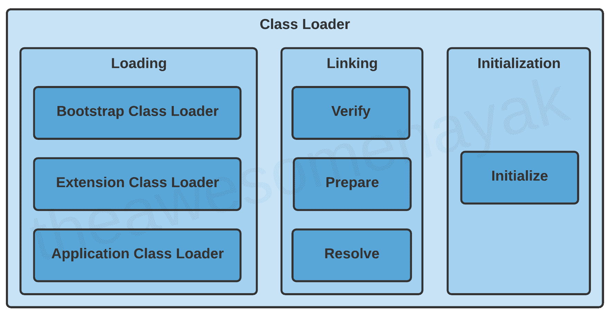
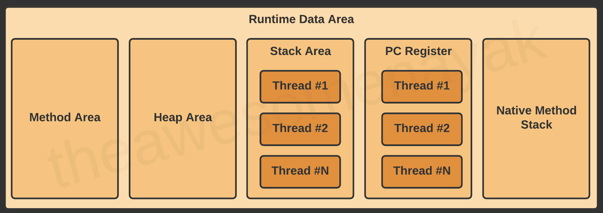
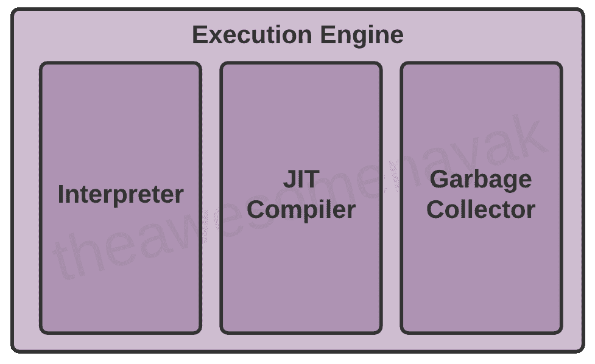

# JVM 教程-为初学者讲解的 Java 虚拟机架构

> 原文：<https://www.freecodecamp.org/news/jvm-tutorial-java-virtual-machine-architecture-explained-for-beginners/>

无论您是否使用过 Java 开发程序，您都可能在某个时候听说过 Java 虚拟机(JVM)。

JVM 是 Java 生态系统的核心，它使得基于 Java 的软件程序能够遵循*“一次编写，随处运行”*的方法。您可以在一台机器上编写 Java 代码，并使用 JVM 在任何其他机器上运行它。

JVM 最初被设计成只支持 Java。然而，随着时间的推移，许多其他语言如 Scala、Kotlin 和 Groovy 也在 Java 平台上被采用。所有这些语言统称为 JVM 语言。

在本文中，我们将学习更多关于 JVM 的知识，它是如何工作的，以及组成它的各种组件。

# 什么是虚拟机？

在我们进入 JVM 之前，让我们回顾一下虚拟机(VM)的概念。

虚拟机是物理计算机的*虚拟表示。我们可以把虚拟机称为来宾机，它运行的物理计算机就是主机。*



一台物理机可以运行多个虚拟机，每个虚拟机都有自己的操作系统和应用程序。这些虚拟机相互隔离。

# 什么是 Java 虚拟机？

在像 C 和 C++这样的编程语言中，代码首先被编译成特定于平台的机器代码。这些语言被称为*编译语言*。

另一方面，在 JavaScript 和 Python 这样的语言中，计算机直接执行指令，而不必编译它们。这些语言被称为*解释语言*。

Java 结合使用了这两种技术。Java 代码先编译成字节码，生成一个*类*文件。这个*类*文件然后由 Java 虚拟机为底层平台进行解释。相同的*类*文件可以在任何平台和操作系统上运行的任何版本的 JVM 上执行。

*与虚拟机类似，*JVM 在主机上创建一个隔离的空间。这个空间可用于执行 Java 程序，而与机器的平台或操作系统无关。

# Java 虚拟机体系结构

JVM 由三个不同的组件组成:

1.  类装入器
2.  运行时内存/数据区
3.  执行引擎



让我们更详细地看一下它们。

## 类装入器

当你编译一个`.java`源文件时，它被转换成字节码作为一个`.class`文件。当你试图在你的程序中使用这个类时，类装入器会把它装入主存。

加载到内存中的第一个类通常是包含`main()`方法的类。

类加载过程有三个阶段:加载、链接和初始化。



### 装货

加载包括获取具有特定名称的类或接口的二进制表示(字节码),并从中生成原始的类或接口。

Java 中有三种内置的类装入器:

*   **引导类装入器** **-** 这是根类装入器。它是扩展类加载器的超类，加载标准的 Java 包，如`java.lang`、`java.net`、`java.util`、`java.io`等。这些包存在于`rt.jar`文件中，其他核心库存在于`$JAVA_HOME/jre/lib`目录中。
*   **扩展类装入器-** 这是引导类装入器的子类，也是应用类装入器的超类。这将加载位于`$JAVA_HOME/jre/lib/ext`目录中的标准 Java 库的扩展。
*   **应用类加载器-** 这是最终的类加载器，也是扩展类加载器的子类。它加载类路径中的文件。默认情况下，类路径设置为应用程序的当前目录。也可以通过添加`-classpath`或`-cp`命令行选项来修改类路径。

JVM 使用`ClassLoader.loadClass()`方法将类加载到内存中。它尝试基于完全限定名加载类。

如果父类装入器找不到一个类，它就把工作委托给子类装入器。如果最后一个子类装入器也不能装入类，它抛出`NoClassDefFoundError`或`ClassNotFoundException` *。*

### 连接

当一个类被加载到内存中后，它会经历链接过程。链接一个类或接口包括将程序的不同元素和依赖项组合在一起。

链接包括以下步骤:

**验证:**这个阶段通过对照一组约束或规则来检查`.class`文件的结构正确性。如果由于某种原因验证失败，我们得到一个`VerifyException`。

例如，如果代码是使用 Java 11 构建的，但是在安装了 Java 8 的系统上运行，那么验证阶段将会失败。

**准备:**在这个阶段，JVM 为类或接口的静态字段分配内存，并用默认值初始化。

例如，假设您已经在类中声明了以下变量:

```
private static final boolean enabled = true;
```

在准备阶段，JVM 为变量`enabled`分配内存，并将其值设置为布尔值的默认值`false`。

**解析:**在这个阶段，符号引用被替换为运行时常量池中存在的直接引用。

例如，如果您有对其他类或其他类中存在的常量变量的引用，它们将在此阶段被解析并替换为它们的实际引用。

### 初始化

初始化包括执行类或接口的初始化方法(称为`<clinit>`)。这可以包括调用类的构造函数，执行静态块，以及为所有静态变量赋值。这是类加载的最后阶段。

例如，当我们在前面声明以下代码时:

```
private static final boolean enabled = true;
```

在准备阶段，变量`enabled`被设置为默认值`false`。在初始化阶段，该变量被赋予其实际值`true`。

**注意:**JVM 是多线程的。可能会发生多个线程同时尝试初始化同一个类的情况。这可能会导致并发问题。您需要处理线程安全，以确保程序在多线程环境中正常工作。

## 运行时数据区

运行时数据区内有五个组件:



让我们单独看一下每一个。

### 方法区域

所有类级别的数据，比如运行时常量池、字段和方法数据，以及方法和构造函数的代码，都存储在这里。

如果方法区中的可用内存不足以启动程序，JVM 会抛出一个`OutOfMemoryError`。

例如，假设您有以下类定义:

```
public class Employee {

  private String name;
  private int age;

  public Employee(String name, int age) {

    this.name = name;
    this.age = age;
  }
}
```

在这个代码示例中，字段级数据如`name`和`age`以及构造函数细节被加载到方法区域。

方法区域是在虚拟机启动时创建的，每个 JVM 只有一个方法区域。

### 堆区域

所有对象及其对应的实例变量都存储在这里。这是运行时数据区，从这里为所有类实例和数组分配内存。

例如，假设您正在声明以下实例:

```
Employee employee = new Employee();
```

在这个代码示例中，`Employee`的一个实例被创建并加载到堆区域。

堆是在虚拟机启动时创建的，每个 JVM 只有一个堆区域。

**注意:**因为方法和堆区域为多个线程共享相同的内存，所以这里存储的数据不是线程安全的。

### 堆栈区

每当在 JVM 中创建一个新线程时，也会同时创建一个单独的运行时堆栈。所有局部变量、方法调用和部分结果都存储在堆栈区域。

如果在一个线程中完成的处理需要比可用的更大的堆栈大小，JVM 抛出一个`StackOverflowError`。

对于每个方法调用，在堆栈内存中创建一个条目，称为堆栈帧。当方法调用完成时，堆栈帧被销毁。

堆栈框架分为三个子部分:

*   **局部变量—**每一帧包含一个变量数组，称为其*局部变量*。所有局部变量及其值都存储在这里。这个数组的长度是在编译时确定的。
*   **操作数堆栈—**每帧包含一个后进先出(LIFO)堆栈，称为其*操作数堆栈*。这充当执行任何中间操作的运行时工作区。这个堆栈的最大深度是在编译时确定的。
*   **帧数据—**对应于该方法的所有符号都存储在这里。这也存储异常情况下的 catch 块信息。

例如，假设您有以下代码:

```
double calculateNormalisedScore(List<Answer> answers) {

  double score = getScore(answers);
  return normalizeScore(score);
}

double normalizeScore(double score) {

  return (score – minScore) / (maxScore – minScore);
} 
```

在这个代码示例中，像`answers`和`score`这样的变量被放在局部变量数组中。操作数堆栈包含执行减法和除法数学计算所需的变量和运算符。


**注意:**因为堆栈区域不是共享的，所以它本身就是线程安全的。

### 程序计数器(PC)寄存器

JVM 同时支持多个线程。每个线程都有自己的 PC 寄存器来保存当前执行的 JVM 指令的地址。一旦指令执行完毕，PC 寄存器就会更新下一条指令。

### 本机方法堆栈

JVM 包含支持*本地*方法的栈。这些方法是用 Java 以外的语言编写的，比如 C 和 C++。对于每个新线程，还会分配一个单独的本机方法堆栈。

## 执行引擎

一旦字节码被加载到主存中，并且细节在运行时数据区中可用，下一步就是运行程序。执行引擎通过执行每个类中的代码来处理这个问题。

然而，在执行程序之前，字节码需要被转换成机器语言指令。JVM 可以为执行引擎使用解释器或 JIT 编译器。



### 解释者

解释器逐行读取并执行字节码指令。由于逐行执行，解释器相对较慢。

解释器的另一个缺点是，当一个方法被多次调用时，每次都需要新的解释。

### JIT 编译器

JIT 编译器克服了解释器的缺点。执行引擎首先使用解释器执行字节码，但是当它发现一些重复的代码时，它使用 JIT 编译器。

然后，JIT 编译器编译整个字节码，并将其更改为本机代码。这种本机代码直接用于重复的方法调用，从而提高了系统的性能。

JIT 编译器具有以下组件:

1.  **中间代码生成器-** 生成中间代码
2.  **代码优化器-** 优化中间代码以获得更好的性能
3.  **目标代码生成器-** 将中间代码转换为本机代码
4.  **分析器-** 发现热点(重复执行的代码)

为了更好地理解解释器和 JIT 编译器之间的区别，假设您有以下代码:

```
int sum = 10;
for(int i = 0 ; i <= 10; i++) {
   sum += i;
}
System.out.println(sum);
```

解释器将为循环中的每次迭代从内存中取出`sum`的值，将`i`的值添加到其中，并将其写回内存。这是一个开销很大的操作，因为它每次进入循环时都要访问内存。

但是，JIT 编译器会识别出这段代码有一个热点，并对其进行优化。它将在 PC 寄存器中为该线程存储一个本地副本`sum`,并在循环中不断向其添加`i`的值。一旦循环完成，它将把`sum`的值写回内存。

**注意:**JIT 编译器编译代码要比解释器逐行解释代码花费更多的时间。如果你打算只运行一次程序，使用解释器会更好。

### 垃圾收集工

垃圾收集器(GC)从堆区域收集和移除未被引用的对象。它是通过销毁运行时未使用的内存来自动回收它们的过程。

垃圾收集使 Java 内存变得高效，因为它从堆内存中移除未引用的对象，并为新对象腾出空间。它包括两个阶段:

1.  **Mark -** 在这一步中，GC 识别内存中未使用的对象
2.  **Sweep -** 在这一步中，GC 会删除前一阶段中识别出的对象

垃圾收集由 JVM 定期自动完成，不需要单独处理。也可以通过调用`System.gc()`来触发，但不保证执行。

JVM 包含 3 种不同类型的垃圾收集器:

1.  **串行 GC -** 这是最简单的 GC 实现，是为运行在单线程环境中的小型应用程序设计的。它使用单线程进行垃圾收集。当它运行时，会导致一个“停止世界”事件，整个应用程序暂停。使用串行垃圾收集器的 JVM 参数是`-XX:+UseSerialGC`
2.  **并行 GC -** 这是 JVM 中 GC 的默认实现，也称为吞吐量收集器。它使用多线程进行垃圾收集，但在运行时仍会暂停应用程序。使用并行垃圾收集器的 JVM 参数是`-XX:+UseParallelGC`。
3.  **垃圾优先(G1) GC -** G1GC 是为拥有大量可用堆(超过 4GB)的多线程应用程序而设计的。它将堆划分成一组大小相等的区域，并使用多个线程来扫描它们。G1GC 识别垃圾最多的区域，并首先对该区域执行垃圾收集。使用 G1 垃圾收集器的 JVM 参数是`-XX:+UseG1GC`

**注意:**还有一种垃圾收集器叫做**并发标记清除(CMS) GC** 。但是，从 Java 9 开始，它就被弃用了，在 Java 14 中，它被完全移除，取而代之的是 G1GC。

## Java 本地接口(JNI)

有时，有必要使用本机(非 Java)代码(例如，C/C++)。这可能是在我们需要与硬件交互，或者需要克服 Java 中的内存管理和性能限制的情况下。Java 通过 Java 本地接口(JNI)支持本地代码的执行。

JNI 作为一座桥梁，允许其他编程语言如 C、C++等的支持包。这在您需要编写不完全受 Java 支持的代码的情况下尤其有用，比如一些只能用 c 语言编写的特定于平台的特性。

您可以使用`native`关键字来表示方法实现将由本地库提供。您还需要调用`System.loadLibrary()`将共享的本地库加载到内存中，并使其功能对 Java 可用。

## 本机方法库

本机方法库是用其他编程语言编写的库，如 C、C++和汇编。这些库通常以`.dll`或`.so`文件的形式存在。这些本地库可以通过 JNI 加载。

# 常见 JVM 错误

*   **classnotfoundexception**——当类加载器试图使用`Class.forName()`、`ClassLoader.loadClass()`或`ClassLoader.findSystemClass()`加载类，但没有找到具有指定名称的类的定义时，会出现这种情况。
*   **NoClassDefFoundError**——当编译器成功编译了类，但类加载器在运行时找不到类文件时，就会出现这种情况。
*   **out of memory error**——当 JVM 由于内存不足而无法分配对象，并且垃圾收集器无法提供更多可用内存时，就会出现这种情况。
*   如果 JVM 在处理一个线程时创建新的堆栈帧时耗尽了空间，就会出现这种情况。

# 结论

在本文中，我们讨论了 Java 虚拟机的架构及其各种组件。我们通常不会深入研究 JVM 的内部机制，或者在代码工作时关心它是如何工作的。

只有当出现问题，我们需要调整 JVM 或修复内存泄漏时，我们才试图理解它的内部机制。

这也是一个非常受欢迎的面试问题，无论是初级还是高级后端角色。对 JVM 的深入理解有助于您编写更好的代码，并避免与堆栈和内存错误相关的陷阱。

[https://www.youtube.com/embed/jnpuRvRdTgI?feature=oembed](https://www.youtube.com/embed/jnpuRvRdTgI?feature=oembed)

谢谢你一直陪着我。希望你喜欢这篇文章。你可以在 LinkedIn 上和我联系，我经常在那里讨论技术和生活。也看看一些[我的其他文章](https://www.freecodecamp.org/news/author/theawesomenayak/)和我的 [YouTube 频道](https://www.youtube.com/channel/UCmWAaPgfWAkl-Jep5mY-NNg?sub_confirmation=1)。快乐阅读。🙂