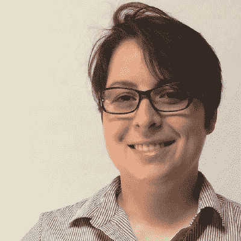
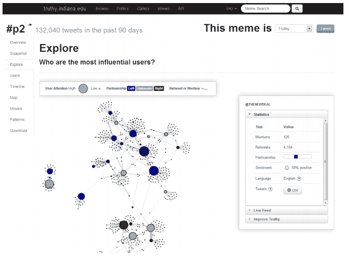
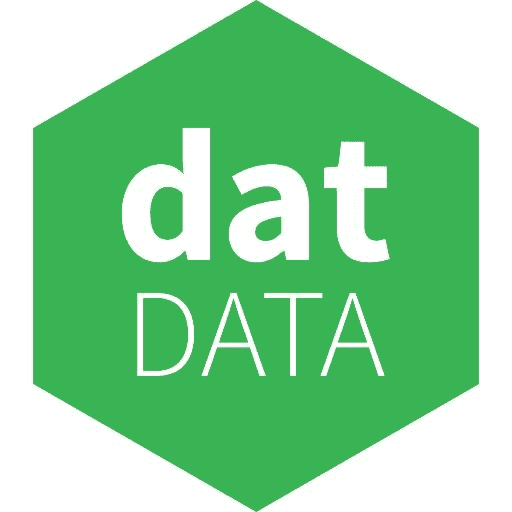
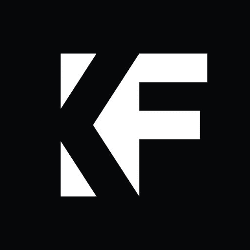
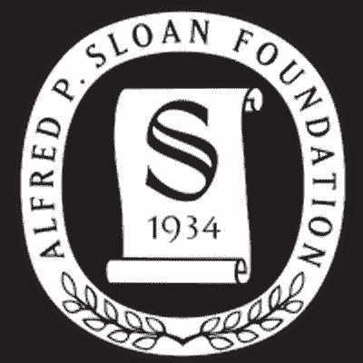
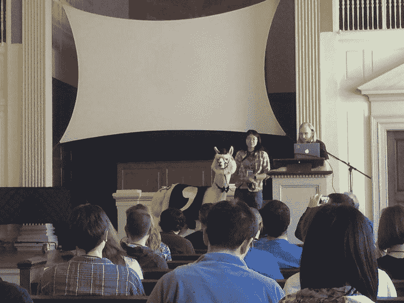
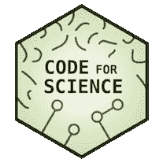
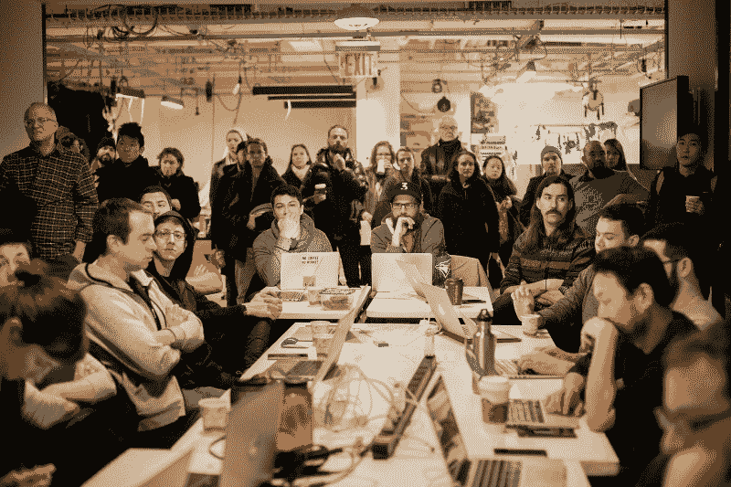
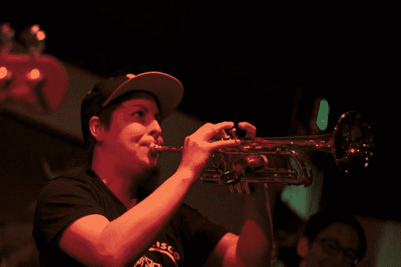

# 电线之间:数据科学家卡丽莎·麦凯尔维访谈

> 原文：<https://www.freecodecamp.org/news/karissa-mckelvey-864084c27cbb/>

薇薇安·克伦威尔

# 电线之间:数据科学家卡丽莎·麦凯尔维访谈

我采访了 [Karissa McKelvey](https://twitter.com/okdistribute) ，她是 [Dat 项目](https://datproject.org/)的工程总监，这是一个分布式数据共享工具，它将你的数据打包并通过分布式网络共享。

#### **你是怎么进入编程的？**

我去了一所公立学校。像大多数 13 岁的孩子一样，我只想通过考试。在某个时候，我开始在 TI-83 计算器上编程。我会把它送给我的朋友，以换取额外的午餐或魔法卡片。我就是这样开始进入编程的。在那之后，我在高中开始为我玩的电子游戏制作网站。

我当时并不认为这是编程，因为我所做的只是解决我需要解决的问题。当我决定上大学时，我并没有真正选择计算机科学。我实际上选择了政治学，因为我对政治和辩论非常感兴趣。当时我把编程放在一边，直到我意识到这是我想做的事情，所以我在大学里结束了双专业。

后来，我去了印第安纳大学攻读信息学博士学位。前提是将计算机科学应用于特定领域。2010 年到 2014 年间，我通过我的实验室，复杂网络和系统研究，从 Twitter 上收集了大量数据。在社会运动和重大政治事件中，我们开始研究新闻和思想是如何在网上传播的。看到全貌是令人兴奋的，这就是我开始进入数据分析的原因。

#### 你是如何参与 Dat 项目的？

你会认为研究人员真的很聪明，他们拥有整合所有不同来源数据的完美系统。你会认为在人与人之间传输数据一定很容易。但事实完全不是这样。在大学里处理数据真的很难。一些小组已经开发了内部数据仓库和工作流程，但大多数实验室在协作和共享数据方面存在困难。

当我离开博士项目开始做数据可视化时，我发现这是一个巨大的头痛。我曾在 Continuum Analytics 和谷歌工作，然后加入了一家名为 Datapad 的初创公司。一年后，我找到了马克斯·奥格登和 T2 的 Dat 项目，我在推特上给马克斯发了关于数据共享的消息，今天我来到了这里。

#### **什么是 Dat 项目？**

Logo for Dat Project

Dat 是一个分布式数据共享工具，它将你的数据打包并通过分布式网络共享。这意味着我们利用了 [BitTorrent](https://en.wikipedia.org/wiki/BitTorrent) 的最好部分，这是一个分布式网络，以及 [Git](https://en.wikipedia.org/wiki/Git) 的最好部分，在那里你有版本历史，你把它们放在一起。它实际上没有使用 Git 或 BitTorrent，但它受到了这两个项目的启发，以构建更健壮、对数据中断更有弹性的东西。

我们三年半前就开始研究这个了。马克斯得到了骑士基金会的资助来制作一个原型。从那以后，它经历了设计、实现和测试的三次迭代。目前，我们的大多数用户都是科学家，因为我们一直在营销，并与他们一起研究科学家用例。它对其他类型的东西也非常有用，这是拥有一个通用的多功能平台的伟大之处。

BitTorrent 的问题是用户不能随着时间的推移更新数据，因为查找数据的散列和链接每次都会改变。我们通过创建一个不变的公钥找到了解决这个问题的方法，生成密钥的人可以通过使用私钥随着时间的推移向它添加更多的数据。获得数据访问权限的人可以查看历史并及时返回，他们还可以在文件中查找特定的字节范围，这是一个非常强大和有用的工具。

#### **Dat 的奖助金是如何运作的？**

马克斯从骑士基金会获得了第一笔 50，000 美元的资助，用于原型研究。这持续了 6-9 个月，然后一个对这个项目感兴趣的来自斯隆基金会的人找到马克斯说:“嘿，让我们把这个应用到科学上吧。”斯隆基金会资助对科学家有用的工具，以提高研究的完整性和效率。

Knight Foundation

随着我们继续从斯隆和奈特基金会获得更多资助，马克斯开始组建团队。整个项目完全由赠款资助。获得资助的最大也是最重要的部分是得到资助官员的帮助，并说服他们你的项目是值得的。奖助金官员的工作就是把钱给他们相信的项目，或者他们相信完成基金会使命的项目。

Sloan Foundation

每个出资人都不一样。有时他们只想给你 20，000 或 50，000 美元，而其他时候他们想给你 50 万美元。他们总是努力争取公共利益。

#### 如果一个基金会给你一系列的资助，期望是如何设定的？

你要做的第一件事是写你的提案，它可以有 12 到 200 页。在提案中，你需要陈述你的里程碑是什么。如果是一年半的资助，你可以说，“三个月后，我们将雇佣一个团队。七个月后，我们将完成用户测试，拥有一套不错的设计，并推出 alpha 版本。”任何能让投资者清楚知道接下来会发生什么的东西。

您希望在提案中设置这些里程碑以及指标，如用户数量和下载量。在预先定义的时间间隔，比如六个月，您需要做一个简短的报告来告知您项目的进展情况，以及您在度量方面做得如何。捐钱的人希望确保他们的钱被正确使用。

#### 赠款官员和工程师如何找到彼此进行合作？

有多种方法可以让你被介绍给助学金官员，但我个人喜欢坚持两种。

第一种方法，在会议或大会的背景下，是有一个坚实的演示文稿，抓住房间里的赠款官员的眼睛。这样，他们会就项目与你接洽。另一种方法是由你认识的人介绍给格兰特官员，这时候你真的需要建立关系。

还有另一种方式，这是最明显的，但可能是最不有效的方式来获得资助，那就是通过在线表格或竞争来申请。通常这是他们让新人入伙的方式。如果你还没有获得重大突破，参加在线论坛或挑战可能会有所帮助。但你需要有现实的期望，因为有很多人申请，竞争非常激烈。

#### **捐赠基金会如何看待开源？**

开源是人们让他们的项目继续成功的一种方式，即使他们没有得到资助，即使项目没有达到目标。从长远来看，这是为社区做贡献的好方法。当你拥有封闭源代码的东西时，它会随着想法、公司或组织一起消亡。

许多捐赠基金会努力做到利他主义，所以开源属于他们的策略，因为他们只想资助对公众有用的项目。这使得许多其他的创造者和企业家对你的使命感兴趣并参与其中。

#### Dat 管理着一个非常分散的团队。请告诉我们您在团队生产力和沟通方面的最佳实践。你使用什么工具？

GitHub 对哥本哈根的分布式团队 Mathias Buus 帮助很大；马克斯·奥格登和乔·汉德在波特兰；柏林的 Yoshua Wuyts，Julian Gruber 和 Kristina Schneider，以及台湾的高嘉良..我们尽量避免团队内部的私下交流，所以一切都在公共 IRC 上完成。我们每天都要站起来汇报当天的工作，每两周打一次电话，互相通报当前的情况，然后我们计划下一步要做的事情。

公开做任何事情有助于让团队以外的其他人作为开源贡献者与我们合作。在我看来，“开源”是“分布式”的同义词

我们没有一个三人以上的团队，这很好。关键之一是拥有一个小而专注的团队。我认为两三个人一组工作效率最高。不止如此，就很难得出结论。当人们对项目中属于他们的部分拥有所有权时，他们会觉得被授权做决定。同时，他们也可以从其他人那里获得横向的意见。

#### 什么是科学与社会的代码？

[科学与社会代码](https://codeforscience.org/)是一个非盈利组织，它从财政上资助那些想要获得资助项目的人。

财政资助基本上就是当你得到一笔拨款时，不管支票的大小，你不能作为个人接受这笔钱。你需要一个为你承担责任的组织。基金会把钱给非营利组织，然后非营利组织把钱给作为承包商的你，并负责法律和会计。

我们创建了科学与社会代码来容纳 Dat 项目和一个名为 T2 的项目，同时我们也在寻找其他的项目来容纳。从本质上说，我们帮助人们获得资金并处理所有的过程，这样他们就可以专注于项目，并通过非营利组织作为承包商获得报酬。我们正在积极寻找有兴趣获得资助的人。如果你有一个伟大的想法，甚至可能是一个原型，我们希望帮助你获得资助，并成为你的财政赞助商。

实际情况是，很多工程师有一个很好的想法，他们可能也和一个资助官员有联系，但他们不知道如何做会计，也不总是知道如何雇用人。工程师不应该担心很多小细节，我们应该专注于更大的蓝图和我们试图完成的使命。但是对于开源来说，这是一个很难的话题，因为你只是想制造产品，但是你没有一个公司来帮助你。我们正努力成为那个伞式组织。

理想情况下，我们投资组合中的所有项目都是可以相互协作的。这包括为科学、社会、新闻、开放政府、行动主义、合作以及所有这些领域编码。

#### 带领我们度过为科学和社会建立数据和代码的一天？

虽然在一个开源项目中构建、维持和灭火是有趣且具有挑战性的，但这也是艰难的，因为您必须要做的任务是不断变化的。有一天我在写一份拨款，下一个小时我就要去解决一个 bug，然后下一个小时就有人打电话给我询问会计。因为我们是非营利组织，我们总是有点资金不足，这意味着每个人都必须兼顾许多不同的任务。

有时候很安静，我一周只写 40 个小时的代码，但后来我开始有点坐立不安。我喜欢忙碌。我想这就是为什么我修了政治学和计算机科学的双学位，因为我喜欢改变它。我喜欢交谈，也喜欢编码。

#### 你能谈谈在构建 Dat 和 CSS 的过程中，你曾经经历过或目前正面临的几个非常困难的时期吗？你是如何战胜挣扎的？

最艰难的一次是大约一年半前。我在队里呆了一年，但那时马克斯和马蒂亚斯已经在这上面工作了大约两年。我在 Dat 的基础上构建了所有这些东西，但是内部设计并不适合我们的目标用户。我们意识到我们必须从零开始。

我们知道这将是最好的长期决定，但这是一个需要面对的挑战。我们意识到我们的用户不高兴，我们没有获得任何新用户，所以我们必须考虑他们想要什么。他们想要的是彻底的重新设计。

放弃我们的原型并转向新版本是一个艰难的转变。我们找到了能帮助我们设计下一阶段并解决所有问题和细节的用户。非营利组织的伟大之处在于你可以做到这一点，因为你不是在一条更短的跑道上。你没有获取用户或收入的强烈需求，这给了你回旋的余地。我们知道我们还剩多少时间，我们知道我们可以在这段时间内重建产品。能够从零开始提供了令人耳目一新的变化，我们开始与我们的用户联系，看看需要什么不同。

#### Dat 项目的下一步是什么？

我们对一直在进行的[数据拯救工作](https://www.datarefuge.org/)感到非常兴奋。

我们一直在与[数据避难所](https://www.datarefuge.org/)以及[国会图书馆](https://www.loc.gov/)、[阳光基金会](https://sunlightfoundation.com/)和[DATA.GOV](https://www.data.gov/)合作。我们将弄清楚如何在希望托管数据的不同机构之间高效地备份所有数据。我们还试图让以分布式方式备份开放数据集变得更容易，以便随着更多机构托管大数据集，他们能够从该数据集中分一杯羹。你可以在《纽约时报》上读到更多关于这项努力的内容。

Source: [https://www.nytimes.com/2017/03/06/science/donald-trump-data-rescue-science.html?mcubz=3](https://www.nytimes.com/2017/03/06/science/donald-trump-data-rescue-science.html?mcubz=3)

例如，DATA.GOV 有 60tb 的数据。没有一家机构愿意自己托管 60tb 的数据。我们想做的是使用 Dat 将数据集分布到许多不同的机构，这样机构就只有他们愿意贡献的一部分。

以一种分布式的方式备份这些数据集非常重要，这样即使其中一个发生故障，其他机构仍然可以使用这些数据。这只是其中的一部分，因为真正重要的是人们可以实际使用这些数据。世界各地的人们都使用由美国的资助机构、科学家和政府产生的数据。

我们谈论的是气候数据集、天文数据集，任何东西。该平台的多功能性为传播信息提供了一种有效的方式，这也是图书馆加入该平台的原因。我们希望让人们能够非常容易地描述他们的数据集，我们希望 Dat 成为一个非常好的工具。这是接下来几个月的目标。

我们试图做的是从世界各地收集数据集，让任何人都可以轻松发布它们。我们实施了一个新系统，将数据“感染”或“注入”到现有的存储库中。你只需要有一系列的元数据文件。我们想做的是获取已经存在于许多国际数据仓库中的数据集，并将它们转换成数据。

人们可以从网站上下载数据和访问 Dat，以获得更新、访问数据历史记录等——即使它在旧的 HTTP 存储库中。我们即将推出一些非常令人兴奋的东西，我们希望为世界各地的存储库做到这一点。

#### 除了编程，你还有什么其他爱好或兴趣？

我吹小号。这是一种很难演奏的乐器，但我很高兴我坚持了下来。

Karissa plays trumpet

除此之外，我还在债务集体组织(T1)工作，这是一个反对美国掠夺性贷款的债务人联盟。就教育和医疗保健等基本需求而言，债务融资体系肯定应该改变。生活在这个系统中而不负债是毫无道理的困难。我喜欢他们的任务。他们帮助全国各地陷入债务纠纷困境的人们。我帮他们建立了一点网站，并为他们做了一些技术咨询。

我[最初](https://betweenthewires.org/2017/08/25/karissa-mckelvey/)在[上发布了这篇采访，这是一个采访系列，以那些开发和设计产品的人为特色。](http://betweenthewires.org)

这个项目得到了 frontendmasters.com、T2、egghead.io 和 T4 的赞助。

Our sponsors.

[捐款支持本项目](https://opencollective.com/betweenthewires)。

要推荐一位您希望听到其声音的制造商，请填写此[表格](https://goo.gl/forms/XhR1IyLXJHNMljcp1)。

您也可以在 Twitter 上向 betweenthewires 发送反馈。