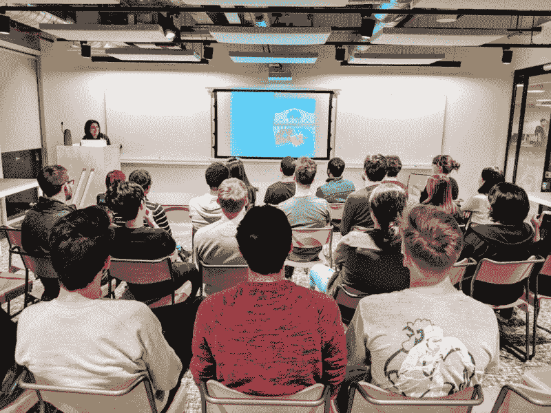
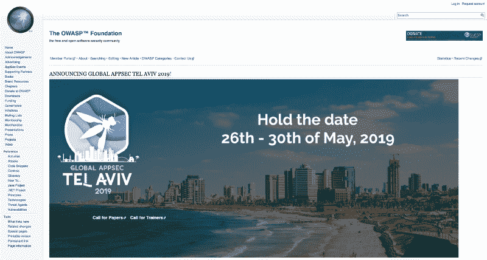

# 如何保持冷静成为一名安全工程师

> 原文：<https://www.freecodecamp.org/news/keep-calm-and-become-a-security-engineer-8547bd33a5cd/>

今年 1 月，我应伦敦熨斗学校的邀请，做了一场关于我如何从商业咨询转向科技行业的演讲。

他们还就如何成为一名安全工程师采访了我。我想和大家分享一下:-)

#### 你第一次开始编码是什么时候？

我第一次接触计算机和编程是在 80 年代中期，当时我在沙特阿拉伯，用的是一台 Sakhr AX-170 MSX。这真的很原始，因为没有来自机器的反馈，这需要我通过枯燥的计算机书籍来了解更多。语言是基本的。这也是我第一次体验电子游戏和 Konami 游戏。

[Sakhr AX-170 — MSX Wiki](https://www.msx.org/wiki/Sakhr_AX-170)

之后，我继续涉猎编码和不同的编程语言，如 XHTML、CSS、HTML 4.0、ECMASCRIPT 3 和 PHP (MAMP 技术栈)。我在视频游戏上创建简单的静态网站，或者在 MySpace.com 上玩 CSS。

#### 进入安全部门需要什么资格？

这完全取决于你想在网络安全的哪个部门工作。有些人有计算机科学学位或证书，有些人是自学的。

对于安全专业人员来说，有几个得到广泛认可和尊重的认证，来自 **(ISC)** 、 **ISACA** 或 **SANS Institute** 等组织。

[**【网络安全和 IT 安全认证及培训| (ISC)**](https://www.isc2.org/)
[*通过我们全球公认的网络安全认证，证明您是您所在领域的领导者。帮助创造网络…*www.isc2.org](https://www.isc2.org/)

[**信息技术-信息安全-信息保障| ISACA**](https://www.isaca.org/pages/default.aspx)
[*ISACA 是一个非营利性的独立协会，致力于倡导信息安全领域的专业人士……*www.isaca.org](https://www.isaca.org/pages/default.aspx)

[**信息安全培训| SANS 网络安全认证&研究**](https://www.sans.org/)
[*SANS 学院是信息安全培训、网络安全认证和…*www.sans.org](https://www.sans.org/)最值得信赖的资源

CompTIA 是另一个伟大的组织，在这里您可以了解更多关于 IT 基础知识、网络、云、linux、服务器和安全性的信息，每个简介都有不同的主题。

[**CompTIA Security+认证**](https://certification.comptia.org/certifications/security)
[*CompTIA Security+树立了 IT 安全和风险管理的最佳实践标准。*certification.comptia.org](https://certification.comptia.org/certifications/security)

你可以在 Udacity、Coursera 或者 edX 上找到一些不错的 MOOCs。

[**网络安全简介| Udacity**](https://eu.udacity.com/course/introduction-to-cybersecurity--ud1337)
[*探索网络安全的基础构建模块。*eu.udacity.com](https://eu.udacity.com/course/introduction-to-cybersecurity--ud1337)

如果你对渗透测试更感兴趣，**攻击性安全认证专家**将是一个很好的认证。

[**攻击性安全认证专家**](https://www.offensive-security.com/information-security-certifications/oscp-offensive-security-certified-professional/)
[*攻击性安全认证专家(OSCP)是对卡莉 Linux 进行渗透测试的认证…*www.offensive-security.com](https://www.offensive-security.com/information-security-certifications/oscp-offensive-security-certified-professional/)

你也可以成为你所在团队的安全冠军。这是我在公司做的。您可以从开发团队开始，担任安全冠军。

[**安全冠军行动手册——OWASP**](https://www.owasp.org/index.php/Security_Champions_Playbook)
[*根据 OWASP 的定义，安全冠军是“团队中的积极成员，他们可以帮助制定关于……的决策*www.owasp.org](https://www.owasp.org/index.php/Security_Champions_Playbook)

您将成为团队中的积极成员，并可能帮助决定何时与安全团队合作。您将充当给定产品、功能或团队的安全代言人，并协助对安全缺陷进行分类。

你可以帮助实现一个 AppSec 管道，在 JIRA 募集门票，在 Wiki 或 Confluence 上写一些文档。您可以在安全冠军网络中进行协作，参加会议，成为关键人物，确保安全不会成为障碍，获得一些培训以及 QA 和测试方面的帮助。

一旦你有了经验，如果你对这个行业感兴趣，你可以与你的安全团队合作，尝试在你的公司内进行，然后随着你的发展获得更多的经验和认证。

#### 你有什么资源可以推荐吗？

对于开发者来说，一个好的开始是**开放 Web 应用安全项目** (OWASP)，在那里他们将找到与软件安全相关的一切。

OWASP website. [https://www.owasp.org/index.php/Main_Page](https://www.owasp.org/index.php/Main_Page)

通常，开发人员可能熟悉 OWASP 十大最重要的 Web 应用程序安全风险，这是一个好的开始

[**类别:OWASP 十大项目——OWASP**](https://www.owasp.org/index.php/Category:OWASP_Top_Ten_Project)
[*OWASP 十大是一个强大的 web 应用安全意识文档。它代表了关于…*www.owasp.org](https://www.owasp.org/index.php/Category:OWASP_Top_Ten_Project)的广泛共识

值得看看其他项目，如 OWASP 十大主动控制，这是每个软件开发项目都应该包含的安全技术列表。还有 OWASP 应用程序安全验证标准(ASVS)项目，它为测试 web 应用程序技术安全控制提供了基础，也为开发人员提供了安全开发的需求列表。

[**OWASP 主动控制-OWASP**](https://www.owasp.org/index.php/OWASP_Proactive_Controls)
[*OWASP 2018 十大主动控制是每个软件都应该包含的安全技术…*www.owasp.org](https://www.owasp.org/index.php/OWASP_Proactive_Controls)

[**OWASP 应用安全验证标准项目-OWASP**](https://www.owasp.org/index.php/Category:OWASP_Application_Security_Verification_Standard_Project)
[*OWASP 应用安全验证标准(ASVS)项目的主要目标是将…*www.owasp.org](https://www.owasp.org/index.php/Category:OWASP_Application_Security_Verification_Standard_Project)中的范围标准化

你可以加入他们在你所在城市的本地聚会或者他们的 slack 频道，每个人都可以自由参与他们的项目。这可能是为开源项目做贡献的一个很好的起点，也是你简历和 GitHub 个人资料上的一个很好的项目。

[**OWASP 伦敦**](https://www.meetup.com/OWASP-London/)
[*OWASP(开放 Web 应用安全项目)是一个全球性的非营利组织，致力于改善……*www.meetup.com](https://www.meetup.com/OWASP-London/)

我还建议安装 Virtual Box 并运行 Kali Linux Box，以熟悉专业人员正在使用的工具套件。

[**我们有史以来最先进的渗透测试分布。**](https://www.kali.org/)
[*卡莉 Linux 之家，一个用于渗透测试的高级渗透测试 Linux 发行版，道德黑客……*www.kali.org](https://www.kali.org/)

然后你可以在一些网站、CTF(Capture The Flag)和 Wargames 上合法地练习你的黑客技能，比如 hackthebox、 [pwnable.kr](http://pwnable.kr/) 、OWASP Webgoat 或 OWASP Juice Shop 项目。

有很多网站和 CTF 可供练习。不要害怕尝试和失败，在这个过程中你会学到很多东西。

[**黑盒子::渗透测试实验室**](https://www.hackthebox.eu/)
[*一个在线平台，测试和提高您在渗透测试和网络安全方面的技能。今天就加入并开始…* www.hackthebox.eu](https://www.hackthebox.eu/)

[**OWASP 果汁店项目——OWASP**](https://www.owasp.org/index.php/OWASP_Juice_Shop_Project)
[*Pwning OWASP 果汁店是这个项目的官方伴随指南。它会给你一个……www.owasp.org 的完整概述*](https://www.owasp.org/index.php/OWASP_Juice_Shop_Project)

如果您的公司有培训预算，您可以尝试为您的团队订购沉浸式实验室、Avatao 或 Secure Code Warrior 等平台，通过在线实验室获得实践经验。

[**网络学习再造|沉浸式实验室**](https://immersivelabs.co.uk/)
[*沉浸式实验室是世界上最先进的网络技能开发平台。我们是网络技能专家，帮助……*immersivelabs.co.uk](https://immersivelabs.co.uk/)

[**安全代码战士|学习安全软件开发**](https://securecodewarrior.com/)
[*通过面向软件开发人员的游戏化、可扩展的在线安全培训，从一开始就保护您的代码。*securecodewarrior.com](https://securecodewarrior.com/)

最后，你可以在 BugCrowd 或 HackerOne 等众包网络安全平台上注册，在那里你将加入一个安全研究人员池，试图找到商业网站上的漏洞/漏洞，并为此获得报酬。根据公司的不同，如果发现的漏洞非常严重，你可以获得简单的荣誉或高额的金钱奖励。

[**Bugcrowd | #1 众包网络安全平台**](https://www.bugcrowd.com/)
[*凭借强大的平台和专家团队，Bugcrowd 将组织连接到全球可信安全人群……*www.bugcrowd.com](https://www.bugcrowd.com/)

[**Bug Bounty -黑客驱动的安全测试| Hacker one**](https://www.hackerone.com/)
[*Hacker one 开发 Bug Bounty 解决方案，通过与……*www.hackerone.com](https://www.hackerone.com/)合作，帮助组织降低安全事故的风险

#### 你会给我们的学生什么建议？

设定目标，真正做到自律。这个行业总是有新的东西要学，因为它是不断发展和快节奏的。公司需要解决网络技能短缺的问题，因此存在大量需求。

适用于科技行业的建议同样适用于网络安全。博客是了解应用安全、网络安全、威胁建模、事件/响应、安全运营中心、红/蓝/紫团队等更多信息的绝佳资源。

在 Twitter 上关注这个行业的组织和人士。这是获取最新新闻、违规、白皮书、报告、事件、会议等的最佳方式。

YouTube 也有很棒的频道可以关注(Troy Hunt、Security Weekly、LiveOverflow、HackerSploit、IppSec、IT Dojo、OWASP、DevSecCon、BugCrowd、HackerOne、AWS 等。).

[**live overflow**](https://www.youtube.com/channel/UClcE-kVhqyiHCcjYwcpfj9w)
[*只是一个想成为黑客的人...-=[支持我的❤️]=-帕特里翁每视频:https://www.patreon.com/join/liveoverflow YouTube…*www.youtube.com](https://www.youtube.com/channel/UClcE-kVhqyiHCcjYwcpfj9w)

[**HackerSploit**](https://www.youtube.com/channel/UC0ZTPkdxlAKf-V33tqXwi3Q)
[*关于 HackerSploit HackerSploit 是一家网络安全培训咨询公司，专业从事:网络安全…*www.youtube.com](https://www.youtube.com/channel/UC0ZTPkdxlAKf-V33tqXwi3Q)

[**IppSec**](https://www.youtube.com/channel/UCa6eh7gCkpPo5XXUDfygQQA)
[*我的频道你大概知道了。这里有一堆我喜欢的其他内容。酷人的帕特里恩页面…*www.youtube.com](https://www.youtube.com/channel/UCa6eh7gCkpPo5XXUDfygQQA)

[**IT Dojo**](https://www.youtube.com/channel/UCwUkAunxT1BNbmKVOSEoqYA)
[*IT Dojo 是一家 IT 培训和咨询公司，主要专注于网络安全、信息保障和……*www.youtube.com](https://www.youtube.com/channel/UCwUkAunxT1BNbmKVOSEoqYA)

[**DevSecCon**](https://www.youtube.com/channel/UCgxhfP2Hi8MQYz6ZkwpLA0A)
[*DevSecCon 是一个以关于 DevSecOps(一种蓬勃发展的嵌入式新方法)的讲座和研讨会为特色的会议……*www.youtube.com](https://www.youtube.com/channel/UCgxhfP2Hi8MQYz6ZkwpLA0A)

[**Bugcrowd**](https://www.youtube.com/channel/UCo1NHk_bgbAbDBc4JinrXww)
[*通过 bug crowd 的官方 YouTube 频道了解更多关于安全、测试员以及 bug 赏金的信息。Bugcrowd 提供…*www.youtube.com](https://www.youtube.com/channel/UCo1NHk_bgbAbDBc4JinrXww)

[**hacker one**](https://www.youtube.com/channel/UCsgzmECky2Q9lQMWzDwMhYw)
[*hacker one 是排名第一的 bug 赏金和漏洞披露平台，连接组织与全球……*www.youtube.com](https://www.youtube.com/channel/UCsgzmECky2Q9lQMWzDwMhYw)

参加聚会，在那里你可以获得更多的见解。OWASP 和 ISC2 有他们自己的分会。伦敦黑客协会(LLHS)的女士们是网络安全领域女性的绝佳聚会。

[**LLHS 伦敦女士黑客协会**](https://www.meetup.com/LLHS-Ladies-of-London-Hacking-Society/)
[*一场进攻型&防御型女性技术安全见面会。以女性为中心不排斥女性，想给男性一个…*www.meetup.com](https://www.meetup.com/LLHS-Ladies-of-London-Hacking-Society/)

看看像 meetup.com、eventbrite.com、T2 和 T3 这样的网站。还可以参加一些免费的网络安全活动或会议。

不要忘记，安全应该涉及到每一个层面，在软件开发生命周期中尝试向左推进，不要害怕与您公司的安全团队或在线安全社区合作。

即使你不想从事网络安全方面的职业，多了解一点这方面的知识也会让你成为一名更全面的软件工程师。

#### 生活教给你的最重要的一课是什么？

我有一个座右铭，那就是保持好奇，继续做黑客，让它发生。但是我学到的最重要的事情是激情和勇气是最基本的。

如果你对某件事充满热情，就去做，因为这是值得的，不要听别人说什么。如果有人告诉你“不，这很傻，你做不到”，别理他们。如果你付出努力和时间，你就能做到。

当我在韩国的时候，我从一名商业顾问变成了一名软件工程师。旅程一点也不容易。我想翻桌子(和电脑)太多次了，但是我被挑战所驱使，激情和勇气让我坚持下去。我有一个长期目标要实现。

不要忘记分享你的挣扎——你会惊讶于在这段旅程中有多少人和你有着相同的感受。不要让冒名顶替综合症让你沮丧，每个人都有不同程度的冒名顶替。乐观、自信、有创造力。

也别忘了分享你的胜利/成就，无论大小，都没关系。当你达到一个里程碑时，庆祝他们。让你保持动力是很重要的。

不断学习，不断与人见面分享，不断挑战自我！

更多关于我从商业到科技的旅程:-)

[**索尼娅的旅程:全栈开发的国际商业顾问**](https://medium.com/worldremit/sonyas-journey-international-business-consultant-to-full-stack-dev-9254598bc2c0)
[*欢迎来到科技领域的杰出女性，在这里我们将见到在行业中掀起波澜的励志女性。*medium.com](https://medium.com/worldremit/sonyas-journey-international-business-consultant-to-full-stack-dev-9254598bc2c0)

#StayCurious, #KeepOnHacking and #MakeItHappen

如果你有其他资源，请在下面的评论中分享！

也可以在 [**中**](https://medium.com/@sonya.moisset)**[Twitter](https://twitter.com/SonyaMoisset)[Github](https://github.com/SonyaMoisset)**和[**LinkedIn**](https://www.linkedin.com/in/sonyamoisset)**上关注我。**