# 保持冷静，黑掉盒子

> 原文：<https://www.freecodecamp.org/news/keep-calm-and-hack-the-box-blocky/>

黑客盒子(HTB)是一个在线平台，让你测试你的渗透测试技能。它包含几个不断更新的挑战。有些是模拟真实世界的场景，有些更倾向于 CTF 风格的挑战。

**注**。*只允许报道退役的 HTB 机器。*

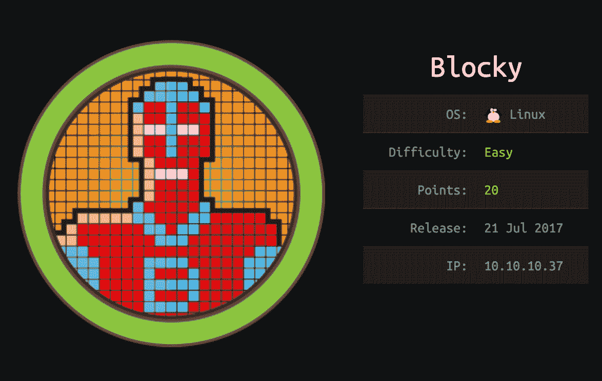

总体而言，Blocky 相当简单，并且基于真实世界的机器。它展示了不良密码做法的风险，以及在面向公众的系统上暴露内部文件的风险。

我们将使用以下工具将机器典当到一个 [Kali Linux 机器](https://www.kali.org/)上:

*   nmap
*   nikto
*   gobuster
*   wpscan
*   jd-gui
*   散列标识符

让我们开始吧。

我在/etc/hosts 文件中添加了 blocky

```
nano /etc/hosts
```

随着

```
10.10.10.37     blocky.htb
```

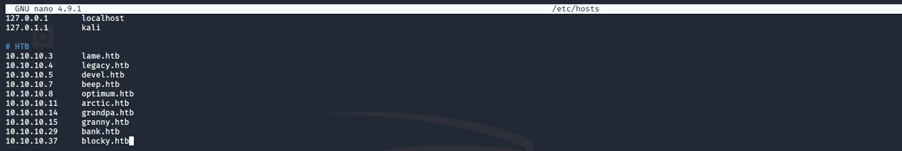

## 第一步-侦察

开发一台机器的第一步是做一些扫描和侦察。

这是最重要的部分之一，因为它将决定你以后可以尝试利用什么。在这个阶段花更多的时间来获取尽可能多的信息总是更好的。

## 端口扫描

我会用 **Nmap** (网络映射器)。Nmap 是一个用于网络发现和安全审计的免费开源工具。它使用原始 IP 数据包来确定网络上有哪些主机可用、这些主机提供什么服务、它们运行什么操作系统、使用什么类型的包过滤/防火墙以及许多其他特征。

这个工具有许多命令可以用来扫描网络。如果你想了解更多，你可以看一下文档[这里](https://tools.kali.org/information-gathering/nmap)。

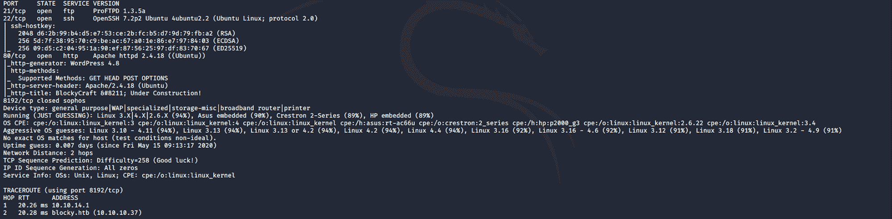

我使用以下命令来执行密集扫描:

```
nmap -A -v blocky.htb
```

**-A:** 启用操作系统检测、版本检测、脚本扫描和跟踪路由

**-v:** 增加详细级别

**blocky.htb:** 块状盒子的主机名

如果您发现结果有点太多，您可以执行另一个命令来只获取开放的端口。

```
nmap blocky.htb
```

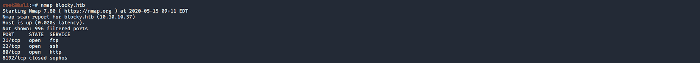

我们可以看到有 3 个开放的端口:

**端口 21** ，文件传输协议(FTP)控制(命令)

**端口 22** ，安全外壳(SSH)，安全登录，文件传输(scp，sftp)和端口转发

****端口** 80** ，最常被超文本传输协议使用

## 目录扫描

我用 **Gobuster** 。Gobuster 是一个用 Go 编写的目录扫描器。更多关于工具[的信息请点击](https://tools.kali.org/web-applications/gobuster)。Gobuster 使用 Kali 上的单词表，它们位于****/usr/share/word lists****目录中。我用的是来自 **dirb** 和 **dirbuster** 的词表，但是你可以从 **SecLists** 这里[下载更多的词表](https://github.com/danielmiessler/SecLists)

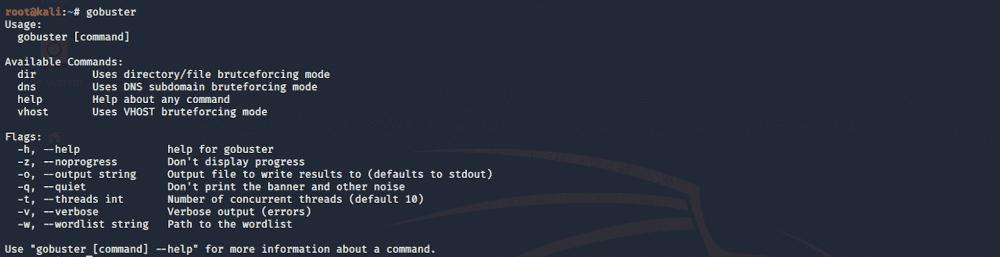

我对 dirb common.txt 单词表使用这个命令

```
gobuster dir -u blocky.htb -w /usr/share/wordlists/dirb/common.txt
```


我们可以看到一些有 **WordPress** 的目录(wp-admin，wp-content-wp-includes)。还有一些其他有趣的页面(/phpmyadmin 和/plugins)

I use **Nikto** .

> Nikto 是一个开放源代码的 web 服务器扫描器，它对 web 服务器执行多项全面测试，检查 1250 多个服务器的过期版本，以及 270 多个服务器上的版本特定问题。它还检查服务器配置项目，例如是否存在多个索引文件、HTTP 服务器选项，并尝试识别已安装的 web 服务器和软件。

更多关于工具 [的信息请点击](https://tools.kali.org/information-gathering/nikto)

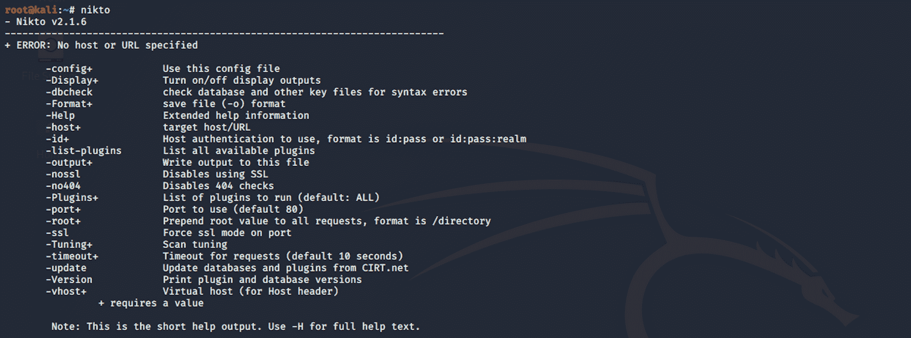

我使用这个命令启动扫描

```
nikto -host blocky.htb
```

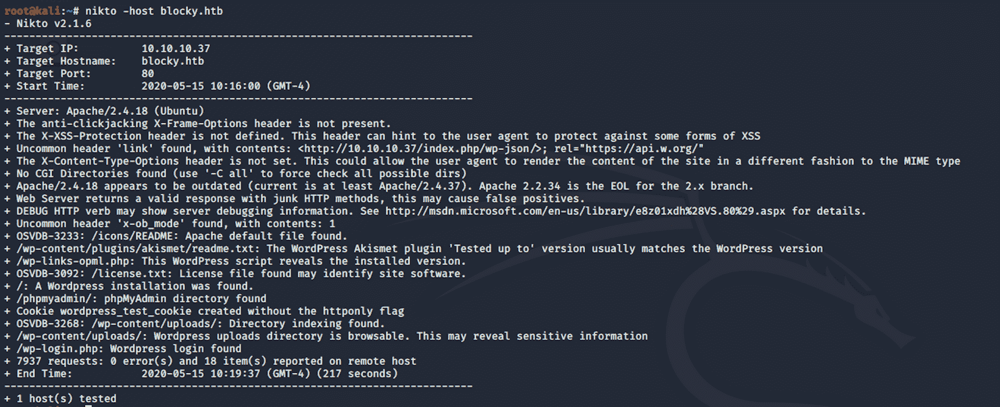

我看到几个目录可能会很有趣(/wp-content/uploads/和/wp-login.php)

最后我用 **WPScan** 。WPScan 是一个黑盒 WordPress 漏洞扫描器，可以用来扫描远程 WordPress 安装，以发现安全问题

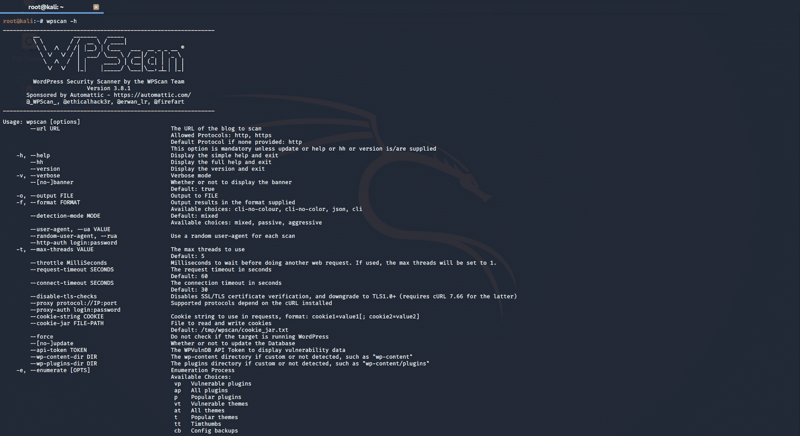

我使用这个命令启动扫描

```
wpscan --url blocky.htb -e
```

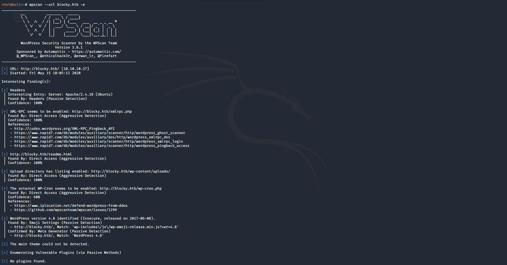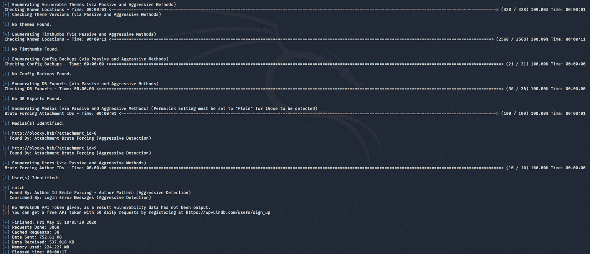

我们有一个用户名， **Notch**

## 第 2 步-访问网页

让我们访问我们从侦察阶段找到的页面。让我们从主网页开始。这是一个关于《我的世界》的博客-**block craft**

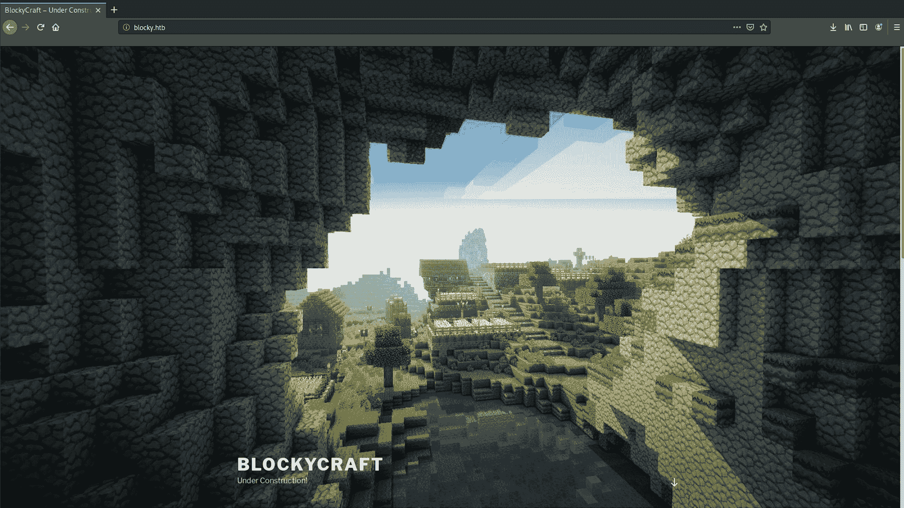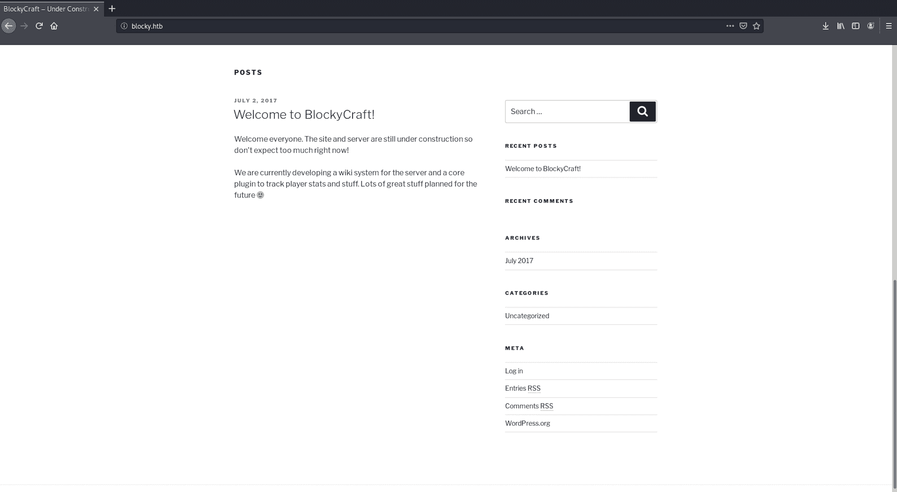

我看了一下**维基**页面。没什么有趣的

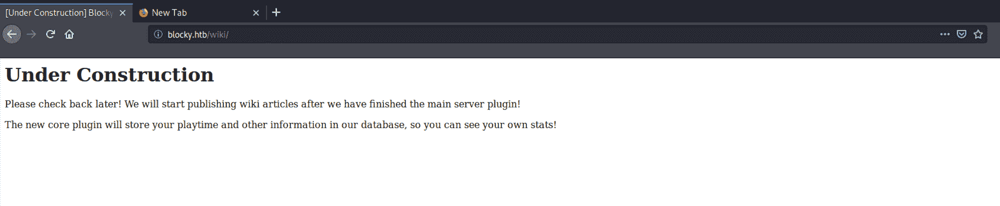

我看了一下**/WP-内容/上传**页面。没什么有趣的

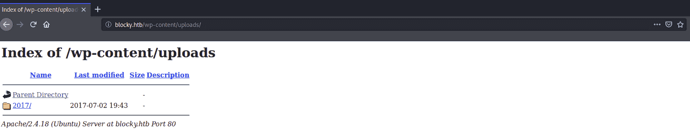

我找到了**管理**面板

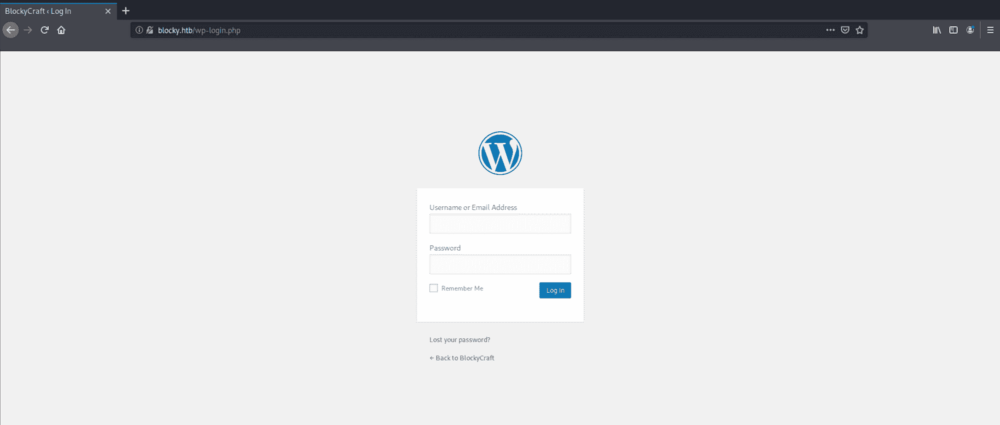

以及 **phpMyAdmin** 面板

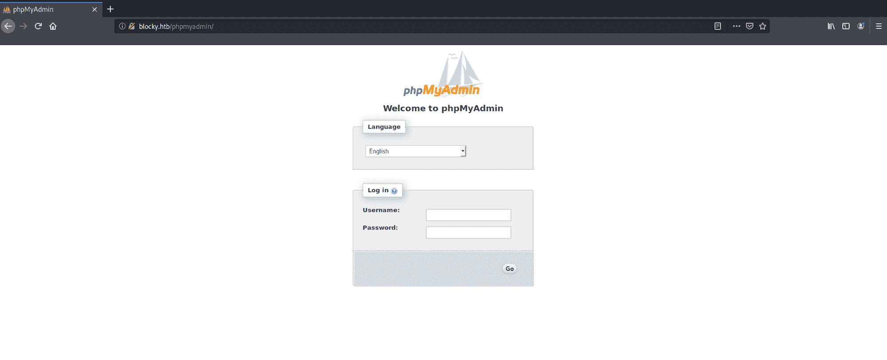

我导航到**/插件**文件夹，找到两个 **jar** 文件。

> 一个 **JAR** 是一种包文件格式，通常用于将许多 Java 类文件和相关的元数据和资源聚集到一个文件中进行分发。JAR 文件是包含特定于 Java 的清单文件的归档文件。它们是以 ZIP 格式构建的，通常具有. jar 文件扩展名

我把两个 zip 文件都下载到了我的 Kali box 上

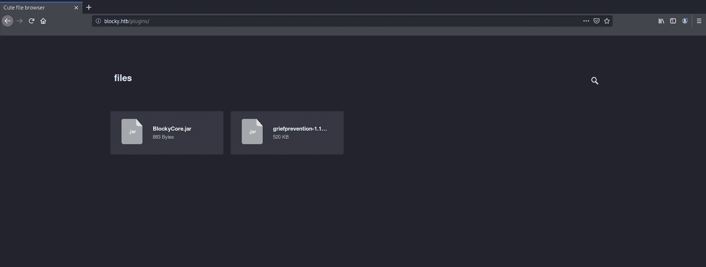

我使用 **JD-Gui** 来反编译 java 文件。JD-GUI 是一个独立的图形实用程序，显示。类”文件。更多关于工具[的信息请点击这里](https://tools.kali.org/reverse-engineering/jd-gui)

我启动了这个工具

```
jd-gui
```

然后选择我要读取的 JAVA 类-**block core . class**

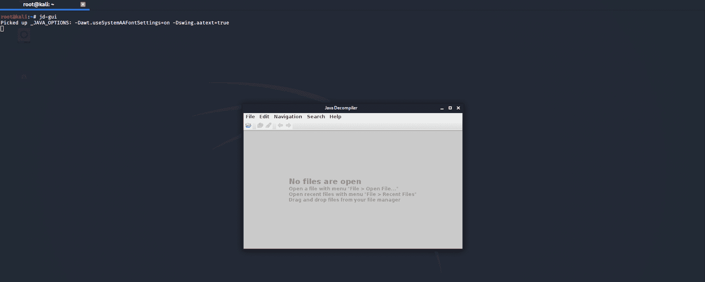

我可以看到用户名和密码

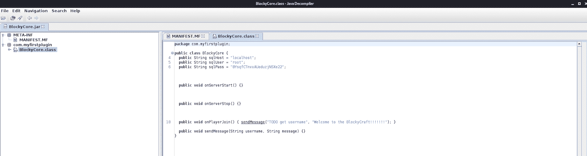

我导航回 **phpMyAdmin** 并输入我刚刚找到的凭证。我可以进入数据库

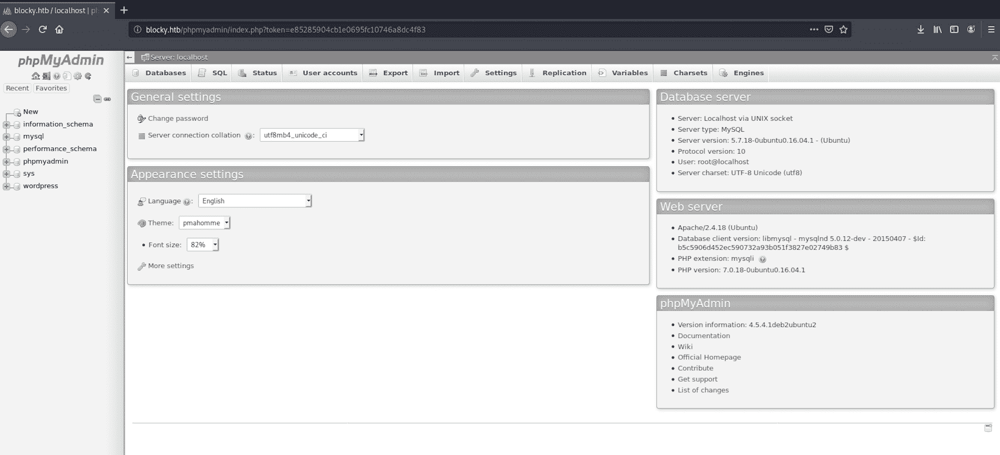

我查看了一下 **wordpress** 文件夹中的表格 **wp_users** ,看看是否能得到更多关于博客用户的信息

SQL 查询

```
SELECT * FROM `wp_users`
```

这可以通过从 wp_users 表中选择所有用户来翻译，只会给我们一个结果， **Notch**

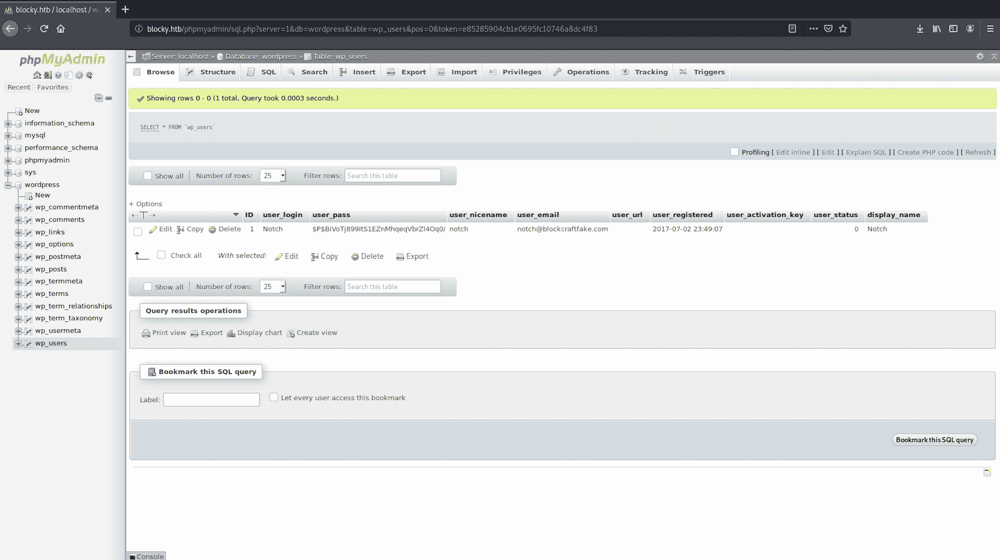

我使用**散列标识符**来标识可能的散列。Hash-identifier 是一款软件，用于识别不同类型的用于加密数据尤其是密码的哈希。你可以在这里找到更多[的信息。](https://tools.kali.org/password-attacks/hash-identifier)

我用以下命令启动 hash-identifier:

```
hash-identifier
```

复制/粘贴我之前得到的散列密码:

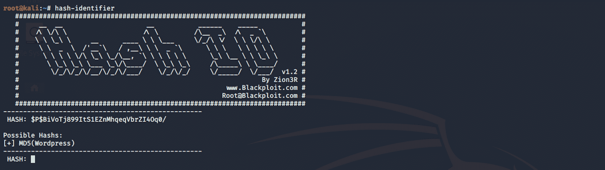

我们看到散列最有可能是一个 **MD5 (Wordpress)散列**

## 步骤 3 -使用端口 22

我回到我的终端上，使用 SSH 进行连接

> SSH 协议(也称为安全 Shell)是一种从一台计算机安全远程登录到另一台计算机的方法。它为强认证提供了几个备选选项，并通过强加密保护了通信的安全性和完整性。它是不受保护的登录协议(如 [**、telnet**](https://www.ssh.com/ssh/telnet) 、rlogin)和不安全的文件传输方式(如 [**、FTP**](https://www.ssh.com/ssh/ftp/) )的安全替代方案。

这里有更多关于 SSH 协议的信息

我使用以下命令

```
ssh notch@10.10.10.37
```

我输入之前在**block core . class**文件中找到的密码

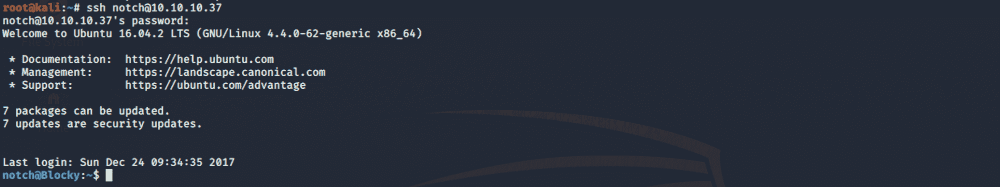

## **步骤 4 -寻找 user.txt 标志**

我现在连接为 Notch。我列出了所有的文件夹/文件

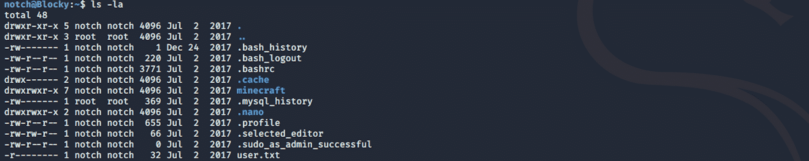

我找到了 **user.txt** 文件！

为了读取文件的内容，我使用了以下命令

```
cat user.txt
```

现在我们有了用户标志，让我们找到根标志！

## **步骤 5 -** 执行权限提升

我用 **sudo** 检查当前的访问用户。

> sudo 是一个用于类 Unix 计算机操作系统的程序，它允许用户以另一个用户的安全特权运行程序，默认情况下是超级用户。它最初代表“超级用户 do ”,因为旧版本的`sudo`被设计为仅作为超级用户运行命令

更多关于 sudo [的信息请点击这里](https://en.wikipedia.org/wiki/Sudo)

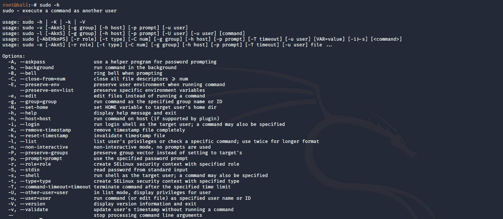

我用这个命令列出了用户的权限

```
sudo -l
```

我使用之前找到的相同密码

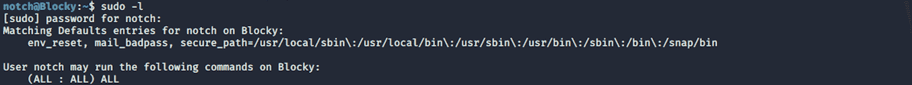

我可以看到 Notch 拥有无限的特权，可以在系统上运行任何命令。我检查了身份证。Linux 中的 **id 命令**用于找出服务器中当前用户或任何其他用户的用户名、组名和数字 id

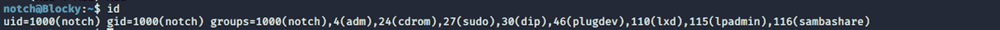

我使用以下命令升级到 root 用户

```
sudo su
```

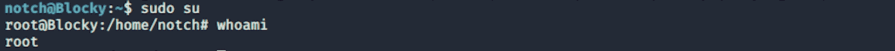

## **步骤 6 -寻找 root.txt 标志**

我现在是根用户，可以导航到根文件夹

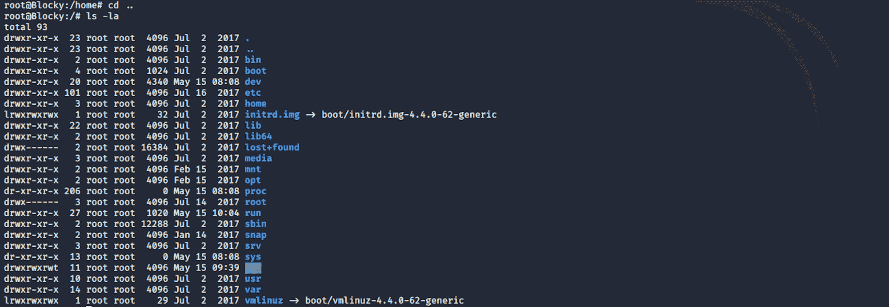

我找到了 **root.txt** 文件！

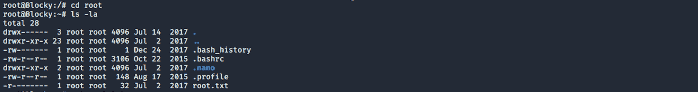

为了读取文件的内容，我使用了以下命令

```
cat root.txt
```

恭喜你。你找到了两面旗子！

* * *

请随时评论、提问或与朋友分享:)

你可以在这里看到更多我的文章

你可以在推特上关注我，也可以在 T2 的 LinkedIn 上关注我

还有别忘了# ****GetSecure**** ，#****be secure****&#****stay secure****！

* * *

**其他黑盒子文章**

*   [保持冷静，黑掉瘸子](https://www.freecodecamp.org/news/keep-calm-and-hack-the-box-lame/)
*   [保持冷静，黑掉盒子——遗产](https://www.freecodecamp.org/news/keep-calm-and-hack-the-box-legacy/)
*   保持冷静，黑掉盒子
*   [保持冷静，黑盒子——哔](https://www.freecodecamp.org/news/keep-calm-and-hack-the-box-beep/)
*   [保持冷静，黑盒子——最佳](https://www.freecodecamp.org/news/keep-calm-and-hack-the-box-optimum/)
*   [保持冷静，黑掉盒子——北极](https://www.freecodecamp.org/news/keep-calm-and-hack-the-box-arctic/)
*   [保持冷静，黑掉盒子——爷爷](https://www.freecodecamp.org/news/keep-calm-and-hack-the-box-grandpa/)
*   [保持冷静，黑掉盒子奶奶](https://www.freecodecamp.org/news/keep-calm-and-hack-the-box-granny/)
*   [保持冷静，黑掉盒子银行](https://www.freecodecamp.org/news/keep-calm-and-hack-the-box-bank/)

